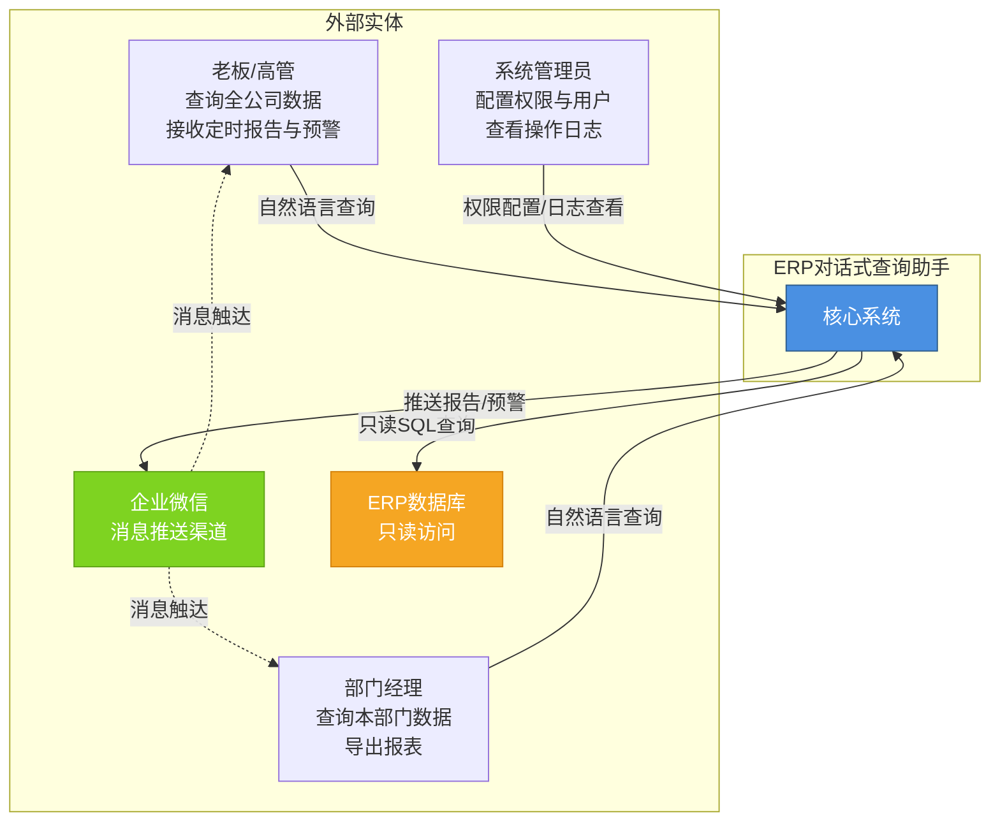
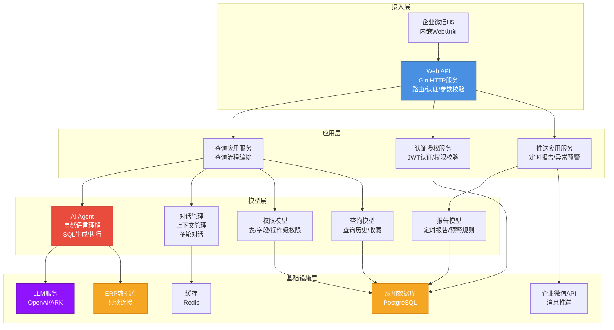
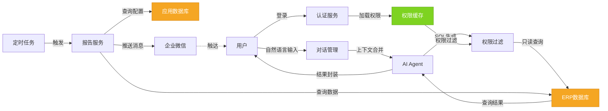

# ERP对话式查询助手 技术架构概要

**版本：** 1.0.0  
**日期：** 2026年6月2日  
**文档状态：** 已评审  
**关联PRD版本：** 1.2.9

---

## 目录

1. [第一章：架构概述](#第一章架构概述)
2. [第二章：架构视图](#第二章架构视图)
3. [第三章：核心架构要素](#第三章核心架构要素)
4. [第四章：质量属性与架构策略](#第四章质量属性与架构策略)
5. [第五章：架构约束与边界](#第五章架构约束与边界)
6. [第六章：演进路线](#第六章演进路线)

---

## 第一章：架构概述

### 1.1 系统定义

**系统定位：** ERP对话式查询助手是一款基于自然语言处理的企业数据查询智能代理系统，通过LLM驱动的语义理解引擎，将口语化问题转换为安全的SQL查询，实现企业管理层对ERP核心经营数据的即时获取与主动感知。

**系统边界：**
- **覆盖范围：** 自然语言查询解析、多轮对话管理、权限控制、数据展示与导出、定时报告推送、异常预警
- **不覆盖范围：** ERP业务逻辑修改、自定义报表设计器、移动App原生开发、AI模型训练平台

### 1.2 架构风格声明

**架构风格：** 分层架构 + AI Agent 模式

**核心驱动力：**
1. **分层架构**：系统需要清晰的职责分离，将查询解析、权限控制、数据访问等关注点隔离，便于独立演进与维护。分层架构提供了良好的模块边界，使得权限系统、对话管理、查询引擎等核心模块可以独立开发与测试。
2. **AI Agent 模式**：系统的核心能力是将自然语言转换为可执行查询，这需要LLM的推理能力与工具调用机制。AI Agent模式通过ReAct循环（推理-行动-观察）实现多步骤查询规划，通过工具抽象实现SQL生成与执行的安全隔离。

### 1.3 核心架构特征

| 特征            | 含义与必要性                                                                |
| ------------- | --------------------------------------------------------------------- |
| **只读数据访问**    | 系统仅以只读方式连接ERP数据库，确保不修改业务数据，降低数据安全风险。这是系统作为"查询层"而非"业务层"的根本约束。          |
| **多租户权限隔离**   | 基于用户组实现表级、字段级、操作级的细粒度权限控制，确保部门经理只能查询本部门数据，高管可查询全公司数据。权限隔离是企业级应用的必备特性。 |
| **自然语言理解驱动**  | 通过LLM实现口语化问题到SQL的转换，支持模糊意图识别、实体抽取、反问澄清。这是系统降低使用门槛的核心能力。               |
| **多轮对话上下文管理** | 系统保留最近5轮对话上下文，支持指代消解与条件增量更新，使用户无需重复输入完整查询条件。这是提升用户体验的关键机制。            |
| **主动推送与预警**   | 系统不仅响应查询，还能主动推送定时报告与异常预警，将"人找数据"升级为"数据找人"。这是系统的差异化价值点。                |

### 1.4 架构决策概要

| 决策内容                   | 核心考量                                             | 替代方案排除理由                                                |
| ---------------------- | ------------------------------------------------ | ------------------------------------------------------- |
| **采用Eino框架构建AI Agent** | Eino提供了开箱即用的LLM集成、工具调用、流式响应、回调追踪等能力，降低Agent开发复杂度 | 自研Agent框架：开发成本高，缺乏生态支持；LangChain：Go生态不成熟，与项目技术栈不匹配      |
| **PostgreSQL作为应用数据库**  | 需要存储用户、权限、对话历史、定时任务等应用数据，PostgreSQL成熟稳定且团队熟悉     | MySQL：功能相当，但团队PostgreSQL经验更丰富；MongoDB：应用数据关系性强，文档数据库不合适 |
| **只读连接ERP数据库**         | 系统定位为查询层，修改ERP数据会引入数据一致性风险与业务逻辑耦合                | 读写连接：违反系统定位，增加安全风险与维护成本                                 |
| **企业微信作为推送渠道**         | 企业微信是企业客户的主流沟通工具，推送触达率高，集成成本低                    | 自研推送服务：开发成本高，触达率无保障；邮件推送：时效性差，用户使用频率低                   |
| **JWT实现无状态认证**         | 系统需要支持企业微信H5内嵌访问，无状态认证便于跨端访问与会话管理                | Session认证：需要服务端会话存储，扩展性差；OAuth2：过度设计，系统不需要第三方授权         |

---

## 第二章：架构视图

### 2.1 系统上下文视图

**视图说明：** 系统作为企业内部查询工具，与三类用户角色（老板/高管、部门经理、系统管理员）交互，通过只读方式连接ERP数据库，通过企业微信推送消息。系统边界清晰：不修改ERP数据，不替代ERP业务逻辑。

**图2-1 系统上下文视图**



**交互性质说明：**
- 用户查询：同步请求-响应模式，用户输入自然语言问题，系统返回查询结果
- ERP数据访问：同步只读查询，系统生成SQL后执行查询并返回结果
- 企业微信推送：异步消息推送，定时任务或预警触发后通过企业微信API推送消息

### 2.2 容器视图

**视图说明：** 系统采用分层架构，分为接入层、应用层、模型层、基础设施层。接入层处理HTTP请求与认证，应用层编排业务流程，模型层实现核心业务逻辑，基础设施层提供数据访问与外部集成。各层职责清晰，依赖单向（上层依赖下层）。

**图2-2 容器视图**



**容器职责与技术类型：**

| 容器       | 职责定位                        | 技术类型                               |
| -------- | --------------------------- | ---------------------------------- |
| Web API  | 接收HTTP请求，处理认证、参数校验、路由分发     | Go + Gin                           |
| 企业微信H5   | 移动端访问入口，内嵌于企业微信             | HTML5 + JavaScript                 |
| 查询应用服务   | 编排查询流程：认证→权限校验→Agent查询→结果返回 | Go Service                         |
| 认证授权服务   | JWT令牌验证、用户组权限加载、表/字段级权限过滤   | Go Service                         |
| 推送应用服务   | 定时任务调度、预警规则触发、企业微信消息推送      | Go Service + Cron                  |
| AI Agent | 自然语言解析、SQL生成、SQL执行、结果封装     | Go + Eino + LLM                    |
| 对话管理     | 会话上下文存储、指代消解、条件合并           | Go + Redis                         |
| 权限模型     | 用户组管理、权限配置、权限校验             | Go Model                           |
| 查询模型     | 查询历史存储、收藏管理                 | Go Model                           |
| 报告模型     | 定时报告配置、预警规则配置、推送记录          | Go Model                           |
| 应用数据库    | 存储用户、权限、对话历史、定时任务等应用数据      | PostgreSQL                         |
| ERP数据库   | 只读访问ERP业务数据                 | PostgreSQL/Oracle/SQL Server/MySQL |
| 企业微信API  | 消息推送接口                      | 外部API                              |
| LLM服务    | 自然语言理解与推理                   | OpenAI/ARK                         |
| 缓存       | 会话上下文缓存、权限缓存、热点查询缓存         | Redis                              |

**关键交互路径：**
1. **查询流程：** 用户输入 → API认证 → 权限校验 → Agent解析 → SQL生成 → ERP查询 → 结果返回
2. **推送流程：** 定时任务触发 → 查询数据 → 生成报告 → 调用企业微信API → 消息推送

---

## 第三章：核心架构要素

### 3.1 分层与模块划分

**分层策略：** 系统采用四层架构，从上到下依次为接入层、应用层、模型层、基础设施层。每层职责明确，依赖单向（上层依赖下层，下层不依赖上层）。

**层次职责定义：**

| 层次 | 职责定义 | 边界约束 |
|------|----------|----------|
| **接入层** | 处理HTTP请求与响应，负责认证、参数校验、路由分发、错误处理 | 不包含业务逻辑，仅做请求转发与响应封装 |
| **应用层** | 编排业务流程，协调多个模型对象完成用例，管理事务边界 | 不包含模型逻辑，仅做流程编排与事务管理 |
| **模型层** | 实现核心业务逻辑，包括权限校验、查询解析、对话管理、报告生成 | 不依赖基础设施实现细节，通过接口抽象数据访问 |
| **基础设施层** | 提供数据访问、外部API调用、缓存等基础能力 | 不包含业务逻辑，仅提供技术能力支撑 |

**层间依赖规则：**
- 接入层 → 应用层：通过接口调用应用服务
- 应用层 → 模型层：通过接口调用模型对象
- 模型层 → 基础设施层：通过接口抽象依赖（依赖倒置）
- 跨层依赖豁免：基础设施层可被应用层直接调用（如缓存、日志）

**模块划分：**

```
internal/
├── agent/
│   ├── graph.go          # Graph 编排
│   ├── react.go          # ReAct Agent
│   ├── tools.go          # 工具定义
│   └── state.go          # 状态定义
├── callback/
│   └── tracing.go        # Eino Callbacks
├── api/                  # 接入层：HTTP处理器
│   └── v1/
│       ├── query.go      # 查询接口
│       ├── auth.go       # 认证接口
│       ├── user.go       # 用户管理接口
│       └── report.go     # 报告管理接口
├── config/
│   └── config.go         # 配置加载
├── middleware/
│   ├── auth.go           # 认证中间件
│   ├── logger.go         # 日志中间件
│   └── recovery.go       # 恢复中间件
├── service/              # 应用层：应用服务
│   ├── query_app.go      # 查询应用服务
│   ├── auth_app.go       # 认证应用服务
│   └── push_app.go       # 推送应用服务
├── model/                # 数据模型
│   ├── agent/            # AI Agent
│   ├── dialog/           # 对话管理模型
│   ├── permission/       # 权限模型
│   ├── query/            # 查询模型
│   └── report/           # 报告模型
├── repository/           # 基础设施层：数据访问
│   ├── user_repo.go
│   ├── permission_repo.go
│   └── query_repo.go
└── infrastructure/       # 基础设施层：外部集成
│   ├── llm/              # LLM客户端
│   ├── wechat/           # 企业微信API
│   └── cache/            # Redis缓存
└── pkg/
    ├── logger/
    ├── response/
    └── errors/
configs/
├── config.yaml
└── config.example.yaml
go.mod
go.sum
```

### 3.2 核心数据模型

**数据模型概念识别：** 系统核心数据模型包括查询、对话、权限、报告四个模块，每个模块包含核心实体与值对象。

**图3-1 核心数据模型**

```mermaid
graph TB
    subgraph 查询模块
        QuerySession[查询会话<br/>聚合根]
        QueryRecord[查询记录<br/>实体]
        QueryResult[查询结果<br/>值对象]
        Favorite[收藏<br/>实体]
    end

    subgraph 对话模块
        DialogSession[对话会话<br/>聚合根]
        DialogTurn[对话轮次<br/>实体]
        Context[上下文<br/>值对象]
    end

    subgraph 权限模块
        User[用户<br/>实体]
        UserGroup[用户组<br/>实体]
        Permission[权限<br/>值对象]
        Role[角色<br/>值对象]
    end

    subgraph 报告模块
        ScheduledReport[定时报告<br/>聚合根]
        AlertRule[预警规则<br/>实体]
        PushRecord[推送记录<br/>实体]
    end

    QuerySession ||--o{ QueryRecord : 包含
    QueryRecord --> QueryResult : 产生
    User ||--o{ Favorite : 拥有
    User ||--o{ QuerySession : 发起

    DialogSession ||--o{ DialogTurn : 包含
    DialogTurn --> Context : 携带
    DialogSession --> QuerySession : 关联

    User ||--o{ UserGroup : 归属
    UserGroup ||--o{ Permission : 拥有
    User --> Role : 具有

    ScheduledReport ||--o{ PushRecord : 触发
    AlertRule --> ScheduledReport : 关联

    style QuerySession fill:#4A90E2,stroke:#2E5C8A,color:#fff
    style DialogSession fill:#4A90E2,stroke:#2E5C8A,color:#fff
    style User fill:#4A90E2,stroke:#2E5C8A,color:#fff
    style ScheduledReport fill:#4A90E2,stroke:#2E5C8A,color:#fff
```

**核心数据模型概念说明：**

| 概念       | 类型  | 职责                           | 核心关系     |
| -------- | --- | ---------------------------- | -------- |
| **查询会话** | 聚合根 | 管理一次完整的查询流程，包含用户输入、解析结果、执行状态 | 聚合多个查询记录 |
| **查询记录** | 实体  | 记录单次查询的自然语言输入、生成的SQL、执行结果、耗时 | 属于查询会话   |
| **查询结果** | 值对象 | 封装查询返回的数据集、理解摘要、可视化类型        | 由查询记录产生  |
| **对话会话** | 聚合根 | 管理多轮对话的上下文，保留最近5轮对话条件        | 聚合多个对话轮次 |
| **对话轮次** | 实体  | 记录单轮对话的用户输入、系统理解、上下文合并结果     | 属于对话会话   |
| **上下文**  | 值对象 | 存储时间范围、过滤条件、分组维度等对话上下文       | 由对话轮次携带  |
| **用户**   | 实体  | 系统使用者，包含账号、密码、角色等信息          | 归属多个用户组  |
| **用户组**  | 实体  | 权限分配单元，包含表级、字段级、操作级权限        | 拥有多个权限   |
| **权限**   | 值对象 | 定义对特定表、字段、操作的访问权限            | 属于用户组    |
| **定时报告** | 聚合根 | 管理定时推送的报告，包含推送时间、推送对象、查询条件   | 触发推送记录   |
| **预警规则** | 实体  | 定义指标阈值与触发条件，关联定时报告           | 关联定时报告   |
| **推送记录** | 实体  | 记录每次推送的时间、内容、接收者、状态          | 由定时报告触发  |

### 3.3 关键设计机制

**机制一：SQL安全校验机制**

- **解决问题：** 自然语言生成的SQL可能包含破坏性操作（DELETE/UPDATE/DROP/INSERT），需要确保系统仅执行只读查询
- **核心策略：** SQL生成后通过安全校验器，基于AST解析识别破坏性操作关键字，拒绝执行不安全SQL
- **影响范围：** AI Agent模块，所有SQL执行前必须经过安全校验

**机制二：权限过滤机制**

- **解决问题：** 不同角色用户对数据的访问范围不同，需要在查询时自动附加权限过滤条件
- **核心策略：** 查询执行前，权限模块根据用户角色与用户组，生成数据权限过滤条件（如部门经理只能查询本部门数据），自动附加到SQL的WHERE子句
- **影响范围：** 查询应用服务，所有ERP数据查询必须经过权限过滤

**机制三：对话上下文管理机制**

- **解决问题：** 多轮对话需要保留前序条件，支持指代消解与条件增量更新
- **核心策略：** 对话会话保留最近5轮对话上下文（存储于Redis），新轮次输入作为条件增量更新；指代词通过前序对话记录消解
- **影响范围：** 对话管理模块，所有查询请求需携带会话ID

**机制四：查询结果缓存机制**

- **解决问题：** 相同查询条件重复执行会带来不必要的数据库压力与响应延迟
- **核心策略：** 对查询结果进行缓存（TTL 5分钟），缓存键为用户ID+查询条件哈希；权限变更时清除相关用户缓存
- **影响范围：** 查询应用服务，所有查询结果返回前检查缓存

**机制五：LLM调用降级机制**

- **解决问题：** LLM服务可能因网络或配额问题不可用，需要保证系统基本可用
- **核心策略：** LLM调用失败时，降级为模板匹配模式（基于关键词匹配预设SQL模板），返回提示"当前智能解析服务不可用，已使用简化模式"
- **影响范围：** AI Agent模块，所有LLM调用需包装降级逻辑

### 3.4 数据架构概要

**数据组织策略：** 系统数据分为两类——应用数据（存储于应用数据库）与ERP数据（只读访问ERP数据库）。应用数据采用集中式存储，ERP数据保持原系统存储不变。

**核心数据流向：**

1. **查询数据流：** 用户输入 → 对话管理（上下文合并）→ AI Agent（SQL生成）→ 权限过滤 → ERP数据库（只读查询）→ 结果封装 → 返回用户
2. **权限数据流：** 用户登录 → 加载用户组权限 → 缓存权限数据 → 查询时附加权限过滤条件
3. **推送数据流：** 定时任务触发 → 查询应用数据（报告配置）→ 查询ERP数据 → 生成报告内容 → 调用企业微信API → 推送记录存储

**数据一致性边界：**

| 数据类型    | 一致性要求    | 说明                          |
| ------- | -------- | --------------------------- |
| 用户与权限数据 | 强一致性     | 用户组变更、权限配置需立即生效，使用事务保证      |
| 对话上下文数据 | 最终一致性    | 上下文存储于Redis，允许短暂不一致，会话超时后清除 |
| 查询历史数据  | 最终一致性    | 查询记录异步写入数据库，允许短暂延迟          |
| ERP业务数据 | 强一致性（只读） | 直接查询ERP数据库，数据一致性由ERP系统保证    |
| 推送记录数据  | 最终一致性    | 推送记录异步写入，允许短暂延迟             |

**图3-2 核心数据流向图**



---

## 第四章：质量属性与架构策略

### 4.1 质量属性优先级矩阵

| 质量属性      | 优先级 | 量化目标                          | 说明                    |
| --------- | --- | ----------------------------- | --------------------- |
| **安全性**   | 高   | SQL注入防护率100%；权限越权防护率100%      | 系统涉及企业核心数据，安全性是首要质量属性 |
| **可用性**   | 高   | 系统可用性≥99.9%；LLM降级模式下系统可用性≥95% | 企业管理层依赖系统进行决策，停机影响大   |
| **性能**    | 高   | 查询响应时间P99<3秒；并发查询支持≥100 QPS   | 用户期望秒级响应，查询体验直接影响使用意愿 |
| **可扩展性**  | 中   | 支持新增ERP数据源≤2周；支持新增查询场景≤1周     | 企业可能接入多个ERP系统，需支持扩展   |
| **可维护性**  | 中   | 新功能开发周期≤2周；Bug修复周期≤3天         | 系统需持续演进，可维护性影响迭代效率    |
| **数据一致性** | 中   | 权限变更生效延迟<1秒；对话上下文一致性≥99%      | 权限数据需强一致，上下文数据允许最终一致  |
| **可观测性**  | 中   | 关键操作日志覆盖率100%；监控告警响应时间<5分钟    | 需要监控系统运行状态，快速定位问题     |
| **易用性**   | 中   | 用户学习成本<5分钟；查询成功率≥85%          | 系统面向非技术用户，易用性影响推广     |

### 4.2 架构策略映射

**策略一：SQL安全校验 → 安全性**

- **解决问题：** 防止自然语言生成的SQL包含破坏性操作
- **核心手段：** 基于AST解析的SQL安全校验器，拒绝DELETE/UPDATE/DROP/INSERT等操作
- **影响要素：** AI Agent模块、查询应用服务

**策略二：多层权限过滤 → 安全性**

- **解决问题：** 防止用户越权访问数据
- **核心手段：** 表级权限（可访问哪些表）、字段级权限（可访问哪些字段）、数据级权限（可访问哪些数据行）三层过滤
- **影响要素：** 权限模型、查询应用服务、AI Agent模块

**策略三：LLM降级模式 → 可用性**

- **解决问题：** LLM服务不可用时系统仍可基本使用
- **核心手段：** LLM调用失败时降级为模板匹配模式，基于关键词匹配预设SQL模板
- **影响要素：** AI Agent模块

**策略四：查询结果缓存 → 性能**

- **解决问题：** 减少重复查询对ERP数据库的压力
- **核心手段：** 对查询结果进行缓存（TTL 5分钟），缓存键为用户ID+查询条件哈希
- **影响要素：** 查询应用服务、Redis缓存

**策略五：异步推送 → 性能**

- **解决问题：** 定时报告与预警推送不应阻塞主查询流程
- **核心手段：** 定时任务与预警触发后，异步执行推送逻辑，推送记录异步写入数据库
- **影响要素：** 推送应用服务、定时任务调度器

**策略六：模块化分层 → 可扩展性**

- **解决问题：** 支持新增ERP数据源与查询场景
- **核心手段：** 通过接口抽象数据源访问，新增ERP数据源只需实现数据源接口；AI Agent通过工具抽象查询能力，新增查询场景只需新增工具
- **影响要素：** 基础设施层、AI Agent模块

**策略七：结构化日志与监控 → 可观测性**

- **解决问题：** 监控系统运行状态，快速定位问题
- **核心手段：** 所有关键操作记录结构化日志（用户ID、操作类型、耗时、结果），接入监控系统（如Prometheus）收集指标
- **影响要素：** 全局日志模块、监控中间件

### 4.3 权衡声明

**权衡一：一致性 vs 可用性**

- **取舍倾向：** 优先保证可用性，应用数据接受最终一致性
- **理由：** 系统定位为查询层，不修改ERP业务数据，应用数据（如查询历史、推送记录）的短暂不一致不影响核心功能。权限数据虽需强一致，但权限变更频率低，通过缓存失效机制可保证一致性。
- **影响：** 对话上下文可能短暂不一致（Redis主从延迟），查询历史可能延迟写入，推送记录可能延迟可见。

**权衡二：性能 vs 成本**

- **取舍倾向：** 在成本可控前提下优化性能，不追求极致性能
- **理由：** 系统面向企业管理层，并发量有限（预估峰值100 QPS），通过缓存与异步推送即可满足性能要求。LLM调用成本较高，但查询频率有限，成本可控。
- **影响：** 不引入复杂的分布式缓存架构，使用单机Redis；不引入消息队列，推送逻辑直接异步执行。

**权衡三：灵活性 vs 安全性**

- **取舍倾向：** 优先保证安全性，限制自然语言查询的灵活性
- **理由：** 系统涉及企业核心数据，安全性是首要质量属性。自然语言查询的灵活性可能带来SQL注入风险，需通过安全校验与权限过滤限制。
- **影响：** 部分复杂查询（如多表关联、子查询）可能被安全校验拒绝，用户需调整查询方式；LLM生成的SQL需经过严格校验，可能影响查询成功率。

---

## 第五章：架构约束与边界

### 5.1 技术约束

**组织级约束：**

| 约束类型       | 约束内容                                      | 对架构决策的影响                          |
| ---------- | ----------------------------------------- | --------------------------------- |
| **技术栈约束**  | 后端使用Go语言，Web框架使用Gin，AI Agent框架使用Eino      | 选择Eino框架构建AI Agent，使用Gin构建Web API |
| **团队技能约束** | 团队熟悉PostgreSQL、Redis，不熟悉MongoDB、Cassandra | 应用数据库选择PostgreSQL，缓存选择Redis       |
| **运维能力约束** | 团队具备容器化部署能力，不具备Kubernetes运维能力             | 部署采用Docker Compose，暂不引入Kubernetes |
| **安全策略约束** | 企业要求所有系统接入统一认证体系（暂未实施），数据传输加密             | 预留统一认证接口，当前使用JWT认证；HTTPS传输        |
| **合规要求约束** | 企业数据不得传输至境外，敏感数据需脱敏                       | LLM服务选择国内服务商（字节ARK），敏感字段脱敏后传输     |

**环境约束：**

| 约束类型       | 约束内容                       | 对架构决策的影响                          |
| ---------- | -------------------------- | --------------------------------- |
| **部署环境约束** | 部署于企业内网服务器，无法访问公网          | LLM服务需通过内网代理访问，企业微信推送需通过内网代理      |
| **网络策略约束** | 内网防火墙限制，仅开放特定端口            | Web API监听80/443端口，数据库、Redis使用内网端口 |
| **资源预算约束** | 服务器配置：4核CPU、16GB内存、500GB存储 | 不引入复杂的分布式架构，单机部署即可满足需求            |

**遗留约束：**

| 约束类型         | 约束内容                                            | 对架构决策的影响              |
| ------------ | ----------------------------------------------- | --------------------- |
| **ERP系统兼容性** | 需支持多种ERP数据库（PostgreSQL、Oracle、SQL Server、MySQL） | 数据源访问层通过接口抽象，支持多数据库适配 |
| **数据迁移约束**   | 不涉及数据迁移，系统为新建系统                                 | 无数据迁移负担，架构设计自由度高      |

### 5.2 架构边界

**系统职责边界：**

| 能力 | 由本系统提供 | 由外部系统提供 | 说明 |
|------|--------------|----------------|------|
| 自然语言查询解析 | ✅ | - | 核心能力 |
| SQL生成与执行 | ✅ | - | 核心能力 |
| 权限控制 | ✅ | - | 核心能力 |
| 多轮对话管理 | ✅ | - | 核心能力 |
| 定时报告推送 | ✅ | - | 核心能力 |
| 异常预警 | ✅ | - | 核心能力 |
| ERP业务数据存储 | - | ✅ | ERP系统 |
| ERP业务逻辑 | - | ✅ | ERP系统 |
| 消息推送渠道 | - | ✅ | 企业微信 |
| LLM推理能力 | - | ✅ | OpenAI/ARK |

**集成边界：**

| 集成对象    | 集成方式       | 数据契约概要                       |
| ------- | ---------- | ---------------------------- |
| ERP数据库  | 只读SQL查询    | 通过数据库连接池访问，SQL需符合ERP数据库方言    |
| 企业微信API | HTTP API调用 | 推送消息需符合企业微信消息格式（Markdown/卡片） |
| LLM服务   | HTTP API调用 | 输入自然语言+上下文，输出SQL或意图识别结果      |

**演进边界：**

| 不变量 | 说明 | 演进限制 |
|--------|------|----------|
| **只读访问ERP** | 系统永远不修改ERP数据 | 不得引入写操作相关功能 |
| **权限隔离** | 系统始终基于用户组实现权限控制 | 不得绕过权限控制直接访问数据 |
| **自然语言查询** | 系统核心交互方式为自然语言 | 不得退化为传统报表查询方式 |
| **企业微信推送** | 系统推送渠道为企业微信 | 不得自建推送服务替代企业微信 |

### 5.3 风险与假设

**架构级风险：**

| 风险 | 风险描述 | 影响范围 |
|------|----------|----------|
| **LLM服务质量不稳定** | LLM服务可能因网络、配额等原因不可用或响应慢 | 查询解析失败，系统降级为模板匹配模式，查询成功率下降 |
| **ERP数据库性能瓶颈** | ERP数据库可能因业务系统压力导致查询慢 | 查询响应时间增加，用户体验下降 |
| **自然语言理解准确率不足** | LLM可能误解用户意图，生成错误SQL | 查询结果不准确，用户信任度下降 |
| **权限配置复杂度高** | 表级、字段级、操作级权限配置复杂，易出错 | 权限配置错误导致数据泄露或无法访问 |

**关键假设：**

| 假设             | 假设内容                  | 假设不成立的影响            |
| -------------- | --------------------- | ------------------- |
| **ERP数据库可访问**  | 企业允许系统只读访问ERP数据库      | 系统无法获取数据，核心功能不可用    |
| **企业微信可集成**    | 企业允许系统接入企业微信推送消息      | 无法实现主动推送与预警，功能价值降低  |
| **LLM服务可用**    | LLM服务（OpenAI/ARK）稳定可用 | 系统降级为模板匹配模式，查询灵活性下降 |
| **用户接受自然语言交互** | 用户愿意使用自然语言而非传统报表      | 用户使用意愿低，系统推广困难      |

---

## 第六章：演进路线

### 6.1 当前架构定位

**当前阶段：** MVP阶段（最小可行产品）

**核心架构目标：**
1. 验证自然语言查询的可行性与用户接受度
2. 实现核心查询功能与权限控制
3. 接入单一ERP数据源，验证架构设计

**当前架构特征：**
- 单体应用部署，模块化分层
- 单一ERP数据源（PostgreSQL）
- 单一LLM服务商（字节ARK）
- 基础权限控制（表级、字段级）
- 基础推送能力（企业微信）

### 6.2 演进方向

**演进方向一：多ERP数据源支持**

- **驱动力：** 企业可能使用多个ERP系统（如采购系统、销售系统、财务系统），需要统一查询入口
- **目标状态：** 支持接入多个ERP数据源，用户可跨数据源查询
- **关键架构变更：**
  - 数据源访问层抽象为接口，支持多种数据库类型（PostgreSQL、Oracle、SQL Server、MySQL）
  - AI Agent增强跨数据源查询能力，支持多数据源SQL生成与执行
  - 权限控制增强，支持数据源级权限配置

**演进方向二：智能推荐与洞察**

- **驱动力：** 用户不仅需要查询数据，还需要系统主动推荐查询方向与发现异常洞察
- **目标状态：** 系统基于用户查询历史与数据特征，主动推荐查询问题与发现异常模式
- **关键架构变更：**
  - 新增推荐引擎模块，基于协同过滤或内容推荐算法生成推荐问题
  - 新增异常检测模块，基于统计方法或机器学习模型发现数据异常
  - AI Agent增强，支持推荐与异常检测结果的解释与呈现

**演进方向三：微服务拆分**

- **驱动力：** 系统规模增长，团队规模扩大，需要独立部署与扩展
- **目标状态：** 核心模块拆分为微服务，独立部署与扩展
- **关键架构变更：**
  - 查询服务、权限服务、推送服务拆分为独立微服务
  - 引入API网关统一入口
  - 引入消息队列（如Kafka）实现异步通信
  - 引入服务注册与发现（如Consul）

### 6.3 演进原则

| 原则 | 说明 | 操作指导 |
|------|------|----------|
| **渐进式拆分** | 不一次性拆分为微服务，按需逐步拆分 | MVP阶段保持单体，当单一模块成为瓶颈时再拆分 |
| **向后兼容优先** | 演进过程中保证API向后兼容，不破坏现有集成 | 新增字段可选，废弃字段保留兼容期，版本化API |
| **数据先行迁移** | 架构演进前先完成数据迁移与验证 | 新增数据源或数据模型时，先迁移数据并验证，再切换流量 |
| **可观测性先行** | 演进前先完善监控与日志，确保可追踪 | 拆分微服务前，先接入分布式追踪与统一日志 |
| **安全优先** | 演进过程中不得降低安全性 | 任何架构变更需通过安全评审，权限控制不得绕过 |

### 6.4 架构守护策略概要

**架构决策记录（ADR）机制：**
- 所有关键架构决策需记录ADR，包含决策背景、决策内容、替代方案、影响范围
- ADR存储于代码仓库，与代码同步演进
- 定期回顾ADR，评估决策是否仍合理

**架构Fitness Function：**
- 定义架构质量度量指标，如模块耦合度、测试覆盖率、查询成功率、响应时间P99
- 通过自动化测试持续验证架构质量，如每次提交运行Fitness Function测试
- 当指标下降时触发告警，提示架构腐化风险

**关键度量持续验证：**
- 查询成功率≥85%（目标值）
- 查询响应时间P99<3秒（目标值）
- 权限越权防护率100%（目标值）
- 系统可用性≥99.9%（目标值）
- 每月生成架构质量报告，对比目标值与实际值

---

## 附录：变更记录

| 版本    | 变更日期       | 变更章节 | 变更类型  | 变更摘要   | 关联影响 |
| ----- | ---------- | ---- | ----- | ------ | ---- |
| 1.0.0 | 2026-06-02 | 全部   | N（新增） | 初始版本创建 | 无    |

---

## 附录：版本关联

| 架构概要版本 | 关联PRD版本 | 关联详细设计版本 |
|--------------|-------------|-------------------|
| 1.0.0 | 1.2.9 | 待创建 |

---

## 附录：术语表

| 术语 | 英文 | 说明 |
|------|------|------|
| AI Agent | AI Agent | 基于LLM的智能代理，能够理解自然语言并调用工具完成任务 |
| LLM | Large Language Model | 大语言模型，如GPT-4、Claude、文心一言等 |
| Eino | Eino | 字节开源的Go语言AI Agent框架 |
| ReAct | Reasoning and Acting | 推理与行动循环，AI Agent的核心执行模式 |
| AST | Abstract Syntax Tree | 抽象语法树，用于SQL解析与校验 |
| JWT | JSON Web Token | 无状态认证令牌 |
| QPS | Queries Per Second | 每秒查询数，衡量系统吞吐量的指标 |
| P99 | 99th Percentile | 99分位数，衡量响应时间的指标 |
| ADR | Architecture Decision Record | 架构决策记录 |
| Fitness Function | Fitness Function | 架构适应度函数，用于验证架构质量的自动化测试 |