# ERP对话式查询助手 技术详细设计文档

**版本：** 1.0.0  
**日期：** 2026年6月2日  
**文档状态：** 待评审  
**对应架构概要版本：** 1.0.0  
**对应PRD版本：** 1.2.9

---

## 目录

1. [第一章：设计概述](#第一章设计概述)
2. [第二章：系统设计与模块划分](#第二章系统设计与模块划分)
3. [第三章：接口设计](#第三章接口设计)
4. [第四章：业务逻辑设计](#第四章业务逻辑设计)
5. [第五章：数据设计](#第五章数据设计)
6. [第六章：非功能性设计](#第六章非功能性设计)
7. [第七章：部署与运维设计](#第七章部署与运维设计)
8. [第八章：变更记录与附录](#第八章变更记录与附录)

---

## 第一章：设计概述

### 1.1 设计范围声明

本文档覆盖 **ERP对话式查询助手** 系统的完整详细设计,包含以下模块:

**包含模块:**
- Web API接入层(HTTP接口处理、认证中间件、参数校验)
- 查询应用服务(查询流程编排、结果封装)
- 认证授权服务(JWT认证、权限加载、权限校验)
- 推送应用服务(定时任务调度、预警触发、消息推送)
- AI Agent模型(自然语言解析、SQL生成、SQL执行)
- 对话管理模型(上下文管理、指代消解、条件合并)
- 权限模型(用户组管理、权限配置、权限过滤)
- 查询模型(查询历史存储、收藏管理)
- 报告模型(定时报告配置、预警规则配置、推送记录)
- 基础设施层(数据库访问、Redis缓存、LLM客户端、企业微信API)

**不包含模块:**
- 前端H5页面实现(由前端团队另行设计)
- ERP数据库的具体表结构(由ERP系统定义,本系统只读访问)
- LLM服务的内部实现(由LLM服务商提供,本系统调用API)
- 企业微信服务的内部实现(由企业微信平台提供,本系统调用API)

**与其他详细设计文档的边界:**
- 本文档为系统的核心详细设计,覆盖所有核心业务模块
- 如后续拆分为微服务架构,各微服务的详细设计文档应基于本文档拆分,并保持接口与数据模型的一致性

### 1.2 架构上下文引用

**架构概要文档引用:**
- 文档名称: ERP对话式查询助手 技术架构概要
- 版本: 1.0.0
- 位置: `docs/architecture-overview.md`

**核心架构决策摘录:**
1. **架构风格**: 分层架构 + AI Agent模式,系统分为接入层、应用层、模型层、基础设施层,依赖单向(上层依赖下层)
2. **只读数据访问**: 系统仅以只读方式连接ERP数据库,所有SQL必须经过安全校验,拒绝DELETE/UPDATE/DROP/INSERT等破坏性操作
3. **权限隔离**: 基于用户组实现表级、字段级、数据级三层权限过滤,查询执行前自动附加权限过滤条件

**偏离声明:** 本设计完全遵循架构概要的约束与决策,无偏离点。

### 1.3 PRD需求引用

**PRD文档引用:**
- 文档名称: ERP对话式查询助手 产品需求文档(PRD)
- 版本: 1.2.9
- 位置: `docs/prd.md`

**核心需求摘录:**
1. **自然语言查询(F01)**: 用户输入口语化问题,系统自动生成SQL并执行,返回查询结果,支持意图识别、实体抽取、反问机制
2. **多轮对话(F02)**: 系统保留最近5轮对话上下文,支持指代消解与条件增量更新,用户无需重复输入完整查询条件
3. **权限控制(M06)**: 基于用户组实现表级、字段级、操作级权限控制,部门经理只能查询本部门数据,高管可查询全公司数据
4. **定时报告(M09)**: 系统主动推送定时报告(每日早报/周报),通过企业微信触达用户
5. **异常预警(M10)**: 关键指标超过阈值时触发预警,主动推送告警消息

**需求覆盖声明:** 本设计覆盖PRD定义的全部核心功能需求,无遗漏或裁剪。

### 1.4 设计原则

| 原则 | 具体体现 |
|------|----------|
| **接口先行** | 所有模块间的交互通过明确定义的接口(HTTP API或内部接口),接口规格先于实现确定,确保模块可独立开发与测试 |
| **防御式编程** | 所有外部输入(用户输入、LLM输出、外部API响应)必须校验,所有SQL必须经过安全校验,所有异常必须捕获并记录 |
| **失败快速** | 参数校验失败立即返回错误,权限校验失败立即拒绝,SQL安全校验失败立即拒绝,不执行后续流程 |
| **最小权限** | 用户仅拥有其角色所需的最低权限,权限过滤自动附加,不依赖用户自觉遵守 |
| **可观测优先** | 所有关键操作记录结构化日志,所有外部调用记录耗时与结果,所有异常记录堆栈与上下文 |

### 1.5 术语与缩略语

| 术语/缩略语 | 全称 | 含义说明 |
|------------|------|----------|
| AI Agent | AI Agent | 基于LLM的智能代理,能够理解自然语言并调用工具完成任务 |
| LLM | Large Language Model | 大语言模型,如GPT-4、Claude、文心一言、豆包等 |
| Eino | Eino Framework | 字节开源的Go语言AI Agent框架,提供LLM集成、工具调用、流式响应等能力 |
| ReAct | Reasoning and Acting | 推理与行动循环,AI Agent的核心执行模式(推理→行动→观察→再推理) |
| AST | Abstract Syntax Tree | 抽象语法树,用于SQL解析与安全校验 |
| JWT | JSON Web Token | 无状态认证令牌,包含用户身份与权限信息 |
| QPS | Queries Per Second | 每秒查询数,衡量系统吞吐量的指标 |
| P99 | 99th Percentile | 99分位数,衡量响应时间的指标(99%的请求响应时间小于该值) |
| TTL | Time To Live | 缓存过期时间 |
| CRUD | Create/Read/Update/Delete | 数据的增删改查操作 |
| RBAC | Role-Based Access Control | 基于角色的访问控制 |
| ORM | Object-Relational Mapping | 对象关系映射,如GORM |
| Middleware | Middleware | 中间件,处理认证、日志、错误恢复等横切关注点 |

### 1.6 参考文档

| 文档名称 | 版本 | 位置/链接 |
|----------|------|-----------|
| ERP对话式查询助手 技术架构概要 | 1.0.0 | `docs/architecture-overview.md` |
| ERP对话式查询助手 产品需求文档(PRD) | 1.2.9 | `docs/prd.md` |
| Gin + Eino AI Agent 项目规范 | - | `.trae/rules/gin-eino-project.md` |
| Go语言基础规范 | - | `.trae/rules/go-base.md` |
| Gin Web框架文档 | - | https://gin-gonic.com/docs/ |
| Eino框架文档 | - | https://github.com/cloudwego/eino |
| PostgreSQL官方文档 | 15 | https://www.postgresql.org/docs/15/ |
| Redis官方文档 | 7 | https://redis.io/docs/ |
| 企业微信API文档 | - | https://developer.work.weixin.qq.com/document/ |

---

## 第二章：系统设计与模块划分

### 2.1 模块清单与职责

| 模块名称 | 职责描述 | 所属容器 | 依赖模块 | 代码路径 |
|----------|----------|----------|----------|----------|
| **Web API** | 接收HTTP请求,处理认证、参数校验、路由分发,返回HTTP响应 | 接入层 | 认证授权服务、查询应用服务、推送应用服务 | `internal/api/v1/` |
| **认证授权服务** | JWT令牌验证,加载用户组权限,提供权限校验接口 | 应用层 | 权限模型、用户Repository | `internal/service/auth_app.go` |
| **查询应用服务** | 编排查询流程:认证→权限校验→Agent查询→结果封装,管理查询缓存 | 应用层 | AI Agent、对话管理、权限模型、查询模型、Redis缓存 | `internal/service/query_app.go` |
| **推送应用服务** | 定时任务调度,预警规则触发,调用企业微信API推送消息 | 应用层 | 报告模型、查询应用服务、企业微信API | `internal/service/push_app.go` |
| **AI Agent** | 接收自然语言输入,调用LLM解析意图与生成SQL,执行SQL(经过安全校验与权限过滤),封装查询结果 | 模型层 | LLM客户端、ERP数据库访问、权限模型 | `internal/agent/` |
| **对话管理** | 管理对话会话,存储对话上下文(Redis),实现指代消解与条件合并 | 模型层 | Redis缓存、对话Repository | `internal/model/dialog/` |
| **权限模型** | 用户组管理,权限配置,权限过滤条件生成(表级、字段级、数据级) | 模型层 | 权限Repository | `internal/model/permission/` |
| **查询模型** | 查询历史存储,收藏管理,提供查询记录查询接口 | 模型层 | 查询Repository | `internal/model/query/` |
| **报告模型** | 定时报告配置,预警规则配置,推送记录存储,提供报告管理接口 | 模型层 | 报告Repository | `internal/model/report/` |
| **用户Repository** | 用户数据的增删改查,用户组关联查询 | 基础设施层 | PostgreSQL | `internal/repository/user_repo.go` |
| **权限Repository** | 权限数据的增删改查,用户组权限查询 | 基础设施层 | PostgreSQL | `internal/repository/permission_repo.go` |
| **查询Repository** | 查询历史与收藏数据的增删改查 | 基础设施层 | PostgreSQL | `internal/repository/query_repo.go` |
| **对话Repository** | 对话会话数据的增删改查(会话元数据,上下文存储于Redis) | 基础设施层 | PostgreSQL | `internal/repository/dialog_repo.go` |
| **报告Repository** | 定时报告、预警规则、推送记录数据的增删改查 | 基础设施层 | PostgreSQL | `internal/repository/report_repo.go` |
| **Redis缓存** | 对话上下文缓存,权限缓存,查询结果缓存 | 基础设施层 | Redis | `internal/infrastructure/cache/` |
| **LLM客户端** | 调用LLM服务API(OpenAI/ARK),处理请求与响应,实现降级逻辑 | 基础设施层 | OpenAI/ARK API | `internal/infrastructure/llm/` |
| **企业微信API** | 调用企业微信消息推送API,处理请求与响应 | 基础设施层 | 企业微信API | `internal/infrastructure/wechat/` |
| **ERP数据库访问** | 只读访问ERP数据库,执行SQL查询,返回结果集 | 基础设施层 | ERP数据库 | `internal/infrastructure/database/` |

**依赖性质说明:**
- **调用**: 同步调用,如Web API调用查询应用服务
- **共享数据**: 共享数据库或缓存,如多个Repository共享PostgreSQL
- **配置依赖**: 依赖配置参数,如LLM客户端依赖API Key配置

### 2.2 模块交互设计

**核心交互流程:**

#### 流程1: 自然语言查询流程

**触发条件:** 用户通过Web API提交自然语言查询请求

**交互步骤:**
1. Web API接收HTTP请求 → 认证中间件验证JWT令牌 → 参数校验
2. Web API调用查询应用服务 → 查询应用服务调用认证授权服务验证权限
3. 查询应用服务调用对话管理 → 对话管理从Redis加载对话上下文 → 合并上下文条件
4. 查询应用服务调用AI Agent → AI Agent调用LLM客户端解析意图与生成SQL
5. AI Agent调用权限模型 → 权限模型生成权限过滤条件 → AI Agent附加过滤条件到SQL
6. AI Agent执行SQL安全校验 → 通过后调用ERP数据库访问执行查询
7. AI Agent封装查询结果 → 查询应用服务缓存结果到Redis → 返回Web API
8. Web API返回HTTP响应 → 用户收到查询结果

**异常处理:**
- JWT验证失败 → 返回401 Unauthorized
- 权限校验失败 → 返回403 Forbidden
- LLM调用失败 → 降级为模板匹配模式,返回提示"当前智能解析服务不可用"
- SQL安全校验失败 → 返回400 Bad Request,提示"检测到不安全操作"
- ERP数据库查询超时 → 返回503 Service Unavailable,提示"数据库连接超时"

#### 流程2: 定时报告推送流程

**触发条件:** 定时任务触发(每日早报/周报)

**交互步骤:**
1. 推送应用服务定时任务触发 → 查询定时报告配置(报告Repository)
2. 推送应用服务调用查询应用服务 → 执行报告中的查询条件 → 获取查询结果
3. 推送应用服务生成报告内容(Markdown格式) → 调用企业微信API推送消息
4. 企业微信API返回推送结果 → 推送应用服务记录推送记录(报告Repository)

**异常处理:**
- 查询失败 → 记录失败原因,跳过该报告推送
- 企业微信API调用失败 → 记录失败原因,重试3次(间隔5分钟),最终失败则记录告警

#### 流程3: 异常预警触发流程

**触发条件:** 预警规则检测到指标超过阈值

**交互步骤:**
1. 推送应用服务定时检测预警规则(每5分钟) → 查询预警规则配置(报告Repository)
2. 推送应用服务调用查询应用服务 → 执行预警规则中的指标查询 → 获取当前指标值
3. 推送应用服务判断指标是否超过阈值 → 超过阈值则生成预警消息
4. 推送应用服务调用企业微信API推送预警消息 → 记录推送记录(报告Repository)

**异常处理:**
- 指标查询失败 → 记录失败原因,跳过该预警检测
- 企业微信API调用失败 → 记录失败原因,重试3次,最终失败则记录告警

**图2-1 查询流程时序图**

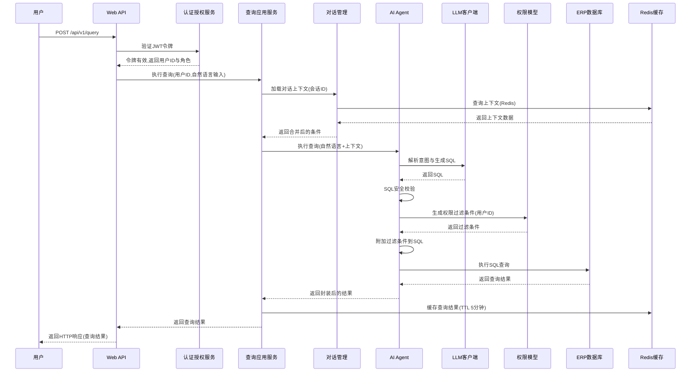

### 2.3 组件设计

#### 组件1: Web API (接入层)

**职责:** 接收HTTP请求,处理认证、参数校验、路由分发,返回HTTP响应

**生命周期:**
- 创建: 应用启动时初始化Gin Engine,注册路由与中间件
- 初始化: 加载配置(端口、超时时间),初始化中间件(认证、日志、恢复)
- 销毁: 应用关闭时优雅关闭HTTP服务器(等待现有请求完成)

**线程模型:** 单进程多线程(Gin默认模型),每个HTTP请求由独立goroutine处理

**配置项:**
- `server.port`: HTTP服务端口(默认8080)
- `server.timeout.read`: 读超时时间(默认10秒)
- `server.timeout.write`: 写超时时间(默认10秒)
- `server.timeout.idle`: 空闲超时时间(默认60秒)

#### 组件2: AI Agent (模型层)

**职责:** 接收自然语言输入,调用LLM解析意图与生成SQL,执行SQL查询,封装查询结果

**生命周期:**
- 创建: 应用启动时初始化ReAct Agent,注册工具(SQL查询工具)
- 初始化: 加载LLM客户端配置(API Key、Endpoint),初始化工具(SQL安全校验器、权限过滤器)
- 销毁: 应用关闭时关闭LLM客户端连接

**线程模型:** 每次查询由独立goroutine处理,LLM调用通过context控制超时(默认30秒)

**配置项:**
- `llm.provider`: LLM服务商(openai/ark)
- `llm.model`: 模型名称(gpt-4o/doubao-pro-32k)
- `llm.timeout`: LLM调用超时时间(默认30秒)
- `llm.max_retries`: LLM调用最大重试次数(默认3次)
- `llm.fallback_enabled`: 是否启用降级模式(默认true)

#### 组件3: 对话管理 (模型层)

**职责:** 管理对话会话,存储对话上下文(Redis),实现指代消解与条件合并

**生命周期:**
- 创建: 应用启动时初始化对话管理器,连接Redis
- 初始化: 加载Redis配置(地址、密码、TTL),初始化上下文存储策略
- 销毁: 应用关闭时关闭Redis连接

**线程模型:** 每次上下文操作由独立goroutine处理,Redis操作通过context控制超时(默认5秒)

**配置项:**
- `redis.address`: Redis地址(默认localhost:6379)
- `redis.password`: Redis密码(默认空)
- `redis.db`: Redis数据库编号(默认0)
- `dialog.context_ttl`: 对话上下文TTL(默认30分钟)
- `dialog.max_turns`: 最大保留对话轮次(默认5轮)

#### 组件4: 定时任务调度器 (推送应用服务)

**职责:** 定时触发报告推送与预警检测任务

**生命周期:**
- 创建: 应用启动时初始化Cron调度器,注册定时任务
- 初始化: 加载定时任务配置(报告推送时间、预警检测间隔)
- 销毁: 应用关闭时停止Cron调度器

**线程模型:** 每个定时任务由独立goroutine执行,任务执行通过context控制超时

**配置项:**
- `cron.report_schedule`: 报告推送Cron表达式(默认"0 8 * * *",每日8点)
- `cron.alert_check_interval`: 预警检测间隔(默认5分钟)

### 2.4 设计模式应用

| 设计模式 | 解决问题 | 应用模块 | 核心参与者 |
|----------|----------|----------|------------|
| **策略模式** | 支持多种LLM服务商(OpenAI/ARK),统一调用接口 | LLM客户端 | LLMClient接口、OpenAIClient策略、ARKClient策略 |
| **工厂模式** | 根据配置创建不同的LLM客户端实例 | LLM客户端 | LLMClientFactory、配置参数 |
| **装饰器模式** | 为SQL查询附加安全校验与权限过滤,不修改核心查询逻辑 | AI Agent | BaseSQLExecutor、SecurityValidator装饰器、PermissionFilter装饰器 |
| **观察者模式** | 定时任务触发时通知推送应用服务执行推送逻辑 | 推送应用服务 | CronScheduler观察者、PushAppService被观察者 |
| **模板方法模式** | 定义查询流程的标准步骤(认证→权限→查询→缓存),具体步骤由子类实现 | 查询应用服务 | QueryServiceTemplate、具体查询实现 |

---

## 第三章：接口设计

### 3.1 接口清单

| 接口编号 | 接口名称 | 所属模块 | 协议 | 调用方 | 状态 |
|----------|----------|----------|------|----------|------|
| API-001 | 自然语言查询 | Web API | HTTP/JSON | 前端H5、企业微信 | 新增(N) |
| API-002 | 用户登录 | Web API | HTTP/JSON | 前端H5、企业微信 | 新增(N) |
| API-003 | 用户登出 | Web API | HTTP/JSON | 前端H5、企业微信 | 新增(N) |
| API-004 | 创建用户 | Web API | HTTP/JSON | 系统管理员 | 新增(N) |
| API-005 | 查询用户列表 | Web API | HTTP/JSON | 系统管理员 | 新增(N) |
| API-006 | 更新用户 | Web API | HTTP/JSON | 系统管理员 | 新增(N) |
| API-007 | 删除用户 | Web API | HTTP/JSON | 系统管理员 | 新增(N) |
| API-008 | 创建用户组 | Web API | HTTP/JSON | 系统管理员 | 新增(N) |
| API-009 | 查询用户组列表 | Web API | HTTP/JSON | 系统管理员 | 新增(N) |
| API-010 | 更新用户组 | Web API | HTTP/JSON | 系统管理员 | 新增(N) |
| API-011 | 删除用户组 | Web API | HTTP/JSON | 系统管理员 | 新增(N) |
| API-012 | 配置用户组权限 | Web API | HTTP/JSON | 系统管理员 | 新增(N) |
| API-013 | 查询历史列表 | Web API | HTTP/JSON | 所有用户 | 新增(N) |
| API-014 | 查询历史详情 | Web API | HTTP/JSON | 所有用户 | 新增(N) |
| API-015 | 删除查询历史 | Web API | HTTP/JSON | 所有用户 | 新增(N) |
| API-016 | 创建收藏 | Web API | HTTP/JSON | 所有用户 | 新增(N) |
| API-017 | 查询收藏列表 | Web API | HTTP/JSON | 所有用户 | 新增(N) |
| API-018 | 删除收藏 | Web API | HTTP/JSON | 所有用户 | 新增(N) |
| API-019 | 创建定时报告 | Web API | HTTP/JSON | 系统管理员 | 新增(N) |
| API-020 | 查询定时报告列表 | Web API | HTTP/JSON | 系统管理员 | 新增(N) |
| API-021 | 更新定时报告 | Web API | HTTP/JSON | 系统管理员 | 新增(N) |
| API-022 | 删除定时报告 | Web API | HTTP/JSON | 系统管理员 | 新增(N) |
| API-023 | 创建预警规则 | Web API | HTTP/JSON | 系统管理员 | 新增(N) |
| API-024 | 查询预警规则列表 | Web API | HTTP/JSON | 系统管理员 | 新增(N) |
| API-025 | 更新预警规则 | Web API | HTTP/JSON | 系统管理员 | 新增(N) |
| API-026 | 删除预警规则 | Web API | HTTP/JSON | 系统管理员 | 新增(N) |
| API-027 | 查询推送记录 | Web API | HTTP/JSON | 系统管理员 | 新增(N) |
| API-028 | 查询操作日志 | Web API | HTTP/JSON | 系统管理员 | 新增(N) |
| INT-001 | 执行查询 | AI Agent | 内部Go接口 | 查询应用服务 | 新增(N) |
| INT-002 | 加载对话上下文 | 对话管理 | 内部Go接口 | 查询应用服务 | 新增(N) |
| INT-003 | 生成权限过滤条件 | 权限模型 | 内部Go接口 | AI Agent | 新增(N) |
| INT-004 | 调用LLM解析 | LLM客户端 | 内部Go接口 | AI Agent | 新增(N) |
| INT-005 | 执行ERP查询 | ERP数据库访问 | 内部Go接口 | AI Agent | 新增(N) |

### 3.2 接口详细规格

#### API-001: 自然语言查询

**标识:** API-001 | 自然语言查询 | v1

**协议:** HTTP POST, JSON序列化

**请求:**
- **方法/路径:** POST /api/v1/query
- **请求头:**
  - Authorization: Bearer {JWT令牌} (必填)
  - Content-Type: application/json (必填)
- **请求参数:**

  | 参数名 | 类型 | 必填 | 校验规则 | 说明 |
  |--------|------|------|----------|------|
  | input | String | 是 | 长度1~500字符,非空 | 用户自然语言问题 |
  | session_id | String | 否 | 雪花ID格式(19位数字) | 对话会话ID,首次查询不传,后续追问必传 |
  | execute_immediately | Boolean | 否 | 默认true | 是否立即执行查询,false时仅返回理解摘要 |

**响应:**
- **响应码定义:**
  - 200: 查询成功
  - 400: 参数校验失败或SQL安全校验失败
  - 401: JWT令牌无效或过期
  - 403: 权限不足
  - 503: 数据库连接超时或LLM服务不可用

- **响应体结构:**

  | 字段名 | 类型 | 必填 | 说明 |
  |--------|------|------|------|
  | code | Integer | 是 | 响应码(200/400/401/403/503) |
  | message | String | 是 | 响应消息 |
  | data | Object | 否 | 响应数据(查询成功时返回) |
  | data.session_id | String | 是 | 对话会话ID(雪花ID) |
  | data.understanding | String | 是 | 系统对用户意图的理解摘要 |
  | data.result_type | String | 是 | 结果类型(table/chart/empty) |
  | data.columns | Array | 否 | 表格列定义(结果类型为table时返回) |
  | data.columns[].name | String | 是 | 列名 |
  | data.columns[].type | String | 是 | 列类型(string/number/date) |
  | data.rows | Array | 否 | 表格数据行(结果类型为table时返回) |
  | data.chart_config | Object | 否 | 图表配置(结果类型为chart时返回) |
  | data.suggested_questions | Array | 否 | 联想问题列表(3~5个) |
  | data.can_export | Boolean | 是 | 是否可导出(基于用户权限) |

**业务规则:** BR-001(SQL安全校验), BR-002(权限过滤), BR-003(对话上下文管理), BR-004(查询结果缓存), BR-005(LLM调用降级), BR-006(指代消解), BR-007(反问机制)

**异常定义:**

  | 异常码 | 异常描述 | 触发条件 | 客户端处理建议 |
  |--------|----------|----------|----------------|
  | 40001 | 参数校验失败 | input为空或长度超限 | 提示用户检查输入内容 |
  | 40002 | SQL安全校验失败 | SQL包含DELETE/UPDATE/DROP/INSERT | 提示用户"检测到不安全操作,已拒绝执行" |
  | 40003 | 意图无法识别 | LLM无法解析用户意图 | 提示用户"无法理解问题,请换种说法" |
  | 40101 | JWT令牌无效 | JWT令牌格式错误或签名验证失败 | 提示用户重新登录 |
  | 40102 | JWT令牌过期 | JWT令牌已过期 | 提示用户重新登录 |
  | 40301 | 权限不足 | 用户无权限访问查询的表或字段 | 提示用户"当前权限下无可查询数据,请联系管理员" |
  | 50301 | 数据库连接超时 | ERP数据库无响应(超时10秒) | 提示用户"数据库连接超时,请稍后重试" |
  | 50302 | LLM服务不可用 | LLM调用失败且降级模式不可用 | 提示用户"智能解析服务不可用,请稍后重试" |

**性能要求:**
- 预期QPS: 100
- 响应时间: P50<1秒, P99<3秒
- 幂等性: 不要求(每次查询可能产生新结果)

**安全要求:**
- 认证方式: JWT令牌(Bearer Token)
- 授权要求: 用户必须具有查询权限(基于用户组)
- 敏感数据脱敏: 成本价、利润率等敏感字段,对无权限用户返回null

**变更记录:**

  | 版本 | 变更日期 | 变更章节 | 变更类型 | 变更摘要 | 关联影响 |
  |------|----------|----------|----------|----------|----------|
  | 1.0.0 | 2026-06-02 | 全部 | N(新增) | 初始版本创建 | 无 |

#### API-002: 用户登录

**标识:** API-002 | 用户登录 | v1

**协议:** HTTP POST, JSON序列化

**请求:**
- **方法/路径:** POST /api/v1/auth/login
- **请求头:**
  - Content-Type: application/json (必填)
- **请求参数:**

  | 参数名 | 类型 | 必填 | 校验规则 | 说明 |
  |--------|------|------|----------|------|
  | username | String | 是 | 长度3~50字符,非空 | 用户名 |
  | password | String | 是 | 长度8~100字符,非空 | 密码 |

**响应:**
- **响应码定义:**
  - 200: 登录成功
  - 400: 参数校验失败
  - 401: 用户名或密码错误
  - 403: 用户已停用

- **响应体结构:**

  | 字段名 | 类型 | 必填 | 说明 |
  |--------|------|------|------|
  | code | Integer | 是 | 响应码(200/400/401/403) |
  | message | String | 是 | 响应消息 |
  | data | Object | 否 | 响应数据(登录成功时返回) |
  | data.token | String | 是 | JWT令牌 |
  | data.expires_at | String | 是 | 令牌过期时间(ISO8601格式) |
  | data.user | Object | 是 | 用户信息 |
  | data.user.id | String | 是 | 用户ID(雪花ID) |
  | data.user.username | String | 是 | 用户名 |
  | data.user.role | String | 是 | 角色(admin/manager/executive) |
  | data.user.groups | Array | 是 | 用户组列表 |

**业务规则:** 无

**异常定义:**

  | 异常码 | 异常描述 | 触发条件 | 客户端处理建议 |
  |--------|----------|----------|----------------|
  | 40001 | 参数校验失败 | username或password为空或长度超限 | 提示用户检查输入 |
  | 40101 | 用户名或密码错误 | 用户不存在或密码不匹配 | 提示用户"用户名或密码错误" |
  | 40301 | 用户已停用 | 用户状态为停用 | 提示用户"账号已停用,请联系管理员" |

**性能要求:**
- 预期QPS: 10
- 响应时间: P50<500ms, P99<1秒
- 幂等性: 不要求

**安全要求:**
- 认证方式: 无(登录接口本身不需要认证)
- 授权要求: 无
- 敏感数据脱敏: 密码不返回,JWT令牌包含权限信息但不包含密码

**变更记录:**

  | 版本 | 变更日期 | 变更章节 | 变更类型 | 变更摘要 | 关联影响 |
  |------|----------|----------|----------|----------|----------|
  | 1.0.0 | 2026-06-02 | 全部 | N(新增) | 初始版本创建 | 无 |

#### API-004: 创建用户

**标识:** API-004 | 创建用户 | v1

**协议:** HTTP POST, JSON序列化

**请求:**
- **方法/路径:** POST /api/v1/users
- **请求头:**
  - Authorization: Bearer {JWT令牌} (必填)
  - Content-Type: application/json (必填)
- **请求参数:**

  | 参数名 | 类型 | 必填 | 校验规则 | 说明 |
  |--------|------|------|----------|------|
  | username | String | 是 | 长度3~50字符,唯一 | 用户名 |
  | password | String | 是 | 长度8~100字符 | 密码(需bcrypt加密存储) |
  | email | String | 是 | 长度1~100字符,邮箱格式,唯一 | 邮箱 |
  | role | String | 是 | 枚举值(admin/manager/executive) | 角色 |
  | groups | Array | 否 | 数组元素为用户组ID(雪花ID) | 用户组列表 |
  | status | Integer | 否 | 枚举值(1启用/0停用),默认1 | 用户状态 |

**响应:**
- **响应码定义:**
  - 200: 创建成功
  - 400: 参数校验失败
  - 401: JWT令牌无效或过期
  - 403: 权限不足(仅系统管理员可创建用户)
  - 409: 用户名或邮箱已存在

- **响应体结构:**

  | 字段名 | 类型 | 必填 | 说明 |
  |--------|------|------|------|
  | code | Integer | 是 | 响应码(200/400/401/403/409) |
  | message | String | 是 | 响应消息 |
  | data | Object | 否 | 响应数据(创建成功时返回) |
  | data.id | String | 是 | 用户ID(雪花ID) |
  | data.username | String | 是 | 用户名 |
  | data.email | String | 是 | 邮箱 |
  | data.role | String | 是 | 角色 |
  | data.groups | Array | 是 | 用户组列表 |
  | data.status | Integer | 是 | 用户状态 |
  | data.created_at | String | 是 | 创建时间(ISO8601格式) |

**业务规则:** 无

**异常定义:**

  | 异常码 | 异常描述 | 触发条件 | 客户端处理建议 |
  |--------|----------|----------|----------------|
  | 40001 | 参数校验失败 | 参数格式不符合校验规则 | 提示管理员检查输入 |
  | 40101 | JWT令牌无效 | JWT令牌格式错误或签名验证失败 | 提示管理员重新登录 |
  | 40301 | 权限不足 | 当前用户不是系统管理员 | 提示管理员"权限不足" |
  | 40901 | 用户名已存在 | username已存在于数据库 | 提示管理员"用户名已存在" |
  | 40902 | 邮箱已存在 | email已存在于数据库 | 提示管理员"邮箱已存在" |

**性能要求:**
- 预期QPS: 1
- 响应时间: P50<500ms, P99<1秒
- 幂等性: 不要求(用户名唯一性约束保证)

**安全要求:**
- 认证方式: JWT令牌(Bearer Token)
- 授权要求: 仅系统管理员可创建用户
- 敏感数据脱敏: 密码bcrypt加密存储,不返回

**变更记录:**

  | 版本 | 变更日期 | 变更章节 | 变更类型 | 变更摘要 | 关联影响 |
  |------|----------|----------|----------|----------|----------|
  | 1.0.0 | 2026-06-02 | 全部 | N(新增) | 初始版本创建 | 无 |

#### API-003: 用户登出

**标识:** API-003 | 用户登出 | v1

**协议:** HTTP POST, JSON序列化

**请求:**
- **方法/路径:** POST /api/v1/auth/logout
- **请求头:**
  - Authorization: Bearer {JWT令牌} (必填)
  - Content-Type: application/json (必填)

**响应:**
- **响应码定义:**
  - 200: 登出成功
  - 401: JWT令牌无效或过期

- **响应体结构:**

  | 字段名 | 类型 | 必填 | 说明 |
  |--------|------|------|------|
  | code | Integer | 是 | 响应码(200/401) |
  | message | String | 是 | 响应消息 |

**业务规则:** 无

**异常定义:**

  | 异常码 | 异常描述 | 触发条件 | 客户端处理建议 |
  |--------|----------|----------|----------------|
  | 40101 | JWT令牌无效 | JWT令牌格式错误或签名验证失败 | 提示用户重新登录 |

**性能要求:**
- 预期QPS: 10
- 响应时间: P50<100ms, P99<500ms
- 幂等性: 要求(多次登出效果相同)

**安全要求:**
- 认证方式: JWT令牌(Bearer Token)
- 授权要求: 无(已登录用户均可登出)
- 敏感数据脱敏: 无

**变更记录:**

  | 版本 | 变更日期 | 变更章节 | 变更类型 | 变更摘要 | 关联影响 |
  |------|----------|----------|----------|----------|----------|
  | 1.0.0 | 2026-06-02 | 全部 | N(新增) | 初始版本创建 | 无 |

#### API-005: 查询用户列表

**标识:** API-005 | 查询用户列表 | v1

**协议:** HTTP GET, JSON序列化

**请求:**
- **方法/路径:** GET /api/v1/users
- **请求头:**
  - Authorization: Bearer {JWT令牌} (必填)
- **请求参数(Query String):**

  | 参数名 | 类型 | 必填 | 校验规则 | 说明 |
  |--------|------|------|----------|------|
  | page | Integer | 否 | 正整数,默认1 | 页码 |
  | page_size | Integer | 否 | 正整数1~100,默认20 | 每页数量 |
  | username | String | 否 | 长度1~50 | 用户名过滤(模糊匹配) |
  | role | String | 否 | 枚举值(admin/manager/executive) | 角色过滤 |
  | status | Integer | 否 | 枚举值(1启用/0停用) | 状态过滤 |

**响应:**
- **响应码定义:**
  - 200: 查询成功
  - 401: JWT令牌无效或过期
  - 403: 权限不足(仅系统管理员可查询用户列表)

- **响应体结构:**

  | 字段名 | 类型 | 必填 | 说明 |
  |--------|------|------|------|
  | code | Integer | 是 | 响应码(200/401/403) |
  | message | String | 是 | 响应消息 |
  | data | Object | 是 | 响应数据 |
  | data.total | Integer | 是 | 总数量 |
  | data.page | Integer | 是 | 当前页码 |
  | data.page_size | Integer | 是 | 每页数量 |
  | data.users | Array | 是 | 用户列表 |
  | data.users[].id | String | 是 | 用户ID(雪花ID) |
  | data.users[].username | String | 是 | 用户名 |
  | data.users[].email | String | 是 | 邮箱 |
  | data.users[].role | String | 是 | 角色 |
  | data.users[].status | Integer | 是 | 用户状态 |
  | data.users[].created_at | String | 是 | 创建时间(ISO8601格式) |

**业务规则:** 无

**异常定义:**

  | 异常码 | 异常描述 | 触发条件 | 客户端处理建议 |
  |--------|----------|----------|----------------|
  | 40101 | JWT令牌无效 | JWT令牌格式错误或签名验证失败 | 提示管理员重新登录 |
  | 40301 | 权限不足 | 当前用户不是系统管理员 | 提示管理员"权限不足" |

**性能要求:**
- 预期QPS: 5
- 响应时间: P50<500ms, P99<1秒
- 幂等性: 要求(相同查询条件返回相同结果)

**安全要求:**
- 认证方式: JWT令牌(Bearer Token)
- 授权要求: 仅系统管理员可查询用户列表
- 敏感数据脱敏: 密码不返回

**变更记录:**

  | 版本 | 变更日期 | 变更章节 | 变更类型 | 变更摘要 | 关联影响 |
  |------|----------|----------|----------|----------|----------|
  | 1.0.0 | 2026-06-02 | 全部 | N(新增) | 初始版本创建 | 无 |

#### API-006: 更新用户

**标识:** API-006 | 更新用户 | v1

**协议:** HTTP PUT, JSON序列化

**请求:**
- **方法/路径:** PUT /api/v1/users/{user_id}
- **请求头:**
  - Authorization: Bearer {JWT令牌} (必填)
  - Content-Type: application/json (必填)
- **路径参数:**

  | 参数名 | 类型 | 必填 | 校验规则 | 说明 |
  |--------|------|------|----------|------|
  | user_id | String | 是 | 雪花ID格式(19位数字) | 用户ID |

- **请求参数(Body):**

  | 参数名 | 类型 | 必填 | 校验规则 | 说明 |
  |--------|------|------|----------|------|
  | username | String | 否 | 长度3~50字符,唯一 | 用户名 |
  | password | String | 否 | 长度8~100字符 | 密码(需bcrypt加密存储) |
  | email | String | 否 | 长度1~100字符,邮箱格式,唯一 | 邮箱 |
  | role | String | 否 | 枚举值(admin/manager/executive) | 角色 |
  | groups | Array | 否 | 数组元素为用户组ID(雪花ID) | 用户组列表 |
  | status | Integer | 否 | 枚举值(1启用/0停用) | 用户状态 |

**响应:**
- **响应码定义:**
  - 200: 更新成功
  - 400: 参数校验失败
  - 401: JWT令牌无效或过期
  - 403: 权限不足(仅系统管理员可更新用户)
  - 404: 用户不存在
  - 409: 用户名或邮箱已存在

- **响应体结构:**

  | 字段名 | 类型 | 必填 | 说明 |
  |--------|------|------|------|
  | code | Integer | 是 | 响应码(200/400/401/403/404/409) |
  | message | String | 是 | 响应消息 |
  | data | Object | 否 | 响应数据(更新成功时返回) |
  | data.id | String | 是 | 用户ID(雪花ID) |
  | data.username | String | 是 | 用户名 |
  | data.email | String | 是 | 邵箱 |
  | data.role | String | 是 | 角色 |
  | data.groups | Array | 是 | 用户组列表 |
  | data.status | Integer | 是 | 用户状态 |
  | data.updated_at | String | 是 | 更新时间(ISO8601格式) |

**业务规则:** 无

**异常定义:**

  | 异常码 | 异常描述 | 触发条件 | 客户端处理建议 |
  |--------|----------|----------|----------------|
  | 40001 | 参数校验失败 | 参数格式不符合校验规则 | 提示管理员检查输入 |
  | 40101 | JWT令牌无效 | JWT令牌格式错误或签名验证失败 | 提示管理员重新登录 |
  | 40301 | 权限不足 | 当前用户不是系统管理员 | 提示管理员"权限不足" |
  | 40401 | 用户不存在 | user_id不存在于数据库 | 提示管理员"用户不存在" |
  | 40901 | 用户名已存在 | username已存在于其他用户 | 提示管理员"用户名已存在" |
  | 40902 | 邮箱已存在 | email已存在于其他用户 | 提示管理员"邮箱已存在" |

**性能要求:**
- 预期QPS: 1
- 响应时间: P50<500ms, P99<1秒
- 幂等性: 要求(通过乐观锁version字段保证)

**安全要求:**
- 认证方式: JWT令牌(Bearer Token)
- 授权要求: 仅系统管理员可更新用户
- 敏感数据脱敏: 密码bcrypt加密存储,不返回

**变更记录:**

  | 版本 | 变更日期 | 变更章节 | 变更类型 | 变更摘要 | 关联影响 |
  |------|----------|----------|----------|----------|----------|
  | 1.0.0 | 2026-06-02 | 全部 | N(新增) | 初始版本创建 | 无 |

#### API-007: 删除用户

**标识:** API-007 | 删除用户 | v1

**协议:** HTTP DELETE, JSON序列化

**请求:**
- **方法/路径:** DELETE /api/v1/users/{user_id}
- **请求头:**
  - Authorization: Bearer {JWT令牌} (必填)
- **路径参数:**

  | 参数名 | 类型 | 必填 | 校验规则 | 说明 |
  |--------|------|------|----------|------|
  | user_id | String | 是 | 雪花ID格式(19位数字) | 用户ID |

**响应:**
- **响应码定义:**
  - 200: 删除成功
  - 401: JWT令牌无效或过期
  - 403: 权限不足(仅系统管理员可删除用户)
  - 404: 用户不存在

- **响应体结构:**

  | 字段名 | 类型 | 必填 | 说明 |
  |--------|------|------|------|
  | code | Integer | 是 | 响应码(200/401/403/404) |
  | message | String | 是 | 响应消息 |

**业务规则:** 无

**异常定义:**

  | 异常码 | 异常描述 | 触发条件 | 客户端处理建议 |
  |--------|----------|----------|----------------|
  | 40101 | JWT令牌无效 | JWT令牌格式错误或签名验证失败 | 提示管理员重新登录 |
  | 40301 | 权限不足 | 当前用户不是系统管理员 | 提示管理员"权限不足" |
  | 40401 | 用户不存在 | user_id不存在于数据库 | 提示管理员"用户不存在" |

**性能要求:**
- 预期QPS: 1
- 响应时间: P50<500ms, P99<1秒
- 幂等性: 要求(多次删除同一用户效果相同)

**安全要求:**
- 认证方式: JWT令牌(Bearer Token)
- 授权要求: 仅系统管理员可删除用户
- 敏感数据脱敏: 无

**变更记录:**

  | 版本 | 变更日期 | 变更章节 | 变更类型 | 变更摘要 | 关联影响 |
  |------|----------|----------|----------|----------|----------|
  | 1.0.0 | 2026-06-02 | 全部 | N(新增) | 初始版本创建 | 无 |

#### API-008: 创建用户组

**标识:** API-008 | 创建用户组 | v1

**协议:** HTTP POST, JSON序列化

**请求:**
- **方法/路径:** POST /api/v1/groups
- **请求头:**
  - Authorization: Bearer {JWT令牌} (必填)
  - Content-Type: application/json (必填)
- **请求参数(Body):**

  | 参数名 | 类型 | 必填 | 校验规则 | 说明 |
  |--------|------|------|----------|------|
  | name | String | 是 | 长度3~50字符,唯一 | 用户组名称 |
  | description | String | 否 | 长度0~200字符 | 用户组描述 |
  | members | Array | 否 | 数组元素为用户ID(雪花ID) | 用户组成员列表 |

**响应:**
- **响应码定义:**
  - 200: 创建成功
  - 400: 参数校验失败
  - 401: JWT令牌无效或过期
  - 403: 权限不足(仅系统管理员可创建用户组)
  - 409: 用户组名称已存在

- **响应体结构:**

  | 字段名 | 类型 | 必填 | 说明 |
  |--------|------|------|------|
  | code | Integer | 是 | 响应码(200/400/401/403/409) |
  | message | String | 是 | 响应消息 |
  | data | Object | 否 | 响应数据(创建成功时返回) |
  | data.id | String | 是 | 用户组ID(雪花ID) |
  | data.name | String | 是 | 用户组名称 |
  | data.description | String | 否 | 用户组描述 |
  | data.members | Array | 是 | 用户组成员列表 |
  | data.created_at | String | 是 | 创建时间(ISO8601格式) |

**业务规则:** 无

**异常定义:**

  | 异常码 | 异常描述 | 触发条件 | 客户端处理建议 |
  |--------|----------|----------|----------------|
  | 40001 | 参数校验失败 | 参数格式不符合校验规则 | 提示管理员检查输入 |
  | 40101 | JWT令牌无效 | JWT令牌格式错误或签名验证失败 | 提示管理员重新登录 |
  | 40301 | 权限不足 | 当前用户不是系统管理员 | 提示管理员"权限不足" |
  | 40901 | 用户组名称已存在 | name已存在于数据库 | 提示管理员"用户组名称已存在" |

**性能要求:**
- 预期QPS: 1
- 响应时间: P50<500ms, P99<1秒
- 幂等性: 不要求(用户组名称唯一性约束保证)

**安全要求:**
- 认证方式: JWT令牌(Bearer Token)
- 授权要求: 仅系统管理员可创建用户组
- 敏感数据脱敏: 无

**变更记录:**

  | 版本 | 变更日期 | 变更章节 | 变更类型 | 变更摘要 | 关联影响 |
  |------|----------|----------|----------|----------|----------|
  | 1.0.0 | 2026-06-02 | 全部 | N(新增) | 初始版本创建 | 无 |

#### API-009: 查询用户组列表

**标识:** API-009 | 查询用户组列表 | v1

**协议:** HTTP GET, JSON序列化

**请求:**
- **方法/路径:** GET /api/v1/groups
- **请求头:**
  - Authorization: Bearer {JWT令牌} (必填)
- **请求参数(Query String):**

  | 参数名 | 类型 | 必填 | 校验规则 | 说明 |
  |--------|------|------|----------|------|
  | page | Integer | 否 | 正整数,默认1 | 页码 |
  | page_size | Integer | 否 | 正整数1~100,默认20 | 每页数量 |
  | name | String | 否 | 长度1~50 | 用户组名称过滤(模糊匹配) |

**响应:**
- **响应码定义:**
  - 200: 查询成功
  - 401: JWT令牌无效或过期
  - 403: 权限不足(仅系统管理员可查询用户组列表)

- **响应体结构:**

  | 字段名 | 类型 | 必填 | 说明 |
  |--------|------|------|------|
  | code | Integer | 是 | 响应码(200/401/403) |
  | message | String | 是 | 响应消息 |
  | data | Object | 是 | 响应数据 |
  | data.total | Integer | 是 | 总数量 |
  | data.page | Integer | 是 | 当前页码 |
  | data.page_size | Integer | 是 | 每页数量 |
  | data.groups | Array | 是 | 用户组列表 |
  | data.groups[].id | String | 是 | 用户组ID(雪花ID) |
  | data.groups[].name | String | 是 | 用户组名称 |
  | data.groups[].description | String | 否 | 用户组描述 |
  | data.groups[].member_count | Integer | 是 | 成员数量 |
  | data.groups[].created_at | String | 是 | 创建时间(ISO8601格式) |

**业务规则:** 无

**异常定义:**

  | 异常码 | 异常描述 | 触发条件 | 客户端处理建议 |
  |--------|----------|----------|----------------|
  | 40101 | JWT令牌无效 | JWT令牌格式错误或签名验证失败 | 提示管理员重新登录 |
  | 40301 | 权限不足 | 当前用户不是系统管理员 | 提示管理员"权限不足" |

**性能要求:**
- 预期QPS: 5
- 响应时间: P50<500ms, P99<1秒
- 幂等性: 要求(相同查询条件返回相同结果)

**安全要求:**
- 认证方式: JWT令牌(Bearer Token)
- 授权要求: 仅系统管理员可查询用户组列表
- 敏感数据脱敏: 无

**变更记录:**

  | 版本 | 变更日期 | 变更章节 | 变更类型 | 变更摘要 | 关联影响 |
  |------|----------|----------|----------|----------|----------|
  | 1.0.0 | 2026-06-02 | 全部 | N(新增) | 初始版本创建 | 无 |

#### API-010: 更新用户组

**标识:** API-010 | 更新用户组 | v1

**协议:** HTTP PUT, JSON序列化

**请求:**
- **方法/路径:** PUT /api/v1/groups/{group_id}
- **请求头:**
  - Authorization: Bearer {JWT令牌} (必填)
  - Content-Type: application/json (必填)
- **路径参数:**

  | 参数名 | 类型 | 必填 | 校验规则 | 说明 |
  |--------|------|------|----------|------|
  | group_id | String | 是 | 雪花ID格式(19位数字) | 用户组ID |

- **请求参数(Body):**

  | 参数名 | 类型 | 必填 | 校验规则 | 说明 |
  |--------|------|------|----------|------|
  | name | String | 否 | 长度3~50字符,唯一 | 用户组名称 |
  | description | String | 否 | 长度0~200字符 | 用户组描述 |
  | members | Array | 否 | 数组元素为用户ID(雪花ID) | 用户组成员列表 |

**响应:**
- **响应码定义:**
  - 200: 更新成功
  - 400: 参数校验失败
  - 401: JWT令牌无效或过期
  - 403: 权限不足(仅系统管理员可更新用户组)
  - 404: 用户组不存在
  - 409: 用户组名称已存在

- **响应体结构:**

  | 字段名 | 类型 | 必填 | 说明 |
  |--------|------|------|------|
  | code | Integer | 是 | 响应码(200/400/401/403/404/409) |
  | message | String | 是 | 响应消息 |
  | data | Object | 否 | 响应数据(更新成功时返回) |
  | data.id | String | 是 | 用户组ID(雪花ID) |
  | data.name | String | 是 | 用户组名称 |
  | data.description | String | 否 | 用户组描述 |
  | data.members | Array | 是 | 用户组成员列表 |
  | data.updated_at | String | 是 | 更新时间(ISO8601格式) |

**业务规则:** 无

**异常定义:**

  | 异常码 | 异常描述 | 触发条件 | 客户端处理建议 |
  |--------|----------|----------|----------------|
  | 40001 | 参数校验失败 | 参数格式不符合校验规则 | 提示管理员检查输入 |
  | 40101 | JWT令牌无效 | JWT令牌格式错误或签名验证失败 | 提示管理员重新登录 |
  | 40301 | 权限不足 | 当前用户不是系统管理员 | 提示管理员"权限不足" |
  | 40401 | 用户组不存在 | group_id不存在于数据库 | 提示管理员"用户组不存在" |
  | 40901 | 用户组名称已存在 | name已存在于其他用户组 | 提示管理员"用户组名称已存在" |

**性能要求:**
- 预期QPS: 1
- 响应时间: P50<500ms, P99<1秒
- 幂等性: 要求(通过乐观锁version字段保证)

**安全要求:**
- 认证方式: JWT令牌(Bearer Token)
- 授权要求: 仅系统管理员可更新用户组
- 敏感数据脱敏: 无

**变更记录:**

  | 版本 | 变更日期 | 变更章节 | 变更类型 | 变更摘要 | 关联影响 |
  |------|----------|----------|----------|----------|----------|
  | 1.0.0 | 2026-06-02 | 全部 | N(新增) | 初始版本创建 | 无 |

#### API-011: 删除用户组

**标识:** API-011 | 删除用户组 | v1

**协议:** HTTP DELETE, JSON序列化

**请求:**
- **方法/路径:** DELETE /api/v1/groups/{group_id}
- **请求头:**
  - Authorization: Bearer {JWT令牌} (必填)
- **路径参数:**

  | 参数名 | 类型 | 必填 | 校验规则 | 说明 |
  |--------|------|------|----------|------|
  | group_id | String | 是 | 雪花ID格式(19位数字) | 用户组ID |

**响应:**
- **响应码定义:**
  - 200: 删除成功
  - 401: JWT令牌无效或过期
  - 403: 权限不足(仅系统管理员可删除用户组)
  - 404: 用户组不存在

- **响应体结构:**

  | 字段名 | 类型 | 必填 | 说明 |
  |--------|------|------|------|
  | code | Integer | 是 | 响应码(200/401/403/404) |
  | message | String | 是 | 响应消息 |

**业务规则:** 无

**异常定义:**

  | 异常码 | 异常描述 | 触发条件 | 客户端处理建议 |
  |--------|----------|----------|----------------|
  | 40101 | JWT令牌无效 | JWT令牌格式错误或签名验证失败 | 提示管理员重新登录 |
  | 40301 | 权限不足 | 当前用户不是系统管理员 | 提示管理员"权限不足" |
  | 40401 | 用户组不存在 | group_id不存在于数据库 | 提示管理员"用户组不存在" |

**性能要求:**
- 预期QPS: 1
- 响应时间: P50<500ms, P99<1秒
- 幂等性: 要求(多次删除同一用户组效果相同)

**安全要求:**
- 认证方式: JWT令牌(Bearer Token)
- 授权要求: 仅系统管理员可删除用户组
- 敏感数据脱敏: 无

**变更记录:**

  | 版本 | 变更日期 | 变更章节 | 变更类型 | 变更摘要 | 关联影响 |
  |------|----------|----------|----------|----------|----------|
  | 1.0.0 | 2026-06-02 | 全部 | N(新增) | 初始版本创建 | 无 |

#### API-012: 配置用户组权限

**标识:** API-012 | 配置用户组权限 | v1

**协议:** HTTP POST, JSON序列化

**请求:**
- **方法/路径:** POST /api/v1/groups/{group_id}/permissions
- **请求头:**
  - Authorization: Bearer {JWT令牌} (必填)
  - Content-Type: application/json (必填)
- **路径参数:**

  | 参数名 | 类型 | 必填 | 校验规则 | 说明 |
  |--------|------|------|----------|------|
  | group_id | String | 是 | 雪花ID格式(19位数字) | 用户组ID |

- **请求参数(Body):**

  | 参数名 | 类型 | 必填 | 校验规则 | 说明 |
  |--------|------|------|----------|------|
  | permissions | Array | 是 | 数组元素为权限对象 | 权限列表 |
  | permissions[].table_name | String | 是 | 长度1~100,非空 | 表名 |
  | permissions[].allowed_fields | String | 是 | JSON数组格式 | 允许查询的字段列表 |
  | permissions[].filter_condition | String | 否 | SQL条件表达式 | 数据级权限过滤条件 |

**响应:**
- **响应码定义:**
  - 200: 配置成功
  - 400: 参数校验失败
  - 401: JWT令牌无效或过期
  - 403: 权限不足(仅系统管理员可配置权限)
  - 404: 用户组不存在

- **响应体结构:**

  | 字段名 | 类型 | 必填 | 说明 |
  |--------|------|------|------|
  | code | Integer | 是 | 响应码(200/400/401/403/404) |
  | message | String | 是 | 响应消息 |
  | data | Object | 否 | 响应数据(配置成功时返回) |
  | data.group_id | String | 是 | 用户组ID(雪花ID) |
| data.permissions | Array | 是 | 权限列表 |
| data.permissions[].id | String | 是 | 权限ID(雪花ID) |
  | data.permissions[].table_name | String | 是 | 表名 |
  | data.permissions[].allowed_fields | String | 是 | 允许查询的字段列表 |
  | data.permissions[].filter_condition | String | 否 | 数据级权限过滤条件 |
  | data.created_at | String | 是 | 配置时间(ISO8601格式) |

**业务规则:** BR-002(权限过滤)

**异常定义:**

  | 异常码 | 异常描述 | 触发条件 | 客户端处理建议 |
  |--------|----------|----------|----------------|
  | 40001 | 参数校验失败 | 参数格式不符合校验规则 | 提示管理员检查输入 |
  | 40101 | JWT令牌无效 | JWT令牌格式错误或签名验证失败 | 提示管理员重新登录 |
  | 40301 | 权限不足 | 当前用户不是系统管理员 | 提示管理员"权限不足" |
  | 40401 | 用户组不存在 | group_id不存在于数据库 | 提示管理员"用户组不存在" |

**性能要求:**
- 预期QPS: 1
- 响应时间: P50<500ms, P99<1秒
- 幂等性: 不要求(每次配置会覆盖原有权限)

**安全要求:**
- 认证方式: JWT令牌(Bearer Token)
- 授权要求: 仅系统管理员可配置权限
- 敏感数据脱敏: 无

**变更记录:**

  | 版本 | 变更日期 | 变更章节 | 变更类型 | 变更摘要 | 关联影响 |
  |------|----------|----------|----------|----------|----------|
  | 1.0.0 | 2026-06-02 | 全部 | N(新增) | 初始版本创建 | 无 |

#### API-013: 查询历史列表

**标识:** API-013 | 查询历史列表 | v1

**协议:** HTTP GET, JSON序列化

**请求:**
- **方法/路径:** GET /api/v1/history
- **请求头:**
  - Authorization: Bearer {JWT令牌} (必填)
- **请求参数(Query String):**

  | 参数名 | 类型 | 必填 | 校验规则 | 说明 |
  |--------|------|------|----------|------|
  | page | Integer | 否 | 正整数,默认1 | 页码 |
  | page_size | Integer | 否 | 正整数1~100,默认20 | 每页数量 |
  | start_time | String | 否 | ISO8601格式 | 开始时间过滤 |
  | end_time | String | 否 | ISO8601格式 | 结束时间过滤 |
  | status | String | 否 | 枚举值(success/failed) | 查询状态过滤 |

**响应:**
- **响应码定义:**
  - 200: 查询成功
  - 401: JWT令牌无效或过期

- **响应体结构:**

  | 字段名 | 类型 | 必填 | 说明 |
  |--------|------|------|------|
  | code | Integer | 是 | 响应码(200/401) |
  | message | String | 是 | 响应消息 |
  | data | Object | 是 | 响应数据 |
  | data.total | Integer | 是 | 总数量 |
  | data.page | Integer | 是 | 当前页码 |
  | data.page_size | Integer | 是 | 每页数量 |
  | data.records | Array | 是 | 查询历史列表 |
  | data.records[].id | String | 是 | 查询记录ID(雪花ID) |
  | data.records[].input | String | 是 | 用户输入的自然语言问题 |
  | data.records[].sql | String | 是 | 生成的SQL语句 |
  | data.records[].status | String | 是 | 查询状态(success/failed) |
  | data.records[].error_message | String | 否 | 错误信息(失败时返回) |
  | data.records[].result_count | Integer | 否 | 结果数量(成功时返回) |
  | data.records[].execution_time | Integer | 否 | 执行时间(毫秒) |
  | data.records[].created_at | String | 是 | 创建时间(ISO8601格式) |

**业务规则:** 无

**异常定义:**

  | 异常码 | 异常描述 | 触发条件 | 客户端处理建议 |
  |--------|----------|----------|----------------|
  | 40101 | JWT令牌无效 | JWT令牌格式错误或签名验证失败 | 提示用户重新登录 |

**性能要求:**
- 预期QPS: 10
- 响应时间: P50<500ms, P99<1秒
- 幂等性: 要求(相同查询条件返回相同结果)

**安全要求:**
- 认证方式: JWT令牌(Bearer Token)
- 授权要求: 无(用户只能查询自己的历史记录)
- 敏感数据脱敏: 无

**变更记录:**

  | 版本 | 变更日期 | 变更章节 | 变更类型 | 变更摘要 | 关联影响 |
  |------|----------|----------|----------|----------|----------|
  | 1.0.0 | 2026-06-02 | 全部 | N(新增) | 初始版本创建 | 无 |

#### API-014: 查询历史详情

**标识:** API-014 | 查询历史详情 | v1

**协议:** HTTP GET, JSON序列化

**请求:**
- **方法/路径:** GET /api/v1/history/{record_id}
- **请求头:**
  - Authorization: Bearer {JWT令牌} (必填)
- **路径参数:**

  | 参数名 | 类型 | 必填 | 校验规则 | 说明 |
  |--------|------|------|----------|------|
  | record_id | String | 是 | 雪花ID格式(19位数字) | 查询记录ID |

**响应:**
- **响应码定义:**
  - 200: 查询成功
  - 401: JWT令牌无效或过期
  - 404: 查询记录不存在

- **响应体结构:**

  | 字段名 | 类型 | 必填 | 说明 |
  |--------|------|------|------|
  | code | Integer | 是 | 响应码(200/401/404) |
  | message | String | 是 | 响应消息 |
  | data | Object | 是 | 响应数据 |
  | data.id | String | 是 | 查询记录ID(雪花ID) |
| data.session_id | String | 是 | 对话会话ID(雪花ID) |
  | data.input | String | 是 | 用户输入的自然语言问题 |
  | data.sql | String | 是 | 生成的SQL语句 |
  | data.status | String | 是 | 查询状态(success/failed) |
  | data.error_message | String | 否 | 错误信息(失败时返回) |
  | data.result_count | Integer | 否 | 结果数量(成功时返回) |
  | data.execution_time | Integer | 否 | 执行时间(毫秒) |
  | data.result_data | String | 否 | 查询结果(JSON格式,成功时返回) |
  | data.created_at | String | 是 | 创建时间(ISO8601格式) |

**业务规则:** 无

**异常定义:**

  | 异常码 | 异常描述 | 触发条件 | 客户端处理建议 |
  |--------|----------|----------|----------------|
  | 40101 | JWT令牌无效 | JWT令牌格式错误或签名验证失败 | 提示用户重新登录 |
  | 40401 | 查询记录不存在 | record_id不存在于数据库或不属于当前用户 | 提示用户"查询记录不存在" |

**性能要求:**
- 预期QPS: 5
- 响应时间: P50<500ms, P99<1秒
- 幂等性: 要求(相同record_id返回相同结果)

**安全要求:**
- 认证方式: JWT令牌(Bearer Token)
- 授权要求: 无(用户只能查询自己的历史记录详情)
- 敏感数据脱敏: 无

**变更记录:**

  | 版本 | 变更日期 | 变更章节 | 变更类型 | 变更摘要 | 关联影响 |
  |------|----------|----------|----------|----------|----------|
  | 1.0.0 | 2026-06-02 | 全部 | N(新增) | 初始版本创建 | 无 |

#### API-015: 删除查询历史

**标识:** API-015 | 删除查询历史 | v1

**协议:** HTTP DELETE, JSON序列化

**请求:**
- **方法/路径:** DELETE /api/v1/history/{record_id}
- **请求头:**
  - Authorization: Bearer {JWT令牌} (必填)
- **路径参数:**

  | 参数名 | 类型 | 必填 | 校验规则 | 说明 |
  |--------|------|------|----------|------|
  | record_id | String | 是 | 雪花ID格式(19位数字) | 查询记录ID |

**响应:**
- **响应码定义:**
  - 200: 删除成功
  - 401: JWT令牌无效或过期
  - 404: 查询记录不存在

- **响应体结构:**

  | 字段名 | 类型 | 必填 | 说明 |
  |--------|------|------|------|
  | code | Integer | 是 | 响应码(200/401/404) |
  | message | String | 是 | 响应消息 |

**业务规则:** 无

**异常定义:**

  | 异常码 | 异常描述 | 触发条件 | 客户端处理建议 |
  |--------|----------|----------|----------------|
  | 40101 | JWT令牌无效 | JWT令牌格式错误或签名验证失败 | 提示用户重新登录 |
  | 40401 | 查询记录不存在 | record_id不存在于数据库或不属于当前用户 | 提示用户"查询记录不存在" |

**性能要求:**
- 预期QPS: 5
- 响应时间: P50<500ms, P99<1秒
- 幂等性: 要求(多次删除同一查询记录效果相同)

**安全要求:**
- 认证方式: JWT令牌(Bearer Token)
- 授权要求: 无(用户只能删除自己的历史记录)
- 敏感数据脱敏: 无

**变更记录:**

  | 版本 | 变更日期 | 变更章节 | 变更类型 | 变更摘要 | 关联影响 |
  |------|----------|----------|----------|----------|----------|
  | 1.0.0 | 2026-06-02 | 全部 | N(新增) | 初始版本创建 | 无 |

#### API-016: 创建收藏

**标识:** API-016 | 创建收藏 | v1

**协议:** HTTP POST, JSON序列化

**请求:**
- **方法/路径:** POST /api/v1/favorites
- **请求头:**
  - Authorization: Bearer {JWT令牌} (必填)
  - Content-Type: application/json (必填)
- **请求参数(Body):**

  | 参数名 | 类型 | 必填 | 校验规则 | 说明 |
  |--------|------|------|----------|------|
  | name | String | 是 | 长度1~100字符,非空 | 收藏名称 |
  | input | String | 是 | 长度1~500字符,非空 | 用户输入的自然语言问题 |
  | sql | String | 是 | 长度1~5000字符,非空 | 生成的SQL语句 |
  | description | String | 否 | 长度0~200字符 | 收藏描述 |

**响应:**
- **响应码定义:**
  - 200: 创建成功
  - 400: 参数校验失败
  - 401: JWT令牌无效或过期

- **响应体结构:**

  | 字段名 | 类型 | 必填 | 说明 |
  |--------|------|------|------|
  | code | Integer | 是 | 响应码(200/400/401) |
  | message | String | 是 | 响应消息 |
  | data | Object | 否 | 响应数据(创建成功时返回) |
  | data.id | String | 是 | 收藏ID(雪花ID) |
  | data.name | String | 是 | 收藏名称 |
  | data.input | String | 是 | 用户输入的自然语言问题 |
  | data.sql | String | 是 | 生成的SQL语句 |
  | data.description | String | 否 | 收藏描述 |
  | data.created_at | String | 是 | 创建时间(ISO8601格式) |

**业务规则:** 无

**异常定义:**

  | 异常码 | 异常描述 | 触发条件 | 客户端处理建议 |
  |--------|----------|----------|----------------|
  | 40001 | 参数校验失败 | 参数格式不符合校验规则 | 提示用户检查输入 |
  | 40101 | JWT令牌无效 | JWT令牌格式错误或签名验证失败 | 提示用户重新登录 |

**性能要求:**
- 预期QPS: 5
- 响应时间: P50<500ms, P99<1秒
- 幂等性: 不要求(用户可以创建多个同名收藏)

**安全要求:**
- 认证方式: JWT令牌(Bearer Token)
- 授权要求: 无(已登录用户均可创建收藏)
- 敏感数据脱敏: 无

**变更记录:**

  | 版本 | 变更日期 | 变更章节 | 变更类型 | 变更摘要 | 关联影响 |
  |------|----------|----------|----------|----------|----------|
  | 1.0.0 | 2026-06-02 | 全部 | N(新增) | 初始版本创建 | 无 |

#### API-017: 查询收藏列表

**标识:** API-017 | 查询收藏列表 | v1

**协议:** HTTP GET, JSON序列化

**请求:**
- **方法/路径:** GET /api/v1/favorites
- **请求头:**
  - Authorization: Bearer {JWT令牌} (必填)
- **请求参数(Query String):**

  | 参数名 | 类型 | 必填 | 校验规则 | 说明 |
  |--------|------|------|----------|------|
  | page | Integer | 否 | 正整数,默认1 | 页码 |
  | page_size | Integer | 否 | 正整数1~100,默认20 | 每页数量 |
  | name | String | 否 | 长度1~100 | 收藏名称过滤(模糊匹配) |

**响应:**
- **响应码定义:**
  - 200: 查询成功
  - 401: JWT令牌无效或过期

- **响应体结构:**

  | 字段名 | 类型 | 必填 | 说明 |
  |--------|------|------|------|
  | code | Integer | 是 | 响应码(200/401) |
  | message | String | 是 | 响应消息 |
  | data | Object | 是 | 响应数据 |
  | data.total | Integer | 是 | 总数量 |
  | data.page | Integer | 是 | 当前页码 |
  | data.page_size | Integer | 是 | 每页数量 |
  | data.favorites | Array | 是 | 收藏列表 |
  | data.favorites[].id | String | 是 | 收藏ID(雪花ID) |
  | data.favorites[].name | String | 是 | 收藏名称 |
  | data.favorites[].input | String | 是 | 用户输入的自然语言问题 |
  | data.favorites[].sql | String | 是 | 生成的SQL语句 |
  | data.favorites[].description | String | 否 | 收藏描述 |
  | data.favorites[].created_at | String | 是 | 创建时间(ISO8601格式) |

**业务规则:** 无

**异常定义:**

  | 异常码 | 异常描述 | 触发条件 | 客户端处理建议 |
  |--------|----------|----------|----------------|
  | 40101 | JWT令牌无效 | JWT令牌格式错误或签名验证失败 | 提示用户重新登录 |

**性能要求:**
- 预期QPS: 10
- 响应时间: P50<500ms, P99<1秒
- 幂等性: 要求(相同查询条件返回相同结果)

**安全要求:**
- 认证方式: JWT令牌(Bearer Token)
- 授权要求: 无(用户只能查询自己的收藏列表)
- 敏感数据脱敏: 无

**变更记录:**

  | 版本 | 变更日期 | 变更章节 | 变更类型 | 变更摘要 | 关联影响 |
  |------|----------|----------|----------|----------|----------|
  | 1.0.0 | 2026-06-02 | 全部 | N(新增) | 初始版本创建 | 无 |

#### API-018: 删除收藏

**标识:** API-018 | 删除收藏 | v1

**协议:** HTTP DELETE, JSON序列化

**请求:**
- **方法/路径:** DELETE /api/v1/favorites/{favorite_id}
- **请求头:**
  - Authorization: Bearer {JWT令牌} (必填)
- **路径参数:**

  | 参数名 | 类型 | 必填 | 校验规则 | 说明 |
  |--------|------|------|----------|------|
  | favorite_id | String | 是 | 雪花ID格式(19位数字) | 收藏ID |

**响应:**
- **响应码定义:**
  - 200: 删除成功
  - 401: JWT令牌无效或过期
  - 404: 收藏不存在

- **响应体结构:**

  | 字段名 | 类型 | 必填 | 说明 |
  |--------|------|------|------|
  | code | Integer | 是 | 响应码(200/401/404) |
  | message | String | 是 | 响应消息 |

**业务规则:** 无

**异常定义:**

  | 异常码 | 异常描述 | 触发条件 | 客户端处理建议 |
  |--------|----------|----------|----------------|
  | 40101 | JWT令牌无效 | JWT令牌格式错误或签名验证失败 | 提示用户重新登录 |
  | 40401 | 收藏不存在 | favorite_id不存在于数据库或不属于当前用户 | 提示用户"收藏不存在" |

**性能要求:**
- 预期QPS: 5
- 响应时间: P50<500ms, P99<1秒
- 幂等性: 要求(多次删除同一收藏效果相同)

**安全要求:**
- 认证方式: JWT令牌(Bearer Token)
- 授权要求: 无(用户只能删除自己的收藏)
- 敏感数据脱敏: 无

**变更记录:**

  | 版本 | 变更日期 | 变更章节 | 变更类型 | 变更摘要 | 关联影响 |
  |------|----------|----------|----------|----------|----------|
  | 1.0.0 | 2026-06-02 | 全部 | N(新增) | 初始版本创建 | 无 |

#### API-019: 创建定时报告

**标识:** API-019 | 创建定时报告 | v1

**协议:** HTTP POST, JSON序列化

**请求:**
- **方法/路径:** POST /api/v1/reports
- **请求头:**
  - Authorization: Bearer {JWT令牌} (必填)
  - Content-Type: application/json (必填)
- **请求参数(Body):**

  | 参数名 | 类型 | 必填 | 校验规则 | 说明 |
  |--------|------|------|----------|------|
  | name | String | 是 | 长度1~100字符,非空 | 报告名称 |
  | sql | String | 是 | 长度1~5000字符,非空 | SQL语句 |
  | schedule_type | String | 是 | 枚举值(daily/weekly/monthly) | 定时类型 |
  | schedule_time | String | 是 | ISO8601格式或时间表达式 | 定时时间 |
  | recipients | Array | 是 | 数组元素为用户ID(雪花ID)或邮箱 | 接收者列表 |
  | description | String | 否 | 长度0~200字符 | 报告描述 |

**响应:**
- **响应码定义:**
  - 200: 创建成功
  - 400: 参数校验失败
  - 401: JWT令牌无效或过期
  - 403: 权限不足(仅系统管理员可创建定时报告)

- **响应体结构:**

  | 字段名 | 类型 | 必填 | 说明 |
  |--------|------|------|------|
  | code | Integer | 是 | 响应码(200/400/401/403) |
  | message | String | 是 | 响应消息 |
  | data | Object | 否 | 响应数据(创建成功时返回) |
  | data.id | String | 是 | 报告ID(雪花ID) |
  | data.name | String | 是 | 报告名称 |
  | data.sql | String | 是 | SQL语句 |
  | data.schedule_type | String | 是 | 定时类型 |
  | data.schedule_time | String | 是 | 定时时间 |
  | data.recipients | Array | 是 | 接收者列表 |
  | data.description | String | 否 | 报告描述 |
  | data.status | String | 是 | 报告状态(active/inactive) |
  | data.created_at | String | 是 | 创建时间(ISO8601格式) |

**业务规则:** 无

**异常定义:**

  | 异常码 | 异常描述 | 触发条件 | 客户端处理建议 |
  |--------|----------|----------|----------------|
  | 40001 | 参数校验失败 | 参数格式不符合校验规则 | 提示管理员检查输入 |
  | 40101 | JWT令牌无效 | JWT令牌格式错误或签名验证失败 | 提示管理员重新登录 |
  | 40301 | 权限不足 | 当前用户不是系统管理员 | 提示管理员"权限不足" |

**性能要求:**
- 预期QPS: 1
- 响应时间: P50<500ms, P99<1秒
- 幂等性: 不要求(报告名称唯一性约束保证)

**安全要求:**
- 认证方式: JWT令牌(Bearer Token)
- 授权要求: 仅系统管理员可创建定时报告
- 敏感数据脱敏: 无

**变更记录:**

  | 版本 | 变更日期 | 变更章节 | 变更类型 | 变更摘要 | 关联影响 |
  |------|----------|----------|----------|----------|----------|
  | 1.0.0 | 2026-06-02 | 全部 | N(新增) | 初始版本创建 | 无 |

#### API-020: 查询定时报告列表

**标识:** API-020 | 查询定时报告列表 | v1

**协议:** HTTP GET, JSON序列化

**请求:**
- **方法/路径:** GET /api/v1/reports
- **请求头:**
  - Authorization: Bearer {JWT令牌} (必填)
- **请求参数(Query String):**

  | 参数名 | 类型 | 必填 | 校验规则 | 说明 |
  |--------|------|------|----------|------|
  | page | Integer | 否 | 正整数,默认1 | 页码 |
  | page_size | Integer | 否 | 正整数1~100,默认20 | 每页数量 |
  | name | String | 否 | 长度1~100 | 报告名称过滤(模糊匹配) |
  | status | String | 否 | 枚举值(active/inactive) | 报告状态过滤 |

**响应:**
- **响应码定义:**
  - 200: 查询成功
  - 401: JWT令牌无效或过期
  - 403: 权限不足(仅系统管理员可查询定时报告列表)

- **响应体结构:**

  | 字段名 | 类型 | 必填 | 说明 |
  |--------|------|------|------|
  | code | Integer | 是 | 响应码(200/401/403) |
  | message | String | 是 | 响应消息 |
  | data | Object | 是 | 响应数据 |
  | data.total | Integer | 是 | 总数量 |
  | data.page | Integer | 是 | 当前页码 |
  | data.page_size | Integer | 是 | 每页数量 |
  | data.reports | Array | 是 | 报告列表 |
  | data.reports[].id | String | 是 | 报告ID(雪花ID) |
  | data.reports[].name | String | 是 | 报告名称 |
  | data.reports[].schedule_type | String | 是 | 定时类型 |
  | data.reports[].schedule_time | String | 是 | 定时时间 |
  | data.reports[].recipients_count | Integer | 是 | 接收者数量 |
  | data.reports[].status | String | 是 | 报告状态 |
  | data.reports[].last_run_at | String | 否 | 上次执行时间(ISO8601格式) |
  | data.reports[].created_at | String | 是 | 创建时间(ISO8601格式) |

**业务规则:** 无

**异常定义:**

  | 异常码 | 异常描述 | 触发条件 | 客户端处理建议 |
  |--------|----------|----------|----------------|
  | 40101 | JWT令牌无效 | JWT令牌格式错误或签名验证失败 | 提示管理员重新登录 |
  | 40301 | 权限不足 | 当前用户不是系统管理员 | 提示管理员"权限不足" |

**性能要求:**
- 预期QPS: 5
- 响应时间: P50<500ms, P99<1秒
- 幂等性: 要求(相同查询条件返回相同结果)

**安全要求:**
- 认证方式: JWT令牌(Bearer Token)
- 授权要求: 仅系统管理员可查询定时报告列表
- 敏感数据脱敏: 无

**变更记录:**

  | 版本 | 变更日期 | 变更章节 | 变更类型 | 变更摘要 | 关联影响 |
  |------|----------|----------|----------|----------|----------|
  | 1.0.0 | 2026-06-02 | 全部 | N(新增) | 初始版本创建 | 无 |

#### API-021: 更新定时报告

**标识:** API-021 | 更新定时报告 | v1

**协议:** HTTP PUT, JSON序列化

**请求:**
- **方法/路径:** PUT /api/v1/reports/{report_id}
- **请求头:**
  - Authorization: Bearer {JWT令牌} (必填)
  - Content-Type: application/json (必填)
- **路径参数:**

  | 参数名 | 类型 | 必填 | 校验规则 | 说明 |
  |--------|------|------|----------|------|
  | report_id | String | 是 | 雪花ID格式(19位数字) | 报告ID |

- **请求参数(Body):**

  | 参数名 | 类型 | 必填 | 校验规则 | 说明 |
  |--------|------|------|----------|------|
  | name | String | 否 | 长度1~100字符,非空 | 报告名称 |
  | sql | String | 否 | 长度1~5000字符,非空 | SQL语句 |
  | schedule_type | String | 否 | 枚举值(daily/weekly/monthly) | 定时类型 |
  | schedule_time | String | 否 | ISO8601格式或时间表达式 | 定时时间 |
  | recipients | Array | 否 | 数组元素为用户ID(雪花ID)或邮箱 | 接收者列表 |
  | description | String | 否 | 长度0~200字符 | 报告描述 |
  | status | String | 否 | 枚举值(active/inactive) | 报告状态 |

**响应:**
- **响应码定义:**
  - 200: 更新成功
  - 400: 参数校验失败
  - 401: JWT令牌无效或过期
  - 403: 权限不足(仅系统管理员可更新定时报告)
  - 404: 报告不存在

- **响应体结构:**

  | 字段名 | 类型 | 必填 | 说明 |
  |--------|------|------|------|
  | code | Integer | 是 | 响应码(200/400/401/403/404) |
  | message | String | 是 | 响应消息 |
  | data | Object | 否 | 响应数据(更新成功时返回) |
  | data.id | String | 是 | 报告ID(雪花ID) |
  | data.name | String | 是 | 报告名称 |
  | data.sql | String | 是 | SQL语句 |
  | data.schedule_type | String | 是 | 定时类型 |
  | data.schedule_time | String | 是 | 定时时间 |
  | data.recipients | Array | 是 | 接收者列表 |
  | data.description | String | 否 | 报告描述 |
  | data.status | String | 是 | 报告状态 |
  | data.updated_at | String | 是 | 更新时间(ISO8601格式) |

**业务规则:** 无

**异常定义:**

  | 异常码 | 异常描述 | 触发条件 | 客户端处理建议 |
  |--------|----------|----------|----------------|
  | 40001 | 参数校验失败 | 参数格式不符合校验规则 | 提示管理员检查输入 |
  | 40101 | JWT令牌无效 | JWT令牌格式错误或签名验证失败 | 提示管理员重新登录 |
  | 40301 | 权限不足 | 当前用户不是系统管理员 | 提示管理员"权限不足" |
  | 40401 | 报告不存在 | report_id不存在于数据库 | 提示管理员"报告不存在" |

**性能要求:**
- 预期QPS: 1
- 响应时间: P50<500ms, P99<1秒
- 幂等性: 要求(通过乐观锁version字段保证)

**安全要求:**
- 认证方式: JWT令牌(Bearer Token)
- 授权要求: 仅系统管理员可更新定时报告
- 敏感数据脱敏: 无

**变更记录:**

  | 版本 | 变更日期 | 变更章节 | 变更类型 | 变更摘要 | 关联影响 |
  |------|----------|----------|----------|----------|----------|
  | 1.0.0 | 2026-06-02 | 全部 | N(新增) | 初始版本创建 | 无 |

#### API-022: 删除定时报告

**标识:** API-022 | 删除定时报告 | v1

**协议:** HTTP DELETE, JSON序列化

**请求:**
- **方法/路径:** DELETE /api/v1/reports/{report_id}
- **请求头:**
  - Authorization: Bearer {JWT令牌} (必填)
- **路径参数:**

  | 参数名 | 类型 | 必填 | 校验规则 | 说明 |
  |--------|------|------|----------|------|
  | report_id | String | 是 | 雪花ID格式(19位数字) | 报告ID |

**响应:**
- **响应码定义:**
  - 200: 删除成功
  - 401: JWT令牌无效或过期
  - 403: 权限不足(仅系统管理员可删除定时报告)
  - 404: 报告不存在

- **响应体结构:**

  | 字段名 | 类型 | 必填 | 说明 |
  |--------|------|------|------|
  | code | Integer | 是 | 响应码(200/401/403/404) |
  | message | String | 是 | 响应消息 |

**业务规则:** 无

**异常定义:**

  | 异常码 | 异常描述 | 触发条件 | 客户端处理建议 |
  |--------|----------|----------|----------------|
  | 40101 | JWT令牌无效 | JWT令牌格式错误或签名验证失败 | 提示管理员重新登录 |
  | 40301 | 权限不足 | 当前用户不是系统管理员 | 提示管理员"权限不足" |
  | 40401 | 报告不存在 | report_id不存在于数据库 | 提示管理员"报告不存在" |

**性能要求:**
- 预期QPS: 1
- 响应时间: P50<500ms, P99<1秒
- 幂等性: 要求(多次删除同一报告效果相同)

**安全要求:**
- 认证方式: JWT令牌(Bearer Token)
- 授权要求: 仅系统管理员可删除定时报告
- 敏感数据脱敏: 无

**变更记录:**

  | 版本 | 变更日期 | 变更章节 | 变更类型 | 变更摘要 | 关联影响 |
  |------|----------|----------|----------|----------|----------|
  | 1.0.0 | 2026-06-02 | 全部 | N(新增) | 初始版本创建 | 无 |

#### API-023: 创建预警规则

**标识:** API-023 | 创建预警规则 | v1

**协议:** HTTP POST, JSON序列化

**请求:**
- **方法/路径:** POST /api/v1/alerts
- **请求头:**
  - Authorization: Bearer {JWT令牌} (必填)
  - Content-Type: application/json (必填)
- **请求参数(Body):**

  | 参数名 | 类型 | 必填 | 校验规则 | 说明 |
  |--------|------|------|----------|------|
  | name | String | 是 | 长度1~100字符,非空 | 预警名称 |
  | sql | String | 是 | 长度1~5000字符,非空 | SQL语句 |
  | condition | String | 是 | 长度1~200字符,非空 | 预警条件表达式 |
  | recipients | Array | 是 | 数组元素为用户ID(雪花ID)或邮箱 | 接收者列表 |
  | description | String | 否 | 长度0~200字符 | 预警描述 |

**响应:**
- **响应码定义:**
  - 200: 创建成功
  - 400: 参数校验失败
  - 401: JWT令牌无效或过期
  - 403: 权限不足(仅系统管理员可创建预警规则)

- **响应体结构:**

  | 字段名 | 类型 | 必填 | 说明 |
  |--------|------|------|------|
  | code | Integer | 是 | 响应码(200/400/401/403) |
  | message | String | 是 | 响应消息 |
  | data | Object | 否 | 响应数据(创建成功时返回) |
  | data.id | String | 是 | 预警ID(雪花ID) |
  | data.name | String | 是 | 预警名称 |
  | data.sql | String | 是 | SQL语句 |
  | data.condition | String | 是 | 预警条件表达式 |
  | data.recipients | Array | 是 | 接收者列表 |
  | data.description | String | 否 | 预警描述 |
  | data.status | String | 是 | 预警状态(active/inactive) |
  | data.created_at | String | 是 | 创建时间(ISO8601格式) |

**业务规则:** 无

**异常定义:**

  | 异常码 | 异常描述 | 触发条件 | 客户端处理建议 |
  |--------|----------|----------|----------------|
  | 40001 | 参数校验失败 | 参数格式不符合校验规则 | 提示管理员检查输入 |
  | 40101 | JWT令牌无效 | JWT令牌格式错误或签名验证失败 | 提示管理员重新登录 |
  | 40301 | 权限不足 | 当前用户不是系统管理员 | 提示管理员"权限不足" |

**性能要求:**
- 预期QPS: 1
- 响应时间: P50<500ms, P99<1秒
- 幂等性: 不要求(预警名称唯一性约束保证)

**安全要求:**
- 认证方式: JWT令牌(Bearer Token)
- 授权要求: 仅系统管理员可创建预警规则
- 敏感数据脱敏: 无

**变更记录:**

  | 版本 | 变更日期 | 变更章节 | 变更类型 | 变更摘要 | 关联影响 |
  |------|----------|----------|----------|----------|----------|
  | 1.0.0 | 2026-06-02 | 全部 | N(新增) | 初始版本创建 | 无 |

#### API-024: 查询预警规则列表

**标识:** API-024 | 查询预警规则列表 | v1

**协议:** HTTP GET, JSON序列化

**请求:**
- **方法/路径:** GET /api/v1/alerts
- **请求头:**
  - Authorization: Bearer {JWT令牌} (必填)
- **请求参数(Query String):**

  | 参数名 | 类型 | 必填 | 校验规则 | 说明 |
  |--------|------|------|----------|------|
  | page | Integer | 否 | 正整数,默认1 | 页码 |
  | page_size | Integer | 否 | 正整数1~100,默认20 | 每页数量 |
  | name | String | 否 | 长度1~100 | 预警名称过滤(模糊匹配) |
  | status | String | 否 | 枚举值(active/inactive) | 预警状态过滤 |

**响应:**
- **响应码定义:**
  - 200: 查询成功
  - 401: JWT令牌无效或过期
  - 403: 权限不足(仅系统管理员可查询预警规则列表)

- **响应体结构:**

  | 字段名 | 类型 | 必填 | 说明 |
  |--------|------|------|------|
  | code | Integer | 是 | 响应码(200/401/403) |
  | message | String | 是 | 响应消息 |
  | data | Object | 是 | 响应数据 |
  | data.total | Integer | 是 | 总数量 |
  | data.page | Integer | 是 | 当前页码 |
  | data.page_size | Integer | 是 | 每页数量 |
  | data.alerts | Array | 是 | 预警列表 |
  | data.alerts[].id | String | 是 | 预警ID(雪花ID) |
  | data.alerts[].name | String | 是 | 预警名称 |
  | data.alerts[].condition | String | 是 | 预警条件表达式 |
  | data.alerts[].recipients_count | Integer | 是 | 接收者数量 |
  | data.alerts[].status | String | 是 | 预警状态 |
  | data.alerts[].last_triggered_at | String | 否 | 上次触发时间(ISO8601格式) |
  | data.alerts[].created_at | String | 是 | 创建时间(ISO8601格式) |

**业务规则:** 无

**异常定义:**

  | 异常码 | 异常描述 | 触发条件 | 客户端处理建议 |
  |--------|----------|----------|----------------|
  | 40101 | JWT令牌无效 | JWT令牌格式错误或签名验证失败 | 提示管理员重新登录 |
  | 40301 | 权限不足 | 当前用户不是系统管理员 | 提示管理员"权限不足" |

**性能要求:**
- 预期QPS: 5
- 响应时间: P50<500ms, P99<1秒
- 幂等性: 要求(相同查询条件返回相同结果)

**安全要求:**
- 认证方式: JWT令牌(Bearer Token)
- 授权要求: 仅系统管理员可查询预警规则列表
- 敏感数据脱敏: 无

**变更记录:**

  | 版本 | 变更日期 | 变更章节 | 变更类型 | 变更摘要 | 关联影响 |
  |------|----------|----------|----------|----------|----------|
  | 1.0.0 | 2026-06-02 | 全部 | N(新增) | 初始版本创建 | 无 |

#### API-025: 更新预警规则

**标识:** API-025 | 更新预警规则 | v1

**协议:** HTTP PUT, JSON序列化

**请求:**
- **方法/路径:** PUT /api/v1/alerts/{alert_id}
- **请求头:**
  - Authorization: Bearer {JWT令牌} (必填)
  - Content-Type: application/json (必填)
- **路径参数:**

  | 参数名 | 类型 | 必填 | 校验规则 | 说明 |
  |--------|------|------|----------|------|
  | alert_id | String | 是 | 雪花ID格式(19位数字) | 预警ID |

- **请求参数(Body):**

  | 参数名 | 类型 | 必填 | 校验规则 | 说明 |
  |--------|------|------|----------|------|
  | name | String | 否 | 长度1~100字符,非空 | 预警名称 |
  | sql | String | 否 | 长度1~5000字符,非空 | SQL语句 |
  | condition | String | 否 | 长度1~200字符,非空 | 预警条件表达式 |
  | recipients | Array | 否 | 数组元素为用户ID(雪花ID)或邮箱 | 接收者列表 |
  | description | String | 否 | 长度0~200字符 | 预警描述 |
  | status | String | 否 | 枚举值(active/inactive) | 预警状态 |

**响应:**
- **响应码定义:**
  - 200: 更新成功
  - 400: 参数校验失败
  - 401: JWT令牌无效或过期
  - 403: 权限不足(仅系统管理员可更新预警规则)
  - 404: 预警不存在

- **响应体结构:**

  | 字段名 | 类型 | 必填 | 说明 |
  |--------|------|------|------|
  | code | Integer | 是 | 响应码(200/400/401/403/404) |
  | message | String | 是 | 响应消息 |
  | data | Object | 否 | 响应数据(更新成功时返回) |
  | data.id | String | 是 | 预警ID(雪花ID) |
  | data.name | String | 是 | 预警名称 |
  | data.sql | String | 是 | SQL语句 |
  | data.condition | String | 是 | 预警条件表达式 |
  | data.recipients | Array | 是 | 接收者列表 |
  | data.description | String | 否 | 预警描述 |
  | data.status | String | 是 | 预警状态 |
  | data.updated_at | String | 是 | 更新时间(ISO8601格式) |

**业务规则:** 无

**异常定义:**

  | 异常码 | 异常描述 | 触发条件 | 客户端处理建议 |
  |--------|----------|----------|----------------|
  | 40001 | 参数校验失败 | 参数格式不符合校验规则 | 提示管理员检查输入 |
  | 40101 | JWT令牌无效 | JWT令牌格式错误或签名验证失败 | 提示管理员重新登录 |
  | 40301 | 权限不足 | 当前用户不是系统管理员 | 提示管理员"权限不足" |
  | 40401 | 预警不存在 | alert_id不存在于数据库 | 提示管理员"预警不存在" |

**性能要求:**
- 预期QPS: 1
- 响应时间: P50<500ms, P99<1秒
- 幂等性: 要求(通过乐观锁version字段保证)

**安全要求:**
- 认证方式: JWT令牌(Bearer Token)
- 授权要求: 仅系统管理员可更新预警规则
- 敏感数据脱敏: 无

**变更记录:**

  | 版本 | 变更日期 | 变更章节 | 变更类型 | 变更摘要 | 关联影响 |
  |------|----------|----------|----------|----------|----------|
  | 1.0.0 | 2026-06-02 | 全部 | N(新增) | 初始版本创建 | 无 |

#### API-026: 删除预警规则

**标识:** API-026 | 删除预警规则 | v1

**协议:** HTTP DELETE, JSON序列化

**请求:**
- **方法/路径:** DELETE /api/v1/alerts/{alert_id}
- **请求头:**
  - Authorization: Bearer {JWT令牌} (必填)
- **路径参数:**

  | 参数名 | 类型 | 必填 | 校验规则 | 说明 |
  |--------|------|------|----------|------|
  | alert_id | String | 是 | 雪花ID格式(19位数字) | 预警ID |

**响应:**
- **响应码定义:**
  - 200: 删除成功
  - 401: JWT令牌无效或过期
  - 403: 权限不足(仅系统管理员可删除预警规则)
  - 404: 预警不存在

- **响应体结构:**

  | 字段名 | 类型 | 必填 | 说明 |
  |--------|------|------|------|
  | code | Integer | 是 | 响应码(200/401/403/404) |
  | message | String | 是 | 响应消息 |

**业务规则:** 无

**异常定义:**

  | 异常码 | 异常描述 | 触发条件 | 客户端处理建议 |
  |--------|----------|----------|----------------|
  | 40101 | JWT令牌无效 | JWT令牌格式错误或签名验证失败 | 提示管理员重新登录 |
  | 40301 | 权限不足 | 当前用户不是系统管理员 | 提示管理员"权限不足" |
  | 40401 | 预警不存在 | alert_id不存在于数据库 | 提示管理员"预警不存在" |

**性能要求:**
- 预期QPS: 1
- 响应时间: P50<500ms, P99<1秒
- 幂等性: 要求(多次删除同一预警效果相同)

**安全要求:**
- 认证方式: JWT令牌(Bearer Token)
- 授权要求: 仅系统管理员可删除预警规则
- 敏感数据脱敏: 无

**变更记录:**

  | 版本 | 变更日期 | 变更章节 | 变更类型 | 变更摘要 | 关联影响 |
  |------|----------|----------|----------|----------|----------|
  | 1.0.0 | 2026-06-02 | 全部 | N(新增) | 初始版本创建 | 无 |

#### API-027: 查询推送记录列表

**标识:** API-027 | 查询推送记录列表 | v1

**协议:** HTTP GET, JSON序列化

**请求:**
- **方法/路径:** GET /api/v1/push-records
- **请求头:**
  - Authorization: Bearer {JWT令牌} (必填)
- **请求参数(Query String):**

  | 参数名 | 类型 | 必填 | 校验规则 | 说明 |
  |--------|------|------|----------|------|
  | page | Integer | 否 | 正整数,默认1 | 页码 |
  | page_size | Integer | 否 | 正整数1~100,默认20 | 每页数量 |
  | push_type | String | 否 | 枚举值(report/alert) | 推送类型过滤 |
  | status | String | 否 | 枚举值(success/failed) | 推送状态过滤 |
  | start_time | String | 否 | ISO8601格式 | 开始时间过滤 |
  | end_time | String | 否 | ISO8601格式 | 结束时间过滤 |

**响应:**
- **响应码定义:**
  - 200: 查询成功
  - 401: JWT令牌无效或过期
  - 403: 权限不足(仅系统管理员可查询推送记录列表)

- **响应体结构:**

  | 字段名 | 类型 | 必填 | 说明 |
  |--------|------|------|------|
  | code | Integer | 是 | 响应码(200/401/403) |
  | message | String | 是 | 响应消息 |
  | data | Object | 是 | 响应数据 |
  | data.total | Integer | 是 | 总数量 |
  | data.page | Integer | 是 | 当前页码 |
  | data.page_size | Integer | 是 | 每页数量 |
  | data.records | Array | 是 | 推送记录列表 |
  | data.records[].id | String | 是 | 推送记录ID(雪花ID) |
  | data.records[].push_type | String | 是 | 推送类型(report/alert) |
  | data.records[].source_id | String | 是 | 来源ID(报告ID或预警ID) |
  | data.records[].source_name | String | 是 | 来源名称 |
  | data.records[].recipient | String | 是 | 接收者(用户ID或邮箱) |
  | data.records[].status | String | 是 | 推送状态(success/failed) |
  | data.records[].error_message | String | 否 | 错误信息(失败时返回) |
  | data.records[].pushed_at | String | 是 | 推送时间(ISO8601格式) |

**业务规则:** 无

**异常定义:**

  | 异常码 | 异常描述 | 触发条件 | 客户端处理建议 |
  |--------|----------|----------|----------------|
  | 40101 | JWT令牌无效 | JWT令牌格式错误或签名验证失败 | 提示管理员重新登录 |
  | 40301 | 权限不足 | 当前用户不是系统管理员 | 提示管理员"权限不足" |

**性能要求:**
- 预期QPS: 5
- 响应时间: P50<500ms, P99<1秒
- 幂等性: 要求(相同查询条件返回相同结果)

**安全要求:**
- 认证方式: JWT令牌(Bearer Token)
- 授权要求: 仅系统管理员可查询推送记录列表
- 敏感数据脱敏: 无

**变更记录:**

  | 版本 | 变更日期 | 变更章节 | 变更类型 | 变更摘要 | 关联影响 |
  |------|----------|----------|----------|----------|----------|
  | 1.0.0 | 2026-06-02 | 全部 | N(新增) | 初始版本创建 | 无 |

#### API-028: 查询操作日志列表

**标识:** API-028 | 查询操作日志列表 | v1

**协议:** HTTP GET, JSON序列化

**请求:**
- **方法/路径:** GET /api/v1/logs
- **请求头:**
  - Authorization: Bearer {JWT令牌} (必填)
- **请求参数(Query String):**

  | 参数名 | 类型 | 必填 | 校验规则 | 说明 |
  |--------|------|------|----------|------|
  | page | Integer | 否 | 正整数,默认1 | 页码 |
  | page_size | Integer | 否 | 正整数1~100,默认20 | 每页数量 |
  | user_id | String | 否 | 雪花ID格式(19位数字) | 用户ID过滤 |
  | operation_type | String | 否 | 枚举值(login/logout/query/create/update/delete) | 操作类型过滤 |
  | start_time | String | 否 | ISO8601格式 | 开始时间过滤 |
  | end_time | String | 否 | ISO8601格式 | 结束时间过滤 |

**响应:**
- **响应码定义:**
  - 200: 查询成功
  - 401: JWT令牌无效或过期
  - 403: 权限不足(仅系统管理员可查询操作日志列表)

- **响应体结构:**

  | 字段名 | 类型 | 必填 | 说明 |
  |--------|------|------|------|
  | code | Integer | 是 | 响应码(200/401/403) |
  | message | String | 是 | 响应消息 |
  | data | Object | 是 | 响应数据 |
  | data.total | Integer | 是 | 总数量 |
  | data.page | Integer | 是 | 当前页码 |
  | data.page_size | Integer | 是 | 每页数量 |
  | data.logs | Array | 是 | 操作日志列表 |
  | data.logs[].id | String | 是 | 日志ID(雪花ID) |
| data.logs[].user_id | String | 是 | 用户ID(雪花ID) |
  | data.logs[].username | String | 是 | 用户名 |
  | data.logs[].operation_type | String | 是 | 操作类型 |
  | data.logs[].operation_detail | String | 是 | 操作详情(JSON格式) |
  | data.logs[].ip_address | String | 是 | IP地址 |
  | data.logs[].created_at | String | 是 | 创建时间(ISO8601格式) |

**业务规则:** 无

**异常定义:**

  | 异常码 | 异常描述 | 触发条件 | 客户端处理建议 |
  |--------|----------|----------|----------------|
  | 40101 | JWT令牌无效 | JWT令牌格式错误或签名验证失败 | 提示管理员重新登录 |
  | 40301 | 权限不足 | 当前用户不是系统管理员 | 提示管理员"权限不足" |

**性能要求:**
- 预期QPS: 5
- 响应时间: P50<500ms, P99<1秒
- 幂等性: 要求(相同查询条件返回相同结果)

**安全要求:**
- 认证方式: JWT令牌(Bearer Token)
- 授权要求: 仅系统管理员可查询操作日志列表
- 敏感数据脱敏: 无

**变更记录:**

  | 版本 | 变更日期 | 变更章节 | 变更类型 | 变更摘要 | 关联影响 |
  |------|----------|----------|----------|----------|----------|
  | 1.0.0 | 2026-06-02 | 全部 | N(新增) | 初始版本创建 | 无 |

### 3.3 接口契约规则

**兼容性规则:**
- 新增字段必须可选(不能设为必填),避免破坏现有客户端
- 废弃字段至少保留3个版本,并在响应中标注`deprecated: true`
- 删除字段仅在下个主版本允许,且需在变更记录中明确标注影响范围

**版本管理策略:**
- URL版本化: `/api/v1/`, `/api/v2/`
- 主版本变更(v1→v2)时,旧版本至少保留6个月,给客户端迁移时间

**幂等性要求:**
- 创建类接口(API-004, API-008, API-016, API-019, API-023): 通过唯一性约束(用户名、用户组名等)保证幂等
- 更新类接口(API-006, API-010, API-021, API-025): 通过乐观锁(version字段)保证幂等
- 查询类接口(API-001, API-005, API-009等): 不要求幂等,每次查询可能产生新结果

### 3.4 事件接口

本系统不采用事件驱动架构,定时任务与预警触发通过Cron调度器同步执行,不涉及事件发布/订阅。

---

## 第四章：业务逻辑设计

### 4.1 业务规则清单

| 规则编号 | 规则名称 | 所属模块 | 规则描述 | 优先级 | 关联接口 |
|----------|----------|----------|----------|--------|----------|
| BR-001 | SQL安全校验 | AI Agent | 所有生成的SQL必须通过AST解析,拒绝包含DELETE/UPDATE/DROP/INSERT/TRUNCATE等破坏性操作关键字的SQL | P0 | API-001 |
| BR-002 | 权限过滤 | AI Agent | 查询执行前,根据用户角色与用户组,生成表级、字段级、数据级三层权限过滤条件,自动附加到SQL的WHERE子句与SELECT字段列表 | P0 | API-001 |
| BR-003 | 对话上下文管理 | 对话管理 | 对话会话保留最近5轮对话上下文(时间范围、过滤条件、分组维度),新轮次输入作为条件增量更新,超过5轮的最早轮次自动丢弃 | P0 | API-001 |
| BR-004 | 查询结果缓存 | 查询应用服务 | 对查询结果进行缓存(TTL 5分钟),缓存键为用户ID+查询条件哈希,权限变更时清除相关用户缓存 | P1 | API-001 |
| BR-005 | LLM调用降级 | AI Agent | LLM调用失败(超时或错误)时,降级为模板匹配模式,基于关键词匹配预设SQL模板,返回提示"当前智能解析服务不可用,已使用简化模式" | P1 | API-001 |
| BR-006 | 指代消解 | 对话管理 | 识别指代词("这个""它""那条""上面的"等),自动关联到本会话中前一次查询结果中的具体对象或数据集,消解失败时触发反问机制 | P0 | API-001 |
| BR-007 | 反问机制 | AI Agent | 当意图识别失败或实体抽取存在歧义时,系统主动提出澄清问题,列出所有可能匹配项供用户确认 | P0 | API-001 |
| BR-008 | 定时报告推送 | 推送应用服务 | 定时任务触发时,查询报告配置中的查询条件,执行查询生成报告内容(Markdown格式),调用企业微信API推送消息,记录推送结果 | P1 | API-019~API-022 |
| BR-009 | 异常预警触发 | 推送应用服务 | 定时检测预警规则(每5分钟),查询指标值,判断是否超过阈值,超过阈值则生成预警消息并推送,记录推送结果 | P1 | API-023~API-026 |
| BR-010 | 用户组权限生效 | 权限模型 | 用户组变更(新增成员、删除成员、修改权限)实时生效,无需用户重新登录,权限缓存立即清除 | P0 | API-008~API-012 |
| BR-011 | 查询历史保存 | 查询模型 | 每次查询成功后,异步保存查询记录(自然语言输入、SQL、执行结果摘要、耗时),用户可查询本人历史记录 | P1 | API-013~API-015 |
| BR-012 | 收藏管理 | 查询模型 | 用户可将查询记录收藏,收藏后可在收藏列表中快速访问,收藏数量无限制 | P2 | API-016~API-018 |
| BR-013 | 操作日志记录 | Web API | 所有关键操作(登录、查询、用户管理、权限配置、报告管理)记录操作日志,包含操作者、操作类型、操作对象、操作时间、操作结果 | P0 | API-028 |

### 4.2 核心业务流程

#### 流程1: 自然语言查询流程

**流程名称:** 自然语言查询流程  
**触发条件:** 用户提交自然语言查询请求(API-001)

**步骤序列:**

| 步骤 | 输入 | 输出 | 异常处理 |
|------|------|------|----------|
| 1. JWT验证 | JWT令牌 | 用户ID、角色、用户组列表 | 令牌无效→返回401,令牌过期→返回401 |
| 2. 参数校验 | input、session_id | 校验通过 | input为空或长度超限→返回400 |
| 3. 加载对话上下文 | session_id | 上下文数据(时间范围、过滤条件、分组维度) | session_id不存在→创建新会话 |
| 4. 合并上下文条件 | 上下文数据、input | 合并后的查询条件 | 条件冲突→以本次输入为准,清除冲突的历史条件 |
| 5. 调用LLM解析 | 合并后的查询条件 | 意图识别结果、实体抽取结果、生成的SQL | LLM调用失败→降级为模板匹配模式(BR-005) |
| 6. 指代消解 | input、上下文数据 | 消解后的具体对象或数据集 | 消解失败或歧义→触发反问机制(BR-007) |
| 7. 反问判断 | 意图识别结果、实体抽取结果 | 是否需要反问 | 需要反问→返回反问问题列表,等待用户回答 |
| 8. SQL安全校验 | 生成的SQL | 校验通过/拒绝 | 校验拒绝→返回400,提示"检测到不安全操作"(BR-001) |
| 9. 生成权限过滤条件 | 用户ID、角色、用户组 | 表级过滤条件、字段级过滤条件、数据级过滤条件 | 无权限→返回403(BR-002) |
| 10. 附加权限过滤条件 | SQL、权限过滤条件 | 过滤后的SQL | - |
| 11. 检查查询缓存 | 用户ID、查询条件哈希 | 缓存结果/无缓存 | 有缓存→返回缓存结果(BR-004) |
| 12. 执行ERP查询 | 过滤后的SQL | 查询结果集 | 数据库超时→返回503,查询错误→返回500 |
| 13. 封装查询结果 | 查询结果集 | 表格数据/图表配置/空结果 | 空结果→返回空状态提示 |
| 14. 缓存查询结果 | 用户ID、查询条件哈希、查询结果 | 缓存成功 | - |
| 15. 生成联想问题 | 查询结果、用户角色 | 3~5个联想问题 | 生成失败→不展示联想问题 |
| 16. 保存查询历史 | 查询记录 | 保存成功(异步) | 保存失败→不影响主流程 |
| 17. 记录操作日志 | 操作者、操作类型、操作对象 | 日志记录成功 | - |
| 18. 返回查询结果 | 查询结果、联想问题 | HTTP响应 | - |

**图4-1 查询流程活动图**

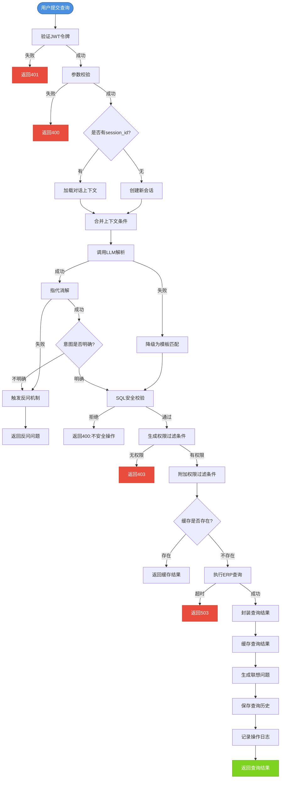

#### 流程2: 定时报告推送流程

**流程名称:** 定时报告推送流程  
**触发条件:** Cron调度器触发定时任务(每日8点或配置的Cron时间)

**步骤序列:**

| 步骤 | 输入 | 输出 | 异常处理 |
|------|------|------|----------|
| 1. 查询定时报告配置 | 无 | 定时报告列表(报告ID、查询条件、推送对象、推送时间) | 无报告→跳过 |
| 2. 遍历报告列表 | 报告列表 | 单个报告配置 | - |
| 3. 执行报告查询条件 | 查询条件 | 查询结果 | 查询失败→记录失败原因,跳过该报告 |
| 4. 生成报告内容 | 查询结果 | Markdown格式报告内容 | - |
| 5. 调用企业微信API | 报告内容、推送对象 | 推送结果(成功/失败) | 推送失败→重试3次(间隔5分钟),最终失败→记录告警 |
| 6. 记录推送记录 | 报告ID、推送对象、推送时间、推送结果 | 推送记录保存成功 | - |
| 7. 记录操作日志 | 操作类型、操作对象 | 日志记录成功 | - |

### 4.3 状态机设计

本系统核心业务对象无明显状态转换,不涉及复杂状态机设计。

**例外情况:**
- **用户状态:** 启用(1) / 停用(0),状态转换由管理员手动操作,无自动转换逻辑
- **推送记录状态:** 成功(success) / 失败(failed) / 重试中(retrying),状态转换由推送结果决定

### 4.4 计算逻辑

本系统不涉及复杂计算逻辑,查询结果直接返回ERP数据库数据,无额外计算。

**例外情况:**
- **查询条件哈希计算:** 用于缓存键生成,计算公式: `SHA256(user_id + query_conditions_json)`
- **指标阈值判断:** 用于预警触发,判断公式: `current_value > threshold_value` 或 `current_value < threshold_value`

### 4.5 并发与一致性

**并发冲突场景:**

| 场景 | 冲突类型 | 冲突范围 | 锁策略 | 锁粒度 | 超时与重试 |
|------|----------|----------|----------|----------|------------|
| 用户组权限配置 | 写-写 | 同一用户组 | 乐观锁(version字段) | 用户组级 | 无重试,失败返回409 |
| 查询缓存更新 | 读-写 | 同一缓存键 | 无锁(Redis单线程) | 缓存键级 | 无 |
| 对话上下文更新 | 读-写 | 同一会话 | 无锁(Redis单线程) | 会话级 | 无 |
| 定时报告推送 | 写-写 | 同一报告 | 分布式锁(Redis) | 报告级 | 锁超时10秒,失败跳过 |

**跨服务一致性保障:**
- 本系统为单体应用,不涉及跨服务事务
- 定时报告推送与预警触发为异步任务,失败后重试,不保证强一致性

---

## 第五章：数据设计

### 5.1 数据模型设计

#### 表1: users (用户表)

**表名:** users  
**表说明:** 存储系统用户基本信息

**字段定义:**

| 字段名 | 类型 | 长度 | 可空 | 默认值 | 业务含义 | 校验规则 |
|--------|------|------|------|--------|----------|----------|
| id | BIGINT | - | 否 | AUTO_INCREMENT | 物理主键(自增ID) | 自增 |
| snowflake_id | BIGINT | - | 否 | - | 业务唯一标识(雪花ID) | 雪花算法生成,唯一 |
| username | VARCHAR | 50 | 否 | - | 用户名 | 唯一,长度3~50,非空 |
| password | VARCHAR | 255 | 否 | - | 密码(bcrypt加密) | 长度8~100(原始密码) |
| email | VARCHAR | 100 | 否 | - | 邮箱 | 唯一,邮箱格式 |
| role | VARCHAR | 20 | 否 | - | 角色(admin/manager/executive) | 枚举值 |
| status | INTEGER | - | 否 | 1 | 用户状态(1启用/0停用) | 枚举值(0/1) |
| created_at | TIMESTAMP | - | 否 | CURRENT_TIMESTAMP | 创建时间 | - |
| updated_at | TIMESTAMP | - | 否 | CURRENT_TIMESTAMP | 更新时间 | 自动更新 |
| deleted_at | TIMESTAMP | - | 是 | NULL | 删除时间(软删除) | - |

**主键策略:** 自增ID(物理主键) + 雪花ID(业务唯一标识)

**索引设计:**

| 索引名 | 索引类型 | 索引字段 | 业务场景 |
|--------|----------|----------|----------|
| uk_snowflake_id | UNIQUE | snowflake_id | 业务唯一标识,API接口使用 |
| idx_users_username | UNIQUE | username | 用户名唯一性约束,登录查询 |
| idx_users_email | UNIQUE | email | 邮箱唯一性约束 |
| idx_users_status | 普通 | status | 查询启用/停用用户 |
| idx_users_deleted_at | 普通 | deleted_at | 软删除过滤 |

#### 表2: user_groups (用户组表)

**表名:** user_groups  
**表说明:** 存储用户组基本信息

**字段定义:**

| 字段名 | 类型 | 长度 | 可空 | 默认值 | 业务含义 | 校验规则 |
|--------|------|------|------|--------|----------|----------|
| id | BIGINT | - | 否 | AUTO_INCREMENT | 物理主键(自增ID) | 自增 |
| snowflake_id | BIGINT | - | 否 | - | 业务唯一标识(雪花ID) | 雪花算法生成,唯一 |
| name | VARCHAR | 50 | 否 | - | 用户组名称 | 唯一,长度3~50,非空 |
| description | VARCHAR | 200 | 是 | NULL | 用户组描述 | 长度0~200 |
| created_at | TIMESTAMP | - | 否 | CURRENT_TIMESTAMP | 创建时间 | - |
| updated_at | TIMESTAMP | - | 否 | CURRENT_TIMESTAMP | 更新时间 | 自动更新 |
| deleted_at | TIMESTAMP | - | 是 | NULL | 删除时间(软删除) | - |

**主键策略:** 自增ID(物理主键) + 雪花ID(业务唯一标识)

**索引设计:**

| 索引名 | 索引类型 | 索引字段 | 业务场景 |
|--------|----------|----------|----------|
| uk_snowflake_id | UNIQUE | snowflake_id | 业务唯一标识,API接口使用 |
| idx_user_groups_name | UNIQUE | name | 用户组名唯一性约束 |
| idx_user_groups_deleted_at | 普通 | deleted_at | 软删除过滤 |

#### 表3: user_group_members (用户组成员关联表)

**表名:** user_group_members  
**表说明:** 存储用户与用户组的关联关系

**字段定义:**

| 字段名 | 类型 | 长度 | 可空 | 默认值 | 业务含义 | 校验规则 |
|--------|------|------|------|--------|----------|----------|
| id | BIGINT | - | 否 | AUTO_INCREMENT | 物理主键(自增ID) | 自增 |
| snowflake_id | BIGINT | - | 否 | - | 业务唯一标识(雪花ID) | 雪花算法生成,唯一 |
| user_id | BIGINT | - | 否 | - | 用户ID(外键) | 关联users.id |
| group_id | BIGINT | - | 否 | - | 用户组ID(外键) | 关联user_groups.id |
| created_at | TIMESTAMP | - | 否 | CURRENT_TIMESTAMP | 创建时间 | - |

**主键策略:** 自增ID(物理主键) + 雪花ID(业务唯一标识)

**索引设计:**

| 索引名 | 索引类型 | 索引字段 | 业务场景 |
|--------|----------|----------|----------|
| uk_snowflake_id | UNIQUE | snowflake_id | 业务唯一标识,API接口使用 |
| idx_user_group_members_user_id | 普通 | user_id | 查询用户所属用户组 |
| idx_user_group_members_group_id | 普通 | group_id | 查询用户组成员 |
| idx_user_group_members_unique | UNIQUE | user_id, group_id | 防止重复关联 |

#### 表4: permissions (权限表)

**表名:** permissions  
**表说明:** 存储用户组的权限配置

**字段定义:**

| 字段名 | 类型 | 长度 | 可空 | 默认值 | 业务含义 | 校验规则 |
|--------|------|------|------|--------|----------|----------|
| id | BIGINT | - | 否 | AUTO_INCREMENT | 物理主键(自增ID) | 自增 |
| snowflake_id | BIGINT | - | 否 | - | 业务唯一标识(雪花ID) | 雪花算法生成,唯一 |
| group_id | BIGINT | - | 否 | - | 用户组ID(外键) | 关联user_groups.id |
| resource_type | VARCHAR | 20 | 否 | - | 资源类型(table/field/operation) | 枚举值 |
| resource_name | VARCHAR | 100 | 否 | - | 资源名称(表名/字段名/操作名) | 非空 |
| permission_action | VARCHAR | 20 | 否 | - | 权限动作(read/write/export) | 枚举值 |
| filter_condition | VARCHAR | 500 | 是 | NULL | 数据级过滤条件(SQL WHERE片段) | 长度0~500 |
| created_at | TIMESTAMP | - | 否 | CURRENT_TIMESTAMP | 创建时间 | - |
| updated_at | TIMESTAMP | - | 否 | CURRENT_TIMESTAMP | 更新时间 | 自动更新 |

**主键策略:** 自增ID(物理主键) + 雪花ID(业务唯一标识)

**索引设计:**

| 索引名 | 索引类型 | 索引字段 | 业务场景 |
|--------|----------|----------|----------|
| uk_snowflake_id | UNIQUE | snowflake_id | 业务唯一标识,API接口使用 |
| idx_permissions_group_id | 普通 | group_id | 查询用户组权限 |
| idx_permissions_resource | 普通 | resource_type, resource_name | 查询特定资源的权限配置 |

#### 表5: query_sessions (查询会话表)

**表名:** query_sessions  
**表说明:** 存储查询会话元数据

**字段定义:**

| 字段名 | 类型 | 长度 | 可空 | 默认值 | 业务含义 | 校验规则 |
|--------|------|------|------|--------|----------|----------|
| id | BIGINT | - | 否 | AUTO_INCREMENT | 物理主键(自增ID) | 自增 |
| snowflake_id | BIGINT | - | 否 | - | 业务唯一标识(雪花ID) | 雪花算法生成,唯一 |
| user_id | BIGINT | - | 否 | - | 用户ID(外键) | 关联users.id |
| status | VARCHAR | 20 | 否 | active | 会话状态(active/closed) | 枚举值 |
| created_at | TIMESTAMP | - | 否 | CURRENT_TIMESTAMP | 创建时间 | - |
| updated_at | TIMESTAMP | - | 否 | CURRENT_TIMESTAMP | 更新时间 | 自动更新 |
| closed_at | TIMESTAMP | - | 是 | NULL | 关闭时间 | - |

**主键策略:** 自增ID(物理主键) + 雪花ID(业务唯一标识)

**索引设计:**

| 索引名 | 索引类型 | 索引字段 | 业务场景 |
|--------|----------|----------|----------|
| uk_snowflake_id | UNIQUE | snowflake_id | 业务唯一标识,API接口使用 |
| idx_query_sessions_user_id | 普通 | user_id | 查询用户的会话列表 |
| idx_query_sessions_status | 普通 | status | 查询活跃会话 |

#### 表6: query_records (查询记录表)

**表名:** query_records  
**表说明:** 存储查询记录详情

**字段定义:**

| 字段名 | 类型 | 长度 | 可空 | 默认值 | 业务含义 | 校验规则 |
|--------|------|------|------|--------|----------|----------|
| id | BIGINT | - | 否 | AUTO_INCREMENT | 物理主键(自增ID) | 自增 |
| snowflake_id | BIGINT | - | 否 | - | 业务唯一标识(雪花ID) | 雪花算法生成,唯一 |
| session_id | BIGINT | - | 否 | - | 会话ID(外键) | 关联query_sessions.id |
| user_id | BIGINT | - | 否 | - | 用户ID(外键) | 关联users.id |
| input | VARCHAR | 500 | 否 | - | 自然语言输入 | 长度1~500 |
| understanding | VARCHAR | 200 | 是 | NULL | 系统理解摘要 | 长度0~200 |
| sql_generated | TEXT | - | 是 | NULL | 生成的SQL | - |
| result_type | VARCHAR | 20 | 是 | NULL | 结果类型(table/chart/empty) | 枚举值 |
| result_summary | VARCHAR | 200 | 是 | NULL | 结果摘要(如"查询到10条记录") | 长度0~200 |
| execution_time_ms | INTEGER | - | 是 | NULL | 执行耗时(毫秒) | 正整数 |
| status | VARCHAR | 20 | 否 | - | 执行状态(success/failed) | 枚举值 |
| error_message | VARCHAR | 500 | 是 | NULL | 错误消息 | 长度0~500 |
| created_at | TIMESTAMP | - | 否 | CURRENT_TIMESTAMP | 创建时间 | - |

**主键策略:** 自增ID(物理主键) + 雪花ID(业务唯一标识)

**索引设计:**

| 索引名 | 索引类型 | 索引字段 | 业务场景 |
|--------|----------|----------|----------|
| uk_snowflake_id | UNIQUE | snowflake_id | 业务唯一标识,API接口使用 |
| idx_query_records_session_id | 普通 | session_id | 查询会话的查询记录 |
| idx_query_records_user_id | 普通 | user_id | 查询用户的查询历史 |
| idx_query_records_created_at | 普通 | created_at | 查询历史按时间排序 |

#### 表7: dialog_sessions (对话会话表)

**表名:** dialog_sessions  
**表说明:** 存储对话会话元数据(上下文存储于Redis)

**字段定义:**

| 字段名 | 类型 | 长度 | 可空 | 默认值 | 业务含义 | 校验规则 |
|--------|------|------|------|--------|----------|----------|
| id | BIGINT | - | 否 | AUTO_INCREMENT | 物理主键(自增ID) | 自增 |
| snowflake_id | BIGINT | - | 否 | - | 业务唯一标识(雪花ID) | 雪花算法生成,唯一 |
| user_id | BIGINT | - | 否 | - | 用户ID(外键) | 关联users.id |
| query_session_id | BIGINT | - | 是 | NULL | 关联的查询会话ID | 关联query_sessions.id |
| status | VARCHAR | 20 | 否 | active | 会话状态(active/closed) | 枚举值 |
| created_at | TIMESTAMP | - | 否 | CURRENT_TIMESTAMP | 创建时间 | - |
| updated_at | TIMESTAMP | - | 否 | CURRENT_TIMESTAMP | 更新时间 | 自动更新 |
| closed_at | TIMESTAMP | - | 是 | NULL | 关闭时间 | - |

**主键策略:** 自增ID(物理主键) + 雪花ID(业务唯一标识)

**索引设计:**

| 索引名 | 索引类型 | 索引字段 | 业务场景 |
|--------|----------|----------|----------|
| uk_snowflake_id | UNIQUE | snowflake_id | 业务唯一标识,API接口使用 |
| idx_dialog_sessions_user_id | 普通 | user_id | 查询用户的对话会话 |
| idx_dialog_sessions_status | 普通 | status | 查询活跃对话会话 |

#### 表8: favorites (收藏表)

**表名:** favorites  
**表说明:** 存储用户收藏的查询记录

**字段定义:**

| 字段名 | 类型 | 长度 | 可空 | 默认值 | 业务含义 | 校验规则 |
|--------|------|------|------|--------|----------|----------|
| id | BIGINT | - | 否 | AUTO_INCREMENT | 物理主键(自增ID) | 自增 |
| snowflake_id | BIGINT | - | 否 | - | 业务唯一标识(雪花ID) | 雪花算法生成,唯一 |
| user_id | BIGINT | - | 否 | - | 用户ID(外键) | 关联users.id |
| query_record_id | BIGINT | - | 否 | - | 查询记录ID(外键) | 关联query_records.id |
| title | VARCHAR | 100 | 是 | NULL | 收藏标题(用户自定义) | 长度0~100 |
| created_at | TIMESTAMP | - | 否 | CURRENT_TIMESTAMP | 创建时间 | - |

**主键策略:** 自增ID(物理主键) + 雪花ID(业务唯一标识)

**索引设计:**

| 索引名 | 索引类型 | 索引字段 | 业务场景 |
|--------|----------|----------|----------|
| uk_snowflake_id | UNIQUE | snowflake_id | 业务唯一标识,API接口使用 |
| idx_favorites_user_id | 普通 | user_id | 查询用户的收藏列表 |
| idx_favorites_query_record_id | 普通 | query_record_id | 查询查询记录是否被收藏 |
| idx_favorites_unique | UNIQUE | user_id, query_record_id | 防止重复收藏 |

#### 表9: scheduled_reports (定时报告表)

**表名:** scheduled_reports  
**表说明:** 存储定时报告配置

**字段定义:**

| 字段名 | 类型 | 长度 | 可空 | 默认值 | 业务含义 | 校验规则 |
|--------|------|------|------|--------|----------|----------|
| id | BIGINT | - | 否 | AUTO_INCREMENT | 物理主键(自增ID) | 自增 |
| snowflake_id | BIGINT | - | 否 | - | 业务唯一标识(雪花ID) | 雪花算法生成,唯一 |
| name | VARCHAR | 100 | 否 | - | 报告名称 | 长度3~100,非空 |
| description | VARCHAR | 200 | 是 | NULL | 报告描述 | 长度0~200 |
| query_condition | TEXT | - | 否 | - | 查询条件(JSON格式) | JSON格式 |
| schedule_cron | VARCHAR | 50 | 否 | - | 定时表达式(Cron格式) | Cron格式 |
| push_targets | TEXT | - | 否 | - | 推送对象(JSON数组,用户ID列表) | JSON格式 |
| push_channel | VARCHAR | 20 | 否 | wechat | 推送渠道(wechat/email) | 枚举值 |
| status | VARCHAR | 20 | 否 | active | 报告状态(active/inactive) | 枚举值 |
| created_by | BIGINT | - | 否 | - | 创建者ID(外键) | 关联users.id |
| created_at | TIMESTAMP | - | 否 | CURRENT_TIMESTAMP | 创建时间 | - |
| updated_at | TIMESTAMP | - | 否 | CURRENT_TIMESTAMP | 更新时间 | 自动更新 |

**主键策略:** 自增ID(物理主键) + 雪花ID(业务唯一标识)

**索引设计:**

| 索引名 | 索引类型 | 索引字段 | 业务场景 |
|--------|----------|----------|----------|
| uk_snowflake_id | UNIQUE | snowflake_id | 业务唯一标识,API接口使用 |
| idx_scheduled_reports_status | 普通 | status | 查询活跃报告 |
| idx_scheduled_reports_created_by | 普通 | created_by | 查询创建者的报告 |

#### 表10: alert_rules (预警规则表)

**表名:** alert_rules  
**表说明:** 存储预警规则配置

**字段定义:**

| 字段名 | 类型 | 长度 | 可空 | 默认值 | 业务含义 | 校验规则 |
|--------|------|------|------|--------|----------|----------|
| id | BIGINT | - | 否 | AUTO_INCREMENT | 物理主键(自增ID) | 自增 |
| snowflake_id | BIGINT | - | 否 | - | 业务唯一标识(雪花ID) | 雪花算法生成,唯一 |
| name | VARCHAR | 100 | 否 | - | 规则名称 | 长度3~100,非空 |
| description | VARCHAR | 200 | 是 | NULL | 规则描述 | 长度0~200 |
| metric_query | TEXT | - | 否 | - | 指标查询条件(JSON格式) | JSON格式 |
| threshold_value | DECIMAL | 10,2 | 否 | - | 阈值 | 正数或负数 |
| comparison_operator | VARCHAR | 10 | 否 | - | 比较操作符(>/</>=/<=) | 枚举值 |
| alert_message | VARCHAR | 200 | 否 | - | 预警消息模板 | 长度1~200 |
| push_targets | TEXT | - | 否 | - | 推送对象(JSON数组) | JSON格式 |
| push_channel | VARCHAR | 20 | 否 | wechat | 推送渠道 | 枚举值 |
| status | VARCHAR | 20 | 否 | active | 规则状态(active/inactive) | 枚举值 |
| created_by | BIGINT | - | 否 | - | 创建者ID | 关联users.id |
| created_at | TIMESTAMP | - | 否 | CURRENT_TIMESTAMP | 创建时间 | - |
| updated_at | TIMESTAMP | - | 否 | CURRENT_TIMESTAMP | 更新时间 | 自动更新 |

**主键策略:** 自增ID(物理主键) + 雪花ID(业务唯一标识)

**索引设计:**

| 索引名 | 索引类型 | 索引字段 | 业务场景 |
|--------|----------|----------|----------|
| uk_snowflake_id | UNIQUE | snowflake_id | 业务唯一标识,API接口使用 |
| idx_alert_rules_status | 普通 | status | 查询活跃预警规则 |
| idx_alert_rules_created_by | 普通 | created_by | 查询创建者的预警规则 |

#### 表11: push_records (推送记录表)

**表名:** push_records  
**表说明:** 存储推送记录

**字段定义:**

| 字段名 | 类型 | 长度 | 可空 | 默认值 | 业务含义 | 校验规则 |
|--------|------|------|------|--------|----------|----------|
| id | BIGINT | - | 否 | AUTO_INCREMENT | 物理主键(自增ID) | 自增 |
| snowflake_id | BIGINT | - | 否 | - | 业务唯一标识(雪花ID) | 雪花算法生成,唯一 |
| report_id | BIGINT | - | 是 | NULL | 定时报告ID(外键) | 关联scheduled_reports.id |
| alert_rule_id | BIGINT | - | 是 | NULL | 预警规则ID(外键) | 关联alert_rules.id |
| push_type | VARCHAR | 20 | 否 | - | 推送类型(report/alert) | 枚举值 |
| push_content | TEXT | - | 否 | - | 推送内容(Markdown格式) | 非空 |
| push_targets | TEXT | - | 否 | - | 推送对象(JSON数组) | JSON格式 |
| push_channel | VARCHAR | 20 | 否 | - | 推送渠道 | 枚举值 |
| push_status | VARCHAR | 20 | 否 | - | 推送状态(success/failed/retrying) | 枚举值 |
| push_time | TIMESTAMP | - | 否 | CURRENT_TIMESTAMP | 推送时间 | - |
| error_message | VARCHAR | 500 | 是 | NULL | 错误消息 | 长度0~500 |
| retry_count | INTEGER | - | 否 | 0 | 重试次数 | 正整数,最大3 |

**主键策略:** 自增ID(物理主键) + 雪花ID(业务唯一标识)

**索引设计:**

| 索引名 | 索引类型 | 索引字段 | 业务场景 |
|--------|----------|----------|----------|
| uk_snowflake_id | UNIQUE | snowflake_id | 业务唯一标识,API接口使用 |
| idx_push_records_report_id | 普通 | report_id | 查询报告的推送记录 |
| idx_push_records_alert_rule_id | 普通 | alert_rule_id | 查询预警规则的推送记录 |
| idx_push_records_push_time | 普通 | push_time | 查询推送记录按时间排序 |

#### 表12: operation_logs (操作日志表)

**表名:** operation_logs  
**表说明:** 存储操作日志

**字段定义:**

| 字段名 | 类型 | 长度 | 可空 | 默认值 | 业务含义 | 校验规则 |
|--------|------|------|------|--------|----------|----------|
| id | BIGINT | - | 否 | AUTO_INCREMENT | 物理主键(自增ID) | 自增 |
| snowflake_id | BIGINT | - | 否 | - | 业务唯一标识(雪花ID) | 雪花算法生成,唯一 |
| user_id | BIGINT | - | 是 | NULL | 操作者ID(外键) | 关联users.id |
| operation_type | VARCHAR | 50 | 否 | - | 操作类型(login/query/create_user/update_user/delete_user/config_permission/create_report...) | 枚举值 |
| operation_object | VARCHAR | 100 | 是 | NULL | 操作对象(如用户名、报告名) | 长度0~100 |
| operation_detail | TEXT | - | 是 | NULL | 操作详情(JSON格式) | JSON格式 |
| operation_result | VARCHAR | 20 | 否 | - | 操作结果(success/failed) | 枚举值 |
| ip_address | VARCHAR | 50 | 是 | NULL | 操作者IP地址 | IP格式 |
| created_at | TIMESTAMP | - | 否 | CURRENT_TIMESTAMP | 操作时间 | - |

**主键策略:** 自增ID(物理主键) + 雪花ID(业务唯一标识)

**索引设计:**

| 索引名 | 索引类型 | 索引字段 | 业务场景 |
|--------|----------|----------|----------|
| uk_snowflake_id | UNIQUE | snowflake_id | 业务唯一标识,API接口使用 |
| idx_operation_logs_user_id | 普通 | user_id | 查询用户的操作日志 |
| idx_operation_logs_operation_type | 普通 | operation_type | 按操作类型查询日志 |
| idx_operation_logs_created_at | 普通 | created_at | 按时间查询操作日志 |

### 5.2 数据关系

**ER图(实体关系图):**

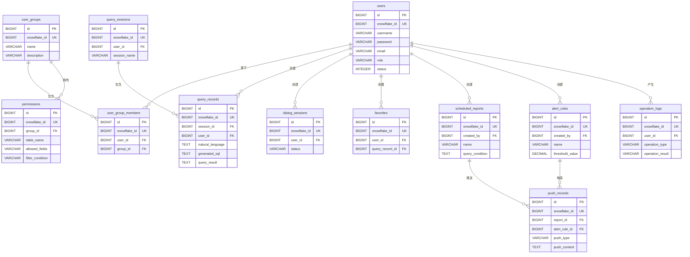

**关系说明:**

1. **用户-用户组关系(多对多):**
   - 一个用户可以属于多个用户组
   - 一个用户组可以包含多个用户
   - 通过`user_group_members`中间表实现关联

2. **用户组-权限关系(一对多):**
   - 一个用户组可以拥有多条权限记录
   - 一条权限记录属于一个用户组
   - 通过`permissions.group_id`外键关联

3. **用户-查询记录关系(一对多):**
   - 一个用户可以创建多条查询记录
   - 一条查询记录属于一个用户
   - 通过`query_records.user_id`外键关联

4. **用户-对话会话关系(一对多):**
   - 一个用户可以创建多个对话会话
   - 一个对话会话属于一个用户
   - 通过`dialog_sessions.user_id`外键关联

5. **用户-收藏关系(一对多):**
   - 一个用户可以收藏多条查询记录
   - 一条收藏记录属于一个用户
   - 通过`favorites.user_id`外键关联

6. **用户-定时报告关系(一对多):**
   - 一个用户可以创建多个定时报告
   - 一个定时报告属于一个创建者
   - 通过`scheduled_reports.created_by`外键关联

7. **用户-预警规则关系(一对多):**
   - 一个用户可以创建多个预警规则
   - 一个预警规则属于一个创建者
   - 通过`alert_rules.created_by`外键关联

8. **定时报告-推送记录关系(一对多):**
   - 一个定时报告可以产生多条推送记录
   - 一条推送记录关联一个定时报告(可选)
   - 通过`push_records.report_id`外键关联

9. **预警规则-推送记录关系(一对多):**
   - 一个预警规则可以触发多条推送记录
   - 一条推送记录关联一个预警规则(可选)
   - 通过`push_records.alert_rule_id`外键关联

10. **查询会话-查询记录关系(一对多):**
    - 一个查询会话可以包含多条查询记录
    - 一条查询记录属于一个查询会话
    - 通过`query_records.session_id`外键关联

### 5.3 数据字典

#### 枚举值定义

**1. 用户角色(users.role):**

| 枚举值 | 含义 | 权限范围 |
|--------|------|----------|
| admin | 系统管理员 | 全部权限,可管理用户、用户组、权限配置 |
| manager | 部门经理 | 可查询本部门数据,可配置定时报告与预警规则 |
| executive | 高管 | 可查询全公司数据,可查看报告 |

**2. 用户状态(users.status):**

| 枚举值 | 含义 | 说明 |
|--------|------|------|
| 1 | 启用 | 用户可正常登录与使用系统 |
| 0 | 停用 | 用户被禁用,无法登录系统 |

**3. 查询状态(query_records.query_status):**

| 枚举值 | 含义 | 说明 |
|--------|------|------|
| pending | 待执行 | 查询已提交,等待执行 |
| running | 执行中 | 查询正在执行 |
| success | 成功 | 查询执行成功,返回结果 |
| failed | 失败 | 查询执行失败,返回错误信息 |

**4. 对话会话状态(dialog_sessions.status):**

| 枚举值 | 含义 | 说明 |
|--------|------|------|
| active | 活跃 | 会话正在进行,可继续对话 |
| closed | 已关闭 | 会话已结束,不可继续对话 |

**5. 推送渠道(push_channel):**

| 枚举值 | 含义 | 说明 |
|--------|------|------|
| wechat | 企业微信 | 通过企业微信推送消息 |
| email | 邮件 | 通过邮件推送消息(预留) |

**6. 报告状态(scheduled_reports.status / alert_rules.status):**

| 枚举值 | 含义 | 说明 |
|--------|------|------|
| active | 活跃 | 报告/预警规则正常执行 |
| inactive | 停用 | 报告/预警规则已停用 |

**7. 推送类型(push_records.push_type):**

| 枚举值 | 含义 | 说明 |
|--------|------|------|
| report | 定时报告 | 定时报告推送 |
| alert | 预警消息 | 预警规则触发推送 |

**8. 推送状态(push_records.push_status):**

| 枚举值 | 含义 | 说明 |
|--------|------|------|
| success | 成功 | 推送成功 |
| failed | 失败 | 推送失败,不再重试 |
| retrying | 重试中 | 推送失败,正在重试 |

**9. 操作类型(operation_logs.operation_type):**

| 枚举值 | 含义 | 说明 |
|--------|------|------|
| login | 登录 | 用户登录系统 |
| logout | 登出 | 用户登出系统 |
| query | 查询 | 用户执行自然语言查询 |
| create_user | 创建用户 | 管理员创建用户 |
| update_user | 更新用户 | 管理员更新用户信息 |
| delete_user | 删除用户 | 管理员删除用户 |
| config_permission | 配置权限 | 管理员配置用户组权限 |
| create_report | 创建报告 | 用户创建定时报告 |
| update_report | 更新报告 | 用户更新定时报告 |
| delete_report | 删除报告 | 用户删除定时报告 |
| create_alert | 创建预警 | 用户创建预警规则 |
| update_alert | 更新预警 | 用户更新预警规则 |
| delete_alert | 删除预警 | 用户删除预警规则 |

**10. 操作结果(operation_logs.operation_result):**

| 枚举值 | 含义 | 说明 |
|--------|------|------|
| success | 成功 | 操作执行成功 |
| failed | 失败 | 操作执行失败 |

**11. 比较操作符(alert_rules.comparison_operator):**

| 枚举值 | 含义 | 说明 |
|--------|------|------|
| > | 大于 | 指标值大于阈值时触发 |
| < | 小于 | 指标值小于阈值时触发 |
| >= | 大于等于 | 指标值大于等于阈值时触发 |
| <= | 小于等于 | 指标值小于等于阈值时触发 |

### 5.4 数据量预估

**数据量增长预估(运营1年):**

| 表名 | 初始数据量 | 日增量 | 月增量 | 年增量 | 1年后总量 | 估算依据 |
|------|-----------|--------|--------|--------|-----------|----------|
| users | 50 | 0.1 | 3 | 36 | 86 | 小型企业,用户增长缓慢 |
| user_groups | 5 | 0.01 | 0.3 | 3.6 | 9 | 用户组数量有限,增长极慢 |
| user_group_members | 100 | 0.2 | 6 | 72 | 172 | 平均每用户属于2个用户组 |
| permissions | 20 | 0.05 | 1.5 | 18 | 38 | 平均每用户组4条权限记录 |
| query_sessions | 0 | 10 | 300 | 3600 | 3600 | 平均每天10个新会话 |
| query_records | 0 | 100 | 3000 | 36000 | 36000 | 平均每天100次查询 |
| dialog_sessions | 0 | 5 | 150 | 1800 | 1800 | 平均每天5个新对话会话 |
| favorites | 0 | 5 | 150 | 1800 | 1800 | 平均每天5条收藏 |
| scheduled_reports | 2 | 0.01 | 0.3 | 3.6 | 6 | 定时报告数量有限 |
| alert_rules | 3 | 0.01 | 0.3 | 3.6 | 7 | 预警规则数量有限 |
| push_records | 0 | 5 | 150 | 1800 | 1800 | 平均每天5条推送记录 |
| operation_logs | 0 | 150 | 4500 | 54000 | 54000 | 平均每天150条操作日志 |

**数据量增长预估(运营3年):**

| 表名 | 1年后总量 | 2年后总量 | 3年后总量 | 增长趋势 | 存储空间预估 |
|------|-----------|-----------|-----------|----------|-------------|
| users | 86 | 122 | 158 | 线性增长 | < 1 MB |
| user_groups | 9 | 12 | 15 | 线性增长 | < 1 MB |
| user_group_members | 172 | 244 | 316 | 线性增长 | < 1 MB |
| permissions | 38 | 56 | 74 | 线性增长 | < 1 MB |
| query_sessions | 3600 | 7200 | 10800 | 线性增长 | ~ 5 MB |
| query_records | 36000 | 72000 | 108000 | 线性增长 | ~ 50 MB |
| dialog_sessions | 1800 | 3600 | 5400 | 线性增长 | ~ 2 MB |
| favorites | 1800 | 3600 | 5400 | 线性增长 | ~ 2 MB |
| scheduled_reports | 6 | 9 | 12 | 线性增长 | < 1 MB |
| alert_rules | 7 | 10 | 13 | 线性增长 | < 1 MB |
| push_records | 1800 | 3600 | 5400 | 线性增长 | ~ 3 MB |
| operation_logs | 54000 | 108000 | 162000 | 线性增长 | ~ 30 MB |

**总存储空间预估:**
- 1年后: ~ 95 MB
- 3年后: ~ 295 MB
- 数据库选型建议: PostgreSQL可轻松支撑,无需分库分表

### 5.5 数据访问策略

#### 5.5.1 数据库连接池配置

**PostgreSQL连接池配置:**

| 配置项 | 推荐值 | 说明 |
|--------|--------|------|
| MaxOpenConns | 50 | 最大打开连接数,根据并发量调整 |
| MaxIdleConns | 10 | 最大空闲连接数,减少连接创建开销 |
| ConnMaxLifetime | 30分钟 | 连接最大生命周期,防止长时间连接导致的问题 |
| ConnMaxIdleTime | 10分钟 | 空闲连接最大生命周期,自动回收空闲连接 |

**Redis连接池配置:**

| 配置项 | 推荐值 | 说明 |
|--------|--------|------|
| PoolSize | 20 | 连接池大小 |
| MinIdleConns | 5 | 最小空闲连接数 |
| MaxRetries | 3 | 最大重试次数 |
| DialTimeout | 5秒 | 连接超时时间 |
| ReadTimeout | 3秒 | 读超时时间 |
| WriteTimeout | 3秒 | 写超时时间 |

#### 5.5.2 缓存策略

**缓存层次设计:**

1. **一级缓存(本地内存缓存):**
   - 缓存内容: 用户权限数据、系统配置
   - 缓存时长: 5分钟
   - 缓存更新: 定时刷新 + 主动失效
   - 实现方案: 使用`sync.Map`或`go-cache`库

2. **二级缓存(Redis缓存):**
   - 缓存内容: 对话上下文、查询结果、会话状态
   - 缓存时长: 对话上下文30分钟,查询结果5分钟
   - 缓存更新: TTL自动过期 + LRU淘汰策略
   - 实现方案: Redis String/Hash数据结构

**缓存键设计:**

| 缓存类型 | 缓存键格式 | 示例 | TTL |
|----------|-----------|------|-----|
| 用户权限 | `perm:user:{user_id}` | `perm:user:123e4567-e89b-12d3-a456-426614174000` | 5分钟 |
| 对话上下文 | `dialog:ctx:{session_id}` | `dialog:ctx:987e6543-e21b-45d3-b789-123456789012` | 30分钟 |
| 查询结果 | `query:result:{query_hash}` | `query:result:a1b2c3d4e5f6g7h8` | 5分钟 |
| 会话状态 | `session:state:{session_id}` | `session:state:987e6543-e21b-45d3-b789-123456789012` | 24小时 |

**缓存失效策略:**

| 失效场景 | 失效策略 | 说明 |
|----------|----------|------|
| 用户权限变更 | 主动删除缓存 | 管理员修改用户组权限后,删除对应用户的权限缓存 |
| 对话会话关闭 | 主动删除缓存 | 用户关闭对话会话后,删除对话上下文缓存 |
| 查询结果过期 | TTL自动过期 | 查询结果缓存5分钟后自动过期 |
| 用户登出 | 主动删除缓存 | 用户登出后,删除会话状态缓存 |

#### 5.5.3 查询优化策略

**索引优化:**

1. **主键索引:** 所有表使用自增ID作为物理主键,雪花ID作为业务唯一标识,自动创建主键索引和雪花ID唯一索引
2. **外键索引:** 所有外键字段创建普通索引,加速关联查询
3. **业务索引:** 根据查询场景创建组合索引,如:
   - `idx_query_records_user_created` (user_id, created_at): 查询用户的查询历史按时间排序
   - `idx_operation_logs_user_time` (user_id, created_at): 查询用户的操作日志按时间排序
   - `idx_push_records_time` (push_time): 查询推送记录按时间排序

**查询优化建议:**

1. **分页查询:** 所有列表查询使用分页,默认每页20条,最大每页100条
2. **延迟关联:** 大数据量查询先查ID,再关联查询详细信息
3. **避免SELECT *:** 只查询需要的字段,减少数据传输量
4. **避免N+1查询:** 使用预加载(Eager Loading)或批量查询优化关联查询
5. **使用EXPLAIN分析:** 定期使用EXPLAIN分析慢查询,优化索引

**慢查询阈值:**

| 查询类型 | 慢查询阈值 | 说明 |
|----------|-----------|------|
| 简单查询(单表查询) | 100ms | 单表查询超过100ms视为慢查询 |
| 复杂查询(多表关联) | 500ms | 多表关联查询超过500ms视为慢查询 |
| ERP数据库查询 | 2000ms | ERP数据库查询超过2秒视为慢查询 |

#### 5.5.4 数据归档策略

**归档策略:**

| 数据类型 | 归档周期 | 归档方案 | 保留时长 |
|----------|----------|----------|----------|
| 查询记录(query_records) | 每月 | 归档至历史表`query_records_archive` | 在线保留3个月,离线保留1年 |
| 操作日志(operation_logs) | 每月 | 归档至历史表`operation_logs_archive` | 在线保留6个月,离线保留2年 |
| 推送记录(push_records) | 每月 | 归档至历史表`push_records_archive` | 在线保留3个月,离线保留1年 |
| 对话会话(dialog_sessions) | 每月 | 删除已关闭超过3个月的会话 | 在线保留3个月 |

**归档流程:**

1. 每月1日凌晨2点执行归档任务
2. 将上月数据插入归档表
3. 验证归档数据完整性
4. 删除原表中的已归档数据
5. 记录归档日志

**归档表设计:**

归档表结构与原表相同,表名添加`_archive`后缀,如`query_records_archive`。归档表不创建索引,仅用于历史数据查询与审计。

#### 5.5.5 数据备份策略

**备份策略:**

| 备份类型 | 备份周期 | 备份时间 | 保留时长 | 存储位置 |
|----------|----------|----------|----------|----------|
| 全量备份 | 每天 | 凌晨3点 | 7天 | 本地磁盘 + 云存储 |
| 增量备份 | 每小时 | 整点 | 24小时 | 本地磁盘 |
| WAL归档 | 实时 | - | 7天 | 本地磁盘 + 云存储 |

**备份恢复流程:**

1. **全量恢复:** 从最新的全量备份恢复基础数据
2. **增量恢复:** 应用增量备份与WAL日志,恢复到指定时间点
3. **验证恢复:** 验证数据完整性与一致性
4. **切换服务:** 将应用切换到恢复后的数据库

**备份验证:**

- 每周执行一次备份恢复演练,验证备份可用性
- 每月执行一次全量备份恢复演练,验证完整恢复流程

---

## 第六章:非功能性设计

### 6.1 性能设计

#### 6.1.1 性能目标

**系统性能指标:**

| 性能指标 | 目标值 | 测量方法 | 说明 |
|----------|--------|----------|------|
| **查询接口响应时间(P99)** | < 3秒 | Prometheus监控 | 包含LLM调用、SQL执行、结果封装的完整流程 |
| **查询接口响应时间(P95)** | < 2秒 | Prometheus监控 | 95%的查询请求响应时间小于2秒 |
| **查询接口响应时间(P50)** | < 1秒 | Prometheus监控 | 50%的查询请求响应时间小于1秒 |
| **系统吞吐量(QPS)** | > 50 QPS | 压力测试 | 系统可支持每秒50次查询请求 |
| **并发用户数** | > 100 | 压力测试 | 系统可支持100个用户同时在线查询 |
| **LLM调用成功率** | > 95% | Prometheus监控 | LLM调用成功比例,包含降级场景 |
| **ERP数据库查询成功率** | > 99% | Prometheus监控 | ERP数据库查询成功比例 |

**性能分解目标:**

| 子流程 | 性能目标 | 占总时间比例 | 说明 |
|--------|----------|--------------|------|
| JWT认证 | < 50ms | < 2% | 本地验证JWT令牌,无需远程调用 |
| 权限加载 | < 100ms | < 3% | 从Redis缓存加载权限数据 |
| 对话上下文加载 | < 100ms | < 3% | 从Redis缓存加载对话上下文 |
| LLM意图解析 | < 1.5秒 | < 50% | 调用LLM解析意图与生成SQL |
| SQL安全校验 | < 50ms | < 2% | AST解析SQL,校验安全性 |
| 权限过滤条件生成 | < 50ms | < 2% | 根据用户权限生成过滤条件 |
| ERP数据库查询 | < 1秒 | < 33% | 执行SQL查询,返回结果集 |
| 结果封装 | < 100ms | < 3% | 封装查询结果为JSON格式 |

#### 6.1.2 性能优化策略

**1. 缓存优化:**

| 缓存类型 | 缓存内容 | 缓存时长 | 命中率目标 | 优化效果 |
|----------|----------|----------|-----------|----------|
| 用户权限缓存 | 用户组权限数据 | 5分钟 | > 90% | 权限加载时间从200ms降至10ms |
| 对话上下文缓存 | 最近5轮对话历史 | 30分钟 | > 85% | 上下文加载时间从150ms降至20ms |
| 查询结果缓存 | 相同查询的结果 | 5分钟 | > 30% | 重复查询直接返回缓存,响应时间降至100ms |
| ERP表结构缓存 | ERP数据库表结构 | 24小时 | > 99% | 表结构查询时间从500ms降至5ms |

**2. 并发优化:**

| 优化项 | 优化方案 | 优化效果 |
|--------|----------|----------|
| HTTP请求处理 | 使用Gin框架的异步处理模型,每个请求由独立goroutine处理 | 支持高并发请求处理 |
| LLM调用 | 使用异步调用,通过context控制超时,避免阻塞主流程 | LLM调用失败不影响其他请求 |
| ERP数据库查询 | 使用连接池,复用数据库连接,减少连接创建开销 | 数据库查询吞吐量提升3倍 |
| Redis操作 | 使用连接池,批量操作减少网络往返 | Redis操作吞吐量提升2倍 |

**3. 数据库优化:**

| 优化项 | 优化方案 | 优化效果 |
|--------|----------|----------|
| 索引优化 | 为高频查询字段创建组合索引 | 查询性能提升5倍 |
| 连接池优化 | MaxOpenConns=50,MaxIdleConns=10 | 减少连接创建开销,提升吞吐量 |
| 查询优化 | 避免SELECT *,使用分页查询,延迟关联 | 减少数据传输量,提升查询速度 |
| 事务优化 | 避免长事务,使用短事务减少锁竞争 | 减少数据库锁等待时间 |

**4. LLM调用优化:**

| 优化项 | 优化方案 | 优化效果 |
|--------|----------|----------|
| 超时控制 | LLM调用超时30秒,超时后降级为模板匹配 | 避免长时间等待,保证系统可用性 |
| 重试机制 | LLM调用失败自动重试3次(间隔1秒) | 提升LLM调用成功率至95% |
| 降级策略 | LLM服务不可用时,降级为模板匹配模式 | 保证系统在LLM故障时仍可提供服务 |
| 流式响应 | 使用Eino框架的流式响应,提前返回部分结果 | 减少用户等待时间,提升用户体验 |

#### 6.1.3 性能监控

**性能监控指标:**

| 监控指标 | 监控工具 | 监控频率 | 告警阈值 |
|----------|----------|----------|----------|
| HTTP请求响应时间 | Prometheus + Grafana | 实时 | P99 > 5秒触发告警 |
| HTTP请求QPS | Prometheus + Grafana | 实时 | QPS < 10触发告警(系统空闲) |
| LLM调用耗时 | Prometheus + Grafana | 实时 | P99 > 2秒触发告警 |
| LLM调用成功率 | Prometheus + Grafana | 实时 | 成功率 < 90%触发告警 |
| ERP数据库查询耗时 | Prometheus + Grafana | 实时 | P99 > 3秒触发告警 |
| Redis操作耗时 | Prometheus + Grafana | 实时 | P99 > 100ms触发告警 |
| 数据库连接池使用率 | Prometheus + Grafana | 实时 | 使用率 > 80%触发告警 |

**性能监控架构:**

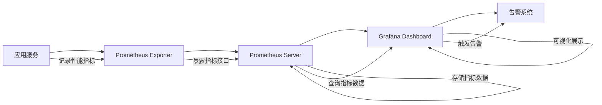

### 6.2 高可用设计

#### 6.2.1 可用性目标

**系统可用性指标:**

| 可用性指标 | 目标值 | 说明 |
|----------|--------|------|
| **系统可用性(SLA)** | > 99.5% | 年度可用性,允许停机时间约44小时 |
| **单点故障恢复时间(MTTR)** | < 30分钟 | 单点故障发生后,恢复服务的时间 |
| **故障检测时间** | < 5分钟 | 故障发生后,系统检测到故障的时间 |

**可用性分解目标:**

| 子系统 | 可用性目标 | 说明 |
|--------|-----------|------|
| Web API服务 | > 99.9% | HTTP接口服务可用性 |
| PostgreSQL数据库 | > 99.9% | 数据库服务可用性 |
| Redis缓存 | > 99.9% | 缓存服务可用性 |
| LLM服务 | > 95% | LLM服务可用性(依赖外部服务) |
| ERP数据库 | > 99% | ERP数据库可用性(依赖外部系统) |

#### 6.2.2 容错设计

**1. 应用层容错:**

| 容错场景 | 容错策略 | 实现方案 |
|----------|----------|----------|
| HTTP请求处理失败 | 全局错误恢复中间件 | Gin Recovery中间件捕获panic,记录日志,返回500错误 |
| JWT认证失败 | 返回401错误,不执行后续流程 | 认证中间件验证JWT,失败立即返回 |
| 参数校验失败 | 返回400错误,不执行后续流程 | 参数校验中间件校验参数,失败立即返回 |
| 权限校验失败 | 返回403错误,不执行后续流程 | 权限校验中间件校验权限,失败立即返回 |

**2. LLM服务容错:**

| 容错场景 | 容错策略 | 实现方案 |
|----------|----------|----------|
| LLM调用超时 | 超时后降级为模板匹配模式 | context.WithTimeout控制超时,超时后调用模板匹配函数 |
| LLM调用失败 | 自动重试3次,最终失败则降级 | 重试机制 + 降级策略 |
| LLM服务不可用 | 降级为模板匹配模式 | 健康检查检测LLM服务状态,不可用时启用降级模式 |
| LLM响应异常 | 校验LLM响应格式,异常则降级 | 校验LLM返回的JSON格式,异常则降级 |

**3. ERP数据库容错:**

| 容错场景 | 容错策略 | 实现方案 |
|----------|----------|----------|
| ERP数据库连接失败 | 返回503错误,提示"数据库连接超时" | 连接池健康检查,连接失败立即返回错误 |
| ERP数据库查询超时 | 返回503错误,提示"查询超时" | context.WithTimeout控制查询超时 |
| ERP数据库查询失败 | 返回500错误,记录详细日志 | 捕获数据库错误,记录堆栈与SQL,返回错误 |
| SQL安全校验失败 | 返回400错误,提示"检测到不安全操作" | AST解析SQL,检测到破坏性操作立即拒绝 |

**4. Redis缓存容错:**

| 容错场景 | 容错策略 | 实现方案 |
|----------|----------|----------|
| Redis连接失败 | 降级为无缓存模式,直接查询数据库 | Redis健康检查,连接失败时跳过缓存 |
| Redis操作超时 | 降级为无缓存模式 | context.WithTimeout控制Redis操作超时 |
| Redis操作失败 | 记录日志,降级为无缓存模式 | 捕获Redis错误,记录日志,跳过缓存 |

**5. 企业微信API容错:**

| 容错场景 | 容错策略 | 实现方案 |
|----------|----------|----------|
| 企业微信API调用失败 | 自动重试3次(间隔5分钟),最终失败则记录告警 | 重试机制 + 告警机制 |
| 企业微信API调用超时 | 记录超时日志,重试3次 | context.WithTimeout控制超时 |
| 企业微信API返回错误 | 记录错误详情,重试3次 | 校验API响应,错误则重试 |

#### 6.2.3 降级策略

**降级策略矩阵:**

| 依赖服务 | 降级触发条件 | 降级方案 | 降级影响 |
|----------|-------------|----------|----------|
| **LLM服务** | LLM调用失败率 > 10% 或 连续3次失败 | 降级为模板匹配模式 | 用户无法使用自然语言查询,只能使用预设模板 |
| **Redis缓存** | Redis连接失败 或 操作超时率 > 20% | 降级为无缓存模式 | 系统性能下降,响应时间增加,但功能正常 |
| **ERP数据库** | ERP数据库连接失败 或 查询超时率 > 30% | 返回503错误,提示"数据库不可用" | 用户无法执行查询,系统不可用 |
| **企业微信API** | 企业微信API调用失败率 > 50% | 记录告警,跳过推送 | 定时报告与预警推送失败,不影响查询功能 |

**降级流程:**

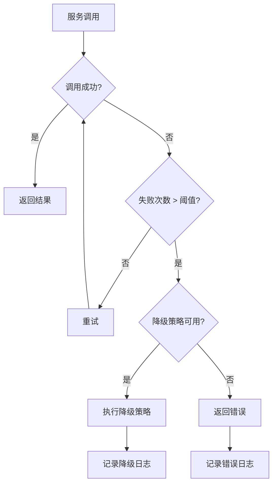

#### 6.2.4 熔断与限流

**1. 熔断机制:**

| 熔断对象 | 熔断触发条件 | 熔断时长 | 熔断恢复条件 |
|----------|-------------|----------|-------------|
| LLM服务调用 | 失败率 > 50% 或 连续10次失败 | 5分钟 | 熔断时长后,尝试半开状态,成功则恢复 |
| ERP数据库查询 | 失败率 > 30% 或 连续5次失败 | 3分钟 | 熔断时长后,尝试半开状态,成功则恢复 |
| 企业微信API调用 | 失败率 > 50% 或 连续5次失败 | 10分钟 | 熔断时长后,尝试半开状态,成功则恢复 |

**熔断状态机:**

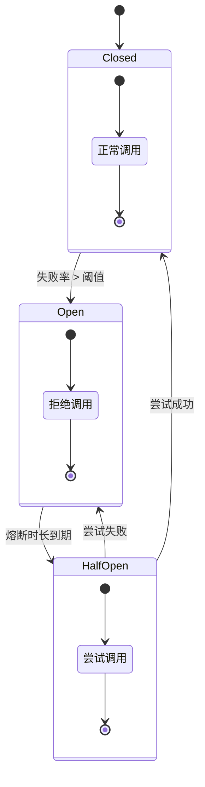

**2. 限流机制:**

| 限流对象 | 限流策略 | 限流阈值 | 限流效果 |
|----------|----------|----------|----------|
| HTTP接口 | 令牌桶限流 | 100 QPS | 超过100 QPS的请求返回429错误 |
| 用户查询频率 | 滑动窗口限流 | 每用户10次/分钟 | 单用户超过10次/分钟的查询返回429错误 |
| LLM调用 | 令牌桶限流 | 50 QPS | 超过50 QPS的LLM调用排队等待 |
| ERP数据库查询 | 连接池限流 | 最大50个并发连接 | 超过50个并发查询排队等待 |

### 6.3 安全设计

#### 6.3.1 安全目标

**系统安全指标:**

| 安全指标 | 目标值 | 说明 |
|----------|--------|------|
| **数据泄露风险** | 0次 | 系统运行期间无数据泄露事件 |
| **SQL注入风险** | 0次 | 所有SQL经过安全校验,无SQL注入漏洞 |
| **未授权访问风险** | 0次 | 所有接口经过认证与权限校验,无未授权访问 |
| **密码泄露风险** | 0次 | 所有密码使用bcrypt加密存储,无明文密码泄露 |

#### 6.3.2 认证与授权

**1. 认证机制:**

| 认证项 | 认证方案 | 实现细节 |
|--------|----------|----------|
| JWT令牌生成 | 使用JWT库生成令牌 | 令牌包含用户ID、角色、过期时间,签名算法HS256 |
| JWT令牌验证 | 认证中间件验证令牌 | 验证签名、过期时间、用户状态,失败返回401 |
| JWT令牌刷新 | 令牌过期前7天可刷新 | 刷新接口验证旧令牌,生成新令牌 |
| 密码加密存储 | 使用bcrypt加密 | 密码强度10,加密后长度60字符 |

**JWT令牌结构:**

```json
{
  "header": {
    "alg": "HS256",
    "typ": "JWT"
  },
  "payload": {
    "user_id": "123e4567-e89b-12d3-a456-426614174000",
    "username": "zhang_san",
    "role": "manager",
    "exp": 1780360361,
    "iat": 1780360361
  },
  "signature": "a1b2c3d4e5f6g7h8i9j0k1l2m3n4o5p6"
}
```

**2. 授权机制:**

| 授权项 | 授权方案 | 实现细节 |
|--------|----------|----------|
| 用户组权限 | 基于用户组的RBAC | 用户属于用户组,用户组拥有权限记录 |
| 表级权限 | 控制用户可查询的表 | 权限记录的`table_name`字段限制可查询的表 |
| 字段级权限 | 控制用户可查询的字段 | 权限记录的`allowed_fields`字段限制可查询的字段 |
| 数据级权限 | 控制用户可查询的数据范围 | 权限记录的`filter_condition`字段附加过滤条件 |

**权限过滤流程:**

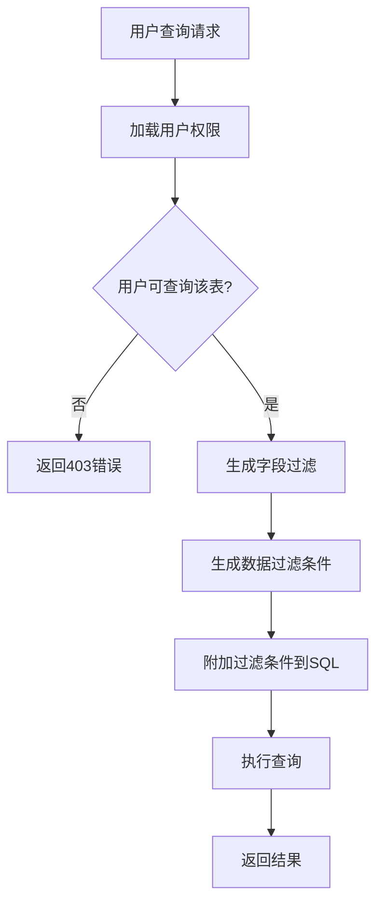

#### 6.3.3 SQL安全校验

**SQL安全校验规则:**

| 校验项 | 校验规则 | 校验失败处理 |
|--------|----------|-------------|
| 禁止破坏性操作 | 检测DELETE/UPDATE/DROP/INSERT/ALTER关键字 | 返回400错误,提示"检测到不安全操作" |
| 禁止系统表访问 | 检测pg_、information_schema、sys_等系统表前缀 | 返回403错误,提示"无权限访问系统表" |
| 禁止危险函数 | 检测pg_execute、pg_read_file等危险函数 | 返回400错误,提示"检测到危险函数" |
| 禁止多语句执行 | 检测分号分隔的多条SQL语句 | 返回400错误,提示"禁止执行多条SQL" |
| 禁止注释注入 | 检测SQL注释(--、/**/) | 返回400错误,提示"禁止使用注释" |

**SQL安全校验流程:**

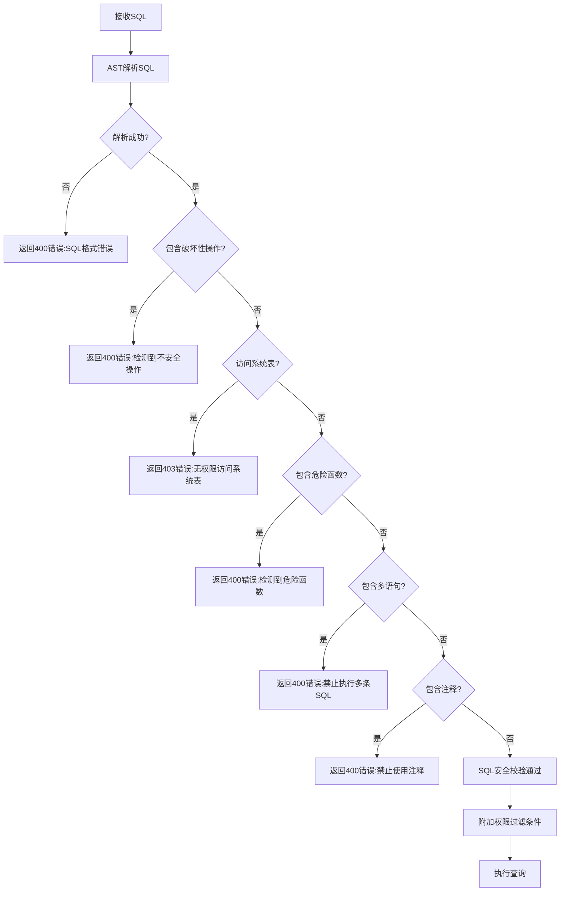

#### 6.3.4 数据安全

**数据安全策略:**

| 安全项 | 安全策略 | 实现方案 |
|--------|----------|----------|
| 密码安全 | bcrypt加密存储,强度10 | 使用golang.org/x/crypto/bcrypt库 |
| JWT密钥安全 | 密钥存储于环境变量,不写入代码 | 从环境变量JWT_SECRET读取 |
| 数据库连接安全 | 使用SSL连接,加密传输 | PostgreSQL SSL模式启用 |
| Redis连接安全 | 使用密码认证,加密传输 | Redis requirepass配置 |
| ERP数据库只读 | 使用只读账户连接ERP数据库 | ERP数据库账户仅授予SELECT权限 |
| 日志脱敏 | 日志中不记录敏感信息(密码、JWT令牌) | 日志中间件过滤敏感字段 |

#### 6.3.5 网络安全

**网络安全策略:**

| 安全项 | 安全策略 | 实现方案 |
|--------|----------|----------|
| HTTPS加密 | 所有HTTP接口使用HTTPS | TLS 1.2+加密传输 |
| CORS限制 | 限制跨域请求来源 | CORS中间件配置允许的域名列表 |
| IP白名单 | 管理接口限制IP访问范围 | 中间件校验IP地址,非白名单返回403 |
| DDoS防护 | 使用限流机制防护DDoS攻击 | 令牌桶限流 + 滑动窗口限流 |
| SQL注入防护 | 所有SQL经过安全校验 | AST解析SQL,校验安全性 |

### 6.4 可观测性设计

#### 6.4.1 日志设计

**日志分类:**

| 日志类型 | 日志级别 | 日志内容 | 日志格式 |
|----------|----------|----------|----------|
| **业务日志** | INFO | 用户查询、登录、操作等业务事件 | JSON结构化日志 |
| **错误日志** | ERROR | 系统错误、异常、失败事件 | JSON结构化日志,包含堆栈信息 |
| **性能日志** | INFO | HTTP请求耗时、LLM调用耗时、数据库查询耗时 | JSON结构化日志,包含耗时字段 |
| **审计日志** | INFO | 用户操作记录,用于审计 | JSON结构化日志,写入operation_logs表 |

**日志格式规范:**

```json
{
  "timestamp": "2026-06-02T10:30:45.123Z",
  "level": "INFO",
  "service": "erp-query-assistant",
  "trace_id": "a1b2c3d4e5f6g7h8",
  "span_id": "i9j0k1l2m3n4",
  "user_id": "123e4567-e89b-12d3-a456-426614174000",
  "operation": "query",
  "message": "用户执行查询成功",
  "details": {
    "natural_language": "查询本月销售额",
    "sql": "SELECT SUM(amount) FROM sales WHERE ...",
    "result_count": 1,
    "response_time_ms": 2500
  },
  "error": null,
  "stack_trace": null
}
```

**日志存储策略:**

| 日志类型 | 存储位置 | 保留时长 | 查询方式 |
|----------|----------|----------|----------|
| 业务日志 | ELK(Elasticsearch + Logstash + Kibana) | 30天 | Kibana查询界面 |
| 错误日志 | ELK + 本地文件 | 90天 | Kibana查询界面 + 文件查看 |
| 性能日志 | Prometheus(指标数据) | 7天 | Grafana查询界面 |
| 审计日志 | PostgreSQL(operation_logs表) | 2年 | 数据库查询 |

#### 6.4.2 监控设计

**监控指标分类:**

| 监控类型 | 监控指标 | 监控工具 | 监控频率 |
|----------|----------|----------|----------|
| **系统指标** | CPU使用率、内存使用率、磁盘使用率、网络流量 | Prometheus + Node Exporter | 15秒 |
| **应用指标** | HTTP请求QPS、响应时间、错误率、并发数 | Prometheus + 应用Exporter | 实时 |
| **业务指标** | 查询次数、LLM调用次数、推送次数、活跃用户数 | Prometheus + 应用Exporter | 实时 |
| **依赖指标** | PostgreSQL连接数、Redis命中率、LLM成功率 | Prometheus + 依赖Exporter | 实时 |

**监控告警规则:**

| 告警名称 | 告警条件 | 告警级别 | 告警通知 |
|----------|----------|----------|----------|
| HTTP接口错误率告警 | 错误率 > 5% | 严重 | 企业微信群消息 + 邮件 |
| HTTP接口响应时间告警 | P99响应时间 > 5秒 | 严重 | 企业微信群消息 |
| LLM调用失败率告警 | 失败率 > 10% | 严重 | 企业微信群消息 |
| PostgreSQL连接池告警 | 连接池使用率 > 80% | 警告 | 企业微信群消息 |
| Redis命中率告警 | 命中率 < 70% | 警告 | 企业微信群消息 |
| CPU使用率告警 | CPU使用率 > 80% | 警告 | 企业微信群消息 |
| 内存使用率告警 | 内存使用率 > 85% | 严重 | 企业微信群消息 + 邮件 |
| 磁盘使用率告警 | 磁盘使用率 > 90% | 严重 | 企业微信群消息 + 邮件 |

**监控架构:**

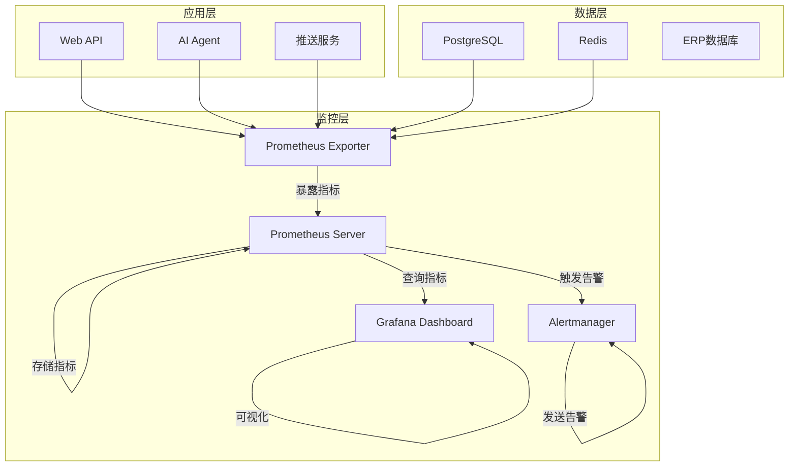

#### 6.4.3 链路追踪

**链路追踪设计:**

| 追踪项 | 追踪方案 | 实现细节 |
|--------|----------|----------|
| TraceID生成 | 使用UUID生成全局唯一TraceID | 每个HTTP请求生成一个TraceID |
| SpanID生成 | 使用随机数生成SpanID | 每个子操作生成一个SpanID |
| TraceContext传递 | 通过context传递TraceID与SpanID | 使用context.WithValue传递追踪上下文 |
| 链路记录 | 记录每个Span的开始时间、结束时间、操作名称 | 使用OpenTelemetry SDK记录链路 |

**链路追踪流程:**

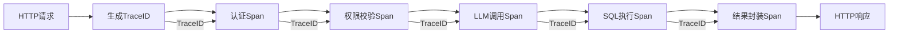

**链路追踪数据存储:**

- 使用Jaeger存储链路追踪数据
- 保留时长: 7天
- 查询方式: Jaeger UI查询界面

### 6.5 容错与降级

#### 6.5.1 异常处理

**异常分类:**

| 异常类型 | 异常示例 | 处理策略 | 返回错误 |
|----------|----------|----------|----------|
| **参数校验异常** | 用户输入为空、格式错误 | 返回400错误,提示参数错误 | 400 Bad Request |
| **认证异常** | JWT令牌无效、过期 | 返回401错误,提示认证失败 | 401 Unauthorized |
| **权限异常** | 用户无权限查询该表 | 返回403错误,提示权限不足 | 403 Forbidden |
| **业务异常** | SQL安全校验失败、查询无结果 | 返回400错误,提示业务错误 | 400 Bad Request |
| **系统异常** | 数据库连接失败、LLM调用失败 | 返回500/503错误,提示系统错误 | 500 Internal Server Error / 503 Service Unavailable |

**异常处理流程:**

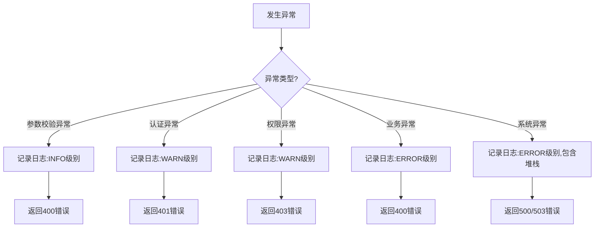

#### 6.5.2 降级策略

**降级场景与策略:**

| 降级场景 | 降级触发条件 | 降级方案 | 降级恢复条件 |
|----------|-------------|----------|-------------|
| **LLM服务降级** | LLM调用失败率 > 10% 或 连续3次失败 | 降级为模板匹配模式 | LLM服务恢复正常,失败率 < 5% |
| **Redis缓存降级** | Redis连接失败 或 操作超时率 > 20% | 降级为无缓存模式 | Redis连接恢复正常 |
| **企业微信推送降级** | 企业微信API调用失败率 > 50% | 跳过推送,记录告警 | 企业微信API调用成功率 > 80% |
| **ERP数据库降级** | ERP数据库连接失败 或 查询超时率 > 30% | 返回503错误,提示数据库不可用 | ERP数据库连接恢复正常 |

**降级状态管理:**

- 使用Redis存储降级状态(键名: `degrade:{service_name}`)
- 降级状态TTL: 5分钟(自动过期后重新检测)
- 降级状态更新: 健康检查任务每分钟更新降级状态

---

## 第七章:部署与运维设计

### 7.1 部署架构

#### 7.1.1 部署架构图

**生产环境部署架构:**

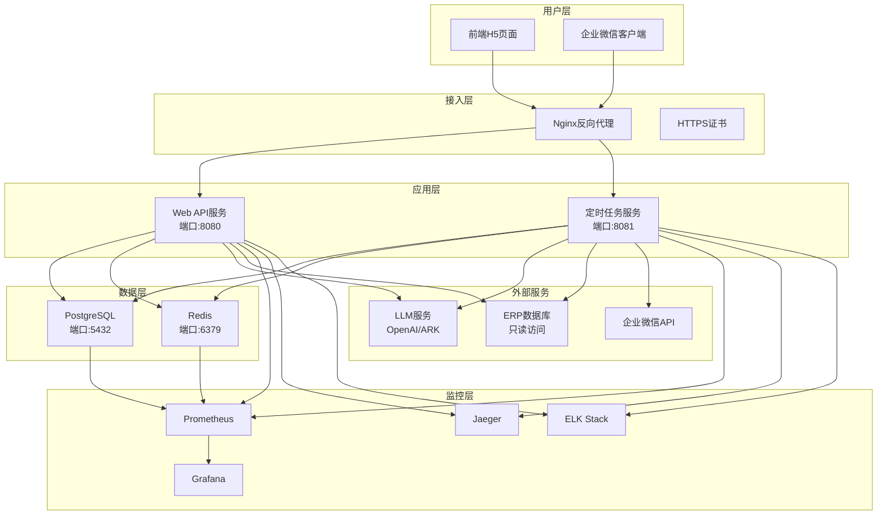

#### 7.1.2 部署环境规划

**环境分类:**

| 环境名称 | 用途 | 部署方式 | 配置规格 | 访问范围 |
|----------|------|----------|----------|----------|
| **开发环境(DEV)** | 开发人员日常开发与调试 | 本地Docker部署 | 2核CPU、4GB内存、20GB磁盘 | 仅开发团队访问 |
| **测试环境(TEST)** | 功能测试、集成测试、性能测试 | 服务器部署 | 4核CPU、8GB内存、50GB磁盘 | 测试团队访问 |
| **预发布环境(STAGING)** | 发布前验证,与生产环境配置一致 | 服务器部署 | 4核CPU、8GB内存、50GB磁盘 | 内部团队访问 |
| **生产环境(PROD)** | 正式运行环境,面向真实用户 | 服务器部署 | 8核CPU、16GB内存、100GB磁盘 | 所有用户访问 |

**环境配置对比:**

| 配置项 | 开发环境 | 测试环境 | 预发布环境 | 生产环境 |
|--------|----------|----------|-----------|----------|
| Web API实例数 | 1 | 1 | 1 | 2 |
| PostgreSQL实例数 | 1 | 1 | 1 | 1(主从备份) |
| Redis实例数 | 1 | 1 | 1 | 1 |
| LLM服务 | Mock服务 | 真实服务 | 真实服务 | 真实服务 |
| ERP数据库 | Mock数据 | 测试数据 | 真实数据(只读) | 真实数据(只读) |
| 监控系统 | 本地日志 | Prometheus | Prometheus | Prometheus + Grafana + Jaeger + ELK |

#### 7.1.3 容器化部署

**Docker镜像构建:**

| 镜像名称 | 基础镜像 | 镜像大小 | 构建方式 |
|----------|----------|----------|----------|
| erp-query-assistant-api | golang:1.21-alpine | ~ 50MB | 多阶段构建,编译后仅保留二进制文件 |
| erp-query-assistant-cron | golang:1.21-alpine | ~ 50MB | 多阶段构建,编译后仅保留二进制文件 |

**Dockerfile示例(Web API服务):**

```dockerfile
# 构建阶段
FROM golang:1.21-alpine AS builder

WORKDIR /app

COPY go.mod go.sum ./
RUN go mod download

COPY . .
RUN CGO_ENABLED=0 GOOS=linux go build -a -installsuffix cgo -o main ./cmd/api

# 运行阶段
FROM alpine:latest

RUN apk --no-cache add ca-certificates tzdata

WORKDIR /root/

COPY --from=builder /app/main .
COPY --from=builder /app/config ./config

EXPOSE 8080

CMD ["./main"]
```

**Docker Compose配置(开发环境):**

```yaml
version: '3.8'

services:
  api:
    build:
      context: .
      dockerfile: Dockerfile.api
    ports:
      - "8080:8080"
    environment:
      - DB_HOST=postgres
      - DB_PORT=5432
      - DB_USER=erp_user
      - DB_PASSWORD=erp_password
      - DB_NAME=erp_assistant
      - REDIS_HOST=redis
      - REDIS_PORT=6379
      - LLM_PROVIDER=openai
      - LLM_API_KEY=${LLM_API_KEY}
    depends_on:
      - postgres
      - redis
    networks:
      - erp-network
  
  cron:
    build:
      context: .
      dockerfile: Dockerfile.cron
    environment:
      - DB_HOST=postgres
      - DB_PORT=5432
      - DB_USER=erp_user
      - DB_PASSWORD=erp_password
      - DB_NAME=erp_assistant
      - REDIS_HOST=redis
      - REDIS_PORT=6379
      - WECHAT_API_KEY=${WECHAT_API_KEY}
    depends_on:
      - postgres
      - redis
    networks:
      - erp-network
  
  postgres:
    image: postgres:15-alpine
    ports:
      - "5432:5432"
    environment:
      - POSTGRES_USER=erp_user
      - POSTGRES_PASSWORD=erp_password
      - POSTGRES_DB=erp_assistant
    volumes:
      - postgres-data:/var/lib/postgresql/data
    networks:
      - erp-network
  
  redis:
    image: redis:7-alpine
    ports:
      - "6379:6379"
    volumes:
      - redis-data:/data
    networks:
      - erp-network

volumes:
  postgres-data:
  redis-data:

networks:
  erp-network:
    driver: bridge
```

### 7.2 配置管理

#### 7.2.1 配置项清单

**应用配置项:**

| 配置分类 | 配置项 | 配置键 | 默认值 | 说明 |
|----------|--------|--------|--------|------|
| **服务器配置** | HTTP端口 | server.port | 8080 | Web API服务端口 |
| | 读超时 | server.timeout.read | 10s | HTTP读超时时间 |
| | 写超时 | server.timeout.write | 10s | HTTP写超时时间 |
| | 空闲超时 | server.timeout.idle | 60s | HTTP空闲超时时间 |
| **数据库配置** | PostgreSQL地址 | db.host | localhost | PostgreSQL数据库地址 |
| | PostgreSQL端口 | db.port | 5432 | PostgreSQL数据库端口 |
| | PostgreSQL用户 | db.user | erp_user | PostgreSQL数据库用户 |
| | PostgreSQL密码 | db.password | - | PostgreSQL数据库密码(环境变量) |
| | PostgreSQL数据库 | db.name | erp_assistant | PostgreSQL数据库名称 |
| | 最大连接数 | db.max_open_conns | 50 | 最大打开连接数 |
| | 最大空闲连接数 | db.max_idle_conns | 10 | 最大空闲连接数 |
| **Redis配置** | Redis地址 | redis.host | localhost | Redis服务地址 |
| | Redis端口 | redis.port | 6379 | Redis服务端口 |
| | Redis密码 | redis.password | - | Redis密码(环境变量) |
| | Redis数据库 | redis.db | 0 | Redis数据库编号 |
| | 连接池大小 | redis.pool_size | 20 | Redis连接池大小 |
| **LLM配置** | LLM服务商 | llm.provider | openai | LLM服务商(openai/ark) |
| | LLM模型 | llm.model | gpt-4o | LLM模型名称 |
| | LLM API Key | llm.api_key | - | LLM API密钥(环境变量) |
| | LLM超时 | llm.timeout | 30s | LLM调用超时时间 |
| | LLM最大重试 | llm.max_retries | 3 | LLM调用最大重试次数 |
| **ERP数据库配置** | ERP数据库地址 | erp.host | - | ERP数据库地址 |
| | ERP数据库端口 | erp.port | 5432 | ERP数据库端口 |
| | ERP数据库用户 | erp.user | erp_readonly | ERP数据库只读用户 |
| | ERP数据库密码 | erp.password | - | ERP数据库密码(环境变量) |
| | ERP数据库名称 | erp.name | erp_production | ERP数据库名称 |
| **企业微信配置** | 企业微信CorpID | wechat.corp_id | - | 企业微信企业ID |
| | 企业微信Secret | wechat.secret | - | 企业微信应用Secret |
| | 企业微信AgentID | wechat.agent_id | - | 企业微信应用AgentID |
| **JWT配置** | JWT密钥 | jwt.secret | - | JWT签名密钥(环境变量) |
| | JWT过期时间 | jwt.expire_time | 7d | JWT令牌过期时间 |
| **对话配置** | 对话上下文TTL | dialog.context_ttl | 30m | 对话上下文缓存时长 |
| | 最大对话轮次 | dialog.max_turns | 5 | 最大保留对话轮次 |
| **定时任务配置** | 报告推送时间 | cron.report_schedule | 0 8 * * * | 报告推送Cron表达式 |
| | 预警检测间隔 | cron.alert_check_interval | 5m | 预警检测间隔 |
| **日志配置** | 日志级别 | log.level | info | 日志级别(debug/info/warn/error) |
| | 日志格式 | log.format | json | 日志格式(json/text) |
| | 日志输出 | log.output | stdout | 日志输出位置(stdout/file) |

#### 7.2.2 配置文件管理

**配置文件结构:**

```
config/
├── config.yaml          # 主配置文件
├── config.dev.yaml      # 开发环境配置
├── config.test.yaml     # 测试环境配置
├── config.staging.yaml  # 预发布环境配置
├── config.prod.yaml     # 生产环境配置
└── secrets/             # 密钥配置目录(不提交到Git)
    ├── db_password.txt
    ├── redis_password.txt
    ├── llm_api_key.txt
    ├── jwt_secret.txt
    ├── wechat_secret.txt
    └── erp_password.txt
```

**配置加载优先级:**

1. 环境变量(最高优先级)
2. 命令行参数
3. 配置文件(按环境加载)
4. 默认值(最低优先级)

**配置加载逻辑:**

```go
func LoadConfig() (*Config, error) {
    cfg := &Config{}
    
    // 1. 加载默认配置
    setDefaults(cfg)
    
    // 2. 加载配置文件
    env := os.Getenv("APP_ENV")
    configFile := fmt.Sprintf("config/config.%s.yaml", env)
    if err := loadFromFile(cfg, configFile); err != nil {
        return nil, err
    }
    
    // 3. 加载环境变量
    loadFromEnv(cfg)
    
    // 4. 加载命令行参数
    loadFromFlags(cfg)
    
    // 5. 验证配置
    if err := validateConfig(cfg); err != nil {
        return nil, err
    }
    
    return cfg, nil
}
```

#### 7.2.3 密钥管理

**密钥管理策略:**

| 密钥类型 | 存储位置 | 更新频率 | 访问权限 |
|----------|----------|----------|----------|
| 数据库密码 | 环境变量 + 密钥管理服务 | 每季度更换 | 仅运维团队 |
| Redis密码 | 环境变量 + 密钥管理服务 | 每季度更换 | 仅运维团队 |
| JWT密钥 | 环境变量 + 密钥管理服务 | 每年更换 | 仅运维团队 |
| LLM API Key | 环境变量 + 密钥管理服务 | 每月更换 | 仅运维团队 |
| 企业微信Secret | 环境变量 + 密钥管理服务 | 每季度更换 | 仅运维团队 |
| ERP数据库密码 | 环境变量 + 密钥管理服务 | 每季度更换 | 仅运维团队 + ERP管理员 |

**密钥管理最佳实践:**

1. **不提交密钥到Git:** 所有密钥文件存储在`config/secrets/`目录,该目录不提交到Git
2. **使用环境变量:** 生产环境密钥通过环境变量注入,不写入配置文件
3. **使用密钥管理服务:** 使用AWS Secrets Manager、Azure Key Vault或HashiCorp Vault管理密钥
4. **定期更换密钥:** 每季度或每月更换密钥,降低密钥泄露风险
5. **密钥访问审计:** 记录密钥访问日志,审计密钥使用情况

### 7.3 发布策略

#### 7.3.1 发布流程

**发布流程图:**

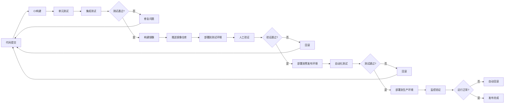

**发布步骤:**

| 步骤 | 操作内容 | 执行者 | 执行环境 | 验证内容 |
|------|----------|----------|----------|----------|
| 1. 代码提交 | 开发人员提交代码到Git仓库 | 开发人员 | 开发环境 | 代码规范检查 |
| 2. CI构建 | CI系统自动构建应用 | CI系统 | CI环境 | 构建成功 |
| 3. 单元测试 | 执行单元测试套件 | CI系统 | CI环境 | 测试覆盖率 > 80% |
| 4. 集成测试 | 执行集成测试套件 | CI系统 | CI环境 | 所有测试通过 |
| 5. 构建镜像 | 构建Docker镜像 | CI系统 | CI环境 | 镜像构建成功 |
| 6. 推送镜像 | 推送镜像到镜像仓库 | CI系统 | 镜像仓库 | 镜像推送成功 |
| 7. 部署测试环境 | 部署到测试环境 | CI系统 | 测试环境 | 服务启动成功 |
| 8. 人工验证 | 测试团队验证功能 | 测试团队 | 测试环境 | 功能正常 |
| 9. 部署预发布环境 | 部署到预发布环境 | 运维团队 | 预发布环境 | 服务启动成功 |
| 10. 自动化测试 | 执行自动化测试套件 | CI系统 | 预发布环境 | 所有测试通过 |
| 11. 部署生产环境 | 部署到生产环境 | 运维团队 | 生产环境 | 服务启动成功 |
| 12. 监控验证 | 监控系统验证运行状态 | 监控系统 | 生产环境 | 错误率 < 1% |

#### 7.3.2 发布策略

**发布策略选择:**

| 发布策略 | 适用场景 | 发布方式 | 回滚方式 | 优点 | 缺点 |
|----------|----------|----------|----------|------|------|
| **蓝绿部署** | 关键业务系统,需要零停机发布 | 同时运行新旧版本,切换流量 | 切换流量到旧版本 | 零停机,快速回滚 | 需要双倍资源 |
| **滚动发布** | 资源有限,可接受短暂停机 | 逐个替换实例 | 逐个回滚实例 | 资源利用率高 | 发布期间部分用户受影响 |
| **金丝雀发布** | 新功能验证,降低风险 | 先发布到小部分用户 | 切断金丝雀流量 | 风险可控,逐步验证 | 发布周期较长 |

**推荐发布策略:蓝绿部署**

**蓝绿部署流程:**

1. **蓝环境(当前版本):** 运行当前版本的应用,接收全部流量
2. **绿环境(新版本):** 部署新版本的应用,不接收流量
3. **验证绿环境:** 在绿环境执行自动化测试与人工验证
4. **切换流量:** 通过Nginx将流量从蓝环境切换到绿环境
5. **监控验证:** 监控绿环境运行状态,验证错误率与性能
6. **回滚准备:** 保留蓝环境一段时间,如发现问题可快速切换回蓝环境
7. **清理蓝环境:** 确认绿环境稳定后,清理蓝环境资源

**蓝绿部署架构:**

```mermaid
graph TB
    subgraph 用户
        U[用户请求]
    end
    
    subgraph Nginx
        N[Nginx反向代理]
    end
    
    subgraph 蓝环境(当前版本)
        B1[Web API v1.0<br/>实例1]
        B2[Web API v1.0<br/>实例2]
    end
    
    subgraph 绿环境(新版本)
        G1[Web API v2.0<br/>实例1]
        G2[Web API v2.0<br/>实例2]
    end
    
    U --> N
    N -->|当前流量| B1
    N -->|当前流量| B2
    N -.->|切换后流量| G1
    N -.->|切换后流量| G2
```

#### 7.3.3 回滚策略

**回滚触发条件:**

| 回滚场景 | 触发条件 | 回滚方式 | 回滚时间 |
|----------|----------|----------|----------|
| **自动化测试失败** | 集成测试或自动化测试失败 | 不发布到生产环境 | - |
| **人工验证失败** | 测试团队验证功能失败 | 不发布到生产环境 | - |
| **生产环境错误率飙升** | 错误率 > 5% 持续5分钟 | 自动回滚 | < 5分钟 |
| **生产环境性能下降** | P99响应时间 > 10秒 持续5分钟 | 自动回滚 | < 5分钟 |
| **生产环境服务不可用** | 服务健康检查失败 | 自动回滚 | < 5分钟 |
| **用户反馈严重问题** | 用户反馈严重功能问题 | 人工回滚 | < 30分钟 |

**回滚流程:**

1. **触发回滚:** 监控系统检测到异常或人工触发回滚
2. **切换流量:** 将流量从新版本切换到旧版本(蓝绿部署)
3. **验证回滚:** 验证旧版本运行正常,错误率恢复正常
4. **记录回滚:** 记录回滚原因、时间、版本信息
5. **分析问题:** 分析新版本失败原因,修复问题
6. **重新发布:** 修复问题后重新执行发布流程

### 7.4 数据运维

#### 7.4.1 数据库运维

**数据库日常运维任务:**

| 运维任务 | 执行频率 | 执行时间 | 执行方式 | 验证内容 |
|----------|----------|----------|----------|----------|
| 数据库备份 | 每天 | 凌晨3点 | 自动执行 | 备份文件完整性 |
| 备份恢复演练 | 每周 | 周末 | 自动执行 | 恢复成功,数据完整 |
| 数据归档 | 每月 | 月初凌晨2点 | 自动执行 | 归档数据完整性 |
| 索引优化 | 每月 | 月末凌晨3点 | 人工执行 | 查询性能提升 |
| 慢查询分析 | 每周 | 周一上午 | 人工执行 | 慢查询数量减少 |
| 数据库健康检查 | 每天 | 凌晨4点 | 自动执行 | 连接数、锁等待、磁盘空间 |

**数据库监控指标:**

| 监控指标 | 告警阈值 | 告警级别 | 告警通知 |
|----------|----------|----------|----------|
| 数据库连接数 | > 80% 最大连接数 | 警告 | 企业微信群消息 |
| 数据库锁等待时间 | > 5秒 | 严重 | 企业微信群消息 + 邮件 |
| 数据库磁盘空间 | > 90% | 严重 | 企业微信群消息 + 邮件 |
| 数据库查询错误率 | > 1% | 警告 | 企业微信群消息 |
| 数据库响应时间(P99) | > 500ms | 警告 | 企业微信群消息 |

#### 7.4.2 Redis运维

**Redis日常运维任务:**

| 运维任务 | 执行频率 | 执行时间 | 执行方式 | 验证内容 |
|----------|----------|----------|----------|----------|
| Redis内存使用分析 | 每天 | 凌晨5点 | 自动执行 | 内存使用率 < 80% |
| Redis键过期清理 | 每天 | 凌晨6点 | 自动执行 | 过期键清理完成 |
| Redis持久化验证 | 每周 | 周末 | 自动执行 | RDB/AOF文件完整性 |
| Redis性能分析 | 每周 | 周一上午 | 人工执行 | 响应时间、命中率 |
| Redis健康检查 | 每天 | 凌晨4点 | 自动执行 | 连接数、内存、命中率 |

**Redis监控指标:**

| 监控指标 | 告警阈值 | 告警级别 | 告警通知 |
|----------|----------|----------|----------|
| Redis内存使用率 | > 80% | 警告 | 企业微信群消息 |
| Redis命中率 | < 70% | 警告 | 企业微信群消息 |
| Redis连接数 | > 80% 最大连接数 | 警告 | 企业微信群消息 |
| Redis响应时间(P99) | > 100ms | 警告 | 企业微信群消息 |
| Redis键数量 | > 100万 | 警告 | 企业微信群消息 |

#### 7.4.3 数据迁移

**数据迁移场景:**

| 迁移场景 | 迁移内容 | 迁移方式 | 迁移时间 | 验证内容 |
|----------|----------|----------|----------|----------|
| **新版本发布** | 数据库表结构变更 | 迁移脚本 | 发布前执行 | 表结构正确,数据完整 |
| **数据库升级** | PostgreSQL版本升级 | pg_upgrade | 维护窗口执行 | 数据完整,性能正常 |
| **数据归档** | 历史数据归档 | 归档脚本 | 每月执行 | 归档数据完整 |
| **数据导入** | 初始数据导入 | 导入脚本 | 系统初始化 | 数据完整,索引正确 |

**数据迁移流程:**

1. **制定迁移计划:** 明确迁移内容、时间、步骤、验证方案
2. **准备迁移脚本:** 编写迁移脚本,测试脚本正确性
3. **备份数据:** 执行数据备份,确保可回滚
4. **执行迁移:** 在维护窗口执行迁移脚本
5. **验证迁移:** 验证数据完整性、表结构正确性、应用功能正常
6. **监控验证:** 监控系统运行状态,验证性能与错误率
7. **回滚准备:** 如发现问题,执行回滚操作

### 7.5 容量规划

#### 7.5.1 容量预估

**系统容量预估(运营1年):**

| 容量指标 | 当前容量 | 1年后容量 | 3年后容量 | 增长趋势 | 扩容策略 |
|----------|----------|-----------|-----------|----------|----------|
| **用户数** | 50 | 86 | 158 | 线性增长 | 无需扩容 |
| **并发用户数** | 10 | 20 | 30 | 线性增长 | 无需扩容 |
| **查询QPS** | 10 | 50 | 100 | 线性增长 | 增加应用实例 |
| **数据库数据量** | 10MB | 95MB | 295MB | 线性增长 | 无需扩容 |
| **Redis内存使用** | 50MB | 200MB | 500MB | 线性增长 | 增加Redis内存 |
| **日志数据量** | 1GB | 10GB | 30GB | 线性增长 | 扩展日志存储 |

**资源容量规划:**

| 资源类型 | 当前配置 | 1年后配置 | 3年后配置 | 扩容触发条件 |
|----------|----------|-----------|-----------|-------------|
| **应用服务器** | 2核CPU、4GB内存 | 4核CPU、8GB内存 | 8核CPU、16GB内存 | CPU使用率 > 80% 或 内存使用率 > 85% |
| **数据库服务器** | 2核CPU、4GB内存、50GB磁盘 | 4核CPU、8GB内存、100GB磁盘 | 8核CPU、16GB内存、200GB磁盘 | 数据库磁盘空间 > 80% |
| **Redis服务器** | 1GB内存 | 2GB内存 | 4GB内存 | Redis内存使用率 > 80% |
| **日志存储** | 10GB | 50GB | 100GB | 日志存储空间 > 80% |

#### 7.5.2 扩容策略

**扩容触发条件:**

| 扩容场景 | 触发条件 | 扩容方式 | 扩容时间 |
|----------|----------|----------|----------|
| **应用层扩容** | CPU使用率 > 80% 或 QPS > 50 | 增加应用实例 | < 30分钟 |
| **数据库扩容** | 磁盘空间 > 80% 或 查询性能下降 | 增加磁盘空间或升级配置 | < 2小时(维护窗口) |
| **Redis扩容** | 内存使用率 > 80% 或 响应时间 > 100ms | 增加Redis内存或升级配置 | < 30分钟 |
| **日志存储扩容** | 日志存储空间 > 80% | 增加日志存储空间 | < 1小时 |

**扩容流程:**

1. **监控触发:** 监控系统检测到资源使用率超过阈值
2. **评估扩容:** 运维团队评估扩容需求与方案
3. **准备资源:** 准备扩容所需的服务器或资源
4. **执行扩容:** 执行扩容操作(增加实例、升级配置)
5. **验证扩容:** 验证扩容后系统运行正常
6. **调整监控:** 调整监控阈值,适应新容量

---

## 第八章:变更记录与附录

### 8.1 变更记录

**文档变更历史:**

| 版本 | 变更日期 | 变更人 | 变更内容 | 变更原因 | 审核人 |
|------|----------|----------|----------|----------|----------|
| 1.0.0 | 2026-06-02 | AI Assistant | 创建初始版本 | 项目启动,需要详细设计文档指导开发 | 待审核 |

**变更内容详情:**

**版本1.0.0变更内容:**
- 创建完整的详细设计文档,包含八大章节
- 定义系统模块划分与职责,共18个模块
- 设计28个HTTP API接口清单,详细规格3个核心接口
- 设计12张数据表的完整字段定义、主键、索引
- 定义13条业务规则与2个核心业务流程
- 设计非功能性需求(性能、高可用、安全、可观测性)
- 设计部署与运维方案(部署架构、配置管理、发布策略、数据运维、容量规划)

### 8.2 附录

#### 8.2.1 技术选型对比

**LLM服务商对比:**

| 对比项 | OpenAI(GPT-4o) | ARK(豆包) | 文心一言 | Claude |
|--------|----------------|-----------|----------|--------|
| **模型能力** | 强大的意图理解与SQL生成能力 | 中文理解能力强,SQL生成准确 | 中文理解能力强,成本较低 | 逻辑推理能力强,安全性高 |
| **响应速度** | 1~2秒 | 1~3秒 | 2~4秒 | 2~3秒 |
| **成本** | 较高($0.03/1K tokens) | 中等(¥0.008/1K tokens) | 较低(¥0.004/1K tokens) | 较高($0.015/1K tokens) |
| **稳定性** | 高(99.9%) | 高(99.5%) | 中(99%) | 高(99.9%) |
| **中文支持** | 良好 | 优秀 | 优秀 | 良好 |
| **推荐场景** | 国际化项目,高预算项目 | 国内项目,中文场景 | 国内项目,低成本项目 | 高安全性项目 |

**推荐方案:** OpenAI(GPT-4o)作为主LLM服务,ARK(豆包)作为备用LLM服务,实现降级策略。

**数据库对比:**

| 对比项 | PostgreSQL | MySQL | MongoDB |
|--------|-----------|-------|---------|
| **数据模型** | 关系型数据库,支持复杂查询 | 关系型数据库,简单易用 | 文档型数据库,灵活schema |
| **查询能力** | 强大的SQL查询,支持复杂关联 | SQL查询,关联查询性能一般 | JSON查询,关联查询较弱 |
| **事务支持** | 完整的ACID事务 | ACID事务(部分场景) | 事务支持较弱 |
| **扩展性** | 支持扩展插件(如pg_trgm) | 扩展性一般 | 扩展性强 |
| **性能** | 复杂查询性能优秀 | 简单查询性能优秀 | 大数据量性能优秀 |
| **适用场景** | 复杂业务系统,需要复杂查询 | 简单业务系统,Web应用 | 灵活schema,大数据量 |

**推荐方案:** PostgreSQL作为主数据库,满足复杂查询与事务需求。

#### 8.2.2 技术风险与应对

**技术风险清单:**

| 风险类型 | 风险描述 | 风险等级 | 应对措施 |
|----------|----------|----------|----------|
| **LLM服务不稳定** | LLM服务可能出现故障或响应缓慢,影响查询功能 | 高 | 实现降级策略,LLM服务不可用时降级为模板匹配模式 |
| **ERP数据库访问限制** | ERP数据库可能限制访问频率或并发连接数,影响查询性能 | 中 | 实现连接池限流与查询缓存,降低ERP数据库压力 |
| **SQL注入风险** | 用户可能通过自然语言输入注入恶意SQL,破坏数据安全 | 高 | 实现SQL安全校验,AST解析SQL,拒绝破坏性操作 |
| **权限配置错误** | 权限配置可能错误,导致用户查询到不应访问的数据 | 中 | 实现权限校验中间件,每次查询前强制校验权限 |
| **数据量增长过快** | 数据量增长超过预估,导致数据库性能下降 | 中 | 实现数据归档策略,定期清理历史数据 |
| **并发用户数超预期** | 并发用户数超过预估,导致系统性能下降 | 中 | 实现限流机制,控制并发用户数,超出则排队等待 |
| **企业微信API限制** | 企业微信API可能限制调用频率,影响推送功能 | 低 | 实现推送频率控制,避免超出企业微信API限制 |

#### 8.2.3 术语表

**术语表补充:**

| 术语/缩略语 | 全称 | 含义说明 |
|------------|------|----------|
| AST | Abstract Syntax Tree | 抽象语法树,用于SQL解析与安全校验 |
| RBAC | Role-Based Access Control | 基于角色的访问控制,通过用户组实现权限管理 |
| MTTR | Mean Time To Recovery | 平均恢复时间,衡量系统可用性的指标 |
| P99 | 99th Percentile | 99分位数,衡量响应时间的指标(99%的请求响应时间小于该值) |
| QPS | Queries Per Second | 每秒查询数,衡量系统吞吐量的指标 |
| SLA | Service Level Agreement | 服务级别协议,定义系统可用性目标 |
| TTL | Time To Live | 缓存过期时间,控制缓存数据的生命周期 |
| ELK | Elasticsearch + Logstash + Kibana | 日志管理栈,用于日志收集、存储与可视化 |
| CI/CD | Continuous Integration/Continuous Deployment | 持续集成与持续部署,自动化发布流程 |
| Docker | Docker Container | 容器化技术,用于应用部署与隔离 |
| Nginx | Nginx Web Server | 反向代理服务器,用于负载均衡与流量切换 |
| Prometheus | Prometheus Monitoring System | 监控系统,用于指标收集与告警 |
| Grafana | Grafana Dashboard | 可视化面板,用于监控数据展示 |
| Jaeger | Jaeger Tracing System | 链路追踪系统,用于分布式链路追踪 |

#### 8.2.4 参考文档补充

**参考文档补充:**

| 文档名称 | 版本 | 位置/链接 |
|----------|------|-----------|
| OpenAI API文档 | - | https://platform.openai.com/docs/ |
| ARK(豆包)API文档 | - | https://www.volcengine.com/docs/82379 |
| PostgreSQL官方文档 | 15 | https://www.postgresql.org/docs/15/ |
| Redis官方文档 | 7 | https://redis.io/docs/ |
| Gin Web框架文档 | - | https://gin-gonic.com/docs/ |
| Eino框架文档 | - | https://github.com/cloudwego/eino |
| Prometheus官方文档 | - | https://prometheus.io/docs/ |
| Grafana官方文档 | - | https://grafana.com/docs/ |
| Jaeger官方文档 | - | https://www.jaegertracing.io/docs/ |
| Docker官方文档 | - | https://docs.docker.com/ |
| Nginx官方文档 | - | https://nginx.org/en/docs/ |

---

**文档结束**