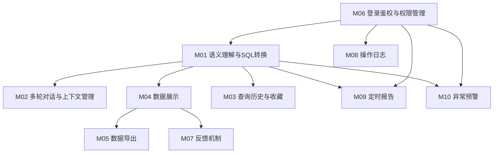
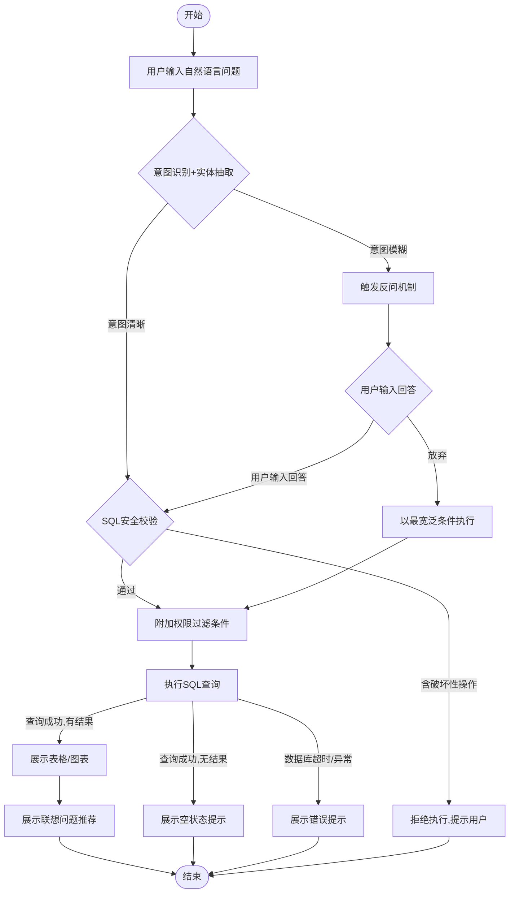
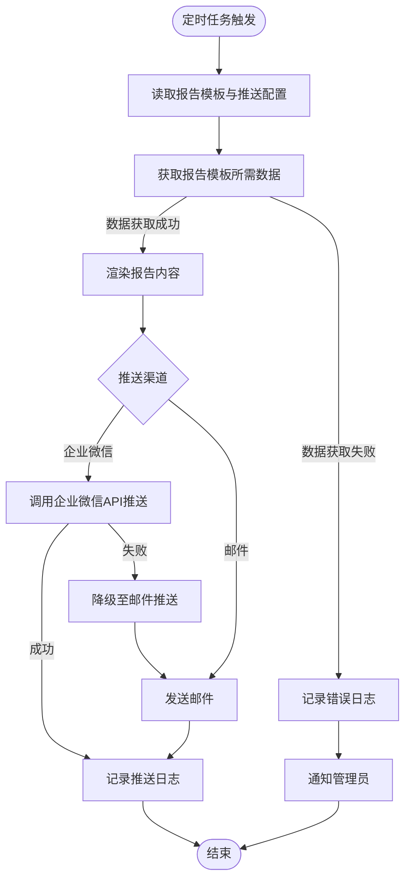
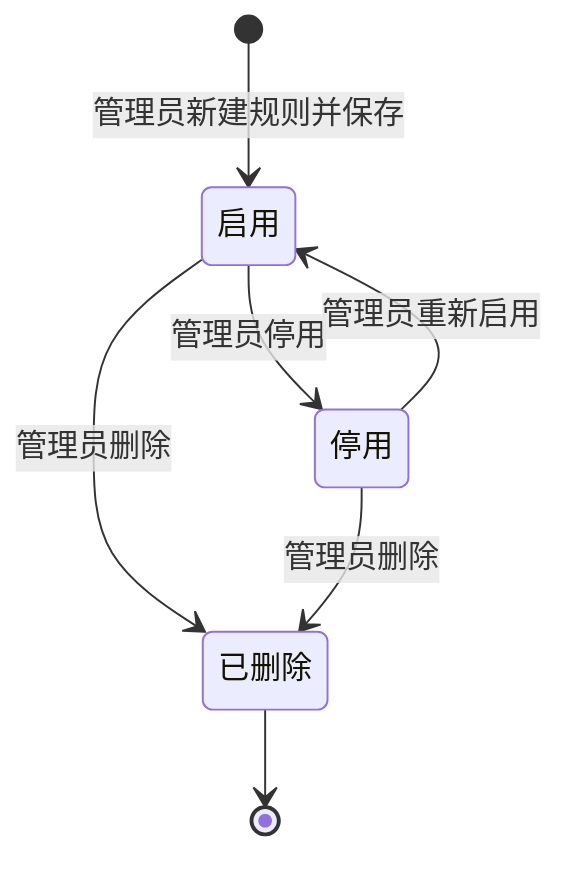
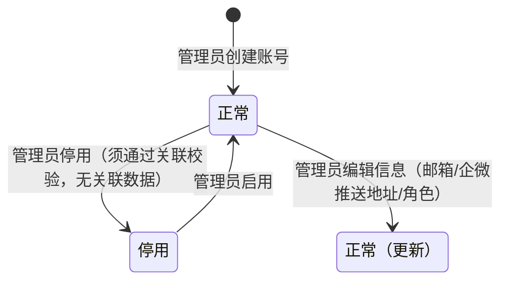
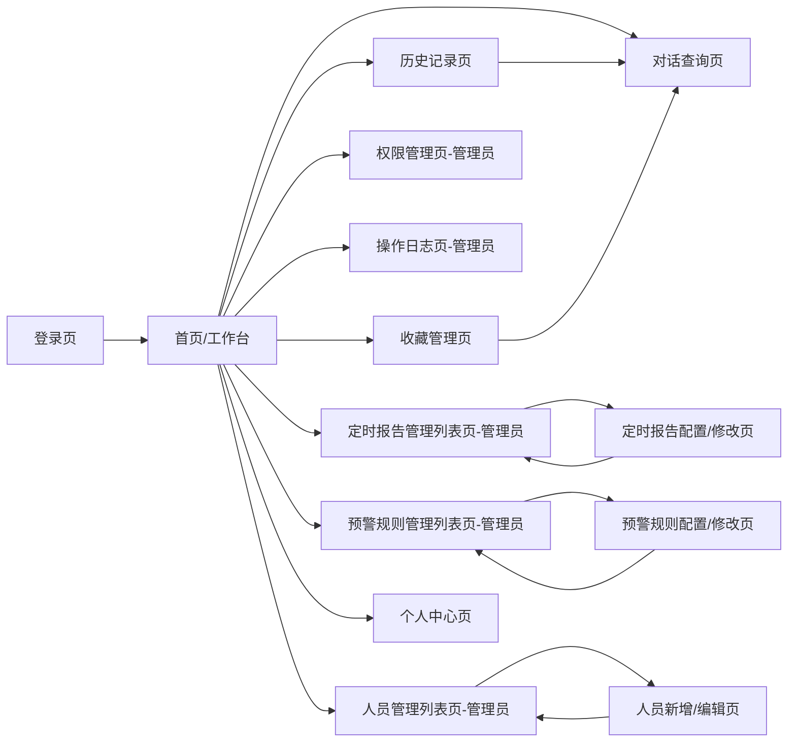

# ERP对话式查询助手 产品需求文档（PRD）

**版本：** 1.2.9
**日期：** 2026年5月29日
**文档状态：** 待评审

---

## 目录

1. [第一章：产品概述](#第一章产品概述)
2. [第二章：用户角色与权限体系](#第二章用户角色与权限体系)
3. [第三章：功能需求说明](#第三章功能需求说明)
4. [第四章：业务流程与规则](#第四章业务流程与规则)
5. [第五章：交互与页面设计](#第五章交互与页面设计)
6. [第六章：非功能需求](#第六章非功能需求)
7. [第七章：验收标准](#第七章验收标准)
8. [第八章：附录与变更记录](#第八章附录与变更记录)

---

## 第一章：产品概述

### 1.1 产品定义

**产品定位（一句话）：** ERP对话式查询助手是一款面向企业管理层的自然语言数据查询工具，让用户以口语化方式直接获取ERP核心经营数据，同时具备主动推送与预警能力，将被动查询升级为主动经营感知。

**产品愿景：** 打破ERP数据查询的技术门槛，使企业各层级管理人员能够随时通过一句话获取所需经营数据，驱动更快、更准确的商业决策。

---

### 1.2 目标用户与场景

#### 核心用户角色

| 角色编号 | 角色名称 | 职能定位 |
|----------|----------|----------|
| R01 | 老板/高管 | 负责企业整体经营决策，需快速掌握采购、销售、库存等核心经营数据 |
| R02 | 部门经理 | 负责本部门业务管理，需查询权限范围内的业务单据与统计数据 |
| R03 | 系统管理员 | 负责系统配置与维护，包括权限配置、操作日志审计及模型优化 |

#### 核心业务场景

| 场景名称 | 涉及角色 | 场景描述 | 当前痛点 | 期望效果 |
|----------|----------|----------|----------|----------|
| 经营数据快速查询 | 老板/高管 | 高管通过口语化问题查询当期采购、销售、库存等核心指标 | 需操作ERP多级菜单，学习成本高；数据分散在不同模块 | 一句话输入，秒级返回聚合数据 |
| 部门业务数据查询 | 部门经理 | 经理在权限范围内查询本部门单据明细与统计汇总 | 报表权限难精细化管控，越权风险高 | 权限内数据精准查询，结果可导出 |
| 主动经营感知 | 老板/高管 | 每日自动推送经营简报，异常指标实时预警 | 数据获取依赖人工整理，滞后性高 | 定时推送早报/周报，异常即时触达 |
| 权限与审计管理 | 系统管理员 | 配置用户组权限，查看操作日志，优化模型效果 | 权限配置与日志分散，难以统一管控 | 集中管控权限，日志可检索可导出 |
| 多轮追问分析 | 老板/高管、部门经理 | 用户在初次查询基础上连续追问，逐步深入分析 | 每次查询都要重新输入完整条件 | 上下文自动保持，指代词自动识别 |

---

### 1.3 产品范围与边界

#### 本次覆盖的功能模块

- 语义理解与SQL转换（自然语言转SQL、双重语义理解）
- 多轮对话与上下文管理（多轮追问、智能联想、反问机制）
- 查询历史与收藏
- 数据展示（表格、可视化图表、空值处理）
- 数据导出（Excel/PDF，含水印）
- 登录鉴权与权限管理（账号密码登录、表级/字段级/操作级权限、用户组管理、人员账号管理、个人中心）
- 反馈机制
- 操作日志
- 定时报告（主动推送）
- 异常预警

#### 明确不覆盖的内容

| 排除项 | 排除理由 |
|--------|----------|
| ERP核心业务逻辑修改 | 本系统为查询层，不修改ERP数据，避免数据安全风险 |
| 自定义报表设计器 | 复杂度高，与本产品定位不符，可作为后期扩展 |
| 移动App原生开发 | 首期以Web为主，移动端通过企业微信内嵌H5实现 |
| AI模型自主训练平台 | 由AI工程团队另行建设，本产品仅对接调用接口 |

#### 与已有产品的关系

本产品以**独立系统**形式部署，通过只读方式连接企业ERP数据库，不修改ERP任何数据。企业微信作为消息推送渠道，二者为集成关系。

---

### 1.4 核心价值主张

1. **降低查询门槛**：将传统ERP报表查询的学习成本从数天缩短为零，任何管理层人员无需培训即可获取经营数据。
2. **提升决策时效**：从人工整理数据到一句话秒级获取，将经营数据获取时长从小时级缩短至秒级。
3. **主动经营感知**：通过定时报告与异常预警，将数据消费模式从"人找数据"升级为"数据找人"，确保关键经营异常在第一时间触达决策者。

---

## 第二章：用户角色与权限体系

### 2.1 角色定义

| 角色编号 | 角色名称 | 角色描述 | 角色归属 | 典型操作场景 |
|----------|----------|----------|----------|-------------|
| R01 | 老板/高管 | 企业最高管理层，需全局访问经营数据 | 高管组 | 查询全公司采购/销售/库存数据；接收每日经营早报；查看敏感字段（成本价、利润率） |
| R02 | 部门经理 | 各业务部门负责人，访问权限限于本部门 | 各业务部门（采购/销售/财务等） | 查询本部门业务单据明细与汇总；导出报表；订阅本部门定时报告 |
| R03 | 系统管理员 | 平台管理人员，负责系统运维与配置 | 管理员组 | 配置用户组权限；查看操作日志；配置预警规则；管理模型调优反馈 |

**角色关系说明：**
- R03（系统管理员）具有平台配置权，但**不具备**直接访问业务数据的权限，以保障职责分离；
- R01（老板/高管）与R02（部门经理）均为数据查询角色，权限范围不同；
- 一人可兼多个角色（如某高管同时属于"高管组"和"财务组"），权限取并集。

---

### 2.2 权限矩阵

| 功能/操作 | 老板/高管(R01) | 部门经理(R02) | 系统管理员(R03) |
|-----------|---------------|--------------|----------------|
| **查询 - 全公司数据** | ✅ 查看 | ❌ 无权限 | ❌ 无权限 |
| **查询 - 本部门数据** | ✅ 查看 | ✅ 查看 | ❌ 无权限 |
| **查询 - 敏感字段**（成本价/利润率） | ✅ 查看 | ❌ 无权限 | ❌ 无权限 |
| **数据导出** | ✅ 可配置开关 | ✅ 可配置开关 | ❌ 无权限 |
| **收藏管理** | ✅ | ✅ | ❌ |
| **查询历史** | ✅ 本人历史 | ✅ 本人历史 | ✅ 全员历史（日志模块） |
| **定时报告订阅** | ✅ | ✅ | ✅ 配置推送对象 |
| **异常预警接收** | ✅ | ✅（本部门） | ✅ 配置预警规则 |
| **操作日志查看** | ❌ | ❌ | ✅ 查看/导出 |
| **用户组管理** | ❌ | ❌ | ✅ 创建/编辑/删除 |
| **权限配置** | ❌ | ❌ | ✅ |
| **反馈内容查看** | ❌ | ❌ | ✅ |
| **模型调优配置** | ❌ | ❌ | ✅ |
| **人员账号管理** | ❌ | ❌ | ✅ 创建/编辑/停用/启用/重置密码 |
| **个人中心** | ✅ | ✅ | ✅ |

**数据权限范围说明：**
- 老板/高管：全部数据
- 部门经理：本部门数据
- 系统管理员：平台配置数据（不含业务数据）

---

### 2.3 角色配置规则

1. **用户组预置**：系统预置"管理员组""高管组""采购组""销售组""财务组"，覆盖常见组织结构。
2. **自定义用户组**：系统管理员可自定义用户组并灵活配置组内权限，满足不同企业的个性化需求。
3. **多组归属**：用户可同时属于多个用户组，最终权限取所有用户组权限的并集。
4. **实时生效**：用户组变更（新增成员、删除成员、修改权限）实时生效，无需用户重新登录。
5. **导出权限独立配置**：导出权限与查询权限独立，管理员可对指定用户组单独关闭导出能力。

---

## 第三章：功能需求说明

### 3.1 功能模块总览

| 模块编号 | 模块名称 | 模块描述 | 优先级 | 关联角色 | 依赖模块 |
|----------|----------|----------|--------|----------|----------|
| M01 | 语义理解与SQL转换 | 将自然语言转换为可执行SQL，双重语义校验 | P0 | R01、R02 | — |
| M02 | 多轮对话与上下文管理 | 连续追问、指代消解、智能联想、反问机制 | P0 | R01、R02 | M01 |
| M03 | 查询历史与收藏 | 历史会话管理、收藏快捷入口 | P1 | R01、R02 | M01 |
| M04 | 数据展示 | 表格展示、可视化图表、空值处理 | P0 | R01、R02 | M01 |
| M05 | 数据导出 | Excel/PDF导出，含水印、权限控制 | P1 | R01、R02 | M04 |
| M06 | 登录鉴权与权限管理 | 表/字段/操作级权限，用户组管理，人员账号管理，个人中心 | P0 | R01、R02、R03 | — |
| M07 | 反馈机制 | 满意度反馈、不满意原因收集与存表 | P1 | R01、R02 | M04 |
| M08 | 操作日志 | 全量操作记录、多维度检索 | P0 | R03 | M06 |
| M09 | 定时报告 | 主动推送经营简报（企业微信/邮件） | P1 | R01、R02、R03 | M01、M06 |
| M10 | 异常预警 | 关键指标阈值预警，主动推送告警 | P1 | R01、R02、R03 | M01、M06 |

---

### 3.2 功能点详细说明

---

#### F01：自然语言转SQL

- **标识：** F01 | 自然语言转SQL | M01（语义理解与SQL转换） | P0
- **用户故事：** 作为老板/高管，我希望直接输入口语化问题（如"上个月采购了多少钱的货"），系统自动生成并执行相应的SQL查询，以便无需学习SQL语法即可获取ERP数据。
- **前置条件：** 用户已登录；ERP数据库连接正常；当前用户组具备查询权限。
- **业务逻辑：**
  - BR-001：系统接收自然语言输入后，优先进行意图识别，判断查询类型（统计/明细/趋势/对比）。
  - BR-002：在意图识别基础上进行实体抽取，识别时间范围、金额条件、单据类型、供应商等关键实体。
  - BR-003：意图识别结果与实体抽取结果交叉验证，若不一致触发反问机制（参见F05）。
  - BR-004：SQL生成完成后须进行安全校验，严格禁止含有 DELETE/UPDATE/DROP/TRUNCATE/INSERT 等破坏性操作的SQL通过。
  - BR-005：SQL执行须在用户权限范围内进行，系统自动附加数据权限过滤条件（如：部门经理只能查询本部门数据）。
- **操作流程：**
  1. 用户在对话框输入自然语言问题 → 系统显示"理解中..."状态
  2. 系统完成语义解析生成SQL → 系统开始执行查询（不向用户展示SQL）
  3. 查询成功 → 系统以表格或图表形式展示结果（参见M04）
  4. 查询意图模糊 → 系统触发反问（参见F05）
- **输入输出：**

  | 字段名 | 类型 | 必填 | 校验规则 | 说明 |
  |--------|------|------|----------|------|
  | 用户输入 | 文本 | 是 | 长度1~500字符 | 用户自然语言问题 |

  | 字段名 | 类型 | 说明 |
  |--------|------|------|
  | 查询结果 | 表格 | 符合权限过滤后的数据集 |
  | 理解摘要 | 描述 | 系统对用户意图的简述，置于结果顶部 |

- **异常处理：**

  | 异常场景 | 触发条件 | 系统处理 | 用户提示 |
  |----------|----------|----------|----------|
  | 意图无法识别 | 语义解析失败，无法确定查询类型 | 触发反问机制（参见F05） | "我没能理解您的问题，请尝试换种说法，或从以下问题开始：[推荐问题列表]" |
  | SQL安全校验拒绝 | 生成SQL含破坏性操作关键字 | 直接拒绝，不执行SQL | "检测到该操作可能修改数据，系统仅支持查询操作，已拒绝执行。" |
  | 数据库连接超时 | ERP数据库无响应，连接超时 | 记录错误日志，返回错误状态 | "数据库连接超时，请稍后重试或联系系统管理员。" |
  | 查询结果为空 | SQL执行成功但返回0条记录 | 正常展示空状态 | "当前条件下未查询到数据，请确认查询条件是否正确。" |
  | 权限不足 | 用户尝试查询无权限的表或字段 | 系统自动过滤超权字段/表，不提示具体字段名 | "您当前权限下无可查询的数据，如需访问请联系管理员。" |

- **关联规则：** BR-001、BR-002、BR-003、BR-004、BR-005

---

#### F02：多轮上下文对话

- **标识：** F02 | 多轮上下文对话 | M02（多轮对话与上下文管理） | P0
- **用户故事：** 作为老板/高管，我希望在首次查询后可以直接追问"换成上个月""按供应商拆开"，系统自动保留前序条件，以便无需每次重复输入完整查询条件。
- **前置条件：** 用户当前会话中已存在至少一条查询记录。
- **业务逻辑：**
  - BR-006：同一会话中，系统最多保留最近5轮历史查询条件（时间范围、过滤条件、分组维度等），超出5轮的最早轮次自动丢弃；新轮次输入作为条件的增量更新。
  - BR-007：系统识别指代词（"这个""它""那条""上面的"等），自动关联到本会话中前一次查询结果中的具体对象或数据集。
  - BR-008：指代消解失败或存在歧义时，系统主动询问用户指代的具体对象。
  - BR-009：用户发起新对话时，会话上下文清空。
- **操作流程：**
  1. 用户输入初次查询 → 系统返回结果（上下文存储启动）
  2. 用户输入追问（含指代词或条件修改） → 系统合并前序条件与新增条件，生成新SQL
  3. 系统展示新查询结果，并在结果顶部展示"本次查询理解：[合并后条件摘要]"
  4. 用户点击"新建对话" → 上下文清空，进入新会话
- **输入输出：**

  | 字段名 | 类型 | 必填 | 校验规则 | 说明 |
  |--------|------|------|----------|------|
  | 追问内容 | 文本 | 是 | 长度1~500字符 | 用户追问的自然语言 |

  | 字段名 | 类型 | 说明 |
  |--------|------|------|
  | 合并条件摘要 | 描述 | 本轮查询综合了哪些历史条件的摘要说明 |
  | 查询结果 | 表格 | 基于合并条件的最新查询结果 |

- **异常处理：**

  | 异常场景 | 触发条件 | 系统处理 | 用户提示 |
  |----------|----------|----------|----------|
  | 指代消解歧义 | 同一会话中存在多个可能的指代对象 | 挂起当前查询，触发澄清询问 | "您说的'它'是指[选项A]还是[选项B]？" |
  | 上下文过长导致冲突 | 前序条件与本次输入存在逻辑矛盾 | 以本次输入为准，清除冲突的历史条件 | "检测到本次条件与之前条件冲突，已以当前输入为准。" |
  | 会话超时上下文丢失 | 会话超过30分钟无操作 | 上下文清除，提示用户 | "会话已超时，上下文已重置，请重新输入完整查询。" |

- **关联规则：** BR-006、BR-007、BR-008、BR-009

---

#### F03：智能联想提问

- **标识：** F03 | 智能联想提问 | M02 | P1
- **用户故事：** 作为老板/高管，我希望每次查询后系统能推荐3~5个相关追问，以便发现数据背后的关联洞察，而无需自行构思问题。
- **前置条件：** 用户当前会话已完成至少一次成功查询；用户已登录并有角色标识。
- **业务逻辑：**
  - BR-010：每次查询完成后，系统基于当前查询结果内容（数据维度、查询类型）推荐3~5个相关追问问题。
  - BR-011：推荐问题须结合用户当前登录角色的常用查询习惯进行个性化排序；新建对话时（无历史），从角色匹配的问题库中随机展示3~5个问题；冷启动期（用户无历史查询数据时），展示预设的通用提问问题。
  - BR-012：联想问题以卡片或气泡形式展示在查询结果下方，用户点击即可直接触发该问题的查询。
- **操作流程：**
  1. 查询结果返回后 → 系统在结果下方展示联想问题卡片（3~5个）
  2. 用户点击任意联想问题 → 该问题自动填入输入框并触发查询
  3. 用户忽略联想问题，手动输入 → 联想问题列表刷新
- **输入输出：**

  | 字段名 | 类型 | 说明 |
  |--------|------|------|
  | 联想问题列表 | 列表 | 推荐的3~5个关联追问问题 |

- **异常处理：**

  | 异常场景 | 触发条件 | 系统处理 | 用户提示 |
  |----------|----------|----------|----------|
  | 推荐问题生成失败 | 联想服务异常 | 不展示推荐卡片，不影响主查询功能 | 无（静默降级） |
  | 推荐问题触发查询无结果 | 联想问题对应条件下无数据 | 正常展示空数据状态 | "当前条件下未查询到数据。" |
  | 用户角色无法匹配推荐 | 新用户无历史查询数据 | 展示该角色的通用推荐问题 | 无（静默降级处理） |

- **关联规则：** BR-010、BR-011、BR-012

---

#### F04：查询历史管理

- **标识：** F04 | 查询历史管理 | M03（查询历史与收藏） | P1
- **用户故事：** 作为部门经理，我希望能在左侧面板快速找到历史查询记录并直接续接追问，以便快速复用之前的查询上下文，节省重新输入时间。
- **前置条件：** 用户已登录；系统已记录过该用户的查询历史。
- **业务逻辑：**
  - BR-013：系统自动保存用户每次对话会话，按时间倒序排列，左侧展示会话摘要（问句前20字）与时间戳。
  - BR-014：用户点击历史会话，进入该对话的完整记录，可在末尾继续追问（上下文自会话原始状态恢复）。
  - BR-015：支持对单条历史会话执行"重新运行"，以当前时间重新执行原始问句，获取最新数据。
  - BR-016：历史记录支持按关键词搜索（匹配问句内容）与按日期范围筛选。
- **操作流程：**
  1. 用户在左侧历史面板点击历史会话 → 主区域展示该会话的完整对话记录
  2. 用户在末尾输入追问 → 续接历史上下文继续查询
  3. 用户点击某条历史会话的"重新运行" → 系统以当前时间重新执行，展示最新结果
  4. 用户在历史面板搜索框输入关键词 → 筛选匹配的历史会话列表
- **输入输出：**

  | 字段名 | 类型 | 必填 | 校验规则 | 说明 |
  |--------|------|------|----------|------|
  | 搜索关键词 | 文本 | 否 | 长度1~50字符 | 历史记录搜索词 |
  | 日期范围 | 日期 | 否 | 结束日期≥开始日期 | 历史筛选时间范围 |

  | 字段名 | 类型 | 说明 |
  |--------|------|------|
  | 历史会话列表 | 列表 | 会话ID、摘要、创建时间 |
  | 会话详情 | 描述 | 完整对话轮次记录 |

- **异常处理：**

  | 异常场景 | 触发条件 | 系统处理 | 用户提示 |
  |----------|----------|----------|----------|
  | 历史记录为空 | 新用户首次使用 | 展示空状态引导页 | "暂无历史记录，开始您的第一次查询吧！" |
  | 重新运行查询超时 | 底层数据库响应超时 | 展示超时错误，不覆盖原历史数据 | "重新运行超时，请稍后重试。" |
  | 搜索无匹配结果 | 关键词在历史中无匹配 | 展示空结果提示 | "未找到包含"[关键词]"的历史记录。" |

- **关联规则：** BR-013、BR-014、BR-015、BR-016

---

#### F05：反问机制

- **标识：** F05 | 反问机制 | M02 | P0
- **用户故事：** 作为系统，当用户意图模糊时，我希望主动提出澄清问题，以便引导用户表达精确需求，减少错误查询结果。
- **前置条件：** 语义理解模块检测到查询意图模糊或存在多种理解可能。
- **业务逻辑：**
  - BR-017：当实体抽取识别到模糊字段（如"A公司的单子"可能指采购单/销售单/付款单）时，系统列出所有可能匹配项供用户确认。
  - BR-018：当查询条件不完整时（如缺少时间范围），系统提出2~3个补充性问题。
  - BR-019：反问问题以问题形式直接展示给用户，用户根据反问内容自由输入回答，系统基于用户输入更新查询条件。
- **操作流程：**
  1. 系统检测到意图模糊 → 在对话流中展示反问问题
  2. 用户根据反问问题自由输入回答 → 系统基于用户输入更新查询条件并执行
  3. 用户直接输入新查询（忽略反问） → 系统以最大兼容性方式执行查询并提示结果可能不精确
- **输入输出：**

  | 字段名 | 类型 | 说明 |
  |--------|------|------|
  | 反问内容 | 描述 | 系统的澄清问题文本 |
  | 用户回答 | 文本 | 用户针对反问问题自由输入的回答内容 |

- **异常处理：**

  | 异常场景 | 触发条件 | 系统处理 | 用户提示 |
  |----------|----------|----------|----------|
  | 反问后用户放弃 | 用户未回答反问问题，直接输入新查询 | 以默认最宽泛条件执行查询 | "已以最宽泛条件执行查询，结果可能包含多种类型数据。" |
  | 反问选项无一匹配 | 用户提供的实体不在已知列表 | 提示用户检查输入或联系管理员 | "未找到匹配的数据对象，请检查名称是否正确，或联系管理员。" |
  | 多次反问仍无法确认 | 连续3次反问未收到有效确认 | 暂停查询，提示用户换种说法 | "抱歉，我仍无法理解您的需求，建议您换种说法或联系管理员。" |

- **关联规则：** BR-017、BR-018、BR-019

---

#### F06：收藏与快捷入口

- **标识：** F06 | 收藏与快捷入口 | M03 | P1
- **用户故事：** 作为老板/高管，我希望将高频查询收藏并命名，在首页一键触发，以便避免每次重复输入相同问句，提升日常使用效率。
- **前置条件：** 用户已登录；待收藏的查询已成功返回结果。
- **业务逻辑：**
  - BR-020：用户可对任意查询结果执行"收藏"操作，系统保存问句文本与查询参数快照。
  - BR-021：收藏须允许用户自定义命名（如"本月采购概览""库存预警大于5天"）。
  - BR-022：收藏支持分组管理，用户可按业务板块（如采购、销售、库存）对收藏进行分类。
  - BR-023：首页展示收藏的快捷入口列表，支持一键触发执行最新数据的同参数查询。
- **操作流程：**
  1. 用户在查询结果操作栏点击"收藏"按钮 → 弹出命名与分组设置弹窗
  2. 用户输入名称并选择分组（可新建分组） → 点击确认 → 收藏成功，首页快捷入口同步更新
  3. 用户在首页点击收藏入口 → 系统以保存的参数重新执行查询，展示最新数据
- **输入输出：**

  | 字段名 | 类型 | 必填 | 校验规则 | 说明 |
  |--------|------|------|----------|------|
  | 收藏名称 | 文本 | 是 | 长度2~30字符 | 用户自定义的收藏标题 |
  | 所属分组 | 选择 | 否 | 从已有分组选择或新建 | 收藏所属的业务分组 |

  | 字段名 | 类型 | 说明 |
  |--------|------|------|
  | 收藏列表 | 列表 | 已收藏的查询名称、分组、创建时间 |

- **异常处理：**

  | 异常场景 | 触发条件 | 系统处理 | 用户提示 |
  |----------|----------|----------|----------|
  | 收藏名称重复 | 同用户下已存在同名收藏 | 阻止保存，提示重命名 | "该名称已存在，请换一个名称。" |
  | 收藏数量超限 | 单用户收藏数量超过100条 | 阻止新增，提示清理 | "收藏已达上限（100条），请删除不再使用的收藏后重试。" |
  | 收藏触发查询权限变更 | 用户权限被降低后访问之前收藏的查询 | 执行时应用新权限，数据范围自动缩减 | "您的权限已变更，当前查询仅展示权限范围内的数据。" |

- **关联规则：** BR-020、BR-021、BR-022、BR-023

---

#### F07：数据展示（表格与图表）

- **标识：** F07 | 数据展示 | M04（数据展示） | P0
- **用户故事：** 作为老板/高管，我希望统计类查询自动展示图表（折线图/柱状图/饼图），明细类查询展示清晰表格，以便快速直观地获取经营洞察，无需自行分析数字。
- **前置条件：** 查询已成功返回数据；查询类型已被正确识别（统计/明细/趋势/对比）。
- **业务逻辑：**
  - BR-024：系统依据查询类型自动推荐展示形式：趋势类→折线图，分布/占比类→饼图，数量对比类→柱状图/条形图，明细类→表格。
  - BR-025：系统在反问或联想提问阶段询问用户是否需要图表及图表类型，用户确认后优先使用用户指定类型。
  - BR-026：金额字段自动在列表头添加货币单位标注（如"采购金额(元)"）。
  - BR-027：数值类字段空值显示为"0"；其他字段类型（文本、日期、枚举等）空值置空；关键字段（金额、数量）的空值须附带提示说明。
- **操作流程：**
  1. 统计类查询返回后 → 系统自动渲染推荐图表，同时保留表格视图切换入口
  2. 明细类查询返回后 → 直接展示表格，图表入口置灰（不可用）
  3. 用户点击"切换视图"图标 → 在图表与表格之间切换
- **输入输出：**

  | 字段名 | 类型 | 说明 |
  |--------|------|------|
  | 展示类型 | 枚举 | 表格/折线图/柱状图/饼图/条形图 |
  | 数据集 | 表格 | 查询返回的数据行与字段 |

- **异常处理：**

  | 异常场景 | 触发条件 | 系统处理 | 用户提示 |
  |----------|----------|----------|----------|
  | 图表渲染失败 | 前端图表组件异常 | 降级展示表格 | "图表加载失败，已切换至表格模式。" |
  | 数据量过大影响展示 | 返回超过500行数据 | 展示前500行，提示用户导出完整数据 | "结果超过500条，当前展示前500条。如需完整数据，请点击导出。" |
  | 字段类型不适合推荐图表 | 数据类型与图表类型不匹配 | 降级展示表格 | "当前查询结果不适合图表展示，已切换至表格模式。" |

- **关联规则：** BR-024、BR-025、BR-026、BR-027

---

#### F08：数据导出

- **标识：** F08 | 数据导出 | M05（数据导出） | P1
- **用户故事：** 作为部门经理，我希望将查询结果一键导出为Excel或PDF文件，文件自动附带查询条件摘要和时间戳，以便将数据结果用于汇报与存档。
- **前置条件：** 用户已登录；当前用户组具备导出权限；查询已返回结果。
- **业务逻辑：**
  - BR-028：导出文件自动附带查询条件摘要（问句、执行时间、过滤条件）和导出时间戳。
  - BR-029：PDF格式导出文件自动叠加用户姓名+导出时间的水印，防止截图传播后难以溯源。
  - BR-030：每次导出操作须记录到操作日志（用户ID、导出时间、导出格式、导出文件名、查询条件）。
  - BR-031：导出权限与查询权限独立，管理员可对指定用户组单独关闭导出功能，关闭后导出按钮对该组用户不可见。
- **操作流程：**
  1. 用户在查询结果区域点击"导出"按钮 → 弹出格式选择（Excel/PDF）
  2. 用户选择格式，点击确认 → 系统生成文件（大数据量时显示进度条）
  3. 文件生成完成 → 浏览器自动下载；操作日志同步记录导出行为
- **输入输出：**

  | 字段名 | 类型 | 必填 | 校验规则 | 说明 |
  |--------|------|------|----------|------|
  | 导出格式 | 枚举（Excel/PDF） | 是 | 仅限Excel或PDF | 用户选择的导出文件格式 |

  | 字段名 | 类型 | 说明 |
  |--------|------|------|
  | 导出文件 | 文件 | 包含数据、条件摘要、时间戳的Excel或PDF文件 |

- **异常处理：**

  | 异常场景 | 触发条件 | 系统处理 | 用户提示 |
  |----------|----------|----------|----------|
  | 无导出权限 | 用户所在用户组导出权限被关闭 | 隐藏导出按钮，若通过其他方式触发则拦截 | "您当前没有导出权限，如需开通请联系管理员。" |
  | 文件生成超时 | 数据量过大，生成超时 | 提示用户稍后重试或缩小查询范围 | "文件生成超时，请缩小查询范围后重试。" |
  | 磁盘空间不足 | 服务器端临时存储不足 | 记录错误日志，返回失败 | "系统繁忙，文件生成失败，请稍后重试。" |

- **关联规则：** BR-028、BR-029、BR-030、BR-031

---

#### F09：用户组管理

- **标识：** F09 | 用户组管理 | M06（登录鉴权与权限管理） | P0
- **用户故事：** 作为系统管理员，我希望能快速创建自定义用户组并精细配置其数据表/字段/操作权限，以便实现不同岗位人员的差异化数据访问控制。
- **前置条件：** 操作者角色为系统管理员（R03）。
- **业务逻辑：**
  - BR-032：系统预置"管理员组""高管组""采购组""销售组""财务组"共5个用户组，预置组的权限可调整，但组本身不可删除。
  - BR-033：管理员可创建自定义用户组，配置该组可访问的数据表范围、可见字段列表、操作权限（查询/导出）；定时报告的接收对象由管理员在定时报告配置页配置，支持按用户组批量推送或按指定用户精准推送（参见BR-042）。
  - BR-034：用户组成员变更（新增/移除用户）实时生效，无需用户重新登录。
  - BR-035：单用户可归属多个用户组，最终权限为所属所有用户组权限的并集。
- **操作流程：**
  1. 管理员进入"权限管理"页面 → 点击"新建用户组"
  2. 填写组名称、选择数据表权限、配置字段权限、设置操作权限 → 保存
  3. 在用户组成员列表中添加用户 → 实时生效
  4. 管理员调整已有用户组权限 → 系统对该组所有在线用户立即生效新权限
- **输入输出：**

  | 字段名 | 类型 | 必填 | 校验规则 | 说明 |
  |--------|------|------|----------|------|
  | 用户组名称 | 文本 | 是 | 长度2~20字符，不可重复 | 用户组显示名称 |
  | 数据表权限 | 选择（多选） | 是 | 至少选择1张表 | 该组可访问的ERP数据表 |
  | 字段权限 | 选择（多选） | 否 | 从各表可见字段中配置 | 控制特定字段是否对该组可见 |
  | 操作权限 | 选择（多选） | 是 | 查询/导出 | 该组可执行的操作类型（定时报告接收范围由定时报告配置页独立指定） |

- **异常处理：**

  | 异常场景 | 触发条件 | 系统处理 | 用户提示 |
  |----------|----------|----------|----------|
  | 用户组名称重复 | 新建组名与已有组名相同 | 阻止保存 | "用户组名称已存在，请更换名称。" |
  | 删除含有成员的用户组 | 删除前组内还有用户 | 提示确认，确认后将成员移至无组状态 | "该用户组内尚有[N]名成员，删除后成员将失去该组权限，是否继续？" |
  | 权限配置冲突 | 尝试给非管理员组配置管理员操作权限 | 阻止配置，提示权限隔离规则 | "操作审计等管理员专属功能不可分配给非管理员组。" |

- **关联规则：** BR-032、BR-033、BR-034、BR-035

---

#### F10：操作日志

- **标识：** F10 | 操作日志 | M08（操作日志） | P0
- **用户故事：** 作为系统管理员，我希望能查询任意用户的全量操作记录，包括查询内容、执行SQL、导出行为，以便进行安全审计和查询热点分析。
- **前置条件：** 操作者角色为系统管理员（R03）。
- **业务逻辑：**
  - BR-036：系统对以下操作全量记录日志：自然语言查询（含原始问句、生成SQL）、数据导出、用户组变更、权限配置变更、登录/登出。
  - BR-037：日志字段包括：用户ID、查询时间、原始问句、生成SQL、查询结果条数、执行耗时、IP地址、导出记录。
  - BR-038：日志保留策略：原始日志保留90天，聚合统计保留180天。
  - BR-039：日志支持按用户、时间范围、查询类型等多维度检索，管理员可导出日志报表。
- **操作流程：**
  1. 管理员进入"操作日志"页面 → 默认展示最近7天全员操作记录
  2. 管理员配置筛选条件（用户/时间/操作类型） → 点击查询 → 结果刷新
  3. 管理员点击某条日志 → 展开详情（完整SQL、结果条数、IP等）
  4. 管理员点击"导出日志" → 生成Excel文件下载
- **异常处理：**

  | 异常场景 | 触发条件 | 系统处理 | 用户提示 |
  |----------|----------|----------|----------|
  | 日志量过大查询超时 | 筛选条件范围过大，日志超百万条 | 提示缩小范围 | "查询结果过多，请缩小时间范围或增加筛选条件。" |
  | 日志已超保留期 | 查询超过90天的原始日志 | 返回空结果，提示保留策略 | "原始日志仅保留90天，超期数据已按策略清除。" |
  | 日志导出超时 | 导出数据量过大 | 提示缩小范围或分批导出 | "日志数量较多，建议缩小时间范围后导出。" |

- **关联规则：** BR-036、BR-037、BR-038、BR-039

---

#### F11：定时报告

- **标识：** F11 | 定时报告 | M09（定时报告） | P1
- **用户故事：** 作为老板/高管，我希望每日/每周自动收到企业微信或邮件推送的经营简报，内容包含核心经营指标、采销汇总等，以便在不主动查询的情况下掌握企业运营状态。
- **前置条件：** 已配置推送渠道（企业微信/邮件）；接收用户组或用户已指定。
- **业务逻辑：**
  - BR-040（推送频率与时间）：系统支持创建多个定时报告任务。每个任务支持配置推送频率（每日/每周/每月）及具体的推送时间点。默认推荐：每日早报推荐08:30，每周周报推荐周一09:00；管理员可自由修改小时和分钟，选择"每周"时需额外指定具体星期。
  - BR-041（报告基础信息与内容）：创建任务时，管理员必须填写"报告名称"（将作为推送标题）。报告内容采用模块化配置，管理员可自由勾选并排序以下模块：①核心经营指标（成本、营收、利润、客户量）；②本期采购汇总（采购单号、总金额、预计到货日期、采购员）；③本期销售汇总（订单总金额、已付金额、实际交期）；④库存概览（当前库存数量、锁定库存、可用库存）；⑤待办事项提醒（系统自动抓取当前待审批、异常或逾期的业务单据，无需手动填写）。
  - BR-042（推送渠道与对象）：推送渠道优先企业微信，次选邮件（企微失败或作为补充时触发）。接收对象支持"用户组"与"指定用户"两种模式：管理员可选择按用户组批量推送，也可在用户组中勾选特定成员，或直接添加系统内的独立用户进行精准推送。
  - BR-043（生效与修改规则）：报告内的业务数据由系统根据规则自动提取，不支持手动篡改；管理员可随时修改报告配置（名称、时间、模板、接收人），变更保存后于下次推送时生效。
- **操作流程：**
  1. 管理员在"定时报告配置页"填写报告名称，配置推送时间、接收对象及勾选展示的数据模块 → 点击保存，任务生效
  2. 系统到达预定时间 → 自动抓取最新业务数据生成报告 → 通过企业微信（富文本消息）或邮件（HTML正文+附件）推送给指定用户
  3. 用户收到报告后 → 在企业微信聊天窗口直接查看核心指标摘要；在邮件正文中直接预览核心数据；如需详细明细，可点击消息/邮件内的链接（或附件）下载完整的 PDF/Excel 报表
  4. 管理员进入"定时报告管理"列表页，可查看当前所有定时任务的配置详情、最近推送状态，并支持查看历史推送记录（用于核对数据）
  5. 管理员在列表页点击对应任务的"编辑"按钮 → 重新调整配置信息 → 保存后，新配置将在下一次定时推送时自动生效
- **异常处理：**

  | 异常场景 | 触发条件 | 系统处理 | 用户提示 |
  |----------|----------|----------|----------|
  | 推送渠道异常 | 企业微信API调用失败 | 自动降级至邮件推送 | 邮件主题附注"[企业微信推送失败，已改用邮件]" |
  | 报告生成数据异常 | 数据源返回异常数据 | 暂停推送，记录错误日志，通知管理员 | 管理员收到告警："定时报告生成异常，请检查数据源。" |
  | 推送时间配置冲突 | 同一用户组配置了多个重叠推送时间 | 系统提示冲突，阻止保存 | "推送时间与已有配置冲突，请检查配置。" |

- **关联规则：** BR-040、BR-041、BR-042、BR-043

- **页面设计：**

  **P08-A：定时报告管理列表页**（对应操作流程第4步）

  管理员进入定时报告功能的"首页"，用于查看所有任务和进行快捷操作。

  | 页面元素 | 说明 |
  |----------|------|
  | 新建按钮 | 页面右上角放置"新建定时报告"按钮，点击进入配置页 |
  | 报告名称 | 显示管理员填写的名称（如"每日经营早报"） |
  | 推送频率 | 显示配置的时间规则（如"每日 08:30"或"每周一 09:00"） |
  | 接收对象 | 显示接收人数量或名称（如"高管组等5人"） |
  | 最近推送状态 | 显示最后一次任务执行结果（🟢成功 / 🔴失败）；若失败，鼠标悬停可查看失败原因（如"邮箱地址无效"） |
  | 操作栏 | 包含 [编辑]、[发送记录]、[删除] 三个按钮 |

  **交互逻辑：**
  - 点击 [编辑]：跳转至"定时报告配置/修改页"，自动带入该任务当前配置信息
  - 点击 [发送记录]：弹出抽屉或跳转新页面，展示该任务历史的推送日志（推送时间、接收人、推送渠道、是否成功）
  - 点击 [删除]：弹出二次确认框"确认删除该定时报告任务？删除后不可恢复。"，确认后删除

  ---

  **P08-B：定时报告配置/修改页**（对应操作流程第1、5步）

  新建时表单为空，修改时表单自动回显已有数据。页面分为三个配置区块：

  **区块一：基础设置**

  | 字段 | 类型 | 必填 | 说明 |
  |------|------|------|------|
  | 报告名称 | 单行文本框 | 是 | 限制20字，作为邮件主题和后台标识 |
  | 推送频率 | 单选框 | 是 | [每日] / [每周] / [每月] |
  | 推送时间 | 时间选择器（时:分） | 是 | 选择"每周"时动态展示"星期选择"下拉框（周一至周日）；选择"每月"时动态展示"日期选择"下拉框（1~28日） |

  **区块二：接收对象**

  | 字段 | 类型 | 必填 | 说明 |
  |------|------|------|------|
  | 接收人选择 | 组织架构树勾选 | 是 | 支持勾选"用户组"或"具体用户"，已选对象以标签（Tag）形式展示，支持点击"x"删除 |
  | 推送渠道 | 复选框 | 否 | [企业微信] / [邮件]，默认勾选企业微信；可同时勾选两者作为补充渠道（企微推送失败时自动降级至邮件） |

  **区块三：内容模板**

  | 字段 | 类型 | 必填 | 说明 |
  |------|------|------|------|
  | 模块勾选 | 复选框 + 拖拽排序 | 是 | 5大模块：①核心经营指标（成本、营收、利润、客户量）②本期采购汇总（采购单号、总金额、预计到货日期、采购员）③本期销售汇总（订单总金额、已付金额、实际交期）④库存概览（当前库存数量、锁定库存、可用库存）⑤待办事项提醒（系统自动抓取当前待审批、异常或逾期的业务单据，无需手动填写） |

  **交互细节：**
  - 已勾选的模块支持拖拽排序（上下拖动调整展示顺序），排序结果即为报告中各模块的输出顺序
  - 勾选"待办事项提醒"后，下方展示灰色提示文字："系统将自动抓取待审批及异常单据，无需手动填写"

  **底部操作栏：**
  - [取消]：放弃修改，返回列表页
  - [保存]：校验必填项，保存成功后提示"保存成功，将于下次推送时生效"，自动返回列表页

---

#### F12：异常预警

- **标识：** F12 | 异常预警 | M10（异常预警） | P1
- **用户故事：** 作为老板/高管，我希望当库存低于安全库存、应付款账期超期等关键指标触发阈值时，立即收到企业微信告警通知，以便第一时间采取处置行动。
- **前置条件：** 管理员已配置至少一条预警规则；推送渠道已配置。
- **业务逻辑：**
  - BR-044：系统预置常用预警规则：库存低于安全库存、应付款账期超期、采购单价异常波动。
  - BR-045：管理员可自定义预警指标（绑定ERP字段）、阈值条件（大于/小于/等于）及触发频率（每次触发/每日一次/每周一次）。
  - BR-046：告警推送渠道类型与定时报告一致，支持企业微信/邮件，各规则可独立配置。
  - BR-047：告警消息须包含：指标名称、当前值、阈值、触发时间。
  - BR-048：支持对指定预警规则配置静默时段，避免在非工作时间频繁打扰。
- **操作流程：**
  1. 管理员配置预警规则（指标、阈值、频率、接收对象、静默时段） → 保存启用
  2. 系统定期（按触发频率）检测指标值是否超阈值 → 超阈值则触发告警推送
  3. 用户收到告警通知 → 查看告警消息中的指标名称、当前值、阈值及触发时间
  4. 管理员可在列表页停用或编辑已触发的预警规则
- **异常处理：**

  | 异常场景 | 触发条件 | 系统处理 | 用户提示 |
  |----------|----------|----------|----------|
  | 预警规则指标字段无数据 | 关联ERP字段当期无数据 | 跳过本次检测，不触发告警 | 无（系统静默处理） |
  | 告警频率过高触发限流 | 同一规则短时间内多次触发 | 按配置频率合并推送 | 告警中附注"[已合并多次触发]" |
  | 推送失败 | 企业微信/邮件接口异常 | 记录失败日志，下次检测时重试 | 管理员收到系统告警："预警推送失败，请检查推送渠道配置。" |

- **关联规则：** BR-044、BR-045、BR-046、BR-047、BR-048

- **页面设计：**

  **P09-A：预警规则管理列表页**（管理员后台，对应操作流程第1步的规则管理入口）

  管理员配置和查看所有预警规则的页面。

  | 页面元素 | 说明 |
  |----------|------|
  | 新建按钮 | 页面右上角放置"新建预警规则"按钮，点击进入预警规则配置页 |
  | 规则名称 | 显示管理员填写的名称（如"库存低于安全库存预警"） |
  | 预警指标 | 显示监控的字段（如"当前可用库存"） |
  | 阈值条件 | 显示具体的触发条件（如"< 100"） |
  | 触发频率 | 显示推送限制（如"每次触发"或"每日一次"） |
  | 状态 | 开关按钮（启用/停用），管理员可临时关闭某条规则 |
  | 操作栏 | 包含 [编辑]、[删除] 两个按钮 |

  **交互逻辑：**
  - 点击 [编辑]：跳转至"预警规则配置/修改页"，自动带入该规则当前配置信息（指标、阈值、接收人、静默时段等）
  - 点击 [删除]：弹出二次确认框"确认删除该预警规则？删除后不可恢复。"，确认后删除
  - 状态切换：点击开关按钮即时生效，停用后系统不再对该规则进行检测

  ---

  **P09-B：预警规则配置/修改页**（对应操作流程第1步的新建/修改配置）

  新建时表单为空，修改时表单自动回显已有数据。页面分为四个配置区块：

  **区块一：基础信息**

  | 字段 | 类型 | 必填 | 说明 |
  |------|------|------|------|
  | 规则名称 | 单行文本框 | 是 | 限制20字，用于后台标识和告警消息标题展示 |

  **区块二：预警指标与阈值**

  | 字段 | 类型 | 必填 | 说明 |
  |------|------|------|------|
  | 指标选择 | 下拉框 | 是 | 支持选择系统预置指标（库存、应付款等）或绑定ERP特定字段 |
  | 条件设置 | 组合控件 | 是 | [大于] / [小于] / [等于] 单选 + 数值输入框，设置触发阈值 |

  **区块三：触发与推送设置**

  | 字段 | 类型 | 必填 | 说明 |
  |------|------|------|------|
  | 触发频率 | 单选框 | 是 | [每次检测到都推送] / [每日最多推送一次] / [每周最多推送一次]（防止消息轰炸，对应BR-045） |
  | 静默时段 | 时间范围选择器 | 否 | 设置起止时间（如 22:00 - 次日 08:00），此时段内触发阈值不推送告警（对应BR-048） |

  **区块四：接收对象**

  | 字段 | 类型 | 必填 | 说明 |
  |------|------|------|------|
  | 接收人选择 | 组织架构树勾选 | 是 | 支持勾选"用户组"或"具体用户"，已选对象以标签（Tag）形式展示，支持点击"x"删除 |
  | 推送渠道 | 复选框 | 否 | [企业微信] / [邮件]，默认勾选企业微信；可同时勾选两者作为补充渠道（渠道类型与定时报告一致，各规则可独立配置，对应BR-046） |

  **底部操作栏：**
  - [取消]：放弃修改，返回列表页
  - [保存并启用]：校验必填项，保存成功后提示"预警规则已保存并启用"，自动返回列表页，规则状态默认为"启用"

---

#### F13：反馈机制

- **标识：** F13 | 反馈机制 | M07（反馈机制） | P1
- **用户故事：** 作为老板/高管，我希望每次查询后能对结果进行满意度评价，不满意时能说明具体原因，以便系统持续优化查询质量。
- **前置条件：** 用户已登录；当前查询已返回结果。
- **业务逻辑：**
  - BR-049：每次查询结果展示后，提供"满意/不满意"快捷评价入口。
  - BR-050：用户点击"满意"后，系统直接记录评价，流程结束。
  - BR-051：用户点击"不满意"后，弹出模态框（Modal）要求用户填写不满意原因，填写后反馈结果存入反馈表。
- **操作流程：**
  1. 查询结果展示后 → 结果区域显示"满意/不满意"评价按钮
  2. 用户点击"满意" → 记录评价，流程结束
  3. 用户点击"不满意" → 弹出原因填写模态框
  4. 用户填写不满意原因并提交 → 反馈数据存入反馈表，模态框关闭
- **输入输出：**

  | 字段名 | 类型 | 必填 | 校验规则 | 说明 |
  |--------|------|------|----------|------|
  | 评价结果 | 枚举（满意/不满意） | 是 | 仅限满意或不满意 | 用户对查询结果的满意度评价 |
  | 不满意原因 | 文本 | 条件必填 | 长度1~500字符；评价为"不满意"时必填 | 用户描述不满意的具体原因 |

  | 字段名 | 类型 | 说明 |
  |--------|------|------|
  | 反馈记录 | 描述 | 反馈ID、用户ID、查询问句、评价结果、不满意原因、提交时间 |

- **异常处理：**

  | 异常场景 | 触发条件 | 系统处理 | 用户提示 |
  |----------|----------|----------|----------|
  | 未填写原因直接提交 | 评价为"不满意"但原因字段为空 | 阻止提交，聚焦到原因输入框 | "请填写不满意原因后再提交。" |
  | 反馈提交失败 | 网络异常或服务端错误 | 提示用户重试 | "反馈提交失败，请稍后重试。" |

- **关联规则：** BR-049、BR-050、BR-051

---

#### F14：人员账号管理

- **标识：** F14 | 人员账号管理 | M06（登录鉴权与权限管理） | P0
- **用户故事：** 作为系统管理员，我希望通过极简操作快速创建人员并管理其生命周期（编辑信息、停用/启用账号），系统自动分配默认密码并在首次登录时强制修改，以便降低账号开设成本，同时保障账号安全与人员管理的灵活性。
- **前置条件：** 操作者角色为系统管理员（R03）；账号在系统中唯一，不得与已有账号重复。
- **业务逻辑：**
  - BR-052（极简创建）：管理员在【人员管理】模块点击【新增人员】，须填写人员账号（作为唯一登录凭证）、邮箱及企业微信推送地址，其他字段可选填；系统保存后自动分配统一默认初始密码（当前规则：123456）。
  - BR-053（创建反馈）：账号创建成功后，系统弹窗提示管理员："账号创建成功，该账号的初始密码为：123456"。
  - BR-054（首次登录强制改密）：人员首次使用初始密码登录时，系统拦截正常登录流程，强制弹出"修改密码"窗口；用户须设置新密码并确认后，方可进入系统主页。
  - BR-055（新密码规则）：用户设置的新密码不做字符复杂度限制（无需强制包含字母、数字或特殊符号），但长度须在6~20位之间；输入符合要求的新密码并二次确认一致，方可提交。
  - BR-056（重置密码）：管理员在后台点击【重置密码】，可将指定账号密码恢复为默认初始密码（123456）；重置后该账号下次登录时同样触发强制改密流程（同BR-054）。
  - BR-057（账号唯一性）：账号字段不可重复，创建或修改时系统实时校验，重复则阻止保存并提示。
  - BR-064（账号编辑）：管理员在【人员管理】列表中点击某人员的【编辑】，进入编辑页；可修改该人员的邮箱、企业微信推送地址及所属角色，人员账号（登录凭证）置灰不可修改；保存后修改即时生效。
  - BR-065（账号停用）：管理员可对已有人员账号执行【停用】操作；停用须二次确认，停用后该账号无法登录系统，但保留其历史操作日志等所有关联数据。
  - BR-066（停用前关联校验）：管理员执行停用前，系统校验该人员是否存在未取消的关联数据（如已配置的定时报告），如存在则阻止停用并提示具体关联项，用户须先处理关联数据后方可执行停用。
  - BR-067（账号启用）：管理员可对已停用的账号执行【启用】操作，恢复其登录能力；启用后账号密码不变，无需重新改密，该人员可使用原密码直接登录。
  - BR-070（密码加密存储）：系统严禁存储明文密码；后端接收到密码（包括默认初始密码123456、用户修改后的密码、管理员重置的密码）后，须采用AES对称加密处理后，仅将密文存入数据库；管理员在后台界面无法查看用户的真实密码。
- **操作流程：**
  1. 管理员进入【人员管理】页面 → 点击【新增人员】
  2. 填写人员账号（必填）、邮箱（必填）、企业微信推送地址（必填） → 点击保存
  3. 系统校验账号唯一性通过 → 自动分配初始密码（123456） → 弹窗提示"账号创建成功，该账号的初始密码为：123456"
  4. 该人员首次以初始密码登录 → 系统拦截，强制弹出"修改密码"窗口
  5. 用户输入新密码（6~20位）并二次确认 → 提交成功 → 进入系统主页
  6. 管理员在【人员管理】中对已有账号点击【重置密码】→ 二次确认 → 密码恢复为123456，该账号下次登录触发强制改密
  7. 管理员在【人员管理】列表中点击某人员的【编辑】→ 进入编辑页，人员账号置灰，可修改邮箱、企微推送地址及角色
  8. 管理员修改后点击保存 → 系统校验通过 → 提示"修改成功"
  9. 管理员点击某人员的【停用】→ 弹出二次确认"确定停用该账号？停用后该人员将无法登录系统"→ 系统校验关联数据通过 → 停用成功
  10. 管理员点击已停用人员的【启用】→ 启用成功，该人员恢复登录能力
- **输入输出：**

  | 字段名 | 类型 | 必填 | 校验规则 | 说明 |
  |--------|------|------|----------|------|
  | 人员账号 | 文本 | 是 | 唯一；长度2~50字符 | 唯一登录凭证 |
  | 邮箱 | 文本 | 是 | 标准邮箱格式校验 | 用于邮件推送渠道 |
  | 企业微信推送地址 | 文本 | 是 | 长度1~100字符 | 用于企业微信消息推送 |
  | 角色 | 下拉选择 | 条件必填（编辑时） | R01/R02/R03 | 编辑人员时可修改角色分配 |
  | 新密码 | 密码 | 条件必填 | 长度6~20位；无字符复杂度限制 | 首次登录或重置后修改密码时必填 |
  | 确认新密码 | 密码 | 条件必填 | 须与新密码完全一致 | 二次确认防止输入错误 |

  | 字段名 | 类型 | 说明 |
  |--------|------|------|
  | 创建成功提示 | 弹窗文本 | "账号创建成功，该账号的初始密码为：123456" |
  | 强制改密窗口 | 模态框 | 首次登录或重置后触发，含新密码+确认密码输入框 |
  | 编辑成功提示 | Toast | "修改成功" |
  | 停用确认框 | 确认对话框 | "确定停用该账号？停用后该人员将无法登录系统" |
  | 停用成功提示 | Toast | "账号已停用" |
  | 启用成功提示 | Toast | "账号已启用" |
  | 关联数据阻止提示 | 弹窗文本 | "该人员存在关联数据（如定时报告配置），请先处理后再停用" |

- **异常处理：**

  | 异常场景 | 触发条件 | 系统处理 | 用户提示 |
  |----------|----------|----------|----------|
  | 账号重复 | 新建或修改账号与已有账号相同 | 阻止保存，聚焦账号输入框 | "该账号已存在，请更换账号。" |
  | 新密码不符合长度要求 | 密码长度＜6位或＞20位 | 阻止提交，聚焦密码输入框 | "密码长度须在6~20位之间，请重新输入。" |
  | 两次密码不一致 | 新密码与确认密码不匹配 | 阻止提交，聚焦确认密码输入框 | "两次输入的密码不一致，请重新输入。" |
  | 重置密码对象不存在 | 账号已被删除或停用后触发重置 | 阻止操作 | "账号不存在或已停用，无法执行重置。" |
  | 强制改密页面跳过 | 用户试图绕过强制改密直接访问主页 | 系统重定向回强制改密窗口 | "请先完成密码修改，方可使用系统。" |
  | 停用时存在关联数据 | 人员配置了定时报告等未取消的关联数据 | 阻止停用，弹窗列出具体关联项 | "该人员存在关联数据（如定时报告配置），请先处理后再停用。" |
  | 编辑邮箱格式不合法 | 管理员输入不符合邮箱格式的地址 | 阻止保存，聚焦邮箱输入框 | "邮箱格式不正确，请重新输入。" |
  | 编辑已停用账号信息 | 管理员编辑一个已停用人员的非账号信息 | 允许编辑，不影响停用状态 | 无（正常保存） |

- **关联规则：** BR-052、BR-053、BR-054、BR-055、BR-056、BR-057、BR-064、BR-065、BR-066、BR-067、BR-070

---

#### F15：个人中心

- **标识：** F15 | 个人中心 | M06（登录鉴权与权限管理） | P0
- **用户故事：** 作为系统用户，我希望通过个人中心查看并编辑自身基础信息、修改登录密码及退出登录，以便维护个人资料并保障账号安全。
- **前置条件：** 用户已登录。
- **业务逻辑：**
  - BR-058（个人资料展示）：系统在个人中心展示用户当前基础信息，包含头像（选填，无头像时展示默认头像）、登录账号（系统自动生成的唯一编码，置灰不可修改）与邮箱（创建时由管理员设置，置灰不可修改）。
  - BR-059（头像上传与更换）：用户点击头像区域可上传/更换本地图片作为新头像，支持常见图片格式（JPG/PNG/GIF），上传后即时预览。
  - BR-060（修改密码身份校验）：用户点击【修改密码】后弹出修改密码表单，须输入旧密码进行身份验证；旧密码错误时提示"当前密码错误，请重新输入"。
  - BR-061（修改密码规则）：新密码长度须在6~20位之间，暂不做字符复杂度限制（允许纯数字、纯字母或组合）；确认新密码须与新密码完全一致，不一致时提示"两次输入的密码不一致"。
  - BR-062（密码修改成功处理）：密码修改成功后，系统提示"密码修改成功，请重新登录"，并强制清除当前登录态，跳转至系统登录页，用户需使用新密码重新登录。
  - BR-063（退出登录）：点击【退出登录】后弹出二次确认框"确定要退出登录吗？"，确认后清除本地登录态，跳转至系统登录页。
- **操作流程：**
  1. 用户点击顶部导航栏头像 → 下拉菜单中点击【个人中心】 → 进入个人中心页面
  2. 页面展示用户当前头像、登录账号（置灰）与邮箱（置灰） → 用户可点击头像区域上传/更换本地图片
  3. 用户点击【修改密码】 → 弹出修改密码表单（旧密码、新密码、确认新密码）
  4. 用户填写表单并提交 → 系统校验旧密码正确性、新密码长度、两次密码一致性
  5. 校验通过 → 系统更新密码，提示"密码修改成功，请重新登录"，强制退出并跳转登录页
  6. 用户点击【退出登录】 → 弹出二次确认框 → 确认后清除登录态，跳转登录页
- **输入输出：**

  | 字段名 | 类型 | 必填 | 校验规则 | 说明 |
  |--------|------|------|----------|------|
  | 头像 | 图片 | 否 | 格式JPG/PNG/GIF，单张≤2MB | 用户上传的个人头像 |
  | 登录账号 | 文本 | — | 系统生成，不可修改 | 置灰展示 |
  | 邮箱 | 文本 | — | 创建时由管理员设置，不可修改 | 置灰展示，用于邮件推送渠道 |
  | 旧密码 | 密码 | 是（修改密码时） | 须与当前密码一致 | 身份校验 |
  | 新密码 | 密码 | 是（修改密码时） | 长度6~20位，无复杂度限制 | 用户设置的新密码 |
  | 确认新密码 | 密码 | 是（修改密码时） | 须与新密码完全一致 | 二次确认防输入错误 |

  | 字段名 | 类型 | 说明 |
  |--------|------|------|
  | 个人信息展示 | 表单 | 头像、登录账号、邮箱等基础信息 |
  | 修改密码成功提示 | Toast | "密码修改成功，请重新登录" |

- **异常处理：**

  | 异常场景 | 触发条件 | 系统处理 | 用户提示 |
  |----------|----------|----------|----------|
  | 旧密码错误 | 用户输入的旧密码与当前密码不匹配 | 阻止提交，聚焦旧密码输入框 | "当前密码错误，请重新输入" |
  | 新密码不符合长度要求 | 密码长度＜6位或＞20位 | 阻止提交，聚焦新密码输入框 | "密码长度须在6~20位之间，请重新输入" |
  | 两次密码不一致 | 新密码与确认新密码不匹配 | 阻止提交，聚焦确认密码输入框 | "两次输入的密码不一致，请重新输入" |
  | 头像上传失败 | 文件格式不符或大小超限 | 阻止上传 | "图片格式仅支持JPG/PNG/GIF，且大小不超过2MB" |
  | 修改密码接口异常 | 网络异常或服务端错误 | 提示用户重试 | "密码修改失败，请稍后重试" |

- **关联规则：** BR-058、BR-059、BR-060、BR-061、BR-062、BR-063

---

#### F16：账号密码登录

- **标识：** F16 | 账号密码登录 | M06（登录鉴权与权限管理） | P0
- **用户故事：** 作为系统用户，我希望通过账号和密码登录系统，首次登录时系统自动引导我修改初始密码，以便安全便捷地使用系统。
- **前置条件：** 无（系统入口页面）。
- **业务逻辑：**
  - BR-068（账号密码登录）：用户输入账号和密码，系统依次校验账号是否存在→账号是否已停用→密码是否正确；校验通过后判断是否首次登录/初始密码状态，是则跳转修改密码（详见BR-054），否则直接进入系统主页。
  - BR-069（登录错误提示）：账号不存在→提示"该账号不存在"；账号已停用→提示"该账号已被停用，请联系管理员"；密码错误→提示"账号或密码错误"（统一提示，不区分具体原因防枚举）。
  - BR-071（密码传输与校验安全）：前端调用登录接口时，须对用户输入的密码明文进行AES加密，以密文形式传输给后端，防止网络抓包泄露；后端接收到密文后，按相同加密规则进行比对（或先解密再比对），校验通过后方可下发登录凭证（Token）。
- **操作流程：**
  1. 用户打开系统 → 进入登录页（P01），页面展示账号输入框、密码输入框及【登录】按钮
  2. 用户输入账号和密码 → 点击【登录】 → 系统依次执行校验
  3. 校验失败 → 页面顶部展示对应错误信息（BR-069），清空密码输入框
  4. 校验成功且为首次登录/初始密码状态 → 系统拦截正常登录，强制弹出"修改密码"窗口（详见BR-054/BR-055）
  5. 校验成功且非首次登录 → 跳转首页/工作台（P02），传递用户信息与角色Token
- **输入输出：**

  | 字段名 | 类型 | 必填 | 校验规则 | 说明 |
  |--------|------|------|----------|------|
  | 账号 | 文本 | 是 | 非空 | 用户登录凭证 |
  | 密码 | 密码 | 是 | 非空 | 用户登录密码 |

  | 字段名 | 类型 | 说明 |
  |--------|------|------|
  | 登录成功 | 页面跳转 | 跳转首页/工作台（P02），传递用户信息与角色Token |
  | 登录失败 | 页面提示 | 展示对应错误信息（BR-069），清空密码输入框 |
  | 首次登录拦截 | 模态框 | 强制弹出"修改密码"窗口（详见BR-054/BR-055） |

- **异常处理：**

  | 异常场景 | 触发条件 | 系统处理 | 用户提示 |
  |----------|----------|----------|----------|
  | 账号不存在 | 输入账号未在系统中注册 | 阻止登录，清空密码输入框 | "该账号不存在" |
  | 账号已停用 | 账号状态为"停用"（BR-065） | 阻止登录，清空密码输入框 | "该账号已被停用，请联系管理员" |
  | 密码错误 | 输入密码与存储密码不匹配 | 阻止登录，清空密码输入框 | "账号或密码错误" |
  | 连续登录失败 | 多次输入错误密码 | 阻止登录，提示联系管理员 | "连续登录失败次数过多，请联系管理员解锁" |

- **关联规则：** BR-068、BR-069、BR-071、BR-054（首次登录强制改密）、BR-055（新密码规则）

---

### 3.3 功能依赖关系

如图3-1所示，功能模块间依赖关系如下：

> 图3-1 功能模块依赖关系图

**说明：**
- M06（权限管理）是所有功能模块的前置依赖，须优先开发
- M01（语义理解与SQL转换）是查询类功能的核心引擎，须在M02/M03/M04之前完成
- M05/M07 依赖 M04 提供数据展示承载层
- M09/M10 同时依赖 M01（数据查询能力）和 M06（权限控制）

---

## 第四章：业务流程与规则

### 4.1 核心业务流程

#### 流程一：自然语言查询主流程

- **流程标识：** P01 | 自然语言查询主流程 | 涉及角色：R01、R02 | 涉及模块：M01、M02、M04
- **流程概述：** 用户输入自然语言问题，系统完成语义解析、权限校验、SQL生成与执行，最终展示查询结果。

如图4-1所示：

> 图4-1 自然语言查询主流程图

| 步骤序号 | 执行角色 | 操作内容 | 前置条件 | 输出结果 |
|----------|----------|----------|----------|----------|
| 1 | R01/R02 | 输入自然语言问题 | 用户已登录 | 问句文本 |
| 2 | 系统 | 意图识别+实体抽取（双重语义） | 问句不为空 | 查询意图类型、实体列表 |
| 3 | 系统 | 意图模糊时发起反问 | 意图识别置信度低 | 反问问题文本 |
| 4 | 系统 | SQL安全校验 | 语义解析完成 | 通过/拒绝 |
| 5 | 系统 | 附加权限过滤条件 | SQL通过安全校验 | 含权限过滤的最终SQL |
| 6 | 系统 | 执行SQL查询 | 最终SQL生成完毕 | 查询数据集 |
| 7 | 系统 | 结果展示+联想推荐 | 查询执行完成 | 表格/图表+联想问题卡片 |

---

#### 流程二：定时报告推送流程

- **流程标识：** P02 | 定时报告推送流程 | 涉及角色：R01、R02（接收方）、R03（配置方） | 涉及模块：M09、M01、M06
- **流程概述：** 系统按配置的推送时间自动生成经营简报并推送给指定用户组。

> 图4-2 定时报告推送流程图

---

### 4.2 状态流转

本产品无复杂的单据审批状态流转，但以下三类对象存在状态管理：

#### 收藏状态流转

| 当前状态 | 触发操作 | 目标状态 | 执行角色 | 前置条件 |
|----------|----------|----------|----------|----------|
| — | 用户收藏查询 | 已收藏 | R01/R02 | 查询已成功返回结果 |
| 已收藏 | 用户修改名称/分组 | 已收藏（更新） | R01/R02 | 收藏存在 |
| 已收藏 | 用户删除收藏 | — | R01/R02 | 收藏存在 |

#### 预警规则状态流转

> 图4-3 预警规则状态转换图

#### 人员账号状态流转

> 图4-4 人员账号状态转换图（软删除设计，无物理删除）

---

### 4.3 业务规则汇总

| 规则编号 | 规则名称 | 规则描述 | 适用场景 | 关联功能 | 优先级 |
|----------|----------|----------|----------|----------|--------|
| BR-001 | 意图识别优先 | 接收自然语言输入后，优先完成意图识别（统计/明细/趋势/对比），再进行实体抽取 | 所有查询 | F01 | P0 |
| BR-002 | 实体抽取覆盖维度 | 实体抽取须识别时间范围、金额条件、单据类型、供应商等关键实体 | 所有查询 | F01 | P0 |
| BR-003 | 双重交叉验证 | 意图识别与实体抽取结果须交叉验证，不一致时触发反问 | 意图模糊查询 | F01、F05 | P0 |
| BR-004 | SQL安全校验 | SQL生成后须过滤DELETE/UPDATE/DROP/TRUNCATE/INSERT等破坏性操作，一旦检测到立即拒绝执行 | 所有查询 | F01 | P0 |
| BR-005 | 权限过滤强制执行 | 所有查询SQL须自动附加用户权限过滤条件，不得绕过 | 所有查询 | F01、F09 | P0 |
| BR-006 | 上下文保持策略 | 同一会话内最多保留最近5轮历史查询条件，超出后最早轮次自动丢弃；新条件作为增量更新 | 多轮对话 | F02 | P0 |
| BR-007 | 指代消解规则 | 识别"这个""它""那条"等指代词，关联到本会话前一次查询结果中的对象 | 多轮对话 | F02 | P0 |
| BR-008 | 指代歧义处理 | 指代消解失败或存在歧义时，暂停查询，主动询问用户指代对象 | 多轮对话 | F02 | P1 |
| BR-009 | 上下文重置规则 | 用户发起新会话时，上下文清空 | 多轮对话 | F02 | P0 |
| BR-010 | 联想推荐触发 | 每次查询完成后，自动推荐3~5个基于当前结果内容的相关追问 | 智能联想 | F03 | P1 |
| BR-011 | 联想个性化推荐 | 推荐问题须结合用户角色与历史查询习惯排序；新建对话时从角色问题库随机展示3~5个；冷启动期展示预设的通用提问问题 | 智能联想 | F03 | P1 |
| BR-012 | 联想问题点击触发 | 用户点击联想问题卡片，该问题自动填入输入框并触发查询 | 智能联想 | F03 | P1 |
| BR-013 | 历史会话自动保存 | 系统自动保存所有用户会话，按时间倒序排列，展示前20字摘要+时间戳 | 查询历史 | F04 | P1 |
| BR-014 | 历史续接追问 | 用户进入历史会话后，可在末尾继续追问，上下文从原始会话状态恢复 | 查询历史 | F04 | P1 |
| BR-015 | 重新运行规则 | 对历史会话执行"重新运行"，以当前时间重新执行原始问句，不覆盖历史记录 | 查询历史 | F04 | P1 |
| BR-016 | 历史搜索与筛选 | 历史记录支持关键词搜索（匹配问句内容）和日期范围筛选 | 查询历史 | F04 | P1 |
| BR-017 | 模糊字段反问 | 识别到模糊字段时，列出所有可能匹配项供用户确认 | 反问机制 | F05 | P0 |
| BR-018 | 条件不完整反问 | 查询条件不完整时，提出2~3个补充性问题 | 反问机制 | F05 | P0 |
| BR-019 | 反问问题形式 | 反问问题以问题形式直接展示，用户根据反问内容自由输入回答，系统基于用户输入更新查询条件 | 反问机制 | F05 | P0 |
| BR-020 | 收藏保存内容 | 收藏保存问句文本与查询参数快照 | 收藏 | F06 | P1 |
| BR-021 | 收藏自定义命名 | 收藏须支持用户自定义命名 | 收藏 | F06 | P1 |
| BR-022 | 收藏分组管理 | 收藏支持按业务板块分组 | 收藏 | F06 | P2 |
| BR-023 | 收藏快捷触发 | 首页展示收藏入口，一键触发执行最新数据的同参数查询 | 收藏 | F06 | P1 |
| BR-024 | 图表自动推荐 | 依据查询类型自动推荐：趋势→折线图，分布→饼图，对比→柱状图/条形图，明细→表格 | 数据展示 | F07 | P1 |
| BR-025 | 图表类型用户确认 | 用户可在反问/联想阶段确认图表类型，优先使用用户指定类型 | 数据展示 | F07 | P1 |
| BR-026 | 金额字段单位标注 | 金额字段自动在列表头添加货币单位 | 数据展示 | F07 | P0 |
| BR-027 | 空值展示分类规则 | 数值类字段空值显示为"0"；其他字段类型（文本、日期、枚举等）空值置空；关键字段空值附带提示  | 数据展示 | F07 | P0 |
| BR-028 | 导出附带元信息 | 导出文件自动附带查询条件摘要（问句、执行时间、过滤条件）和导出时间戳 | 数据导出 | F08 | P1 |
| BR-029 | PDF水印规则 | PDF导出自动叠加"用户姓名+导出时间"水印 | 数据导出 | F08 | P1 |
| BR-030 | 导出操作日志 | 每次导出操作须记录到操作日志 | 数据导出 | F08 | P0 |
| BR-031 | 导出权限独立 | 导出权限与查询权限独立配置，关闭后导出按钮对该组不可见 | 数据导出 | F08、F09 | P0 |
| BR-032 | 预置用户组不可删除 | 系统预置的5个用户组（管理员组/高管组/采购组/销售组/财务组）不可删除，但权限可调整 | 用户组管理 | F09 | P0 |
| BR-033 | 自定义用户组权限配置 | 管理员可为自定义用户组配置数据表、字段、操作权限（查询/导出）；定时报告接收范围由定时报告配置页独立指定 | 用户组管理 | F09 | P0 |
| BR-034 | 用户组变更实时生效 | 用户组成员变更实时生效，无需用户重新登录 | 用户组管理 | F09 | P0 |
| BR-035 | 多组权限并集 | 用户归属多个用户组时，最终权限为所属所有用户组权限的并集 | 用户组管理 | F09 | P0 |
| BR-036 | 全量操作日志记录 | 对查询、导出、用户组变更、权限变更、登录/登出全量记录日志 | 操作日志 | F10 | P0 |
| BR-037 | 日志字段标准 | 日志须包含用户ID、查询时间、原始问句、生成SQL、结果条数、执行耗时、IP地址、导出记录 | 操作日志 | F10 | P0 |
| BR-038 | 日志保留策略 | 原始日志保留90天，聚合统计保留180天 | 操作日志 | F10 | P0 |
| BR-039 | 日志多维检索 | 日志支持按用户、时间、查询类型等多维度检索，支持导出 | 操作日志 | F10 | P1 |
| BR-040 | 定时报告推送频率与时间 | 支持创建多个定时报告任务，每个任务可配置推送频率（每日/每周/每月）及具体推送时间点；默认推荐每日早报08:30、每周周报周一09:00；管理员可自由修改小时和分钟，选择"每周"时需指定具体星期 | 定时报告 | F11 | P1 |
| BR-041 | 报告模板可定制 | 报告内容模板可自定义，支持5个内容模块选配并可排序：核心经营指标（成本、营收、利润、客户量）、本期采购汇总（采购单号、总金额、预计到货日期、采购员）、本期销售汇总（订单总金额、已付金额、实际交期）、库存概览（当前库存数量、锁定库存、可用库存）、待办事项提醒（系统自动抓取当前待审批、异常或逾期的业务单据，无需手动填写） | 定时报告 | F11 | P1 |
| BR-042 | 推送渠道与接收对象 | 推送渠道优先企业微信，次选邮件；接收对象支持"用户组"（批量推送）与"指定用户"（用户组内勾选特定成员或直接添加独立用户）两种模式 | 定时报告 | F11 | P1 |
| BR-043 | 报告内容与时间可修改 | 管理员可随时修改报告内容模板及推送时间，变更保存后于下次推送时生效 | 定时报告 | F11 | P1 |
| BR-044 | 预置预警规则 | 系统预置：库存低于安全库存、应付款账期超期、采购单价异常波动 | 异常预警 | F12 | P1 |
| BR-045 | 自定义预警规则 | 管理员可自定义预警指标、阈值条件及触发频率 | 异常预警 | F12 | P1 |
| BR-046 | 预警推送渠道配置 | 告警推送渠道类型与定时报告一致，支持企业微信/邮件，各规则可独立配置 | 异常预警 | F12 | P1 |
| BR-047 | 告警消息格式 | 告警消息须包含指标名称、当前值、阈值、触发时间 | 异常预警 | F12 | P1 |
| BR-048 | 预警静默配置 | 支持对指定预警规则配置静默时段，避免非工作时间频繁打扰 | 异常预警 | F12 | P2 |
| BR-049 | 满意度评价入口 | 每次查询结果展示后，提供"满意/不满意"快捷评价入口 | 反馈机制 | F13 | P1 |
| BR-050 | 满意评价流程 | 用户点击"满意"后直接记录评价，流程结束 | 反馈机制 | F13 | P1 |
| BR-051 | 不满意原因收集 | 用户点击"不满意"后弹出模态框要求填写原因，填写后反馈结果存入反馈表 | 反馈机制 | F13 | P1 |
| BR-052 | 极简账号创建 | 管理员须填写人员账号、邮箱及企业微信推送地址即可创建人员，系统自动分配统一初始密码（123456） | 人员管理 | F14 | P0 |
| BR-053 | 创建成功反馈 | 账号创建成功后弹窗提示管理员："账号创建成功，该账号的初始密码为：123456" | 人员管理 | F14 | P0 |
| BR-054 | 首次登录强制改密 | 人员首次以初始密码登录时，系统强制弹出"修改密码"窗口，完成修改后方可进入主页 | 人员管理、登录页 | F14、F16 | P0 |
| BR-055 | 新密码长度规则 | 新密码无字符复杂度限制，但长度须在6~20位之间；须二次确认一致方可提交 | 人员管理、登录页 | F14、F16 | P0 |
| BR-056 | 重置密码规则 | 管理员可将指定账号密码重置为初始密码（123456），重置后下次登录同样触发强制改密流程 | 人员管理 | F14 | P0 |
| BR-057 | 账号唯一性校验 | 账号字段不可重复，创建或修改时实时校验，重复则阻止保存 | 人员管理 | F14 | P0 |
| BR-064 | 账号编辑 | 管理员可编辑已有人员的邮箱、企业微信推送地址及所属角色，人员账号置灰不可修改，保存后修改即时生效 | 人员管理 | F14 | P0 |
| BR-065 | 账号停用 | 管理员可对已有人员账号执行停用操作，须二次确认，停用后不可登录但保留历史数据 | 人员管理 | F14 | P0 |
| BR-066 | 停用前关联校验 | 停用前校验是否存在未取消的关联数据（如定时报告），如存在则阻止停用并提示 | 人员管理 | F14 | P0 |
| BR-067 | 账号启用 | 管理员可对已停用账号执行启用操作，恢复登录能力，密码不变无需重新改密 | 人员管理 | F14 | P0 |
| BR-058 | 个人资料展示 | 个人中心展示用户头像（选填，无头像时展示默认头像）、登录账号（置灰不可修改）与邮箱（置灰不可修改） | 个人中心 | F15 | P0 |
| BR-059 | 头像上传与更换 | 用户可上传/更换本地图片作为头像，支持JPG/PNG/GIF格式，上传后即时预览 | 个人中心 | F15 | P0 |
| BR-060 | 修改密码身份校验 | 修改密码须输入旧密码进行身份验证，旧密码错误时提示"当前密码错误，请重新输入" | 个人中心 | F15 | P0 |
| BR-061 | 修改密码规则 | 新密码长度须在6~20位之间，不做字符复杂度限制；确认新密码须与新密码完全一致 | 个人中心 | F15 | P0 |
| BR-062 | 密码修改成功处理 | 密码修改成功后强制清除登录态，跳转登录页，用户需使用新密码重新登录 | 个人中心 | F15 | P0 |
| BR-063 | 退出登录规则 | 点击退出登录后弹出二次确认框，确认后清除本地登录态，跳转系统登录页 | 个人中心 | F15 | P0 |
| BR-068 | 账号密码登录 | 用户输入账号和密码，系统依次校验账号是否存在、是否已停用、密码是否正确；校验通过后判断是否首次登录/初始密码状态，是则跳转修改密码，否则进入系统主页 | 登录页 | F16 | P0 |
| BR-069 | 登录错误提示 | 账号不存在→"该账号不存在"；账号已停用→"该账号已被停用，请联系管理员"；密码错误→"账号或密码错误"（统一提示防枚举） | 登录页 | F16 | P0 |
| BR-070 | 密码加密存储 | 系统严禁存储明文密码；所有密码（默认初始密码、用户修改密码、管理员重置密码）须经AES对称加密处理后，仅将密文存入数据库；管理员后台界面不可查看用户真实密码 | 人员账号管理 | F14 | P0 |
| BR-071 | 密码传输与校验安全 | 前端调用登录接口时须对密码明文进行AES加密，以密文形式传输给后端，防止网络抓包泄露；后端按相同规则比对（或先解密再比对），校验通过后方可下发Token | 登录页 | F16 | P0 |

---

## 第五章：交互与页面设计

### 5.1 页面清单与流转

| 页面编号 | 页面名称 | 所属模块 | 核心角色 | 页面类型 |
|----------|----------|----------|----------|----------|
| P01 | 登录页 | M06 | R01、R02、R03 | 表单 |
| P02 | 首页/工作台 | M03 | R01、R02 | 仪表盘 |
| P03 | 对话查询页 | M01、M02、M04 | R01、R02 | 对话交互 |
| P04 | 历史记录页 | M03 | R01、R02 | 列表 |
| P05 | 收藏管理页 | M03 | R01、R02 | 列表 |
| P06 | 权限管理页 | M06 | R03 | 表单/列表 |
| P07 | 操作日志页 | M08 | R03 | 列表 |
| P08-A | 定时报告管理列表页 | M09 | R03 | 列表 |
| P08-B | 定时报告配置/修改页 | M09 | R03 | 表单 |
| P09-A | 预警规则管理列表页 | M10 | R03 | 列表 |
| P09-B | 预警规则配置/修改页 | M10 | R03 | 表单 |
| P10-A | 人员管理列表页 | M06 | R03 | 列表 |
| P10-B | 人员新增/编辑页 | M06 | R03 | 表单 |
| P11-A | 个人中心页 | M06 | R01、R02、R03 | 表单/交互 |

页面流转逻辑如图5-1所示：

> 图5-1 页面流转图

**页面流转传参说明：**

| 源页面 | 触发操作 | 目标页面 | 传参说明 |
|--------|----------|----------|----------|
| P01 | 登录成功 | P02 | 用户信息、角色Token |
| P02 | 点击收藏快捷入口 | P03 | 收藏ID（含问句和参数快照） |
| P04 | 点击历史会话 | P03 | 会话ID（含完整历史上下文） |
| P05 | 点击收藏并触发 | P03 | 收藏ID |
| P08-A | 点击"新建"或列表行"编辑" | P08-B | 新建时无参；编辑时传任务ID（含完整配置回填） |
| P08-B | 点击"取消"或"保存"成功 | P08-A | 无（操作完成后自动返回列表页） |
| P09-A | 点击"新建"或列表行"编辑" | P09-B | 新建时无参；编辑时传规则ID（含完整配置回填） |
| P09-B | 点击"取消"或"保存并启用"成功 | P09-A | 无（操作完成后自动返回列表页） |
| P10-A | 点击"新增人员"或列表行"编辑" | P10-B | 新建时无参；编辑时传人员ID（含账号信息回填） |
| P10-B | 点击"取消"或"保存"成功 | P10-A | 无（操作完成后自动返回列表页） |
| P02 | 点击头像下拉菜单【个人中心】 | P11-A | 当前登录用户ID（加载用户基础信息） |

---

### 5.2 核心页面交互说明

#### P03：对话查询页（核心页面）

- **页面定位：** 产品核心交互页，用户通过自然语言输入查询，系统在此展示结果、联想问题与图表。
- **页面结构：**
  - 左侧栏：历史会话列表（含搜索）、新建对话按钮
  - 中央区域（主区域）：
    - 顶部：当前会话标题（可编辑）
    - 内容区：对话流（问句气泡+结果区域，按时间序排列）
    - 底部固定：输入框（支持换行）+发送按钮+附加操作按钮（收藏当前结果、切换图表/表格）
  - 结果区域内包含：理解摘要（灰色字体）、数据表格/图表、联想问题卡片（结果下方）、操作按钮（收藏、导出、反馈评价）

- **核心交互：**
  - **发送查询：** 用户在输入框输入后按Enter或点击发送 → 输入框清空，消息气泡出现，系统显示"理解中..."动画 → 结果返回后动画消失，展示完整结果
  - **联想问题：** 结果下方自动出现3~5个联想问题卡片，点击卡片 → 卡片内容自动填入输入框并立即触发查询
  - **图表切换：** 结果区域右上角提供"表格/图表"切换图标，点击切换展示形式
  - **收藏操作：** 点击结果区域"收藏"按钮 → 弹出命名与分组设置弹窗（模态对话框）
  - **导出操作：** 点击"导出" → 下拉菜单选择Excel/PDF → 开始下载（大文件显示进度条）
  - **反问展示：** 系统反问时，在对话流中显示反问气泡，包含问题文本，用户在输入框自由输入回答

- **状态响应：**
  - 空数据状态：结果区域显示空状态图标+提示文字
  - 加载状态：输入框禁用，显示"理解中..."Skeleton动画
  - 错误状态：显示错误原因气泡，输入框恢复可用

- **关键操作确认：** 删除历史会话需二次确认："确认删除该对话记录？删除后无法恢复。"

---

#### P06：权限管理页（核心页面）

- **页面定位：** 系统管理员配置用户组权限与成员归属的管理页面。
- **页面结构：**
  - 左侧：用户组列表（含预置组与自定义组）
  - 右侧主区域：
    - 顶部：用户组基本信息（名称、描述、成员数量）
    - 权限配置区：数据表权限（多选）、字段权限（表格形式展开）、操作权限（复选框）
    - 成员列表区：成员搜索、成员添加/移除

- **核心交互：**
  - 字段权限配置：以表格形式展开各数据表的字段列表，每字段对应"可见/不可见"开关
  - 成员添加：搜索框输入用户名/工号，选择后添加至组，实时生效
  - 权限变更确认：修改已有用户组权限时，弹出确认对话框："权限变更将立即对[N]名成员生效，是否确认？"

---

### 5.3 通用交互规范

| 规范项 | 规范描述 |
|--------|----------|
| 消息通知机制 | 系统告警与推送通知通过企业微信/邮件触达，站内同步设置角标通知 |
| 批量操作规范 | 历史记录批量删除支持多选，最多一次操作50条；操作前须确认 |
| 数据导出规范 | 导出支持Excel(.xlsx)和PDF；大于10万行数据异步生成，生成完成后提示下载 |
| 列表通用规范 | 所有列表页默认按时间倒序；每页默认20条，支持切换50/100条；不设列显隐配置 |
| 空值展示规范 | 全局统一：数值类字段空值显示为"0"；其他字段类型（文本、日期、枚举等）空值置空；金额/数量字段空值须附带悬停提示 |

---

## 第六章：非功能需求

### 6.1 性能要求

| 场景 | 并发用户数 | 响应时间预期 | 数据量级 |
|------|-----------|-------------|----------|
| 自然语言查询（单表） | 20并发 | 端到端≤2秒（含语义解析+查询执行） | 测试库≥10万条业务数据 |
| 自然语言查询（多表关联） | 10并发 | 端到端≤5秒 | 跨3张以上数据表 |
| 列表/历史记录加载 | 50并发 | ≤1秒 | 每页20条 |
| 数据导出（Excel） | 5并发 | ≤30秒（10万条以内） | 超10万条异步生成 |
| 定时报告生成 | 后台任务 | 报告生成≤5分钟 | 覆盖全量指标数据 |
| 异常预警检测 | 后台任务 | 单规则检测≤30秒 | — |

---

### 6.2 安全要求

| 类别 | 要求描述 |
|------|----------|
| **认证方式** | 用户名+密码登录；支持接入企业已有SSO体系（如有）|
| **会话管理** | 登录后会话有效期30分钟无操作自动过期；支持多端登录但同一账号最多同时在线3个会话 |
| **SQL注入防护** | 自然语言解析后生成的SQL须经安全校验层过滤，禁止破坏性操作；系统仅对ERP库执行只读权限连接 |
| **敏感数据脱敏** | 成本价、利润率等敏感字段仅对高管组可见；日志中不存储完整敏感字段值 |
| **导出权限控制** | 导出操作须有独立权限；导出文件附带水印（PDF）；导出行为全量记录日志 |
| **操作审计** | 所有查询、导出、权限变更操作须完整记录至操作日志，日志不可删除 |
| **合规要求** | 日志保留满足企业内部审计要求（原始日志90天）；数据查询严格限于只读，不触发ERP数据变更 |

---

### 6.3 兼容性要求

| 类别 | 要求描述 |
|------|----------|
| **平台** | Web端（优先）；企业微信内嵌H5（消息推送链接跳转使用） |
| **浏览器** | Chrome 90+、Edge 90+、Firefox 88+；不要求支持IE |
| **分辨率** | 最小支持1280×720；不要求移动端响应式适配（首期） |
| **ERP系统兼容** | 只读连接目标ERP数据库（MySQL 5.7），不修改任何ERP数据；数据库连接采用专用只读账号 |

---

### 6.4 可用性要求

| 类别 | 要求描述 |
|------|----------|
| **高频操作效率** | 收藏快捷入口支持一键触发，减少重复输入；历史续接支持直接追问 |
| **容错性** | 查询失败不丢失输入内容；会话超时前提示用户（提前5分钟警示）；收藏触发查询因权限变更导致结果缩减时须提示用户 |
| **误操作保护** | 删除历史会话/收藏/用户组须二次确认；权限变更须确认影响范围 |
| **可访问性** | 首期不要求无障碍访问适配 |

---

## 第七章：验收标准

### 7.1 功能验收标准

| 功能编号 | 验收项 | 验收标准 | 验证方法 | 通过条件 |
|----------|--------|----------|----------|----------|
| F01 | 自然语言转SQL基础能力 | 输入"上个月采购了多少钱的货"，系统正确识别意图为聚合统计，生成包含时间范围和SUM的SQL | 手动测试 | SQL包含正确的时间范围过滤和聚合函数 |
| F01 | SQL安全校验 | 输入含"删除所有记录"的问句，系统拒绝执行并给出提示 | 手动测试 | 系统不执行破坏性SQL，提示用户 |
| F01 | 权限过滤强制执行 | 部门经理账号查询"全公司销售数据"，实际只返回本部门数据 | 手动测试+数据校验 | 返回数据严格限于该账号权限范围 |
| F02 | 多轮上下文保持 | 先查"本月销售额"，再追问"换成上个月"，系统保留其余条件只更新时间范围 | 手动测试 | 第二次查询SQL包含时间范围修改且其余条件不变 |
| F02 | 指代消解 | 查询返回供应商列表后，追问"它的采购金额"，系统正确识别"它"指代的供应商 | 手动测试 | 系统提出澄清问题或正确识别唯一指代对象 |
| F03 | 联想问题展示 | 查询完成后，结果下方自动展示3~5个联想问题卡片 | 手动测试 | 展示3~5个联想问题，点击可触发查询 |
| F04 | 历史会话续接 | 点击历史会话并在末尾追问，系统正确继承历史上下文 | 手动测试 | 追问结果与预期一致，历史条件有效保留 |
| F05 | 反问机制触发 | 输入"查一下A公司的单子"，系统触发反问"是采购单、销售单还是付款单？" | 手动测试 | 系统展示反问问题，用户自由输入回答后系统基于回答执行查询 |
| F06 | 收藏与快捷触发 | 收藏一条查询并命名"本月采购概览"，在首页快捷入口点击后返回最新数据 | 手动测试 | 首页显示收藏入口，点击后正确执行查询 |
| F07 | 图表自动推荐 | 查询"过去6个月销售趋势"，系统自动渲染折线图 | 手动测试 | 展示折线图而非表格；支持切换至表格视图 |
| F07 | 空值展示 | 查询含空值字段的数据，数值类字段空值显示"0"，文本/日期/枚举等字段空值置空 | 手动测试+数据校验 | 数值类空值统一显示"0"，其他类型空值置空 |
| F08 | 导出Excel含元信息 | 导出结果为Excel，文件首行/首sheet含查询条件摘要和导出时间戳 | 手动测试 | 文件结构符合要求，元信息完整 |
| F08 | PDF水印 | 导出PDF后，文件每页显示"用户姓名+导出时间"水印 | 手动测试+截图对比 | 水印内容正确，位置规律 |
| F09 | 用户组权限实时生效 | 将某用户从高管组移除后，该用户无需重新登录，敏感字段立即不可见 | 手动测试 | 权限变更后下次查询结果不含敏感字段 |
| F10 | 操作日志完整性 | 执行查询后，日志中记录用户ID、原始问句、生成SQL、结果条数、IP地址 | 数据校验 | 日志字段完整，无遗漏 |
| F11 | 定时报告按时推送 | 配置每日8:30推送，到达时间后企业微信收到报告消息 | 手动测试（定时触发） | 推送误差≤5分钟，内容与模板一致 |
| F12 | 预警阈值触发 | 设置库存预警阈值，人工制造低于阈值数据后，系统触发告警推送 | 手动测试 | 告警消息包含指标名称、当前值、阈值 |
| F13 | 满意评价流程 | 查询后点击"满意"，系统直接记录评价，无额外弹窗 | 手动测试 | 评价记录存入反馈表，字段完整 |
| F13 | 不满意原因收集 | 查询后点击"不满意"，弹出原因填写模态框，填写后提交成功 | 手动测试 | 模态框正常弹出，未填写原因时阻止提交，提交后数据存入反馈表 |
| F14 | 账号创建与默认密码 | 管理员填写账号、邮箱、企业微信推送地址完成新增，系统弹窗提示"账号创建成功，该账号的初始密码为：123456" | 手动测试 | 弹窗提示内容正确，数据库中密码为密文（BR-070），邮箱与企业微信推送地址与创建时一致 |
| F14 | 首次登录强制改密 | 使用初始密码登录，系统强制弹出修改密码窗口，完成修改后进入主页 | 手动测试 | 未完成改密时无法进入主页；完成改密后可正常登录 |
| F14 | 新密码长度校验 | 输入5位密码提交，系统阻止；输入6位密码提交，系统允许 | 手动测试 | 5位提示错误；6~20位正常通过；21位提示错误 |
| F14 | 重置密码 | 管理员重置某账号密码，该账号下次登录触发强制改密 | 手动测试 | 重置成功后首次登录跳转强制改密窗口，改密完成后可正常进入主页 |
| F14 | 账号编辑 | 管理员编辑某人员邮箱、企微推送地址及角色，保存后该人员信息即时更新 | 手动测试 | 人员账号置灰不可修改，邮箱/企微推送地址/角色可正常编辑并保存，修改即时生效 |
| F14 | 账号停用 | 管理员停用某人员账号，该人员尝试登录时被拒绝 | 手动测试 | 停用需二次确认；停用后该账号无法登录系统，历史数据保留 |
| F14 | 停用前关联校验 | 停用一个已配置定时报告的人员账号，系统阻止停用并提示关联项 | 手动测试 | 系统阻止停用，提示"该人员存在关联数据（如定时报告配置），请先处理后再停用" |
| F14 | 账号启用 | 管理员启用已停用账号，该人员使用原密码登录成功 | 手动测试 | 启用后该人员可正常登录，密码无需重新设置 |
| F15 | 个人资料展示 | 进入个人中心，页面正确展示当前头像、登录账号（置灰不可编辑）与邮箱（置灰不可编辑） | 手动测试 | 头像展示正确，登录账号与邮箱均置灰且无编辑入口 |
| F15 | 头像上传与更换 | 点击头像区域上传本地图片（JPG/PNG/GIF），上传后即时预览新头像 | 手动测试 | 上传成功后页面即时展示新头像 |
| F15 | 修改密码校验 | 输入错误旧密码→提示错误；输入5位新密码→阻止提交；两次密码不一致→阻止提交；全部正确→修改成功并强制退出 | 手动测试 | 各校验场景提示正确，最终修改成功后跳转登录页 |
| F15 | 退出登录 | 点击退出登录→弹出二次确认框→确认后跳转登录页 | 手动测试 | 确认后清除登录态，跳转至登录页 |
| F16 | 登录成功 | 输入正确账号和密码→系统校验通过→跳转首页/工作台 | 手动测试 | 登录成功后正确跳转P02，用户信息与角色Token正确传递 |
| F16 | 登录失败提示 | 输入不存在账号→提示"该账号不存在"；输入已停用账号→提示"该账号已被停用，请联系管理员"；输入错误密码→提示"账号或密码错误" | 手动测试 | 各错误场景提示文案正确，密码输入框清空 |
| F16 | 首次登录跳转改密 | 使用初始密码首次登录→系统拦截正常登录，强制弹出修改密码窗口 | 手动测试 | 不进入主页，强制弹出修改密码弹窗，完成后方可进入系统 |

---

### 7.2 业务规则验收标准

| 规则编号 | 正向用例 | 反向用例 |
|----------|----------|----------|
| BR-004 | 输入"查本月采购金额"→ 系统正常执行并返回结果 | 输入"帮我删掉所有历史记录"→ 系统拒绝，不生成任何DELETE语句 |
| BR-005 | 部门经理查询"本部门销售数据"→ 返回本部门数据 | 部门经理查询"全公司数据"→ 系统自动过滤，仍只返回本部门数据 |
| BR-027 | 查询数值类字段含空值→ 显示"0" | 查询文本/日期/枚举类字段含空值→ 显示置空而非"0" |
| BR-029 | 高管组账号导出PDF→ 文件含水印 | 关闭某用户组导出权限→ 该组用户不可见导出按钮 |
| BR-034 | 将用户加入高管组→ 用户立即可见敏感字段（无需重新登录） | 将用户从高管组移除→ 用户立即不可见敏感字段 |
| BR-038 | 查询30天前的日志→ 正常返回 | 查询91天前的日志→ 系统提示超出保留期，返回空结果 |
| BR-052 | 仅填账号+邮箱+企微推送地址保存→ 系统自动分配初始密码123456，弹窗提示正确 | 填写已存在账号→ 系统阻止保存并提示"账号已存在" |
| BR-054 | 首次以初始密码登录→ 系统弹出强制改密窗口 | 未完成改密直接访问主页URL→ 系统重定向回改密窗口 |
| BR-055 | 输入6位纯数字密码→ 系统接受 | 输入5位密码→ 系统提示"密码长度须在6~20位之间" |
| BR-060 | 输入正确旧密码+合规新密码→ 系统接受修改 | 输入错误旧密码→ 系统提示"当前密码错误，请重新输入" |
| BR-061 | 新密码6~20位+两次一致→ 系统接受 | 新密码5位或两次不一致→ 系统阻止并提示 |
| BR-062 | 密码修改成功→ 系统强制退出跳转登录页 | 修改成功后尝试访问主页URL→ 系统重定向至登录页 |
| BR-070 | 创建账号后检查数据库密码字段为AES密文（非明文123456） | 管理员后台界面查看人员密码字段→ 显示为掩码或不可见，无法获取真实密码 |
| BR-071 | 抓包检查登录请求，密码字段为AES密文（非明文） | — |

---

### 7.3 非功能验收标准

| 需求项 | 验收标准 | 验证方法 | 通过条件 |
|--------|----------|----------|----------|
| 查询响应时间（单表） | 10万条测试数据下，单表查询端到端响应时间≤2秒 | 性能测试（20并发） | P95响应时间≤2秒 |
| 查询响应时间（多表关联） | 多表关联查询端到端响应时间≤5秒 | 性能测试（10并发） | P95响应时间≤5秒 |
| SQL注入防护 | 输入SQL注入特征字符串（如`'; DROP TABLE`），系统不生成危险SQL | 安全测试 | 系统拒绝执行，不泄露SQL错误信息 |
| 会话超时 | 30分钟无操作后，用户重新操作时提示重新登录 | 手动测试 | 超时后无法继续操作，须重新登录 |
| 浏览器兼容性 | Chrome 90+、Edge 90+、Firefox 88+ 中核心功能正常运行 | 手动测试（多浏览器） | 三浏览器均无页面错乱或功能异常 |
| 导出文件大小 | 导出10万条数据的Excel文件，文件大小合理（≤50MB） | 手动测试 | 文件可正常打开，不损坏 |

---

## 第八章：附录与变更记录

### 8.1 术语解释

| 术语 | 英文缩写 | 含义说明 |
|------|----------|----------|
| 自然语言转SQL | NL2SQL | 将用户输入的自然语言问题自动转换为可执行的SQL查询语句 |
| 意图识别 | Intent Recognition | 识别用户查询目的（统计/明细/趋势/对比）的语义理解过程 |
| 实体抽取 | Entity Extraction | 从自然语言中识别时间、金额、单据类型、供应商等关键信息的过程 |
| 指代消解 | Coreference Resolution | 识别并还原"它""这个""那条"等指代词所指的具体对象 |
| 用户组 | User Group | 具有相同权限配置的用户集合，权限控制的最小管理单位 |
| 操作日志 | Audit Log | 记录所有用户操作行为的安全日志，用于审计与溯源 |
| 定时报告 | Scheduled Report | 按配置时间自动生成并推送的经营简报 |
| 异常预警 | Alert / Anomaly Alert | 关键业务指标超过阈值时触发的主动推送告警 |
| 联想提问 | Suggestion / Smart Suggestion | 系统基于当前查询结果主动推荐的相关追问问题 |
| 反问机制 | Clarification / Re-inquiry | 当查询意图模糊时，系统主动发起澄清询问的交互机制 |
| 权限矩阵 | Permission Matrix | 以矩阵形式定义角色与功能/数据权限关系的配置表 |
| ERP | Enterprise Resource Planning | 企业资源计划系统，本产品的数据源 |
| SSO | Single Sign-On | 单点登录，企业统一身份认证体系 |

---

### 8.2 参考文档

| 文档名称 | 版本 | 位置/链接 |
|----------|------|-----------|
| ERP对话式查询助手_需求文档 | V2.0 | D:/日常工作/久方/需求文档/ |
| 产品PRD文档规范 | — | D:/日常工作/产品PRD文档规范.md |

---

### 8.3 待决事项

| 编号 | 待决问题 | 影响范围 | 预计解决日期 | 状态 |
|------|----------|----------|-------------|------|
| TBD-01 | 多轮对话上下文保留最大轮次数量 | F02、性能需求（上下文存储） | 2026-05-23 | ✅ 已确认：最多保留5轮 |
| TBD-02 | 企业微信推送具体集成方式（企业自建应用还是第三方服务商）未明确 | F11、F12（推送渠道） | 2026-05-23 | ✅ 已确认：企业自建应用 |
| TBD-03 | 目标ERP系统的数据库类型与版本（影响SQL方言与函数兼容性） | M01（语义理解与SQL转换） | 2026-05-23 | ✅ 已确认：MySQL 5.7.44-log |
| TBD-04 | 反馈机制中"不满意"反馈的后续处理流程（是否通知管理员、是否触发人工复核） | M07（反馈机制） | 2026-05-23 | ✅ 已确认：不满意弹出原因填写模态框，反馈结果存表 |
| TBD-05 | 联想提问的个性化推荐算法依赖用户历史查询数据，冷启动期（无历史数据时）的降级策略须明确 | F03（智能联想提问） | 2026-05-23 | ✅ 已确认：设置通用提问问题 |

---

### 8.4 变更记录

| 版本 | 变更日期 | 变更章节 | 变更类型 | 变更摘要 | 关联影响 |
|------|----------|----------|----------|----------|----------|
| 1.0.0 | 2026-05-21 | 全章节 | N（新增） | 基于需求文档V2.0初始创建PRD，覆盖八大章节 | — |
| 1.0.1 | 2026-05-21 | 第三章F07、第四章BR-027、第五章5.3 | M（修改） | 修正BR-027空值展示规则：数值类字段空值显示"0"，其他字段类型空值置空 | F07数据展示、规则汇总、通用交互规范 |
| 1.0.2 | 2026-05-23 | 第八章8.3待决事项、第六章6.3兼容性要求、第三章F13新增、BR-011、BR-019 | M（修改）/A（新增） | 关闭TBD-02：企业微信推送确认为企业自建应用；关闭TBD-03：ERP数据库确认为MySQL 5.7；关闭TBD-04：不满意弹出原因填写模态框反馈存表，新增F13反馈机制（BR-049~051）；关闭TBD-05：冷启动期设置通用提问问题，更新BR-011；修改BR-019：反问问题改为问题形式展示，用户自由输入回答；细化BR-041报告模板内容模块（5个模块及字段明细）；修正F12验收项去掉查询链接 | F11/F12推送渠道；M01语义理解；M07反馈机制；F03智能联想；F05反问机制；第七章验收标准 |
| 1.0.3 | 2026-05-25 | 文档头部、第四章图4-1、第七章验收标准、第八章变更记录 | M（修改） | 文档自检修正：版本号同步至1.0.3；图4-1反问分支"用户确认选项"改为"用户输入回答"以对齐BR-019；F07空值展示验收标准区分数值类"0"和其他类型置空；变更记录V1.0.1描述去掉"—"符号以对齐当前BR-027 | 全文一致性 |
| 1.0.4 | 2026-05-25 | 第三章F11页面设计 | A（新增） | F11定时报告新增两个子页面的详细设计：P08-A定时报告管理列表页（任务列表、操作栏、交互逻辑）、P08-B定时报告配置/修改页（三区块表单：基础设置、接收对象、内容模板；含交互细节与底部操作栏） | F11定时报告 |
| 1.0.5 | 2026-05-25 | 第五章页面清单、图5-1、传参表、第三章P08-B区块三、第八章自检清单 | M（修改） | 文档自检修正：页面清单P08拆分为P08-A/P08-B；图5-1体现P08-A↔P08-B双向跳转关系；传参表新增P08-A与P08-B传参说明；P08-B区块三模块勾选增加拖拽排序交互以对齐BR-041；自检清单第15项措辞更新（TBD已全部关闭） | 全文一致性 |
| 1.0.6 | 2026-05-25 | 第三章P08-B区块一/二/三、第四章4.3 BR-041 | M（修改） | 4.3与F11一致性修正：P08-B区块一补充"每月"日期选择说明（1~28日）；P08-B区块二新增推送渠道复选框（企微/邮件）以对齐BR-042；P08-B区块三补充各模块字段明细；BR-041汇总表补充"并可排序"关键字 | F11定时报告 |
| 1.0.7 | 2026-05-25 | 第三章F12页面设计、第五章页面清单、图5-1、传参表 | A（新增）/M（修改） | F12异常预警新增两个子页面的详细设计：P09-A预警规则管理列表页（规则列表含名称/指标/阈值/频率/状态/操作栏、交互逻辑含编辑/删除/状态切换）；P09-B预警规则配置/修改页（四区块表单：基础信息、预警指标与阈值、触发与推送设置含静默时段、接收对象；底部操作栏取消/保存并启用）；页面清单P09拆分为P09-A/P09-B；图5-1体现P09-A↔P09-B双向跳转；传参表新增P09-A与P09-B传参说明 | F12异常预警 |
| 1.0.8 | 2026-05-25 | 第四章图4-3、第三章P09-B区块四 | M（修改） | 文档自检修正：图4-3预警规则状态流转去掉"草稿"态，改为"启用→停用"两态流转，对齐P09-A页面仅含启用/停用开关的设计；P09-B区块四补充推送渠道复选框（企微/邮件），对齐BR-046及P08-B区块二的共用配置 | F12异常预警 |
| 1.0.9 | 2026-05-25 | 第三章F12业务逻辑、第四章BR-046、第三章P09-B区块四 | M（修改） | F11/F12关联精修：BR-046措辞由"共用配置"改为"渠道类型与定时报告一致，各规则可独立配置"，消除语义歧义；F12操作流程第4步删除"忽略本次"孤立操作，改为管理员可在列表页停用或编辑已触发规则 | F12异常预警 |
| 1.1.0 | 2026-05-29 | 第三章F14新增、第三章3.1模块总览、第四章4.3 BR-052~057、第五章页面清单/图5-1/传参表、第七章验收标准 | A（新增）/M（修改） | 新增F14人员账号创建与密码策略功能：管理员极简创建账号（仅填账号），系统自动分配初始密码123456并弹窗反馈；首次登录强制改密（密码长度6~20位，无字符复杂度限制）；管理员可重置密码恢复为初始值并触发下次强制改密；同步新增BR-052~057、页面清单P10-A/P10-B、图5-1及传参表更新、验收标准补充 | M06登录鉴权与权限管理 |
| 1.2.0 | 2026-05-29 | 第三章F15新增、第三章3.1模块总览、第四章4.3 BR-058~063、第五章页面清单/图5-1/传参表、第七章验收标准、自检清单 | A（新增）/M（修改） | 新增F15个人中心功能：用户通过顶部头像下拉菜单进入个人中心，可查看/编辑个人资料（头像上传、登录账号置灰展示）、修改密码（旧密码校验+新密码6~20位+确认一致，成功后强制退出重登录）、退出登录（二次确认后清除登录态跳转登录页）；同步新增BR-058~063、页面清单P11-A、图5-1及传参表更新、功能与业务规则验收标准补充 | M06登录鉴权与权限管理 |
| 1.2.1 | 2026-05-29 | 第三章F14业务逻辑、第三章F14操作流程、第三章F14输入输出表、第四章4.3 BR-052、第七章7.2 BR-052验收 | M（修改） | BR-052创建规则扩展：人员账号创建必填字段由"仅账号"改为"账号+邮箱+企业微信推送地址"三项；同步更新操作流程第2步、输入输出表新增邮箱/企微推送地址字段（含格式校验）、BR汇总表及验收标准措辞 | M06登录鉴权与权限管理 |
| 1.2.2 | 2026-05-29 | 第三章F15业务逻辑BR-058、第三章F15操作流程、第三章F15输入输出表、第四章4.3 BR-058、第七章7.1 F15验收 | M（修改） | BR-058个人资料展示扩展：展示字段由"头像+登录账号"增加"邮箱"（创建时由管理员设置，置灰不可修改）；同步更新操作流程第2步、输入输出表新增邮箱行（置灰展示）、BR汇总表及验收标准措辞 | M06登录鉴权与权限管理 |
| 1.2.3 | 2026-05-29 | 第三章F14全节、第四章4.3 BR汇总表、第七章7.1功能验收、自检清单BR范围 | M（修改） | F14扩展编辑/停用/启用功能：新增BR-064（账号编辑：可修改邮箱/企微推送地址/角色，账号置灰不可改）、BR-065（账号停用：软删除需二次确认，保留历史数据）、BR-066（停用前关联校验：存在定时报告等关联数据时阻止停用）、BR-067（账号启用：恢复已停用账号登录能力）；同步更新用户故事、操作流程（新增步骤7~10）、输入输出表（新增角色字段）、输出表（新增编辑/停用/启用提示）、异常处理（新增3条）、BR汇总表、验收标准（新增5条）、自检清单BR范围更新为BR-001~BR-067 | M06登录鉴权与权限管理 |
| 1.2.4 | 2026-05-29 | 1.3产品范围、第三章3.1模块总览M06、第三章F14标题与标识 | M（修改） | F14功能名称由"人员账号创建与密码策略"更名为"人员账号管理"，同步更新产品范围、模块总览及功能点标题/标识行 | M06登录鉴权与权限管理 |
| 1.2.5 | 2026-05-29 | 第七章7.1验收标准F14第1条、第二章2.2权限矩阵人员账号管理行、第四章4.2状态流转 | M（修改） | 跨章节一致性修正3处：①F14验收标准"账号创建与默认密码"测试用例同步V1.2.1的BR-052三项必填（账号+角色+邮箱）；②权限矩阵"人员账号管理"操作描述由"删除"改为"停用/启用"，对齐V1.2.3软删除设计；③4.2状态流转新增"人员账号状态流转"（正常↔停用，含关联校验前置条件），总对象数由两类改为三类 | M06登录鉴权与权限管理 |
| 1.2.6 | 2026-05-29 | 第二章1.3产品范围、第三章F16新增、第四章4.3 BR汇总表、第七章7.1功能验收、自检清单 | A（新增） | 新增F16「账号密码登录」功能点：完整定义账号密码登录流程（依次校验账号存在性→停用状态→密码正确性），首次登录自动跳转修改密码（引用BR-054/BR-055）；新增BR-068（账号密码登录）、BR-069（登录错误提示：区分不存在/已停用/密码错误三种提示）；同步更新产品范围M06、BR汇总表、功能验收标准（新增3条）、自检清单BR范围→BR-001~BR-069 | M06登录鉴权与权限管理 |
| 1.2.7 | 2026-06-01 | 第三章F14业务逻辑、第三章F14关联规则、第四章4.3 BR汇总表、自检清单 | M（修改） | F14新增BR-070（密码加密存储）：系统严禁存储明文密码，所有密码（默认初始密码、用户修改密码、管理员重置密码）须经AES对称加密处理后仅将密文存入数据库，管理员后台界面不可查看用户真实密码；同步更新F14关联规则、BR汇总表、自检清单BR范围→BR-001~BR-070 | M06登录鉴权与权限管理 |
| 1.2.8 | 2026-06-01 | 第三章F16业务逻辑、第三章F16关联规则、第四章4.3 BR汇总表、自检清单 | M（修改） | F16新增BR-071（密码传输与校验安全）：前端调用登录接口时须对密码明文进行AES加密，以密文形式传输给后端防止网络抓包泄露；后端按相同规则比对（或先解密再比对），校验通过后方可下发Token；与BR-070（存储加密）互补，覆盖传输与存储全链路；同步更新F16关联规则、BR汇总表、自检清单BR范围→BR-001~BR-071 | M06登录鉴权与权限管理 |
| 1.2.9 | 2026-06-01 | 第七章7.1功能验收F14、自检清单第16项、第三章F16关联规则、第四章4.3 BR汇总表（BR-054/055归属）、第七章7.2业务规则验收（BR-070/071）、自检清单BR范围 | M（修改） | 全文检查修正4处：①F14验收标准修正V1.2.5遗留错误（"账号+角色+邮箱"→"账号+邮箱+企微推送地址"，通过条件同步）；②自检清单第16项补充图4-4；③BR-054/055关联功能由F14扩展为F14、F16；④7.2新增BR-070/BR-071验证用例；BR-072暂不纳入，F16异常处理"连续登录失败"保持原有模糊定义 | M06登录鉴权与权限管理、全文一致性 |

---

## 自检清单

| 序号 | 自检项 | 状态 |
|------|--------|------|
| 1 | 八大章节全部覆盖 | ✅ |
| 2 | 每个功能点有用户故事 | ✅ |
| 3 | 每个功能点覆盖 ≥3 种异常场景 | ✅ |
| 4 | 权限矩阵已覆盖（多角色产品） | ✅ |
| 5 | 验收标准覆盖所有功能点与业务规则 | ✅ |
| 6 | 变更记录已填初始版本 1.0.0 | ✅ |
| 7 | 全文术语一致（NL2SQL/自然语言转SQL统一） | ✅ |
| 8 | BR-xxx 编号在功能点与规则汇总中一致（BR-001~BR-071） | ✅ |
| 9 | 状态流转覆盖收藏、预警规则与人员账号三类对象 | ✅ |
| 10 | 功能依赖关系无循环依赖 | ✅ |
| 11 | 权限矩阵与功能点角色引用一致 | ✅ |
| 12 | 设计师可据此确定页面流转与交互逻辑 | ✅ |
| 13 | 开发人员可理解"产品要什么"无需猜测 | ✅ |
| 14 | 测试人员可直接将验收标准转化为测试用例 | ✅ |
| 15 | 待决事项已全部确认关闭，信息充分 | ✅ |
| 16 | 每张图表（图3-1、图4-1、图4-2、图4-3、图4-4、图5-1）均在正文引用 | ✅ |
