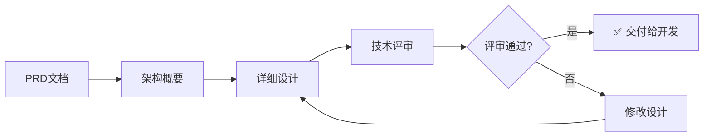

# 架构师使用指南

本指南帮助架构师使用AI编程规范体系进行技术架构设计。

## 角色定位

作为架构师，你是技术方案的决策者，负责：
- 设计系统技术架构
- 定义技术选型和规范
- 编写架构概要和详细设计文档
- 指导开发人员实现

## 你将使用的技能

| 技能 | 用途 | 使用场景 |
|------|------|----------|
| architecture-overview-generator | 生成架构概要 | 新系统设计、架构演进、技术重构 |
| detailed-design-generator | 生成详细设计 | 模块设计、接口设计、数据模型设计 |

## 快速开始

### 架构设计流程



### 步骤1：基于PRD生成架构概要

**前置条件**：已有PRD文档（由产品经理提供）

**触发方式**：

```
请根据 docs/PRD.md 生成技术架构概要文档
```

或提供PRD的核心内容：

```
请根据以下PRD核心内容生成架构概要：

【产品概述】
用户订单管理系统，支持订单创建、审批、查询统计

【核心功能】
1. 订单管理（CRUD）
2. 审批流程（多级审批）
3. 数据统计（报表）
4. 权限控制（角色权限）

【技术要求】
- 高并发：支持1000 QPS
- 高可用：99.9%
- 数据安全：敏感数据加密
```

### 步骤2：验证架构概要

架构概要生成后，检查以下内容：

**结构完整性检查**：
- [ ] 系统概述是否清晰
- [ ] 架构视图是否完整（逻辑视图、部署视图、数据视图、技术视图）
- [ ] 技术选型是否合理
- [ ] 接口设计是否定义
- [ ] 安全设计是否覆盖
- [ ] 性能设计是否满足

**技术合理性检查**：
- [ ] 技术选型是否符合团队技术栈
- [ ] 架构模式是否适合业务场景
- [ ] 是否考虑了扩展性和可维护性
- [ ] 是否识别了技术风险

### 步骤3：生成详细设计文档

架构概要完成后，为每个模块生成详细设计：

```
请根据架构概要，生成【订单模块】的详细设计文档
```

或指定详细内容：

```
请生成以下模块的详细设计：

【订单模块】
- 订单创建接口
- 订单查询接口
- 订单状态流转
- 订单数据表设计
```

### 步骤4：详细设计评审要点

详细设计生成后，检查以下内容：

**结构完整性检查**：
- [ ] 模块概述是否清晰
- [ ] 接口设计是否完整（请求/响应/错误码）
- [ ] 数据模型设计是否合理（表结构/索引）
- [ ] 业务逻辑设计是否详尽
- [ ] 异常处理是否覆盖
- [ ] 安全设计是否考虑
- [ ] 性能优化是否设计

**技术细节检查**：
- [ ] 接口命名是否规范
- [ ] 数据表字段类型是否合理
- [ ] 索引设计是否覆盖查询场景
- [ ] 是否考虑了并发控制
- [ ] 是否考虑了事务处理

## 架构概要文档结构说明

### 第一章：系统概述
- 系统背景和目标
- 业务范围和边界
- 核心业务流程
- 关键技术挑战

### 第二章：架构设计
- 整体架构设计（分层架构/微服务架构）
- 逻辑架构视图（模块划分）
- 部署架构视图（部署拓扑）
- 数据架构视图（数据流向）

### 第三章：技术选型
- 技术栈选型及理由
- 框架和中间件选型
- 第三方服务选型
- 技术选型对比表

### 第四章：接口设计
- 接口设计原则
- 接口规范（RESTful/GraphQL）
- 公共参数和响应格式
- 接口版本管理

### 第五章：安全设计
- 认证与授权
- 数据安全（加密/脱敏）
- 接口安全（限流/签名）
- 安全审计

### 第六章：性能设计
- 性能目标
- 性能优化策略
- 缓存设计
- 数据库优化

## 详细设计文档结构说明

### 第一章：模块概述
- 模块定位和职责
- 模块边界
- 与其他模块的关系
- 设计约束

### 第二章：接口设计
- 接口列表
- 接口详细定义（路径、方法、参数、响应）
- 错误码定义
- 接口调用示例

### 第三章：数据模型设计
- 数据表设计（字段、类型、约束）
- 索引设计
- 数据关系图
- 数据字典

### 第四章：业务逻辑设计
- 业务流程设计
- 状态流转设计
- 业务规则定义
- 异常处理设计

### 第五章：安全设计
- 权限控制
- 数据权限
- 操作审计
- 敏感数据处理

### 第六章：性能设计
- 性能要求
- 缓存策略
- 数据库优化
- 并发控制

### 第七章：测试设计
- 测试策略
- 测试用例设计
- 测试数据准备
- 性能测试场景

### 第八章：部署设计
- 部署架构
- 配置管理
- 监控告警
- 日志管理

## 技术选型参考

本项目规范体系推荐的技术栈：

| 类别 | 推荐技术 | 备选方案 |
|------|----------|----------|
| Web框架 | Gin | Echo, Fiber |
| AI框架 | Eino | - |
| ORM | GORM | sqlx, ent |
| 日志 | Zap | logrus, zerolog |
| 配置 | Viper | envconfig |
| 监控 | Prometheus | Datadog |
| 缓存 | Redis | - |
| 消息队列 | Kafka | RabbitMQ |
| 数据库 | PostgreSQL | MySQL |
| 搜索引擎 | Elasticsearch | Meilisearch |

## 最佳实践

### 1. 架构设计原则

遵循以下原则进行架构设计：

- **简单性**：在满足需求的前提下，选择最简单的方案
- **可扩展性**：预留扩展点，支持业务发展
- **可维护性**：代码清晰，文档完善，易于理解和修改
- **可靠性**：容错设计，故障隔离，快速恢复
- **安全性**：安全左移，纵深防御

### 2. 接口设计规范

遵循 `.trae/rules/gin-base.md` 中的规范：

```
统一响应格式：
{
  "code": 0,
  "message": "success",
  "data": { ... },
  "trace_id": "xxx"
}

分页响应格式：
{
  "code": 0,
  "message": "success",
  "data": {
    "list": [...],
    "total": 100,
    "page": 1,
    "page_size": 20
  }
}
```

### 3. 数据库设计规范

- 表名使用蛇形命名：`user_order`
- 主键使用 `id`（BIGINT）
- 必须有 `created_at` 和 `updated_at` 字段
- 软删除使用 `deleted_at` 字段
- 索引命名：`idx_表名_字段名`
- 唯一索引命名：`uniq_表名_字段名`

### 4. 性能设计考量

| 场景 | 策略 |
|------|------|
| 热点数据 | Redis缓存 |
| 大数据量查询 | 分页、索引优化、读写分离 |
| 高并发写入 | 消息队列削峰、批量写入 |
| 复杂计算 | 异步处理、结果缓存 |

### 5. 安全设计清单

- [ ] 认证机制（JWT/OAuth2）
- [ ] 权限控制（RBAC）
- [ ] 数据加密（传输加密/存储加密）
- [ ] 敏感数据脱敏
- [ ] SQL注入防护
- [ ] XSS防护
- [ ] CSRF防护
- [ ] 接口限流
- [ ] 操作审计日志

## 与其他角色的协作

| 协作对象 | 输入 | 输出 | 协作方式 |
|----------|------|------|----------|
| 产品经理 | PRD文档 | 架构概要、详细设计 | 基于PRD进行技术设计 |
| 开发人员 | 架构概要、详细设计 | 代码实现 | 指导开发人员实现 |
| 测试人员 | 详细设计 | 测试用例 | 提供测试设计依据 |
| 运维人员 | 部署架构 | 部署方案 | 协作完成部署设计 |

## 常见问题

### Q1: 架构概要和详细设计的区别？

| 文档 | 粒度 | 目标受众 |
|------|------|----------|
| 架构概要 | 系统级、模块级 | 全体技术人员、管理层 |
| 详细设计 | 接口级、表级 | 开发人员、测试人员 |

### Q2: 如何处理技术债务？

在架构概要中记录：
```
【技术债务】
1. 当前使用单机Redis，需升级为集群（优先级：高）
2. 日志收集使用文件方式，需接入ELK（优先级：中）
```

### Q3: 如何评估技术风险？

在架构概要中记录：
```
【技术风险】
| 风险项 | 影响程度 | 发生概率 | 应对措施 |
|--------|----------|----------|----------|
| 第三方API不稳定 | 高 | 中 | 增加重试机制和降级方案 |
| 数据库性能瓶颈 | 高 | 低 | 预留读写分离方案 |
```

### Q4: 如何管理架构演进？

使用版本管理：
```
架构概要版本：2.1.0
变更记录：
- 2.1.0: 新增消息队列组件
- 2.0.0: 微服务拆分
- 1.0.0: 单体架构
```

---

**提示**：架构设计是技术决策的基础，好的架构设计能让开发事半功倍，减少后期的重构成本。
