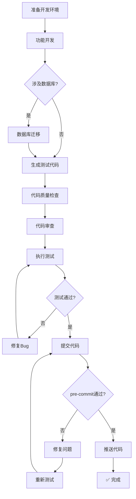
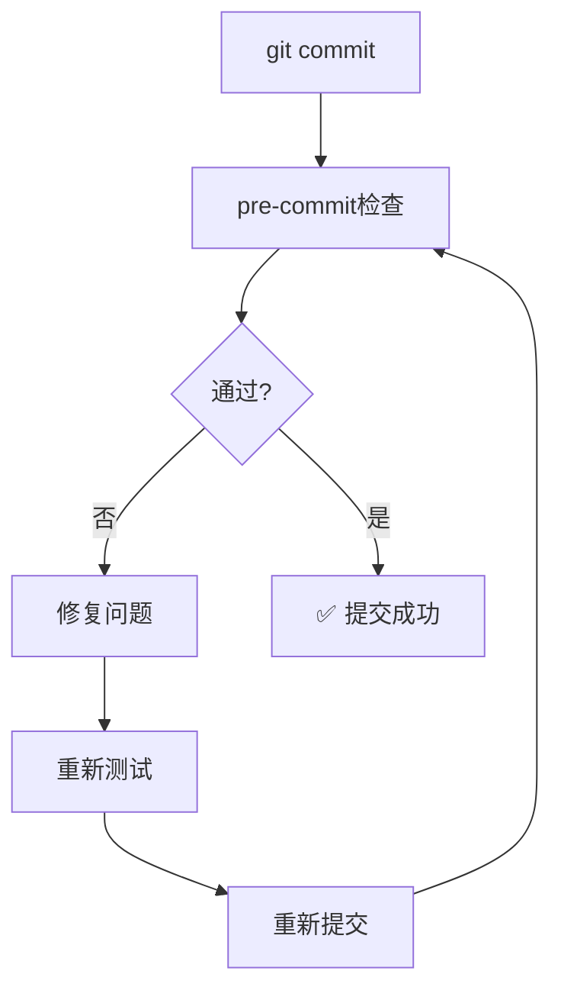

# 开发人员使用指南

本指南帮助开发人员使用AI编程规范体系进行高效开发。

## 角色定位

作为开发人员，你是功能的实现者，负责：
- 根据设计文档实现功能
- 编写单元测试和集成测试
- 进行代码审查和Bug修复
- 维护代码质量

## 你将使用的技能

| 技能 | 用途 | 使用场景 |
|------|------|----------|
| module-developer | 功能开发 | 新功能开发、功能修改、功能扩展 |
| database-migrator | 数据库迁移 | 表结构变更、新增表、修改字段 |
| unit-test-generator | 单元测试 | 生成单元测试代码 |
| integration-test-developer | 集成测试 | 搭建集成测试环境、编写集成测试 |
| bug-fixer | Bug修复 | 问题定位和修复 |
| code-reviewer | 代码审查 | 代码质量检查 |

## 快速开始

### 开发流程



**流程说明**：

| 步骤 | 内容 | 说明 |
|------|------|------|
| 准备开发环境 | 安装工具、配置环境 | 开发前必须完成 |
| 功能开发 | 实现业务功能 | 根据设计文档开发 |
| 数据库迁移 | 生成迁移脚本 | 如涉及数据库变更 |
| 生成测试代码 | 单元测试、集成测试 | 保证代码可测试 |
| 代码质量检查 | 格式化、lint、静态分析 | 确保代码质量 |
| 代码审查 | AI审查代码 | 检查潜在问题 |
| 执行测试 | 运行测试 | 确保功能正确 |
| 修复Bug | 修复测试失败 | 循环直到通过 |
| 提交代码 | git commit | 触发pre-commit检查 |
| 修复问题 | 修复pre-commit失败 | 循环直到通过 |
| 完成 | 模块开发完成 | 提交成功才算完成 |

### 步骤1：准备开发环境

```bash
# 检查前置条件
make check-prerequisites

# 安装开发工具
make setup

# 验证安装
go version
golangci-lint version
```

### 步骤2：触发功能开发

**前置条件**：已有详细设计文档（由架构师提供）

**触发方式**：

```
请根据 docs/detailed-design.md 实现用户管理模块
```

或描述具体功能：

```
请实现以下功能：

【用户管理模块】
1. 用户列表接口（GET /api/v1/users）
2. 用户详情接口（GET /api/v1/users/:id）
3. 创建用户接口（POST /api/v1/users）
4. 更新用户接口（PUT /api/v1/users/:id）
5. 删除用户接口（DELETE /api/v1/users/:id）

【参考设计文档】
接口定义见详细设计文档第三章
数据模型见详细设计文档第四章
```

### 步骤3：数据库迁移

如果功能涉及数据库变更，AI会提示使用 `database-migrator` 技能：

```
检测到需要新增用户表，请先使用 database-migrator 生成迁移脚本
```

**手动触发数据库迁移**：

```
请生成以下数据库变更的迁移脚本：
- 新增 user 表（id, username, email, phone, department_id, created_at, updated_at）
- 新增 idx_user_username 索引
```

### 步骤4：生成测试代码

功能实现后，生成相应的测试代码：

**生成单元测试**：

```
请为 internal/service/user_service.go 生成单元测试
```

或指定测试范围：

```
请为以下方法生成单元测试：
- UserService.Create
- UserService.Update
- UserService.Delete

【测试要求】
- 覆盖正常流程
- 覆盖边界条件
- 覆盖异常场景
```

**生成集成测试**（如需要）：

```
请为用户管理模块生成集成测试

【测试范围】
- API端到端测试
- 数据库集成测试
- Redis缓存集成测试
```

### 步骤5：代码质量检查

**提交代码前必须运行代码质量检查**，确保代码符合规范：

```bash
# 运行所有检查（格式化 + vet + lint + 测试）
make check

# 或分步执行
make fmt        # 代码格式化
make vet        # 静态分析
make lint       # golangci-lint检查
make test       # 运行测试
```

**检查内容说明**：

| 检查项 | 命令 | 说明 |
|--------|------|------|
| 格式化 | make fmt | 检查代码格式是否符合gofmt规范 |
| 静态分析 | make vet | 检查常见错误（未使用变量、错误的结构等） |
| Lint检查 | make lint | 运行golangci-lint，检查代码质量、安全、性能等 |
| 单元测试 | make test | 运行所有单元测试 |

**处理检查失败**：

```bash
# 如果lint检查失败，可以尝试自动修复
golangci-lint run --fix

# 查看具体错误信息
golangci-lint run ./internal/service/...

# 如果是格式问题，运行格式化
make fmt
```

**配置文件**：代码检查规则配置在 `.golangci.yml`，详见"代码质量命令"章节。

### 步骤6：代码审查

代码质量检查通过后，进行代码审查：

```
请审查以下代码：
[粘贴代码]

【审查重点】
- 是否符合项目规范
- 是否有性能问题
- 是否有安全隐患
```

### 步骤7：执行测试修复Bug

代码审查通过后，运行测试并修复发现的问题：

**运行测试**：

```bash
# 运行所有测试
make test

# 运行指定包的测试
go test -v ./internal/service/...

# 运行指定测试
go test -v -run TestUserService ./internal/service/...

# 生成覆盖率报告
make test-coverage
```

**测试通过后**：

```bash
# 确认所有检查通过
make check

# 准备提交代码
git add .
git commit -m "feat: 实现用户管理模块"
```

**如果测试失败**，使用 `bug-fixer` 修复：

```
请修复以下Bug：

【Bug描述】
用户创建时，邮箱验证规则不正确

【重现步骤】
1. 调用 POST /api/v1/users 接口
2. 传入 email: "test@"
3. 请求成功返回

【预期结果】
应该返回400错误，提示邮箱格式不正确

【实际结果】
请求成功，创建了用户
```

**Bug修复流程**：

```
问题分析 → 定位代码 → 设计修复方案 → 实现修复 → 验证修复
```

### 步骤8：提交代码

测试通过后，提交代码：

```bash
# 提交代码
git add .
git commit -m "feat: 实现用户管理模块"
```

**注意**：提交时会触发 pre-commit 钩子，自动运行代码检查。

**提交失败的处理**：

pre-commit 检查失败时，需要修复问题后重新提交：

```bash
# 查看失败原因（pre-commit会输出具体错误）
# 常见问题：

# 1. 格式问题
make fmt

# 2. Lint问题
golangci-lint run --fix

# 3. 测试失败
make test
# 修复测试失败的代码

# 修复后重新提交
git add .
git commit -m "feat: 实现用户管理模块"
```

**提交循环流程**：



### 步骤9：完成

提交成功后，模块开发才算完成：

```bash
# 提交成功后推送
git push
```

**模块完成确认清单**：

- [ ] 功能开发完成
- [ ] 数据库迁移已生成（如需要）
- [ ] 测试代码已生成
- [ ] 代码质量检查通过（`make check`）
- [ ] 代码审查通过
- [ ] 测试全部通过
- [ ] pre-commit检查通过
- [ ] git commit成功
- [ ] git push成功

## 开发过程中的Bug修复

除了步骤7中的测试失败修复，开发过程中还可能遇到以下Bug修复场景：

**测试人员报告Bug**：

```
请修复以下Bug：

【Bug描述】
并发创建订单时，库存扣减出现超卖问题

【重现步骤】
1. 启动100个并发请求创建同一商品的订单
2. 商品库存只有50件
3. 检查订单数量和库存

【预期结果】
最多创建50个订单，库存为0

【实际结果】
创建了78个订单，库存变为-28

【相关代码】
[粘贴相关代码片段]

【错误日志】
[粘贴相关日志]
```

**修复完成后**：

```
请为刚才的Bug修复编写单元测试，确保问题不再复现
```

## 遵循的规范文件

开发过程中应遵循以下规范：

### go-base.md

Go语言基础规范：
- 命名规范（包名、变量、常量、接口）
- 错误处理规范
- Context使用规范
- 并发规范
- 日志规范（使用zap）
- 测试规范
- 代码风格规范

### gin-base.md

Gin框架规范：
- 项目结构规范
- 统一响应格式
- Handler模式
- 请求验证
- 中间件规范
- 路由组织
- 配置管理
- 日志初始化

### gin-project.md 或 gin-eino-project.md

根据项目类型选择：
- **gin-project.md**：纯Web API项目
- **gin-eino-project.md**：AI Agent项目

## 项目结构规范

```
.
├── cmd/                    # 应用入口
│   └── server/
│       └── main.go
├── internal/               # 内部代码
│   ├── handler/            # HTTP处理器
│   ├── service/            # 业务逻辑
│   ├── repository/         # 数据访问
│   ├── model/              # 数据模型
│   └── middleware/         # 中间件
├── pkg/                    # 可复用代码
│   ├── config/
│   ├── logger/
│   └── utils/
├── configs/                # 配置文件
├── migrations/             # 数据库迁移
├── docs/                   # 文档
├── scripts/                # 脚本
└── tests/                  # 测试
```

## 常用命令

### 开发命令

```bash
# 运行应用
make run

# 构建应用
make build

# 清理构建产物
make clean
```

### 测试命令

```bash
# 运行测试
make test

# 生成覆盖率报告
make test-coverage

# 运行特定测试
go test -v ./internal/service/... -run TestUserService
```

### 代码质量命令

```bash
# 代码格式化
make fmt

# 代码检查（使用 golangci-lint）
make lint

# 静态分析
make vet

# 安全扫描
make security

# 运行所有检查
make check
```

**代码检查配置（.golangci.yml）**：

项目使用 golangci-lint 进行代码质量检查，配置文件为 `.golangci.yml`。

**初始化项目时需要修改**：

```yaml
# .golangci.yml 第74行
# 将 local-prefixes 替换为您的项目模块路径
local-prefixes: github.com/yourorg/yourproject
```

**项目模块路径获取**：

```bash
# 查看 go.mod 第一行
head -1 go.mod
# 输出：module github.com/yourorg/yourproject
```

**常用 lint 操作**：

```bash
# 运行检查
make lint

# 自动修复可修复的问题
golangci-lint run --fix

# 检查指定目录
golangci-lint run ./internal/service/...

# 查看启用的检查器
golangci-lint linters
```

### 数据库迁移命令

```bash
# 创建迁移文件
migrate create -ext sql -dir migrations -seq create_user_table

# 执行迁移
migrate -path migrations -database "postgres://..." up

# 回滚迁移
migrate -path migrations -database "postgres://..." down 1
```

## 最佳实践

### 1. Handler层规范

```go
// internal/handler/user_handler.go
package handler

import (
    "github.com/gin-gonic/gin"
    "go.uber.org/zap"
)

type UserHandler struct {
    userService service.UserService
    logger      *zap.Logger
}

func NewUserHandler(userService service.UserService, logger *zap.Logger) *UserHandler {
    return &UserHandler{
        userService: userService,
        logger:      logger,
    }
}

// List 获取用户列表
func (h *UserHandler) List(c *gin.Context) {
    var req PageRequest
    if err := c.ShouldBindQuery(&req); err != nil {
        BadRequest(c, err.Error())
        return
    }

    users, total, err := h.userService.List(c.Request.Context(), &req)
    if err != nil {
        InternalError(c, err.Error())
        return
    }

    SuccessWithPage(c, users, total, req.Page, req.PageSize)
}
```

### 2. Service层规范

```go
// internal/service/user_service.go
package service

import (
    "context"
    "crypto/sha256"
    "go.uber.org/zap"

    "github.com/yourorg/yourproject/internal/model"
    "github.com/yourorg/yourproject/internal/repository"
)

type UserService interface {
    Create(ctx context.Context, req *CreateUserRequest) (*model.User, error)
    GetByID(ctx context.Context, id uint) (*model.User, error)
    Update(ctx context.Context, id uint, req *UpdateUserRequest) error
    Delete(ctx context.Context, id uint) error
    List(ctx context.Context, req *PageRequest) ([]*model.User, int64, error)
}

type userService struct {
    repo   repository.UserRepository
    logger *zap.Logger
}

func NewUserService(repo repository.UserRepository, logger *zap.Logger) UserService {
    return &userService{repo: repo, logger: logger}
}

func (s *userService) Create(ctx context.Context, req *CreateUserRequest) (*model.User, error) {
    user := &model.User{
        Username: req.Username,
        Email:    req.Email,
    }

    if err := s.repo.Create(ctx, user); err != nil {
        s.logger.Error("create user failed", zap.Error(err))
        return nil, err
    }

    s.logger.Info("user created", zap.Uint("user_id", user.ID))
    return user, nil
}
```

### 3. Repository层规范

```go
// internal/repository/user_repository.go
package repository

import (
    "context"
    "gorm.io/gorm"

    "github.com/yourorg/yourproject/internal/model"
)

type UserRepository interface {
    Create(ctx context.Context, user *model.User) error
    GetByID(ctx context.Context, id uint) (*model.User, error)
    Update(ctx context.Context, user *model.User) error
    Delete(ctx context.Context, id uint) error
    List(ctx context.Context, req *PageRequest) ([]*model.User, int64, error)
}

type userRepository struct {
    db *gorm.DB
}

func NewUserRepository(db *gorm.DB) UserRepository {
    return &userRepository{db: db}
}

func (r *userRepository) Create(ctx context.Context, user *model.User) error {
    return r.db.WithContext(ctx).Create(user).Error
}
```

### 4. 日志规范

使用zap进行日志记录：

```go
// 日志级别使用
logger.Debug("debug message", zap.String("key", value))  // 调试信息
logger.Info("info message", zap.String("key", value))    // 常规信息
logger.Warn("warn message", zap.String("key", value))    // 警告
logger.Error("error message", zap.Error(err))            // 错误

// 结构化日志
logger.Info("user login",
    zap.Uint("user_id", userID),
    zap.String("ip", ip),
    zap.String("action", "login"),
)

// 关键操作埋点
logger.Info("api request",
    zap.String("method", c.Request.Method),
    zap.String("path", c.Request.URL.Path),
    zap.Int("status", c.Writer.Status()),
    zap.Duration("latency", latency),
)
```

### 5. 错误处理规范

```go
// 定义业务错误
var (
    ErrUserNotFound   = errors.New("user not found")
    ErrUserExists     = errors.New("user already exists")
    ErrInvalidRequest = errors.New("invalid request")
)

// 错误包装
if err != nil {
    return fmt.Errorf("get user failed: %w", err)
}

// 错误处理
user, err := s.userService.GetByID(ctx, id)
if err != nil {
    if errors.Is(err, ErrUserNotFound) {
        return NotFound(c, "user not found")
    }
    return InternalError(c, err.Error())
}
```

### 6. 测试规范

```go
// 单元测试
func TestUserService_Create(t *testing.T) {
    tests := []struct {
        name    string
        req     *CreateUserRequest
        wantErr bool
    }{
        {
            name: "success",
            req: &CreateUserRequest{
                Username: "test",
                Email:    "test@example.com",
            },
            wantErr: false,
        },
        {
            name: "empty username",
            req: &CreateUserRequest{
                Username: "",
                Email:    "test@example.com",
            },
            wantErr: true,
        },
    }

    for _, tt := range tests {
        t.Run(tt.name, func(t *testing.T) {
            // test implementation
        })
    }
}
```

## 与其他角色的协作

| 协作对象 | 输入 | 输出 | 协作方式 |
|----------|------|------|----------|
| 产品经理 | PRD文档 | 功能实现 | 理解需求并实现 |
| 架构师 | 详细设计 | 代码实现 | 按设计实现功能 |
| 测试人员 | 代码 | Bug报告 | 修复测试发现的问题 |
| 运维人员 | 部署配置 | 配置项说明 | 配合完成部署 |

## 常见问题

### Q1: 如何处理复杂的业务逻辑？

将复杂逻辑拆分为多个小方法，每个方法只做一件事：

```go
func (s *orderService) CreateOrder(ctx context.Context, req *CreateOrderRequest) error {
    // 1. 校验库存
    if err := s.checkInventory(ctx, req.Items); err != nil {
        return err
    }

    // 2. 计算价格
    total, err := s.calculateTotal(ctx, req.Items)
    if err != nil {
        return err
    }

    // 3. 创建订单
    order, err := s.createOrderRecord(ctx, req, total)
    if err != nil {
        return err
    }

    // 4. 扣减库存
    if err := s.deductInventory(ctx, req.Items); err != nil {
        return err
    }

    return nil
}
```

### Q2: 如何保证代码质量？

1. **遵循规范**：严格按照 `.trae/rules/` 下的规范编写代码
2. **单元测试**：每个函数都有对应的单元测试
3. **代码审查**：提交代码前使用 code-reviewer 进行审查
4. **静态检查**：通过 `make check` 运行所有检查

### Q3: 如何处理并发问题？

```go
// 使用 sync.Mutex 保护共享资源
type SafeCounter struct {
    mu    sync.Mutex
    count int
}

func (c *SafeCounter) Increment() {
    c.mu.Lock()
    defer c.mu.Unlock()
    c.count++
}

// 使用 Context 控制超时
ctx, cancel := context.WithTimeout(context.Background(), 5*time.Second)
defer cancel()

result, err := s.slowOperation(ctx)
```

### Q4: 如何进行数据库事务处理？

```go
func (s *orderService) CreateOrderWithTx(ctx context.Context, req *CreateOrderRequest) error {
    return s.db.Transaction(func(tx *gorm.DB) error {
        // 在事务中执行多个操作
        if err := tx.Create(&order).Error; err != nil {
            return err // 自动回滚
        }

        if err := tx.Model(&inventory).Update("stock", gorm.Expr("stock - ?", quantity)).Error; err != nil {
            return err // 自动回滚
        }

        return nil // 自动提交
    })
}
```

---

**提示**：遵循规范、编写测试、及时审查，是高质量代码的三大保障。
