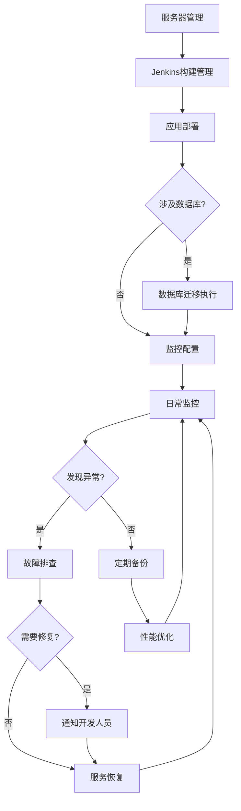

# 运维人员使用指南

本指南帮助运维人员使用AI编程规范体系进行高效运维。

## 角色定位

作为运维人员，你是系统的守护者，负责：
- 部署和配置管理
- 系统监控和告警
- 故障排查和恢复
- 性能优化和容量规划
- 安全运维和备份恢复

## 你将使用的技能

运维人员的主要工作不需要直接使用AI编程技能。AI编程技能主要用于代码生成，而运维人员的职责是：

- **服务器运维**：服务器配置、部署、监控
- **Jenkins管理**：CI/CD流水线配置、构建管理
- **数据库运维**：执行迁移、备份恢复、性能监控
- **故障排查**：日志分析、问题定位、服务恢复

**技能说明**：
- `database-migrator`：由开发人员使用，生成迁移脚本
- `code-reviewer`：由开发人员使用，审查代码
- 运维人员负责**执行**开发人员生成的迁移脚本，而不是编写迁移脚本

## 快速开始

### 运维工作流程



### 运维日常工作

| 工作类型 | 具体内容 |
|----------|----------|
| 服务器管理 | 服务器配置、资源监控、安全加固 |
| Jenkins管理 | 构建触发、构建监控、构建产物管理 |
| 应用部署 | 部署执行、服务启停、配置更新 |
| 数据库运维 | 迁移执行、备份恢复、性能监控 |
| 监控告警 | 指标监控、告警配置、日志分析 |
| 故障处理 | 问题定位、服务恢复、根因分析 |

### 步骤1：环境准备

**检查前置条件**：

```bash
# 检查系统要求
make check-prerequisites

# 查看依赖
cat go.mod

# 检查配置
cat configs/config.yaml
```

**环境变量配置**：

```bash
# .env 文件
APP_ENV=production
APP_PORT=8080
DB_HOST=localhost
DB_PORT=5432
DB_NAME=myapp
DB_USER=myapp
DB_PASSWORD=${DB_PASSWORD}
REDIS_HOST=localhost
REDIS_PORT=6379
LOG_LEVEL=info
```

### 步骤2：应用部署

项目使用Jenkins CI/CD流水线进行自动化部署。

**Jenkins流水线阶段**：


**触发构建**：

1. **自动触发**：代码推送到Git仓库自动触发构建
2. **手动触发**：在Jenkins控制台点击"Build Now"

**查看构建状态**：

```bash
# 通过Jenkins CLI查看
jenkins-cli build-status myapp

# 或访问Jenkins Web界面
# http://jenkins.example.com/job/myapp/
```

**Jenkinsfile配置说明**：

| 阶段 | 说明 | 检查内容 |
|------|------|----------|
| Checkout | 代码检出 | Git仓库代码 |
| Setup | 环境准备 | Go版本、依赖下载 |
| Format Check | 格式检查 | gofmt |
| Imports Check | 导入检查 | goimports |
| Lint | 代码检查 | golangci-lint |
| Vet | 静态分析 | go vet |
| Security Scan | 安全扫描 | gosec |
| Test | 单元测试 | go test |
| Build | 构建 | 生成二进制文件 |
| Archive | 归档 | 保存构建产物 |

**构建产物**：

```
bin/server     # Linux AMD64
bin/server.exe # Windows AMD64
```

**手动构建命令**（本地开发或紧急部署）：

```bash
# 构建二进制文件
make build

# 构建Docker镜像
docker build -t myapp:v1.0.0 .

# 推送镜像
docker push registry.example.com/myapp:v1.0.0
```

### 步骤3：数据库迁移执行

开发人员编写迁移脚本后，运维人员负责在生产环境执行迁移。

**迁移执行流程**：

```
1. 备份数据库（必须！）
2. 查看待执行迁移
3. 在低峰期执行迁移
4. 验证迁移结果
5. 监控应用状态
```

**备份操作**：

```bash
# PostgreSQL备份
pg_dump -h ${DB_HOST} -U ${DB_USER} -d ${DB_NAME} -F c -f /backup/pre_migration_$(date +%Y%m%d_%H%M%S).dump

# MySQL备份
mysqldump -h ${DB_HOST} -u ${DB_USER} -p ${DB_NAME} > /backup/pre_migration_$(date +%Y%m%d_%H%M%S).sql
```

**执行迁移**：

```bash
# 查看当前版本
migrate -path migrations -database "postgres://..." version

# 查看待执行迁移
migrate -path migrations -database "postgres://..." up -dry-run

# 执行迁移
migrate -path migrations -database "postgres://..." up

# 验证迁移
migrate -path migrations -database "postgres://..." version
```

**回滚操作**（出问题时）：

```bash
# 回滚最近一次迁移
migrate -path migrations -database "postgres://..." down 1

# 回滚到指定版本
migrate -path migrations -database "postgres://..." goto 20240101000000
```

**迁移注意事项**：

| 事项 | 说明 |
|------|------|
| 备份 | 执行迁移前必须备份 |
| 时间 | 选择业务低峰期执行 |
| 监控 | 执行后监控应用日志和性能 |
| 回滚 | 准备好回滚方案 |
| 通知 | 提前通知相关团队 |

### 步骤4：监控配置

**Prometheus配置**：

```yaml
# prometheus.yml
global:
  scrape_interval: 15s

scrape_configs:
  - job_name: 'myapp'
    static_configs:
      - targets: ['localhost:8080']
```

**Grafana仪表盘**：

导入预置仪表盘：
- Go应用监控
- PostgreSQL监控
- Redis监控
- Gin框架监控

## 部署配置

### Docker部署

**Dockerfile示例**：

```dockerfile
# Build stage
FROM golang:1.21-alpine AS builder

WORKDIR /app

COPY go.mod go.sum ./
RUN go mod download

COPY . .
RUN CGO_ENABLED=0 GOOS=linux go build -ldflags="-w -s" -o /server ./cmd/server

# Runtime stage
FROM alpine:3.18

RUN apk --no-cache add ca-certificates tzdata

WORKDIR /app

COPY --from=builder /server .
COPY configs configs

EXPOSE 8080

HEALTHCHECK --interval=30s --timeout=3s \
  CMD wget --no-verbose --tries=1 --spider http://localhost:8080/health || exit 1

ENTRYPOINT ["/app/server"]
```

**docker-compose.yml示例**：

```yaml
version: '3.8'

services:
  app:
    build: .
    ports:
      - "8080:8080"
    environment:
      - APP_ENV=production
      - DB_HOST=db
      - DB_PORT=5432
      - DB_NAME=myapp
      - DB_USER=myapp
      - DB_PASSWORD=${DB_PASSWORD}
      - REDIS_HOST=redis
      - REDIS_PORT=6379
    depends_on:
      - db
      - redis
    healthcheck:
      test: ["CMD", "wget", "--spider", "-q", "http://localhost:8080/health"]
      interval: 30s
      timeout: 10s
      retries: 3
    restart: unless-stopped
    networks:
      - app-network

  db:
    image: postgres:15-alpine
    environment:
      - POSTGRES_DB=myapp
      - POSTGRES_USER=myapp
      - POSTGRES_PASSWORD=${DB_PASSWORD}
    volumes:
      - postgres-data:/var/lib/postgresql/data
    healthcheck:
      test: ["CMD-SHELL", "pg_isready -U myapp"]
      interval: 10s
      timeout: 5s
      retries: 5
    networks:
      - app-network

  redis:
    image: redis:7-alpine
    volumes:
      - redis-data:/data
    healthcheck:
      test: ["CMD", "redis-cli", "ping"]
      interval: 10s
      timeout: 5s
      retries: 5
    networks:
      - app-network

  prometheus:
    image: prom/prometheus:latest
    ports:
      - "9090:9090"
    volumes:
      - ./prometheus.yml:/etc/prometheus/prometheus.yml
    networks:
      - app-network

  grafana:
    image: grafana/grafana:latest
    ports:
      - "3000:3000"
    environment:
      - GF_SECURITY_ADMIN_PASSWORD=${GRAFANA_PASSWORD}
    volumes:
      - grafana-data:/var/lib/grafana
    networks:
      - app-network

volumes:
  postgres-data:
  redis-data:
  grafana-data:

networks:
  app-network:
    driver: bridge
```

### Kubernetes部署

**Deployment示例**：

```yaml
apiVersion: apps/v1
kind: Deployment
metadata:
  name: myapp
  labels:
    app: myapp
spec:
  replicas: 3
  selector:
    matchLabels:
      app: myapp
  template:
    metadata:
      labels:
        app: myapp
    spec:
      containers:
      - name: myapp
        image: registry.example.com/myapp:v1.0.0
        ports:
        - containerPort: 8080
        env:
        - name: APP_ENV
          value: production
        - name: DB_HOST
          valueFrom:
            secretKeyRef:
              name: myapp-secret
              key: db-host
        - name: DB_PASSWORD
          valueFrom:
            secretKeyRef:
              name: myapp-secret
              key: db-password
        resources:
          requests:
            cpu: 100m
            memory: 128Mi
          limits:
            cpu: 500m
            memory: 512Mi
        livenessProbe:
          httpGet:
            path: /health
            port: 8080
          initialDelaySeconds: 10
          periodSeconds: 10
        readinessProbe:
          httpGet:
            path: /health
            port: 8080
          initialDelaySeconds: 5
          periodSeconds: 5
---
apiVersion: v1
kind: Service
metadata:
  name: myapp
spec:
  selector:
    app: myapp
  ports:
  - port: 80
    targetPort: 8080
  type: ClusterIP
---
apiVersion: networking.k8s.io/v1
kind: Ingress
metadata:
  name: myapp
  annotations:
    nginx.ingress.kubernetes.io/ssl-redirect: "true"
spec:
  tls:
  - hosts:
    - api.example.com
    secretName: myapp-tls
  rules:
  - host: api.example.com
    http:
      paths:
      - path: /
        pathType: Prefix
        backend:
          service:
            name: myapp
            port:
              number: 80
```

## 监控和日志

### Prometheus指标

**应用暴露的指标**：

| 指标名 | 类型 | 说明 |
|--------|------|------|
| http_requests_total | Counter | HTTP请求总数 |
| http_request_duration_seconds | Histogram | 请求延迟分布 |
| http_requests_in_flight | Gauge | 正在处理的请求数 |
| db_connections_active | Gauge | 活跃数据库连接数 |
| cache_hits_total | Counter | 缓存命中次数 |
| cache_misses_total | Counter | 缓存未命中次数 |

**PromQL查询示例**：

```promql
# 请求速率
rate(http_requests_total[5m])

# P99延迟
histogram_quantile(0.99, rate(http_request_duration_seconds_bucket[5m]))

# 错误率
sum(rate(http_requests_total{status=~"5.."}[5m])) / sum(rate(http_requests_total[5m]))

# 内存使用
go_memstats_alloc_bytes

# Goroutine数量
go_goroutines
```

### Grafana仪表盘

**推荐仪表盘**：

1. **应用概览**
   - 请求QPS
   - 响应时间（P50/P95/P99）
   - 错误率
   - 活跃连接数

2. **系统资源**
   - CPU使用率
   - 内存使用率
   - 磁盘IO
   - 网络IO

3. **数据库**
   - 连接池状态
   - 查询延迟
   - 慢查询数
   - 死锁数

4. **Redis**
   - 内存使用
   - 命令执行速率
   - 缓存命中率
   - 连接数

### 日志管理

**日志格式（zap）**：

```json
{
  "level": "info",
  "ts": "2024-01-15T10:30:00.000Z",
  "caller": "handler/user_handler.go:45",
  "msg": "api request",
  "method": "GET",
  "path": "/api/v1/users",
  "status": 200,
  "latency": "15.234ms",
  "request_id": "abc123"
}
```

**日志收集配置（ELK）**：

```yaml
# filebeat.yml
filebeat.inputs:
- type: log
  enabled: true
  paths:
    - /var/log/myapp/*.log
  json.keys_under_root: true
  json.add_error_key: true

output.elasticsearch:
  hosts: ["elasticsearch:9200"]
  index: "myapp-%{+yyyy.MM.dd}"
```

### 告警规则

**Prometheus告警规则**：

```yaml
groups:
- name: myapp
  rules:
  - alert: HighErrorRate
    expr: sum(rate(http_requests_total{status=~"5.."}[5m])) / sum(rate(http_requests_total[5m])) > 0.05
    for: 5m
    labels:
      severity: critical
    annotations:
      summary: "High error rate detected"
      description: "Error rate is {{ $value | humanPercentage }}"

  - alert: HighLatency
    expr: histogram_quantile(0.99, rate(http_request_duration_seconds_bucket[5m])) > 1
    for: 5m
    labels:
      severity: warning
    annotations:
      summary: "High latency detected"
      description: "P99 latency is {{ $value | humanizeDuration }}"

  - alert: InstanceDown
    expr: up == 0
    for: 1m
    labels:
      severity: critical
    annotations:
      summary: "Instance {{ $labels.instance }} down"
      description: "{{ $labels.instance }} has been down for more than 1 minute."
```

## 故障排查

### 常见故障处理

**故障排查思路**：

1. **收集信息**
   - 查看应用日志
   - 查看监控指标
   - 查看Jenkins构建状态

```bash
# 查看应用日志
docker logs -f myapp --tail=100

# 或查看文件日志
tail -f /var/log/myapp/app.log

# 查看Jenkins构建状态
jenkins-cli list-builds myapp
```

2. **定位问题**
   - 分析日志错误
   - 分析监控指标
   - 分析调用链

3. **解决问题**
   - 重启服务
   - 回滚版本
   - 联系开发人员修复

**示例：分析生产问题**

```
请帮我分析以下生产环境问题的可能原因：

【问题描述】
API响应时间突然从50ms增加到500ms

【环境信息】
- 应用版本：v1.2.0
- 数据库：PostgreSQL 15

【日志信息】
[粘贴相关日志]

【监控数据】
- CPU: 85%
- Memory: 70%
- DB连接数: 95/100
```

**注意**：运维人员负责定位问题，如果是代码Bug，需要通知开发人员使用 `bug-fixer` 技能进行修复。

### 日志分析

```bash
# 查看错误日志
grep '"level":"error"' /var/log/myapp/app.log

# 统计HTTP状态码
grep -o '"status":[0-9]*' /var/log/myapp/app.log | sort | uniq -c

# 查看慢请求
grep '"latency"' /var/log/myapp/app.log | grep -E '[0-9]{3,}ms'
```

## 备份和恢复

### 数据库备份

```bash
# 全量备份
pg_dump -h localhost -U myapp -d myapp -F c -f /backup/myapp_$(date +%Y%m%d).dump

# 备份脚本
#!/bin/bash
DATE=$(date +%Y%m%d_%H%M%S)
BACKUP_DIR="/backup"
BACKUP_FILE="${BACKUP_DIR}/myapp_${DATE}.dump"

pg_dump -h ${DB_HOST} -U ${DB_USER} -d ${DB_NAME} -F c -f ${BACKUP_FILE}

# 保留最近7天的备份
find ${BACKUP_DIR} -name "*.dump" -mtime +7 -delete

# 上传到对象存储
aws s3 cp ${BACKUP_FILE} s3://my-backup/postgres/
```

### 数据库恢复

```bash
# 恢复数据库
pg_restore -h localhost -U myapp -d myapp_restore -F c /backup/myapp_20240115.dump

# 恢复到新数据库
createdb -h localhost -U myapp myapp_restore
pg_restore -h localhost -U myapp -d myapp_restore /backup/myapp_20240115.dump
```

### 应用配置备份

```bash
# 备份配置
tar -czf config_$(date +%Y%m%d).tar.gz configs/ k8s/ helm/

# 备份Kubernetes资源
kubectl get all,configmaps,secrets -n myapp -o yaml > k8s_backup.yaml
```

## 常用命令

### 应用管理

```bash
# 构建应用
make build

# 运行应用
make run

# 查看版本
./server --version

# 健康检查
curl http://localhost:8080/health
```

### Docker命令

```bash
# 构建镜像
docker build -t myapp:v1.0.0 .

# 运行容器
docker run -d -p 8080:8080 --name myapp myapp:v1.0.0

# 查看日志
docker logs -f myapp

# 进入容器
docker exec -it myapp sh

# 清理资源
docker system prune -f
```

### Kubernetes命令

```bash
# 查看Pod
kubectl get pods -l app=myapp

# 查看日志
kubectl logs -f deployment/myapp

# 查看资源
kubectl get all -n myapp

# 查看配置
kubectl get configmap -n myapp

# 查看密钥
kubectl get secret -n myapp

# 执行命令
kubectl exec -it deployment/myapp -- sh

# 端口转发
kubectl port-forward deployment/myapp 8080:8080
```

### Jenkins命令

```bash
# 查看构建历史
jenkins-cli list-builds myapp

# 触发构建
jenkins-cli build myapp

# 查看构建日志
jenkins-cli console myapp <build-number>

# 停止构建
jenkins-cli stop-build myapp <build-number>

# 查看队列
jenkins-cli queue

# 查看节点状态
jenkins-cli nodes
```

**Jenkins Web界面操作**：

| 操作 | 路径 |
|------|------|
| 查看构建历史 | /job/myapp/ |
| 查看构建详情 | /job/myapp/<build-number>/ |
| 查看控制台输出 | /job/myapp/<build-number>/console |
| 查看测试结果 | /job/myapp/<build-number>/testReport/ |
| 查看构建趋势 | /job/myapp/trend/ |

### 数据库命令

```bash
# 连接数据库
psql -h localhost -U myapp -d myapp

# 查看连接数
SELECT count(*) FROM pg_stat_activity;

# 查看慢查询
SELECT query, calls, total_time, mean_time 
FROM pg_stat_statements 
ORDER BY mean_time DESC 
LIMIT 10;

# 终止连接
SELECT pg_terminate_backend(pid) FROM pg_stat_activity WHERE datname = 'myapp' AND pid <> pg_backend_pid();
```

## 安全运维

### 安全检查清单

运维人员日常安全检查：

- [ ] 敏感信息不在配置文件中明文存储
- [ ] 使用HTTPS加密传输
- [ ] 数据库连接使用加密
- [ ] 定期更新系统补丁
- [ ] 启用访问日志
- [ ] 配置防火墙规则
- [ ] 定期备份数据
- [ ] 监控异常登录

### 安全配置检查

```bash
# 检查开放端口
netstat -tlnp

# 检查防火墙状态
ufw status

# 检查SSH配置
cat /etc/ssh/sshd_config | grep -E "Port|PermitRootLogin|PasswordAuthentication"

# 检查系统用户
cat /etc/passwd | grep -v nologin

# 检查定时任务
crontab -l
```

### 密钥管理

```bash
# 使用Kubernetes Secret
kubectl create secret generic myapp-secret \
  --from-literal=db-password=xxx \
  --from-literal=redis-password=xxx \
  --from-literal=jwt-secret=xxx

# 使用Vault
vault kv put secret/myapp db-password=xxx redis-password=xxx
```

## 性能优化

运维人员可以从以下方面协助性能优化，但具体的代码层面优化需要开发人员配合。

### 系统资源监控

```bash
# 查看CPU使用
top -p <pid>

# 查看内存使用
free -h

# 查看磁盘IO
iostat -x 1

# 查看网络IO
sar -n DEV 1
```

### 应用性能监控

通过监控平台观察应用性能指标：

| 监控项 | 正常范围 | 异常处理 |
|--------|----------|----------|
| CPU使用率 | < 70% | 扩容或优化代码 |
| 内存使用率 | < 80% | 检查是否有泄漏 |
| 请求延迟P99 | < 500ms | 分析慢接口 |
| 错误率 | < 1% | 分析错误日志 |

**注意**：代码层面的性能优化（如pprof分析）由开发人员负责。运维人员负责资源层面的监控和扩容建议。

### 数据库优化

```sql
-- 分析查询计划
EXPLAIN ANALYZE SELECT * FROM users WHERE email = 'test@example.com';

-- 创建索引
CREATE INDEX CONCURRENTLY idx_users_email ON users(email);

-- 更新统计信息
ANALYZE users;

-- 清理空间
VACUUM ANALYZE users;
```

### 缓存优化

```bash
# Redis监控
redis-cli info stats
redis-cli info memory

# 查看慢日志
redis-cli slowlog get 10

# 内存分析
redis-cli --scan --pattern '*' | head -100
```

## 相关配置文件

运维过程中需要了解的配置文件：

### 根目录配置文件

| 文件 | 说明 | 运维关注点 |
|------|------|------------|
| Jenkinsfile | CI/CD流水线 | 构建阶段、构建产物 |
| Makefile | 构建命令 | 常用命令、构建步骤 |
| docker-compose.yml | Docker部署 | 服务配置、网络配置 |
| configs/config.yaml | 应用配置 | 环境变量、数据库连接 |

### 配置文件示例

**应用配置**（configs/config.yaml）：

```yaml
server:
  port: 8080
  mode: release

database:
  host: ${DB_HOST}
  port: 5432
  name: myapp
  user: ${DB_USER}
  password: ${DB_PASSWORD}
  max_open_conns: 100
  max_idle_conns: 20

redis:
  host: ${REDIS_HOST}
  port: 6379
  password: ${REDIS_PASSWORD}

log:
  level: info
  format: json
```

**注意**：运维人员不需要遵循代码规范，但需要了解配置文件的格式和关键配置项。

## 与其他角色的协作

| 协作对象 | 输入 | 输出 | 协作方式 |
|----------|------|------|----------|
| 产品经理 | 发布计划 | 部署进度 | 配合版本发布 |
| 架构师 | 部署架构 | 运维文档 | 落地部署方案 |
| 开发人员 | 部署配置 | 问题反馈 | 配合解决部署问题 |
| 测试人员 | 测试环境 | 环境状态 | 配合环境部署 |

## 常见问题

### Q1: 如何处理发布失败？

1. **查看发布状态**
```bash
kubectl rollout status deployment/myapp
```

2. **查看失败原因**
```bash
kubectl describe deployment myapp
kubectl logs deployment/myapp --previous
```

3. **回滚版本**
```bash
kubectl rollout undo deployment/myapp
kubectl rollout undo deployment/myapp --to-revision=2
```

### Q2: 如何处理数据库连接池耗尽？

1. **检查连接池状态**
```sql
SELECT count(*), state FROM pg_stat_activity GROUP BY state;
```

2. **查看活跃连接**
```sql
SELECT pid, usename, application_name, state, query 
FROM pg_stat_activity 
WHERE datname = 'myapp' AND state = 'active';
```

3. **调整连接池配置**
```yaml
database:
  max_open_conns: 100
  max_idle_conns: 20
  conn_max_lifetime: 1h
```

### Q3: 如何处理内存泄漏？

1. **观察监控指标**
   - 查看内存使用趋势图
   - 确认内存持续增长不释放

2. **临时处理**
```bash
# 重启应用释放内存
kubectl rollout restart deployment/myapp

# 或重启Docker容器
docker restart myapp
```

3. **长期解决**
   - 收集监控数据和日志
   - 反馈给开发人员分析
   - 开发人员使用pprof等工具定位代码问题

### Q4: 如何进行容量规划？

1. **收集历史数据**
   - 请求QPS趋势
   - 资源使用趋势
   - 业务增长预测

2. **计算资源需求**
   - 单实例承载能力
   - 预期峰值流量
   - 安全冗余

3. **制定扩容计划**
   - 水平扩容：增加副本数
   - 垂直扩容：增加资源配置
   - 弹性伸缩：HPA/VPA

---

**提示**：运维是系统的最后一道防线，做好监控、备份、预案，才能确保系统稳定运行。
