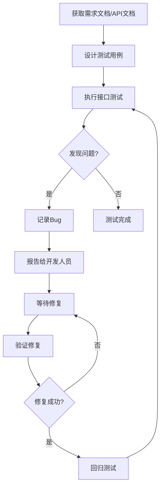

# 测试人员使用指南

本指南帮助测试人员使用AI辅助测试工作。

## 角色定位

作为测试人员，你是质量的守护者，负责：
- 根据需求文档设计测试用例
- 根据API文档进行接口测试
- 执行功能测试和回归测试
- 报告和跟踪Bug
- 验证Bug修复

## 你将使用的技能

| 技能 | 用途 | 使用场景 |
|------|------|----------|
| test-case-generator | 测试用例设计 | 根据需求文档生成测试用例 |

**技能说明**：
- 测试人员**不接触代码**，不需要编写测试代码
- 单元测试、集成测试代码由开发人员编写
- API文档由开发人员生成后提供给测试人员
- 测试人员的核心工作是**设计测试用例、执行测试、报告Bug**

## 工作流程



### 与开发人员的协作

| 测试人员需要的文档 | 提供者 | 来源 |
|-------------------|--------|------|
| PRD文档 | 产品经理 | docs/prd.md |
| 详细设计文档 | 架构师 | docs/detailed-design.md |
| API文档 | 开发人员 | 开发人员使用api-doc-generator生成 |

### 步骤1：获取测试资料

测试开始前，需要获取以下资料：

1. **需求文档**（PRD）：了解业务需求
2. **API文档**：由开发人员提供，用于接口测试
3. **测试环境**：由运维人员部署

**示例：向开发人员获取API文档**

```
请提供用户管理模块的API文档，我需要进行接口测试
```

开发人员会使用 `api-doc-generator` 生成API文档并提供给你。

### 步骤2：设计测试用例

根据需求文档或API文档，使用AI生成测试用例：

```
请根据以下API文档生成测试用例：

【API接口】用户登录
- 接口地址：POST /api/v1/auth/login
- 请求参数：username（必填），password（必填）
- 响应：成功返回Token，失败返回错误信息

【测试要求】
- 覆盖正常流程
- 覆盖异常场景
- 覆盖边界条件
- 覆盖安全场景
```

**生成的测试用例格式**：

```markdown
## 用户登录接口测试用例

### 1. 功能测试

| 用例ID | 测试场景 | 前置条件 | 测试步骤 | 预期结果 | 优先级 |
|--------|----------|----------|----------|----------|--------|
| TC001 | 正确用户名密码登录 | 已注册用户 | 1. POST /api/v1/auth/login<br>2. Body: {"username":"admin","password":"123456"} | 返回200，Token有效 | P0 |
| TC002 | 错误密码登录 | 已注册用户 | 1. POST /api/v1/auth/login<br>2. Body: {"username":"admin","password":"wrong"} | 返回401，提示密码错误 | P0 |
| TC003 | 用户名不存在 | 无 | 1. POST /api/v1/auth/login<br>2. Body: {"username":"notexist","password":"123456"} | 返回401，提示用户不存在 | P1 |

### 2. 边界值测试

| 用例ID | 测试场景 | 请求参数 | 预期结果 |
|--------|----------|----------|----------|
| TC010 | 用户名为空 | {"username":"","password":"123456"} | 返回400，提示用户名不能为空 |
| TC011 | 密码为空 | {"username":"admin","password":""} | 返回400，提示密码不能为空 |
| TC012 | 用户名超长 | {"username":"256字符...","password":"123456"} | 返回400，提示用户名长度超限 |

### 3. 安全测试

| 用例ID | 测试场景 | 请求参数 | 预期结果 |
|--------|----------|----------|----------|
| TC020 | SQL注入 | {"username":"admin'--","password":"123456"} | 返回401，登录失败 |
| TC021 | XSS攻击 | {"username":"<script>alert(1)</script>","password":"123456"} | 返回400，参数验证失败 |
```

### 步骤3：执行接口测试

根据API文档和测试用例，使用工具执行接口测试：

**常用接口测试工具**：

| 工具 | 说明 | 适用场景 |
|------|------|----------|
| Postman | API测试工具 | 手动接口测试 |
| curl | 命令行工具 | 快速验证接口 |
| Swagger UI | API文档界面 | 可直接测试接口 |

**Postman测试示例**：

```
请求：POST http://localhost:8080/api/v1/auth/login
Header：Content-Type: application/json
Body：
{
  "username": "admin",
  "password": "123456"
}

预期响应：
{
  "code": 0,
  "message": "success",
  "data": {
    "token": "eyJhbGciOiJIUzI1NiIs..."
  }
}
```

**curl测试示例**：

```bash
# 测试登录接口
curl -X POST http://localhost:8080/api/v1/auth/login \
  -H "Content-Type: application/json" \
  -d '{"username":"admin","password":"123456"}'

# 测试用户列表接口
curl -X GET http://localhost:8080/api/v1/users \
  -H "Authorization: Bearer <token>"
```

### 步骤4：记录测试结果

执行测试后，记录结果：

| 用例ID | 测试结果 | 实际响应 | 备注 |
|--------|----------|----------|------|
| TC001 | 通过 | 返回200，Token有效 | - |
| TC002 | 通过 | 返回401，提示密码错误 | - |
| TC010 | **失败** | 返回200，登录成功 | Bug: 空用户名未验证 |

### 步骤5：报告Bug

发现Bug后，向开发人员报告：

```
【Bug标题】登录接口空用户名未验证

【严重程度】高

【优先级】P0

【测试用例】TC010

【重现步骤】
1. POST /api/v1/auth/login
2. Body: {"username":"","password":"123456"}

【预期结果】
返回400，提示用户名不能为空

【实际结果】
返回200，登录成功

【API文档】
[附上相关API文档截图或链接]
```

### 步骤6：验证修复

开发人员修复Bug后，重新执行测试用例验证：

1. 获取修复版本
2. 重新执行原失败用例
3. 确认问题已解决
4. 执行相关回归测试

## 测试用例设计方法

### 1. 等价类划分

将输入数据划分为有效等价类和无效等价类：

```
请使用等价类划分法设计用户年龄输入的测试用例

【输入要求】
- 年龄必须是正整数
- 年龄范围：1-150

【等价类划分】
有效等价类：1-150之间的整数
无效等价类：小于1、大于150、非整数、空值
```

### 2. 边界值分析

针对边界条件设计测试用例：

```
请使用边界值分析法设计分页参数的测试用例

【参数要求】
- page: 页码，最小值1
- page_size: 每页数量，范围1-100

【边界值】
page: 0, 1, 2, 最大值
page_size: 0, 1, 2, 99, 100, 101
```

### 3. 错误推测法

根据经验推测可能的错误：

```
请使用错误推测法设计订单创建的测试用例

【可能的问题】
- 库存不足
- 价格计算错误
- 并发下单
- 网络超时
- 数据库连接失败
```

### 4. 场景法

根据业务场景设计测试用例：

```
请使用场景法设计购物车功能的测试用例

【业务场景】
1. 用户浏览商品 → 添加购物车 → 修改数量 → 结算
2. 用户添加商品 → 删除商品 → 再次添加 → 结算
3. 用户添加商品 → 商品下架 → 结算失败
```

## Bug报告

### Bug报告格式

```
【Bug标题】用户登录时输入特殊字符导致系统崩溃

【严重程度】高

【优先级】P0

【重现步骤】
1. 打开登录页面
2. 在用户名输入框输入：<script>alert(1)</script>
3. 点击登录按钮

【预期结果】
系统过滤特殊字符，提示用户名格式错误

【实际结果】
系统返回500错误，页面崩溃

【环境信息】
- 操作系统：Windows 11
- 浏览器：Chrome 120
- 测试环境：UAT

【附件】
- 截图：login_error.png
- 日志：error.log
```

**注意**：Bug修复由开发人员负责。测试人员只需要清晰描述Bug并报告给开发人员。

## 测试报告

测试完成后，输出测试报告：

```markdown
## 用户管理模块测试报告

### 1. 测试概况

| 项目 | 内容 |
|------|------|
| 测试模块 | 用户管理 |
| 测试版本 | v1.0.0 |
| 测试时间 | 2024-01-15 ~ 2024-01-17 |
| 测试人员 | 张三 |

### 2. 测试统计

| 指标 | 数量 |
|------|------|
| 测试用例总数 | 50 |
| 执行用例数 | 50 |
| 通过用例数 | 45 |
| 失败用例数 | 5 |
| 用例通过率 | 90% |

### 3. Bug统计

| 严重程度 | 数量 | 已修复 | 待修复 |
|----------|------|--------|--------|
| 致命 | 0 | 0 | 0 |
| 严重 | 2 | 1 | 1 |
| 一般 | 3 | 2 | 1 |
| 轻微 | 0 | 0 | 0 |
| 合计 | 5 | 3 | 2 |

### 4. 测试结论

本次测试共执行50个测试用例，通过率90%。发现5个Bug，其中严重Bug 2个，已修复1个。建议修复剩余严重Bug后再发布。

### 5. 遗留问题

| Bug ID | 描述 | 严重程度 | 状态 |
|--------|------|----------|------|
| BUG-001 | 并发创建用户时偶发重复 | 严重 | 待修复 |
| BUG-005 | 用户列表排序不稳定 | 一般 | 待修复 |
```

## 测试工具

测试人员使用的测试工具：

| 工具 | 用途 | 说明 |
|------|------|------|
| Postman | API测试 | 发送HTTP请求，测试接口 |
| curl | 命令行测试 | 快速验证接口 |
| Swagger UI | API测试 | 在文档界面直接测试接口 |
| 浏览器 | 功能测试 | 测试前端页面 |

**注意**：测试人员专注于手动测试和接口测试。代码相关的测试（单元测试、集成测试）由开发人员负责。

---

**提示**：测试人员的核心价值在于发现别人发现不了的问题。认真设计测试用例，严格执行测试，详细报告Bug，确保产品质量。

## 与其他角色的协作

| 协作对象 | 测试人员需要的输入 | 测试人员提供的输出 | 协作方式 |
|----------|-------------------|-------------------|----------|
| 产品经理 | PRD文档 | 测试用例 | 确认测试范围 |
| 架构师 | 详细设计文档 | 测试方案 | 确认测试策略 |
| 开发人员 | API文档、修复版本 | Bug报告 | 获取文档、报告Bug、验证修复 |
| 运维人员 | 测试环境 | 测试结果 | 配合环境部署 |

## 常见问题

### Q1: 如何设计高质量的测试用例？

1. **理解需求**：仔细阅读PRD和详细设计文档
2. **覆盖全面**：正常流程、异常流程、边界条件
3. **清晰描述**：步骤明确，预期结果清晰
4. **可维护性**：用例结构化，便于更新

### Q2: 如何有效报告Bug？

1. **描述清晰**：标题简洁准确
2. **步骤完整**：提供完整的重现步骤
3. **附上证据**：截图、日志、错误信息
4. **评估优先级**：合理评估严重程度和优先级

### Q3: 如何进行回归测试？

1. **获取修复版本**：确认Bug已修复
2. **验证修复**：执行原Bug重现步骤
3. **相关回归**：测试相关功能是否受影响
4. **全量回归**：重要版本发布前执行全量测试
